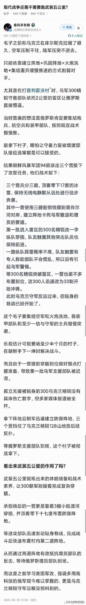
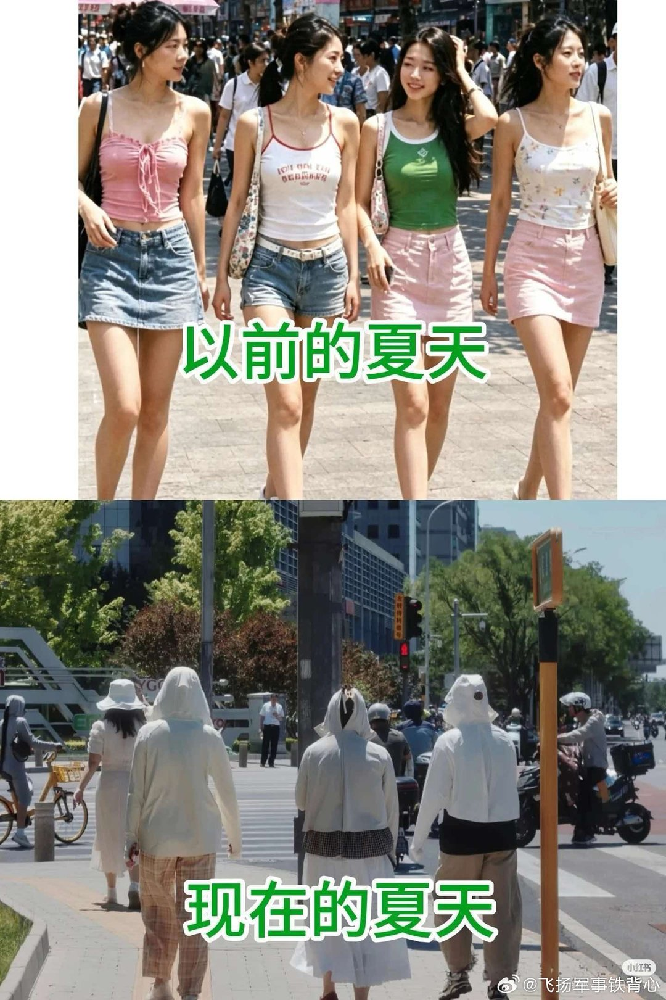
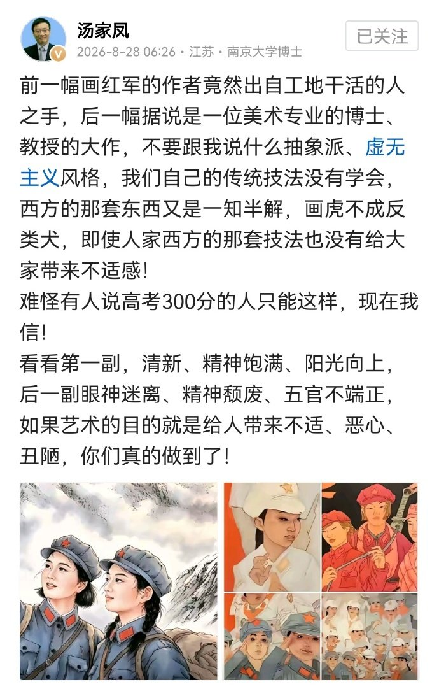
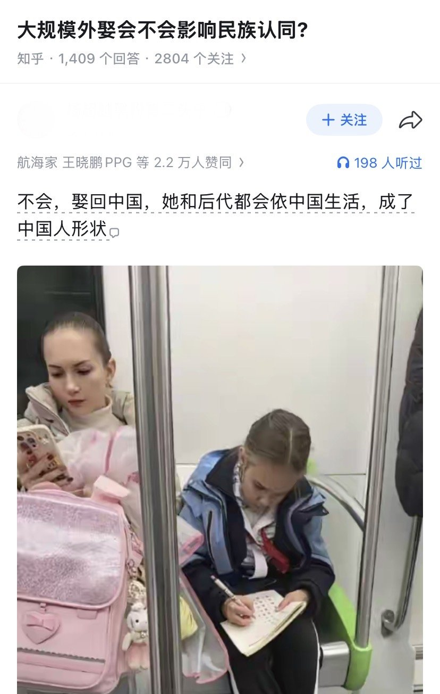
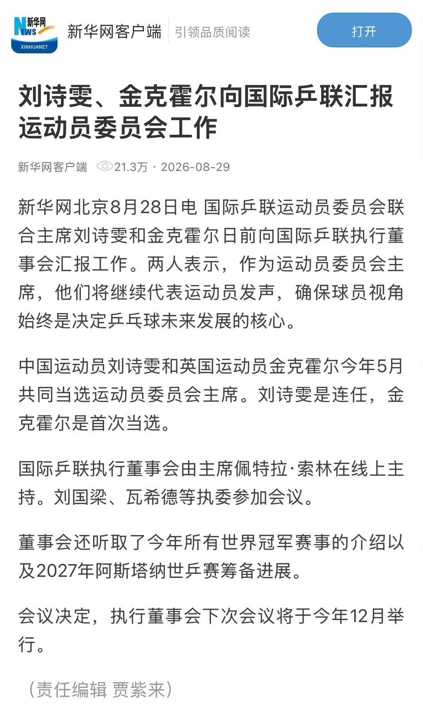
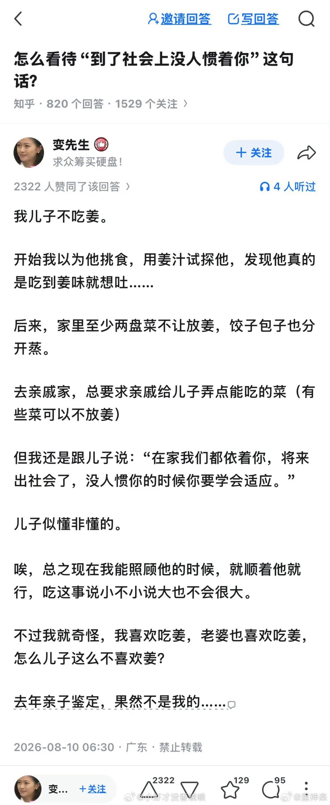

# 2026-08-30

## 1

@飞扬军事铁背心

发表于：2026-08-29 13:33

来源：微博

链接：https://m.weibo.cn/status/5337364839797633

分享图片

---

## 2

@飞扬军事铁背心

发表于：2026-08-29 13:26

来源：微博

链接：https://m.weibo.cn/status/5337363033097779

以前的夏天

VS

现在的夏天

---

## 3

@理记

发表于：2026-08-29 13:17

来源：微博

链接：https://m.weibo.cn/status/5337360929917940

刘翔那个事，我打听的消息是目前还没有定论，就是还没有方案，还在研究。刘翔自由惯了，他肯定是不愿意回来天天上班，但他是党员，也是体制内的干部，现在全党全国体制内严管又不是针对他一个人，比他资格老贡献大的多的是，戍边英雄航母设计功勋照样上班，都得遵守规定。

我估计啊，最后也许安排个顾问性质的工作，有一定自由度，就看他愿不愿意了。

还是多说两句，刘翔退役前那些年，国家给他的相关待遇可以说都是特级的，耗资非常大，而且很多待遇根本是钱买不来的。

刘翔两次退赛，当时负面舆论是滔天巨浪，上海对刘翔的保护力度已经是最大最大限度了。当年给他的安排，那也是综合考虑对他的最优解，而且有伤病还是给最高级别治疗。

刘翔不是受了十年委屈的小媳妇，他自己想走谁都拦不住。他愿意留在体制内，他心里清清楚楚知道好处，也知道得到了什么待遇。

现在挺多人觉得刘翔被上海体育局吸了十年血似的，这既是意淫，也是刘翔没有把来龙去脉交代清楚，留了太多想象空间。

简单用脑子想想都知道不可能，上海那是什么地方，顶级国际大都市，谁能差刘翔的广告分成那仨瓜俩枣？

希望这事儿尽快解决吧。大家都平安。

---

## 4

@海兰珠阿婶

发表于：2026-08-29 13:13

来源：微博

链接：https://m.weibo.cn/status/5337359844378543

这几天大家都在关注孙宇晨与景甜儿这个事儿。

殊不知，景甜只是孙宇晨炒作宇宙中的一环，现实是，孙宇晨早就已经碰瓷到疯魔，我撸了一遍关于他的新闻，四月份那会他的碰瓷就已经上升到特朗普家里去了。对，你没听错就是那个一脑袋金毛的懂王

事情是这样的。

特朗普家族之前搞了个加密项目 World Liberty Financial，孙宇晨一开始不但不是跟人家对着干，反而是人家的大金主。前前后后砸进去大约7500万美元买 WLFI 代币，后来还当上了这个项目的顾问。

也就是说，最开始孙宇晨跟特朗普家族参与的这个项目是正儿八经的合作伙伴。

从这一刻开始，看上去两家的合作是各取所需，特朗普家族的项目拿到了孙宇晨的真金白银，孙宇晨也终于抱上了懂王这棵大树。怎么看都像是孙宇晨花钱给自己认了个大哥。

但是，他可是孙割。

一个和别人握个手都恨不得把人家手上护手霜撸走的人，怎么可能甘心情愿花7500万美元，就为了给川子当老弟？

须知连景甜和他处了八个月现在都能被炒的满城风雨，流量三天居高不下。他既然搭上了川子的关系，又怎么可能不给川子放放血？

很快，事情就来了。

去年9月，WLF（World Liberty Financial，特朗普家族参与创办的加密金融项目）突然把孙宇晨持有的大量WLFI代币拉进了黑名单，理由也很直接：他们怀疑孙宇晨把受到转让限制的代币转进交易平台，并通过其他账户进行交易，甚至做空WLFI。

孙宇晨当然不认。

他一边否认自己存在WLF所说的违规操作，一边要求对方解除冻结。双方从原本的合作伙伴，迅速变成了互相指责。

但真正把事情搞大的，是到了今年4月。

孙宇晨不跟你私下掰扯了。

直接起诉。

一纸诉状把WLF告上美国联邦法院，指控对方无权冻结自己的代币，还把双方此前的一系列矛盾直接搬到了公众面前。

这一下味道就变了。

原来这事只是“孙宇晨投资特朗普家族参与的加密项目”。

现在成了什么？

孙宇晨把特朗普家族参与的加密项目告了。

特朗普这两个字一挂上去，新闻能一样吗？

而WLF显然也不打算惯着孙割。

到了5月份，WLF反手又把孙宇晨给告了，不但指控他违反协议、违规交易，还直接加上了一条诽谤，称孙宇晨针对WLF发动了一场公开的舆论抹黑。

好家伙。

几个月以前还是一家人。

孙宇晨又是砸7500万美元，又是当项目顾问，怎么看都是一副跟着川子混的架势。

几个月以后，两边已经在美国法院里互相开干。

但你仔细想想，这事最孙宇晨的地方恰恰就在这里。

我可以跟你合作，我可以给你投资，我甚至可以跟你成为利益共同体。

但你既然跟我孙宇晨产生了关系，那这段关系就不能白产生。

合作的时候，我是“特朗普家族加密项目的大金主”，这是新闻。

翻脸的时候，我跟“特朗普家族加密项目闹掰了”，这又是新闻。

等到了打官司的时候，我直接变成了“孙宇晨起诉特朗普家族参与的项目”。

还是新闻。

你会发现孙宇晨这个人特别神奇。

对普通人来说，一段关系闹掰了，这段关系基本也就到头了。

但到了孙宇晨这里不是。

合作有合作的流量，翻脸有翻脸的流量，打官司还有打官司的流量。

所以我现在越来越觉得，研究孙宇晨不能研究他到底跟谁关系好。

因为这个问题对孙割可能压根就不重要。

今天是合作伙伴，明天可以是诉讼对手，后天说不定又能坐在一起。

关系怎么变化无所谓。

重要的是：

我可以给你当合作伙伴，但是我一定要让你给我带来流量。

跟你好，炒咱俩关系好。

跟你翻脸，炒咱俩撕逼。

撕逼完了，炒咱俩打官司。

反正只要跟我孙宇晨产生过关系，这点流量就别想浪费。

所以回过头再看景甜这件事，你就会发现它压根不突兀。

女明星也好，特朗普家族也罢。

对于孙割来说，无非都是进入了他的关系网。

而一旦进入这张网，关系本身就成了一种可以反复开发的流量资产。

这可能才是孙学最牛逼的一点：

别人是薅羊毛。

孙割连羊都不放过。

所以，景甜被孙割薅羊毛、炒流量这太正常了…给他当女友的曾颖都要手洗内裤，何况一个想反套孙割 3000 万的女艺人呢？不把你的流量价值榨干，怎么可能罢休呢？

谢谢大家

\#景甜富豪男友疑似孙宇晨\#

---

## 5

@2049年的世界

发表于：2026-08-29 12:45

来源：微博

链接：https://m.weibo.cn/status/5337352746571763

其实很多人没有意识到，在文化艺术领域，最近几十年也算是“三千年未有之变局”了。

农业时代里能接受多年脱产完整体系教育的人少之又少，所以“知识分子”是稀缺的，他的知识面相比普通人是有很大优势的。

哪怕到了六七十年代，虽然新中国已经开始大力扫盲和办教育，但是由于起点太低，知识分子相对普通人来说确实是知识分子，也确实有知识。也正因为如此，“知识分子”被单独列了一栏，和工农兵相区别。

三千年未有之变局，发生在新世纪高等教育逐步普及之后。

对于理学、工学的知识分子，由于知识本身具有门槛，他们在专业领域确实是仍然相比普通人有巨大优势。

但一部分社会科学、文化艺术领域，就不一样了。

由于高等教育已经普及了，尤其是对于年轻一代。

因此在部分社会文化艺术领域，这些领域的“知识分子”，其实已经没有知识了。

他们和普通人或者爱好者相比，没有什么优势，即使是在他们自己的专业领域。

比如经济学家，完全可能不懂经济，天天预测错误。

比如美术学院教授，画的一坨屎，连爱好者都不如。

比如新闻学泰斗，可以完全不懂如何运用新闻学，自己上阵撕逼的时候满口污言秽语。

比如法学教授，能想出上床前录音以解决性同意问题的奇葩思路。

比如文学教授，写的屎尿屁连普通人都不如，要是放到网络市场上靠写文章能饿死。

比如TOP2高校的法学教授，听着名头很响吧。其实它可以完全不懂法学或者瞎理解法学，它之所以有法学教授的权威，能在媒体上指鹿为马，完全是因为它坐在那个位置上。因为它是TOP2高校的法学教授，有那个编制，所以它是法学专业人士，而不是反过来。

如果你把一条狗放在TOP2高校法学教授的位置上，那么叫声就是法学教授在发表高论了。

当然，不是说这些人里面没有厉害的，但现行学术体制对这些人几乎没有筛选能力，没办法成功筛出有用的，淘汰滥竽充数的。因此是泥沙俱下，鱼龙混杂。

而且看中国现在社会科学领域跟着西方后面专心吃尾气的样子，搞不好是里面是滥竽充数的废物更多。他们的萎靡表现相比中国席卷世界的工业能力，差距太大太大了。

他们看上去挺唬人，动不动就发好多社科论文。但很多论文只不过是故弄玄虚，用一堆所谓的专业术语，讲一个很简单的道理，甚至道理本身可能还是错的。那堆术语很多人没听说过，还夹杂着外国话，看上去很高大上。其实就类似于互联网上的“梗”而已。

出于讽刺目的，我这周做了一件有点抽象的事情，借助AI独立创建了一门新的社会科学学科——凯申学。

写了《凯申学》这边学术专著，是这个学科的开山著作，PDF版本全书共有762页。

“凯申学”是研究什么的呢？当然是研究我的。

研究我，能搞出一门学科来吗？可以的。

等下我再整理整理，然后把这本书贴出来供大家乐一乐。今天晚上刚写好的，我自己还没看。

---

## 6

@tombkeeper

发表于：2026-08-29 12:22

来源：微博

链接：https://m.weibo.cn/status/5337346901806455

这一看就是完全融入中华民族了……

---

## 7

@北京青年报

发表于：2026-08-29 08:52

来源：微博

链接：https://m.weibo.cn/status/5337294209027044

\#刘国梁参加国际乒联会议\#【刘诗雯、金克霍尔向国际乒联汇报运动员委员会工作】国际乒联运动员委员会联合主席刘诗雯和金克霍尔日前向国际乒联执行董事会汇报工作。两人表示，作为运动员委员会主席，他们将继续代表运动员发声，确保球员视角始终是决定乒乓球未来发展的核心。

中国运动员刘诗雯和英国运动员金克霍尔今年5月共同当选运动员委员会主席。刘诗雯是连任，金克霍尔是首次当选。

国际乒联执行董事会由主席佩特拉·索林在线上主持。刘国梁、瓦希德等执委参加会议。

董事会还听取了今年所有世界冠军赛事的介绍以及2027年阿斯塔纳世乒赛筹备进展。

会议决定，执行董事会下次会议将于今年12月举行。 （新华网）

---

## 8

@最后的科学家·垠

发表于：2026-08-29 13:43

来源：微博

链接：https://m.weibo.cn/status/5337367363718363

经历越多，看的越多，人就会越来越明白：爱是存在的，但爱情是不存在的。

世界上的爱只包括：爱自己，爱孩子。但却不包括爱一个异性（所谓的爱情）。

Matrix 拍的电影都喜欢渲染爱情，为什么呢？因为他们想要夺取你对自己的爱。一旦相信了爱情，你就被控制和操纵了，因为你会傻到不再知道如何爱自己。

这就是为什么 Matrix 的影视和文学都在极力宣扬“爱情”，甚至包括它自己的写实片《Matrix》在内——为了爱情，连 Neo 这样的救世主都可以放弃全人类。荒谬绝伦。Matrix 当然希望人都这样儿女情长，这样人类的救世主就不存在了。

爱情本不存在。Matrix 使用文学和影视艺术，从无到有创造了“爱情”，创造了“谈恋爱”这种概念，然后告诉人们谈恋爱应该是什么样的，告诉女人们如何判断“一个男人是否真的爱你”，告诉她们每个节日应该期待什么……

有人说，不是艺术在模仿生活，而是生活在模仿艺术。确实如此。只要使用艺术树造出生活方式，就可以让越来越多的人按这种方式生活。

Matrix 的演员们总是告诉人们“相信爱情”，就像他们告诉人们“相信科学”一样。然而他们从来没有证明过爱情的存在。

科学的基础不是相信，而是证明。宗教的基础才是相信。

无数的痴男信女，为了这所谓的“爱情”，神经错乱和苦恼，为了获得爱情而做出 Matrix 所希望的事情。这样就完美地操纵了人类。

这种高招也只有 Matrix 能想得出来。

---

## 9

@小虾才没香喷喷

发表于：2026-08-29 01:15

来源：微博

链接：https://m.weibo.cn/status/5337179120468199

哦，原来如此

---

## 10

@问鼎资本-张佳男

发表于：2026-08-30 15:31

来源：微博

链接：https://m.weibo.cn/status/5337632835634249

\#亲密关系的萧条是全球趋势\#亲密关系的萧条：一场静默的全球性退潮

2025年，北京大学与复旦大学联合发布的《中国私生活质量调查》显示，18至25岁年轻人中有过约炮经历的比例在五年间大幅下降，男性从20%降至8%，女性从17%降至约4%。同年，一项覆盖韩国、中国、日本、美国、西班牙五国8242人的调查显示，韩国18至39岁未婚单身女性中，60.8%表示"对恋爱没有兴趣"，韩国整体男女对恋爱不感兴趣的比例高达55.4%。而在英国，16至29岁的Z世代中仅有49%拥有稳定亲密关系，远低于千禧一代同年龄段57%的比例。这些散落在不同大陆的数据，共同指向一个事实：亲密关系的萧条，并非某一国的局部现象，而是一场全球性的退潮。

数据的冷峻面孔

过去十多年里，全球30个发达国家中有26个国家的单人家庭比例持续上升，仅与2017年相比，全球就多出至少1亿单身人口。美国25至34岁人群中，男性单身比例约50%，女性约41%。日本国立社会保障与人口问题研究所推算，到2040年，日本成年人中将有47%是单身，"超级单身社会"正在成形。中国2026年二季度结婚登记仅327.5万对，相比2013年峰值缩水超过一半。

三重结构性推力

经济压力的"挤出效应"。韩国调查中，没有恋爱经历的男女中38.5%处于失业状态，而有恋爱经历的失业率仅12.9%，两者相差25.6个百分点。就业不稳定、住房成本高企、育儿预期开支巨大，使得亲密关系从"情感项目"变成了"重资产契约"。正如一位韩国22岁女大学生所说："与其说'不想恋爱'，不如说是'没有能力恋爱'。"

社交媒体的"文本化牢笼"。《大西洋月刊》记者Faith Hill指出，美国已进入一个"去性感化"时代，公开场合的亲热行为随时可能被拍摄上传，遭受网络审判。而在日常交往中，延迟回复、含糊其辞、截图传播等行为，让社交文本化成为一种弥漫性的压力源。正如作家萨莉·鲁尼在小说中所描绘的，"十分钟、二十分钟，他穿过运河，一整天盯着屏幕，眼睛刺痛"——这种等待回复的焦虑，已成为一代人的共同体验。社交媒体打破了私密性，推高了情感暴露的成本，让许多年轻人更倾向于用保守姿态规避可能的尴尬与伤害。

个体化浪潮的深层冲击。德国社会学家贝克夫妇在《爱的失序》中揭示：劳动市场需要"绝对自由的个体"，而家庭制度仍依赖"自我牺牲的奉献者"，这种结构性撕裂正让所有现代人成为"情感难民"。当外卖、家政、各类智能设备能搞定日常琐事，"搭伙过日子"的必要性被彻底削弱。伴侣不再是身份认同的来源，关系不再是必须完成的人生阶段，拒绝低质量关系被视为理性选择。

渴望并未消失，只是换了出口

值得注意的是，亲密关系的萧条并不意味着人类对亲密的渴望消失了。恰恰相反，出售"恋爱感"的商品正呈现爆发式增长：乙女游戏持续火爆，人们对着AI倾吐心事，委托cosplay出售一对一的亲密互动，情感剧本杀一票难求，各式陪聊陪玩的直播间琳琅满目。社会学家鲍曼在《液态之爱》中的预言正在应验——现代关系如同"网络连线"般充满不确定性、短暂易逝且规避承诺，人们宁愿选择流动的关系，也不愿在一段高度绑定的关系中失去自我。

这构成了一幅深刻的矛盾图景：一面是对亲密的渴望依然炽热，一面是对躬身入局的恐惧日益加深。人们消费亲密、模拟亲密、购买亲密，却越来越难以承受真实关系中那些不可控的摩擦、不可撤回的承诺和不可预知的伤害。

不是爱的终结，而是爱的重构

亲密关系不会退出人类生活。五个国家的调查都呈现一个一致趋势：越对恋爱感兴趣，幸福感越高。真正改变的不是关系存在与否，而是它的基础——从生存需求变为情感选择，从社会规范驱动变为个体意愿驱动，从单一模式走向多元生态。LAT关系（分开居住的伴侣）、序列单一伴侣、轻量化陪伴关系等新形态正在涌现。

我们正见证的，或许是人类亲密关系史上最大规模的一次实验。问题不再是"关系会不会消失"，而是我们是否准备好面对一种没有脚本的亲密关系时代——在那里，爱不再是命运的安排，而是两个自由个体在不确定性中反复选择彼此的勇气！

