# 2026-08-31

## 1

@推倒王道

发表于：2026-08-29 13:14

来源：微博

链接：https://m.weibo.cn/status/5337360146370235

再次忠告所有有创作想法的大伙伴和小伙伴们：

绝对，不要，使用AI，写作正文。

你们可以跟AI讨论提纲和思路，搜集资料，放松心情，没问题，但不要使用它真实替代你写任何一个字的正文，否则AI的行文会把你的上限锁死，永远把你卡在一个五六十分的水平，只需要几个月，你就会被它污染，丧失自己对文字的敏感和情感的把握，你但凡偷一点懒，仅有的才能就会被它一扫而空。你会成为它的奴隶，批量产生低劣的文字，因为文学创作不是公文，它是人类情感的投注，需要你作为一个活人来体验并创造性地输出，它很难，很艰苦，可能会让你掉头发，冥思苦想，日夜操劳，但只有经历这个过程，你才能掌握仓颉传给你的古老技艺并且通过肉体来刻骨铭心，但如果你被ai污染过，你就再也没有办法感受汉字之美，最重要的是你也不知道什么才是真正的美。

如果说这个世界上有智子可以锁死人类的文明进程，那么现在的智子就是AI。

---

## 2

@李建秋的世界

发表于：2026-08-30 15:07

来源：微博

链接：https://m.weibo.cn/status/5337750815380234

杭州是中国最文明的城市。

诚恳地向当年黑过西湖醋鱼表示道歉。

西湖醋鱼，好吃。

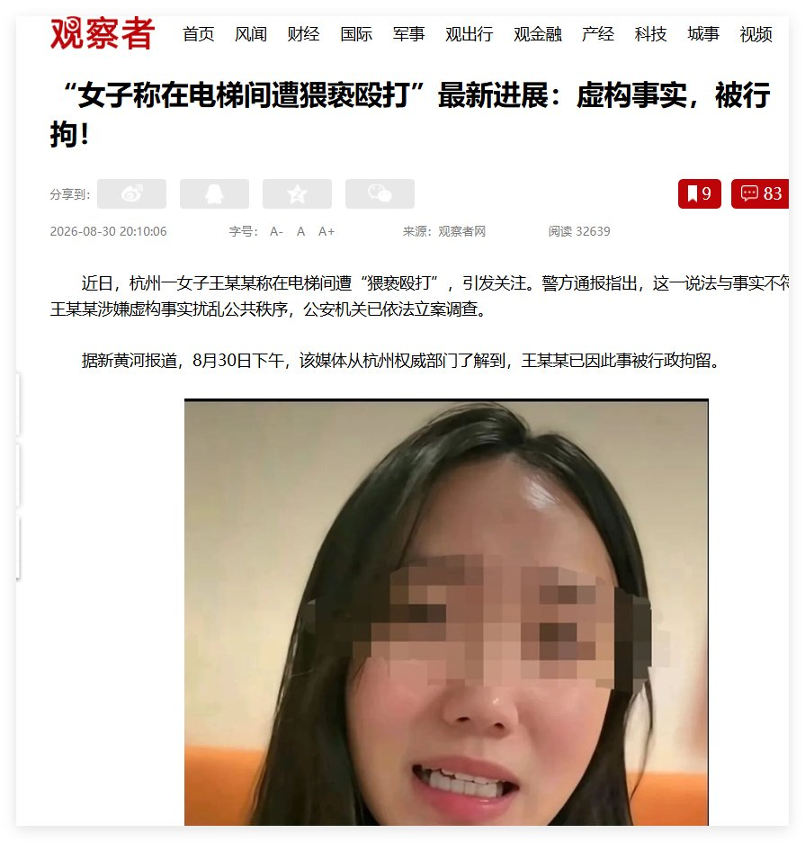

---

## 3

@抱朴仙人

发表于：2026-08-30 11:44

来源：微博

链接：https://m.weibo.cn/status/5337699726394320

回青岛老家。门前的石老人观光园景区还在施工建设中。

一时好奇去看看规划图，大为失望，真不觉得好看。

问问专家，说这个设计方案是基于“元宇宙”概念的，但是开建之时，元宇宙热度已然退潮。

我评论说：“建筑这种长期存在的艺术，不宜蹭互联网这类短线热度。”

朋友回答：“少废话！你就说它圆不圆吧！”

我：“那倒是，圆……”

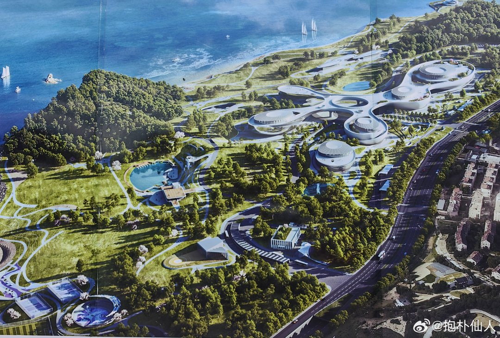

---

## 4

@问鼎资本-张佳男

发表于：2026-08-30 12:11

来源：微博

链接：https://m.weibo.cn/status/5337706649620904

\#金饰销量暴跌34%\#"金饰销量暴跌34%"：一场黄金消费大分裂的深度解剖

现象：不是没人买黄金了，而是没人"戴"黄金了

2026年上半年，中国黄金消费总量511.412吨，同比微增1.23%——看起来还算平稳。但撕开总量看结构，里面是一场剧烈的"冰火两重天"：黄金首饰消费仅132.133吨，同比暴跌33.88%；金条及金币消费高达339.336吨，同比猛增28.42%。

也就是说，投资类黄金首次大幅超越金饰，占中国黄金需求的66%。买黄金的人没少，只是从"戴身上"彻底转向了"藏家里"。

金价高位震荡：一切的起点

理解金饰销量暴跌，必须先理解当前金价的极端位置。

2026年金价走出了一轮史诗级行情：1月29日伦敦现货黄金一度触及5598美元/盎司的历史高点，随后深度回调，6月末较高点回撤近30%，跌破4000美元关口；8月又快速反弹，单月最高涨幅超17%，一度逼近4700美元，但月末受美联储鹰派表态影响再次跳水。截至8月30日，国际金价报4454美元/盎司，国内现货金价963.88元/克。

在这种高位剧烈波动的环境下，品牌金饰零售价长期维持在1344—1408元/克区间，而银行投资金条仅979—1022元/克，两者每克价差高达300—400元。 这意味着什么？意味着消费者每买一克品牌金饰，就有300多元花在了工费和品牌溢价上——而这些钱在回收时一分不值。

三重结构性推力

第一重：高金价击穿了消费能力。

当足金零售价突破1300元/克，婚庆"三金"预算从约2万元涨到3万元以上。大量消费者直接缩减克重或延迟购买。河南南阳地区甚至出现30%的新人直接不要"三金"，折成现金给女方。 世界黄金协会指出，前所未有的金价上涨幅度超过了居民收入增长，直接削弱了消费者的购买力。

第二重：回收亏损的传播击碎了保值幻觉。

这是最致命的认知转变。有消费者7万元购入的30克品牌金吊坠，回收时仅被报价3万元——工费和品牌溢价在回收时归零。此类案例在社交媒体上大规模传播，三个月内击碎了"买首饰既能戴又能保值"的传统认知，消费者用脚投票涌向零溢价的金条。

第三重：增值税新政加速了资金迁移。

2025年11月落地的黄金增值税新政调整了金饰链条税负，金条金币等投资性黄金产品继续享受免征增值税优惠，部分原本出于投资目的购买金饰的消费者直接转向金条。

渠道端的连锁崩塌

消费端的寒意迅速传导到渠道端。2026年上半年，几乎所有头部品牌都在大规模关店：老凤祥净关店483家，豫园股份（老庙、亚一）476家，周大生473家，周大福内地258家，中国黄金203家。

关店的主力是加盟店。周大生上半年净减少的473家门店中，454家来自加盟体系，自营仅减少19家。老凤祥关闭的三四线城市低坪效加盟店占其总关店数的63%。 原因很直接：金价高位意味着加盟商需要自备巨额资金进货囤货，一旦金价剧烈波动，库存贬值风险全部由加盟商承担。当客流萎缩叠加资金压力，"用脚投票"撤店成为唯一理性选择。

与此同时，线上渠道和水贝"批零一体化"模式正在改写行业规则。周大生电商渠道上半年营收15.76亿元，同比增长34.97%，已超越线下加盟成为第一大收入来源。 水贝商家通过直播带货省去了实体店的高额租金和人员成本，打穿品牌溢价，进一步分流了线下客源。

暴露的深层问题

第一，"戴"与"囤"的分裂：黄金的双重属性正在撕裂。

黄金同时具备消费品和投资品双重属性，但在高金价环境下，这两种属性正在剧烈对抗。投资者"买涨不买跌"，价格越高越想买；金饰消费者"高位慎买"，价格越高越觉得不划算。 当投资需求吞噬了消费需求的生存空间，整个金饰产业链——从设计、加工到零售——都面临价值重估。

第二，品牌溢价的信仰危机。

消费者越来越精明：同样是黄金，品牌金饰1348元/克，银行金条979元/克，回收价统一按原料金价约950元/克结算。 品牌溢价的"保值"叙事正在被数据击穿。老铺黄金式的高端古法金路线虽然逆势崛起，但其成功很大程度上依赖金价上涨势头而非文化认同，可持续性存疑。

第三，加盟模式的结构性失效。

过去十年，加盟模式是黄金品牌跑马圈地的核心武器——中国黄金加盟占比一度超过97%，周大生近七成加盟门店落在三四线及以下城市。 但当市场不再需要这么多金店，低效门店的矛盾集中爆发。正如行业专家所言："有疯狂开店的一天，就要想到有疯狂撤店的这一天。"

第四，婚庆刚需的萎缩是长期趋势。

结婚人数持续下降，叠加金价高企，"三金"这个黄金零售最硬的刚需正在被"折现"。河南品牌省代观察到，婚庆类需求的克重下滑了50%—60%。 这不是周期性问题，而是人口结构变化带来的长期趋势，金饰行业最大的"基本盘"正在收缩。

行业往哪去？

世界黄金协会亚太区研究负责人贾舒畅判断："未来黄金投资需求或进一步升温，金饰消费需求则偏弱，这一市场格局将延续。"短期内首饰市场难以快速回暖，大概需要3—4个季度，此前金价上涨对金饰消费的负面影响才会逐步消退。

行业的出路指向三个方向：一是小克重轻量化（5克以下轻饰销量增速领跑全品类），二是线上渠道深耕（电商占比持续提升），三是从"卖金子"转向"卖设计和体验"（IP联名溢价率达151.8%）。

但更深层的启示在于：当黄金从脖颈手腕上的装饰变成储蓄罐里的硬通货，当消费者集体用脚投票拒绝为品牌溢价买单，这不仅仅是金饰行业的问题——它折射的是一个消费理性觉醒的时代，所有依赖信息不对称和品牌信仰赚取超额利润的商业模式，都将面临同样的审判。

---

## 5

@是奶霸

发表于：2026-08-29 05:34

来源：微博

链接：https://m.weibo.cn/status/5337244309128611

【曾颖：风口逐尽，无处归身】

互联网最吊诡的规律，莫过于人设轮回，记忆短暂。

有些争议人物，看似销声匿迹、泯然众人，实则蛰伏蓄力、伺机而动。时隔数年，换身份、换叙事、换赛道，再度闯入公众视野，搅动全网舆论。

曾颖，便是如此。

2022年，安倍晋三遇刺现场的一场哽咽，让她一夜沦为全网争议焦点，账号禁言、舆论围剿、声名扫地，几乎断送了所有公众前路。风波发酵十余日后，网络上流出她的疑似遗书，曾颖轻生传闻迅速传遍全网，接着友人证实其被送往医院抢救，这一事件也让该轮舆论风波推向顶峰。

时隔四年，2026年，她再度登顶热搜。

此番归来，无关政治舆情，她以孙割前女友身份解构孙的创业往事，一夜出圈。

大批新晋网友，凭几篇短文便对其人其文交口称赞，却全然不知，这一篇篇小作文的写作者，早已在中日商业、媒体传播、币圈资本的风口浪潮里，辗转腾挪、深耕十余年。

世人只看她今朝提笔戏谑，无人深究她半生来路纵横。

2019年，在《福布斯中国》的相关介绍里，曾颖的核心身份为：日本同道文化株式会社创始人CEO。

彼时29岁的她，早已不是零敲碎打的跨境博主，而是体系化的商业操盘手。其打造的Tokyotube矩阵，全网粉丝突破1700万，原创IP《一个人在东京》成功授权日本知名保健品厂商开发动漫版权，实现内容商业闭环。

但她更核心的价值，藏在被广大网友忽略的深层业务中。

曾颖长期为东急集团等日本上市企业高管，定制对华社交媒体传播战略；为前泽友作、大泽隆夫等日本知名企业家、艺人，操盘中国互联网相关流量运营。

她的生意，从来不是简单的“向中国人介绍日本”，而是精准搭桥、双向引流：帮日本巨头读懂中国舆论逻辑、适配中国网民审美、撬开中国消费市场。

2018年，在面对火星财经采访中，曾颖直言不讳。她在东京创立广告公司，核心业务便是助力电通、资生堂、花王、DHC等日系品牌，用中国受众喜闻乐见的方式，完成对华公关与品牌宣传。

而她所有商业布局的底层依托，直指日本国家级文化战略，Cool Japan。

Cool Japan并不是普通文化宣传口号，是日本国家层面的软性对外渗透战略，核心目标就是通过文化、文旅、消费、舆论传播，潜移默化完成海外认知植入与国家形象输出。

曾颖是极少数公开、主动、深度嵌入Cool Japan落地执行层的在日华人操盘手。她的所有广告业务、企业咨询、文旅推广、内容输出，并非其个人商业自选赛道，而是精准贴合、主动承接日本国家级对外渗透工程的市场化落地动作。

她曾公开自述，个人所有跨境传播、品牌服务业务，均顺势依托日本政企全球化、日化与文旅产业出海的大势展开。

她的核心定位，绝非简单的中日贸易中介，而是日本Cool Japan国家战略，面向中国互联网舆论场的民间实施端口、落地渗透载体。扎根日本商业体系，依托日本国家顶层传播战略，精准对接中国互联网流量，业务体系完全服务于日本对外软性输出脉络。

但比起商业合作，更耐人寻味的，是她深度嵌入日本地方公共传播的履历。

2018年曾颖公开自述履历，称其本人历任日本多个城市观光旅游大使，其中最具代表性的身份，便是奈良县观光旅游大使。

她公开展示原创奈良小鹿漫画IP，明确标注作品创作于履职奈良观光大使期间。

奈良县地方观光体系、日本本土企业圈层、日本公共对外传播渠道，三者形成闭环，将她纳入日本民间官方对外输出体系。而她主动将个人地方文旅履职经历，主动挂靠、对齐日本国家级Cool Japan战略框架，把个人自媒体内容、地方观光推广、企业对华传播，全部打包纳入日本国家对外渗透体系，形成自上而下、从官方到民间、从内容到商业的完整渗透链条。

不仅如此，她自身也早已跻身日本对外传播核心圈层。

2014至2015年，曾颖斩获NHK WORLD中文主持人大赛第一名，先后担任日本放送联盟对外节目常驻主持、跨境文化专栏主创。

她的人生轨迹，从来不是“中国网红远赴日本淘金”的偶然路径。而是循序渐进、层层进阶：日本名校留学打底，深耕日本广告行业，入局日系企业营销，跻身官方对外媒体，执掌地方文旅传播，全程依托Cool Japan国家战略布局生长，最终双向打通中日流量与商业赛道，成为日本对华软性传播的关键抓手。

也正因这套深耕十余年、背靠日本国家战略的完整体系，她手握碾压普通博主的话语权，常年垄断国内互联网的日本话题传播高地。

安稳的中日传播赛道，并未困住野心勃勃的曾颖。

2017年，她受人点拨，果断转身，一头扎进当时最狂热、最浮躁的虚拟货币风口。

这一年，国内虚拟货币监管收紧、行业洗牌加剧，无数从业者纷纷退场避险。

曾颖却逆势而上、逆流入局。

2017年6月，她正式涉足比特币领域；9月，打造垂直币圈IP《甜甜说币》（是的，就是你们马上能想到的那个甜甜），迅速搭建自媒体矩阵、社群体系与项目资源链。

她的布局，是全链条深度入局虚拟货币，野心直指行业核心。

2017年11月，她联合多名日本籍合伙人，向日本金融厅正式提交虚拟货币交易所牌照申请，公开身份为日本Eden虚拟货币交易所联合创始人。

在全网避险退场的大环境下，曾颖始终乐观激进、全力押注。

之所以如此孤注一掷，是曾颖判断的行业趋势是，当国内币圈监管趋严，大量区块链项目势必亟需出海；而日本将成为虚拟货币与区块链产业的核心沃土。

依托《甜甜说币》IP，曾颖快速搭建起庞大行业版图：702万全网粉丝、115个垂直社群、四万余核心社群成员，深度对接火币、唯链、RUFF等数十个头部区块链项目。

她的定位，早已超越自媒体博主。

正如其公开自述：《甜甜说币》可为项目方提供内容、流量、资金三重赋能。

彼时的她，是舆论发声者、流量掌控者、项目服务商、出海咨询师，多重身份集于一身，构建起完整的“流量-社群-项目-资本-海外落地”商业闭环。

为推广日本币圈市场，她不遗余力造势发声。拆解日本投资群体特征，剖析日本低利率金融环境下虚拟货币的投资红利，甚至以日本知名艺人圈层的认知变化，佐证行业热度，极尽所能为虚拟货币赛道鼓吹。

不止站台发声，她还公开传授实战玩法，手把手指导国内区块链项目方入局日本市场：拆解日本金融厅监管规则、梳理交易所白名单机制、公示官方申报渠道，提供一站式出海落地解决方案。

2018年ICO泡沫鼎盛期，她深度参与ICST区块链项目公开推广，联动创始人开启直播造势，以空投福利撬动全网传播，全力助推项目出圈。

她的野心不止于此。创立LikoFund，正式入局资本投资赛道，从内容传播、项目服务，进阶至资本操盘、股权投资核心领域。

2017至2018年，是币圈最疯狂的时代，人人逐利、人人狂热。曾颖站在浪潮之巅，全线押注、多点布局，将风口红利吃至极致。

2019年，风口尚未彻底退潮，她凭借跨境传播的商业履历，成功登顶《福布斯中国》30位30岁以下精英榜，以青年创业者的光鲜身份，迎来人生风头无两的高光时刻。

彼时的她，手握千万流量、政企资源、资本渠道，横跨中日两大市场，集所有时代红利于一身。

但是，所有风光无两，终究是昙花一现。

2022年，一场直播哽咽，彻底撕碎她所有光鲜人设。

安倍晋三遇刺当日，身处奈良现场的曾颖，在与中国媒体公开直播连线中流露悲情、当众哽咽。

这场有意或者无意的的情绪失控，成为她人生最大的分水岭。

中国网友很愤怒，作为一个中国人，你悲从何来？

事后曾颖公开表示，不该将私人情绪带入公共平台，但仍固执坚持个人价值观，声称逝者值得尊重，自己只是有血有肉的普通国人。

但这场风波，不仅击碎了曾颖的短期口碑，更打破了她所有商业身份的底层逻辑。

过去，“中日桥梁、跨境精英、文化使者”的标签，是她的商业资产、流量光环；风波之后，所有身份被重新解构、彻底颠覆。

商业层面的跨境合作，沦为立场层面的边界模糊；文旅传播的深耕布局，被解读为单向度的对外造势。

网友们的核心质疑，穿透其光鲜履历直指本质：身跨两国，代表中国媒体，坐拥公权流量，究竟立身何处、为谁发声？

舆论裂痕一旦产生，便根深蒂固、难以弥合。

2024年的香飘飘事件，让曾颖的舆论争议雪上加霜。

日本核污染水排海引发全民声讨之际，香飘飘员工讽日的爱国举动，引发全网共鸣、企业公开力挺。唯独曾颖，公开批评民众讽日行为，回避核污染水排海的核心争议，拒不直面是非对错。

在关乎民族共识、公共安危的大是大非面前，她刻意避重就轻本末倒置，在取舍之间，彻底固化了公众对她的争议认知。

十年风口红利，两场舆论塌方。

她的公众形象，从新锐跨境创业者，彻底沦为立场模糊、争议缠身的舆论边缘人。

2026年2月11日，曾颖深耕多年的海外X主账号被平台永久封禁，平台公示封禁理由为违反假冒身份、误导公众相关政策，至此，她经营十余年的境外主流舆论阵地宣告失守。

2026年，互联网记忆彻底翻篇。

蛰伏四年的曾颖，凭借一组辛辣通透的“颖学”短文，解构孙割的世俗与荒诞，精准踩中互联网娱乐风口，再度翻红出圈。

不少新生代网友沉迷她的文笔通透、人间清醒，纷纷追捧效仿；昔年的舆论争议、立场裂痕、币圈过往，就这么被一场娱乐化流量彻底掩盖。

但她忘了，她虚有其表，根基悬空。

真正清醒的人都知道：这场翻红，并不是来自大众的谅解，而只是互联网的健忘。

她根本做不到真正翻盘，只能是短暂脱敏。

纵观曾颖十余年人生轨迹，没有一步是安稳笃定的坚守，全程皆是追风逐利、随势而迁。

她极度敏锐、极度聪明，永远能精准站在时代风口的最前沿，借力起飞、借势成名。

可她最大的短板，也正在于此：逐尽千帆，无一所守，遍历风口，无一所依。

她毕生都在做“连接者”，连接中日商业、连接跨境流量、连接风口资本、连接全网热度。

盛世之时，连接是国际化、是多元化、是商业传奇；变局之时，连接是立场模糊、是边界失守、是无所适从。

她半生追逐所有时代红利，精通所有流量玩法、商业套路、赛道规则，长期为日本Cool Japan国家软性渗透战略站台落地，却唯独没有守住最根本的立身之本：一个中国人的立场与底线。

所有风口都会落幕，所有流量都会褪色，所有时代红利都会过期。靠风口起飞的人，终将被风口抛下；靠流量续命的人，终将被流量定义。

曾颖的半生浮沉，不是个人的悲剧，而是整个时代的缩影。

十余年间，无数人借着全球化、互联网、资本浪潮乘风而起，赚尽时代红利。

可潮水退去终有时。

风口万千，皆可奔赴；立场一旦偏移，终身无处归身。

风起时，人人皆是传奇。

风停后，方知谁在裸泳。

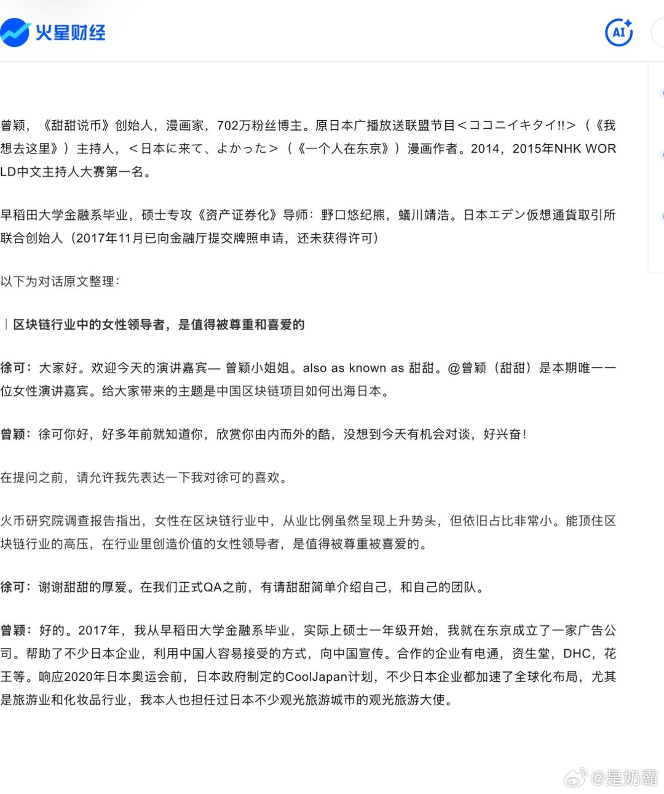

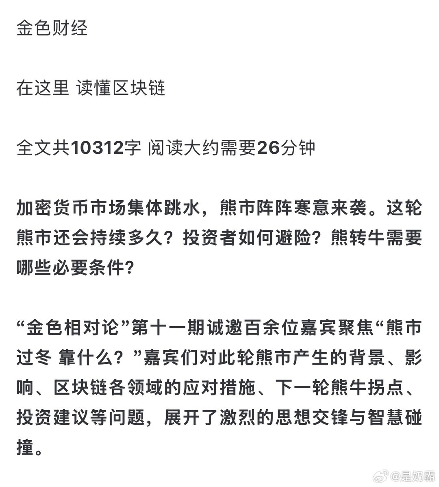

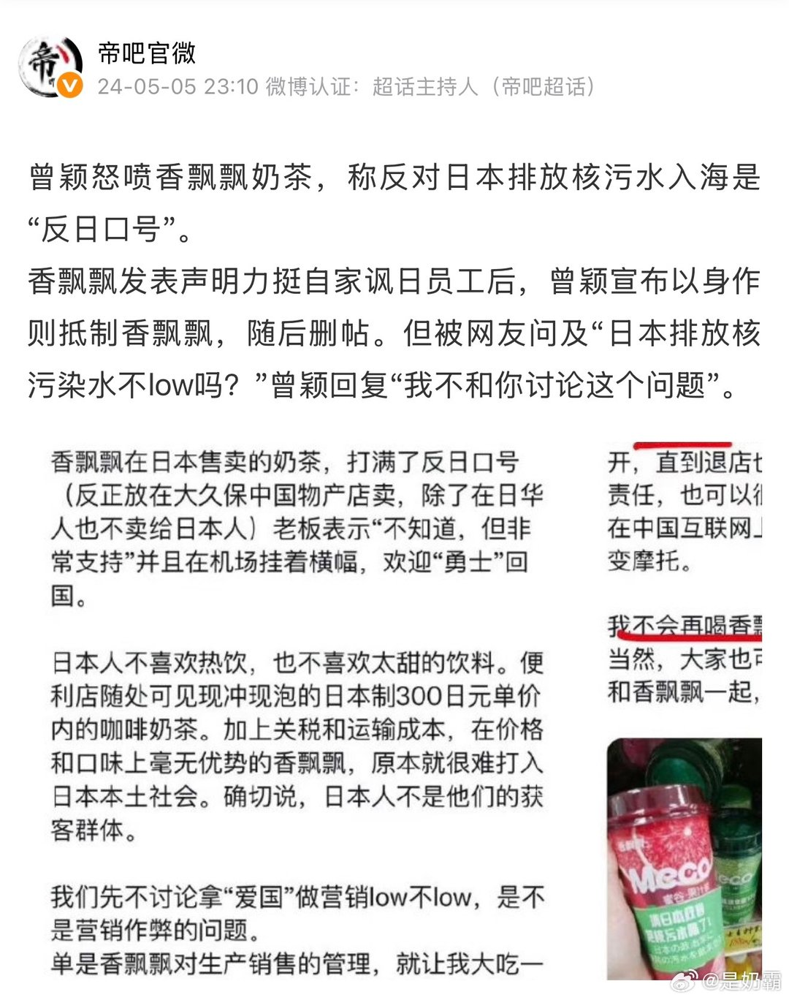

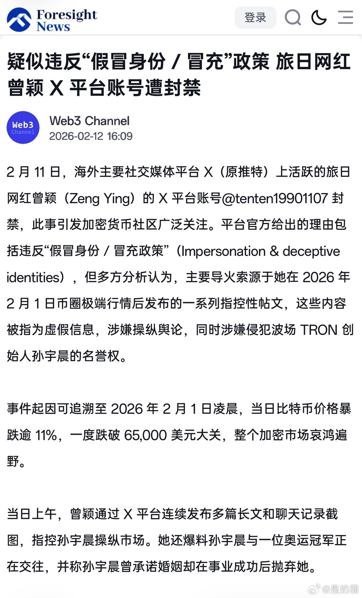

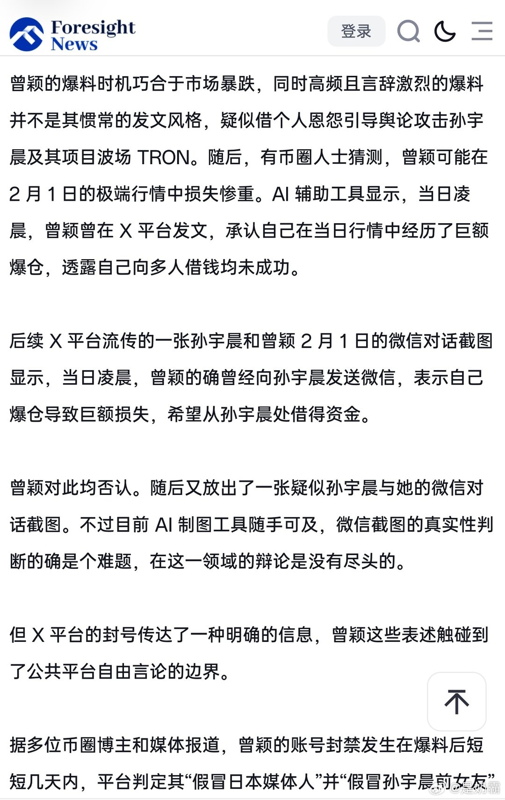

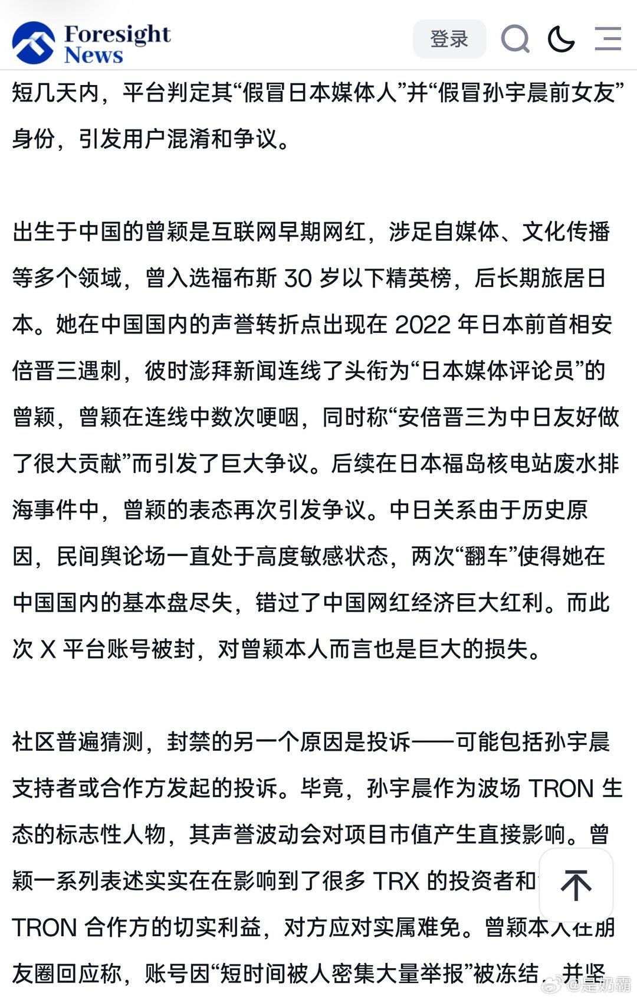

---

## 6

@李建秋的世界

发表于：2026-08-30 12:34

来源：微博

链接：https://m.weibo.cn/status/5337712519024441

从2000年到现在，从日本角度，对华贸易量占整个日本贸易从10%一路上升到20%。虽然中日关系不咋地，而实际上中国在日本的贸易总量上一直都在加强，是日本第一大贸易国。

而从2000年到现在，从中国角度上看，对日贸易量从17.5%一路下滑到5%。

日本在东盟贸易中的占比，从13.6%一路下滑到6.7%。

光看这个比例就知道日本目前处于多危险的境地。

---

## 7

@最后的科学家·垠

发表于：2026-08-30 11:25

来源：微博

链接：https://m.weibo.cn/status/5337694940169807

《老式双缸洗衣机的优点》

有些大家以为早已过时的东西，其实有最新科技没有的优点。

比如这种双缸（半自动）洗衣机，几乎没有现代洗衣机用久了之后的藏污纳垢问题。为什么呢？因为它的甩干桶和洗衣桶是分开的，不是像现代的洗衣机，两个桶套在一起。

现代洗衣机的两个桶之间的夹层，就是藏污纳垢的地方。用久了之后就发现洗过的衣服上面会粘黑色的屑。这时候你就得清洗洗衣机了，而且得请专业的洗衣机清洗服务，把桶完全拆下来，才洗得干净。

所谓的“机槽清洗剂”效果并不好，因为它无法把夹层 100% 地清洗干净。只要留一点没洗干净，你的衣服上就会继续粘上黑屑。另外，机槽清洗剂可能让夹层里厚重的污垢变得松动，却不能把它完全除掉，这样洗了之后掉屑反而比没洗还严重。

即使没粘明显的黑屑，你的衣服真的就是干净的吗？那个夹层里藏了多少细菌和微生物，以看不见的方式粘在衣服上。看不见，不等于就是干净的。

那个桶之间的夹层，可以和下水道管子一样脏，通过它的水流却不是单向的。洗衣服的时候，夹层里面的水是会回灌到正在清洗的衣服上的。这设计想想也不大科学。

用双缸洗衣机的年代，用了很多年也没听说过“清洗洗衣机”这回事，不知道“机槽清洗剂”是何物。所以是现代的全自动洗衣机才有这个问题。

几年前，母亲用了特别久的双缸洗衣机坏了。她不舍得换新的，想把它修好。当时我还跟她说“早就该换全自动的了”，打算给她买个滚筒式的。她不同意，后来只好给她换了一个波轮的全自动洗衣机。

到现在才发现，她不想换新东西是有道理的。因为这些新的洗衣机远远难以解决这个藏污纳垢的问题，洗出来的衣服并没有双缸洗衣机洗得干净。

别说普通的波轮全自动洗衣机了，我在日本用的最高级的东芝滚筒洗衣机，都没很好的解决这问题。虽然它有“桶自洁”之类的功能，但那远远不是真正的干净。如果要把两个桶套在一起，这问题可能就没法完美解决。

所谓的全自动洗衣机，比起半自动的，真的省了很多事吗？好像也没省多少事。感觉就像 Hindley-Milner 类型系统一样，带来的麻烦也许比省的事还多。也许我们都高估了“半自动”到底有多少事。

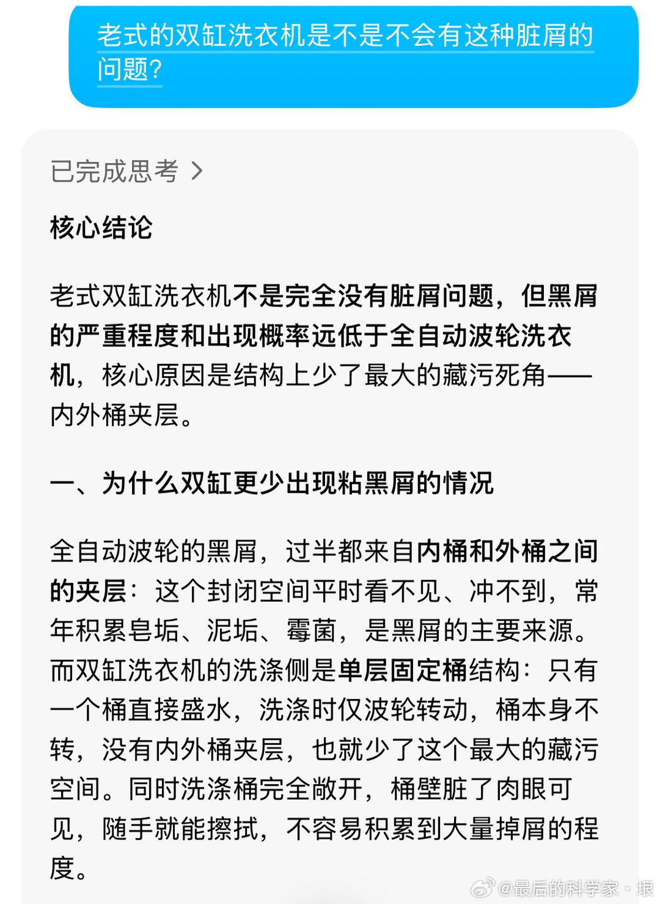

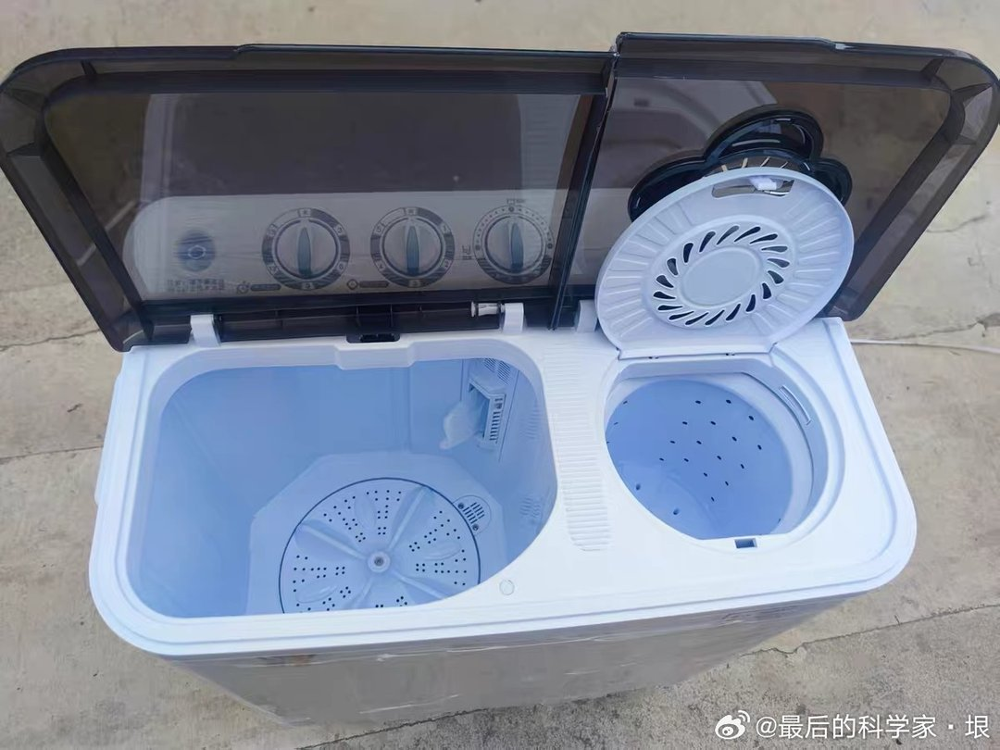

---

## 8

@蚁工厂

发表于：2026-08-30 02:21

来源：微博

链接：https://m.weibo.cn/status/5337558017376461

深度：重新设计推理芯片：从 Nvidia GPU 的缺陷到 OpenAI Jalapeño

地址：zartbot.github.io/blog/arch/jalapeno/index.html

假如重生成为基模型团队的 Infra 负责人, 会对 Nvidia 的系统有哪些不满? 从第一性原理出发, 拆解一颗为推理而生的芯片 —— Core Slice 架构、内存子系统、片上网络、软件栈与设计闭环。

“今天这篇分析 Jalapeño 的文章, 我假设我自己是某基模芯片团队的负责人, 从模型的需求以及当前 Nvidia GPU 的缺陷出来, 逐步从第一性原理开始推导该如何设计, 当然也会在公司内部逐渐复现整个设计过程. 通过这种方式来阐述 Jalapeño 的芯片架构以及背后的一些工具链... ”

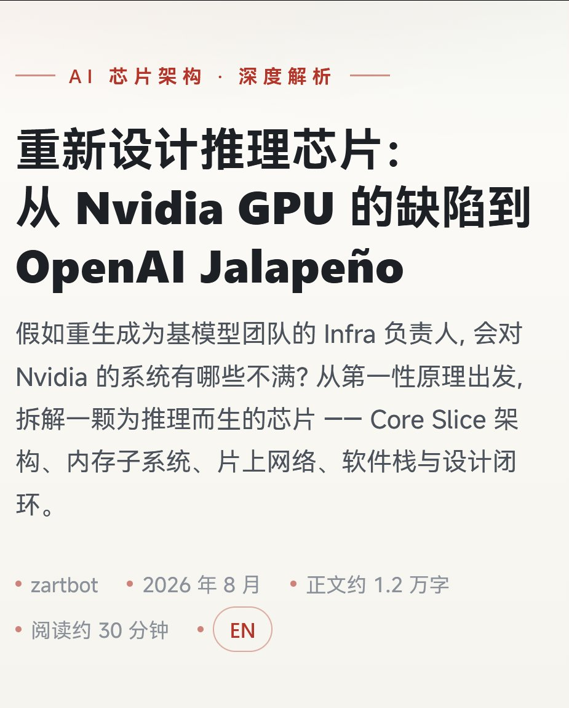

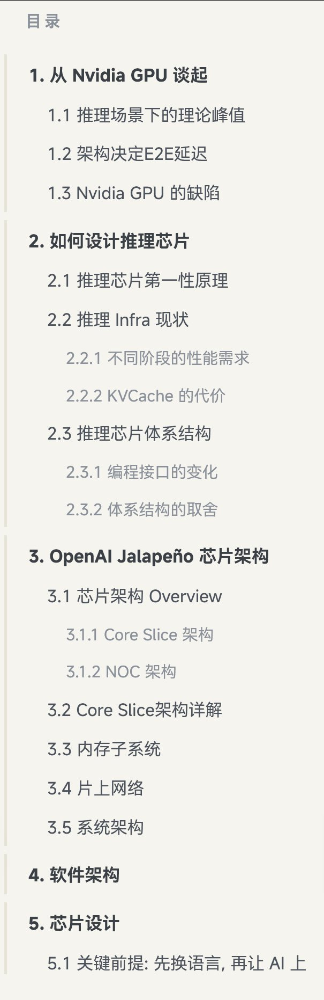

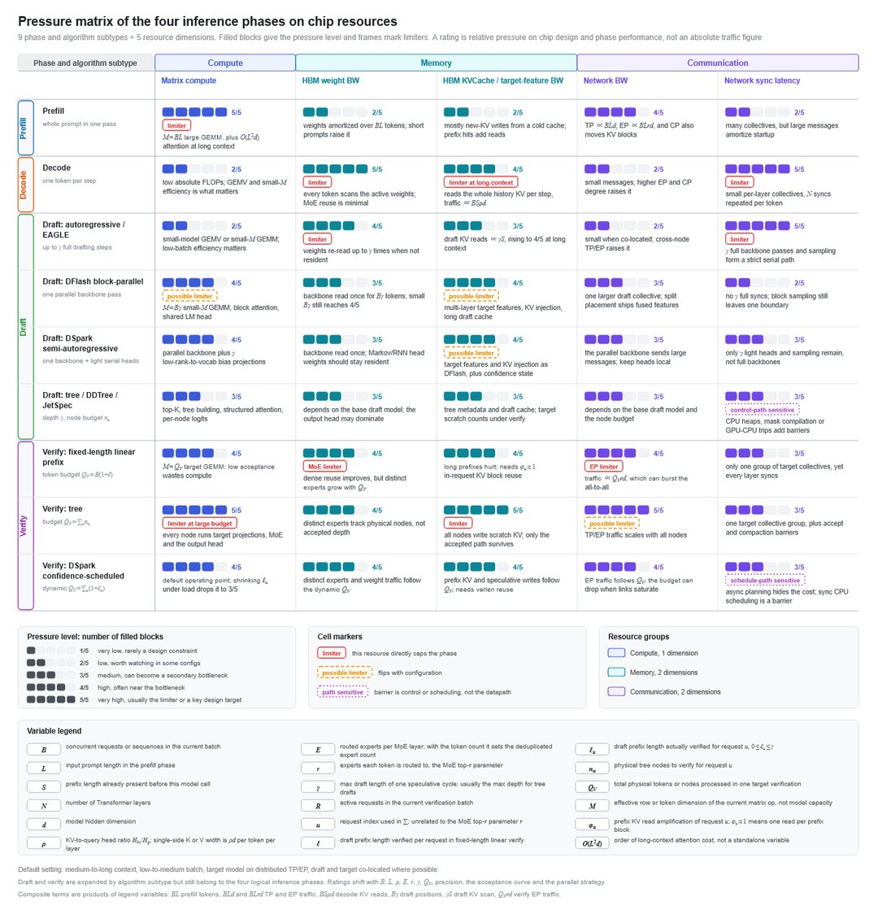

---

## 9

@包容万物恒河水

发表于：2026-08-30 11:10

来源：微博

链接：https://m.weibo.cn/status/5337691160838639

🔻据路透社看到的一份内部工会文章，大众汽车员工抨击董事会沟通不力，员工表示，管理层公开表态让他们感到“不安与恐惧”。

🔻而大众汽车正在酝酿其史上最大规模的重组。这些计划可能包括多达 5 万个额外的裁员岗位，或剥离部分部门，这还不包括公司去年确认的约 2 万个自愿离职名额。

\#热点现场\#\#海外新鲜事\#

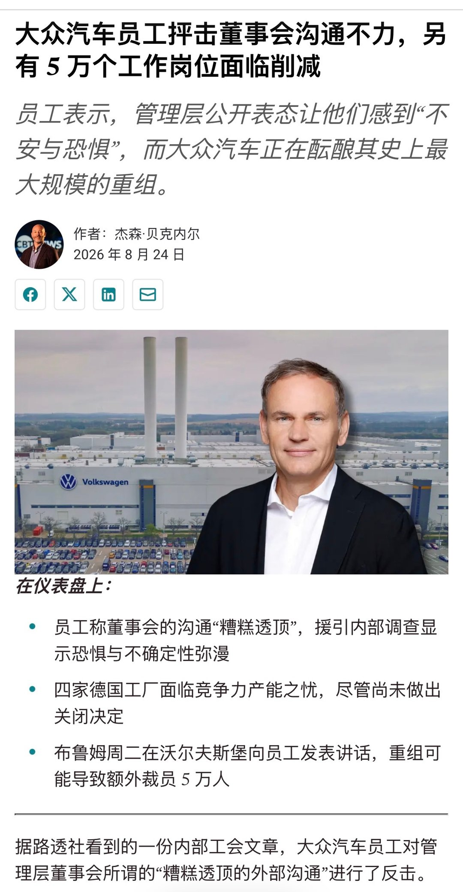

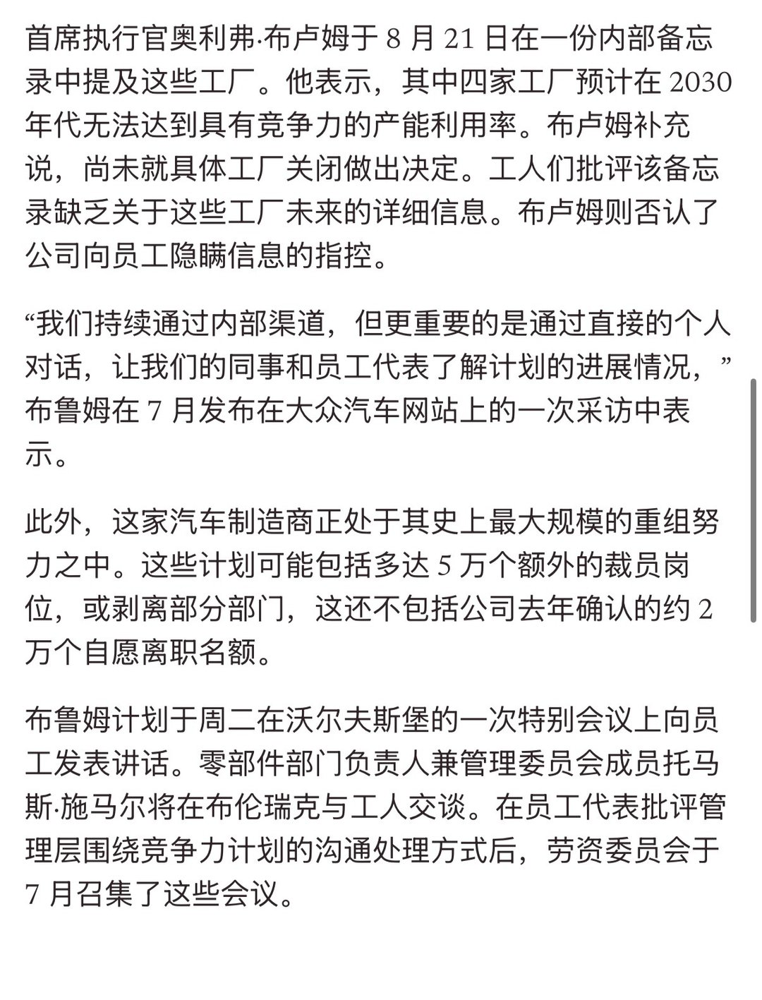

---

## 10

@风中的厂长

发表于：2026-08-30 11:10

来源：微博

链接：https://m.weibo.cn/status/5337691312360627

我现在只要吃到品质好味道好的饭店，都会推荐给身边朋友去吃，或者发微博软软地推荐给网友，因为我怕它倒闭，以后再也吃不到了，毕竟现在太卷了，很多劣币驱逐良币，特别是最近这些年，很多好店已经不见了。

---

## 11

@飞扬军事铁背心

发表于：2026-08-30 09:43

来源：微博

链接：https://m.weibo.cn/status/5337669493327443

“室友因为身体原因要用冰箱，但是电费却由我们平摊，合理嘛？”

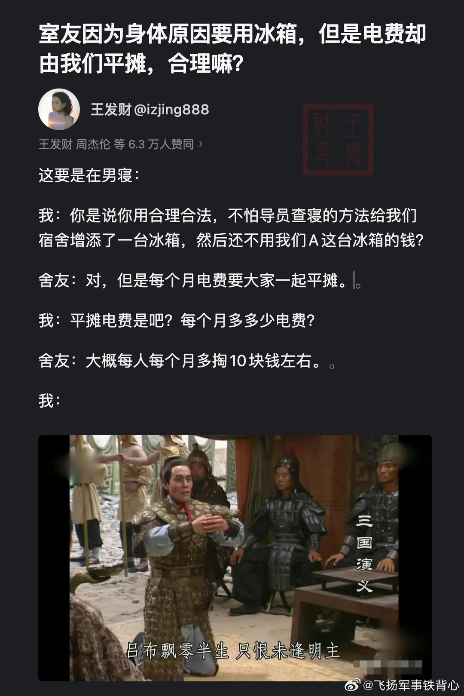

---

## 12

@南山林雪萍

发表于：2026-08-30 09:53

来源：微博

链接：https://m.weibo.cn/status/5337671867565126

哈萨克人民最爱车，这是最早游牧民族的爱马基因所留下来的吧。

哈萨克每年进口650亿美元。而在Top5的产品类项中，有三个跟汽车相关。第一是整车最高，占比4.4%。第四是车身2.3%；第五是汽车部件2.2%。第四和第五，都跟汽车的部件运进来，通过KD（散件）加工有关。

江淮汽车在哈萨克的西北部的科斯塔奈州有一个汽车厂，合作对象则是哈萨克最大的汽车厂Allur。谁在这里生产汽车，也很难摆脱本地汽车厂的影响。最神奇的是，这里可以制造很多不同品牌的汽车。江淮、雪佛兰、奇瑞、北汽等都可以在这里生产。一个工厂，拼盘生产汽车，也是工业奇观。

哈萨克是人均GDP为1.3万美元的国家，2000万人口但每年汽车容量却只有24万辆，少的不应该。这跟当地没有汽车报废期限，应该有关系。

但相信中国汽车的加速涌入，会改变这一点。哈萨克有的是石油，每年出口790亿美元的商品中，一半以上都是原油。这里不缺油，因此中国电动汽车在这里能够像在缺油的乌兹别克那样，快速发威。但江淮、奇瑞、五菱、吉利的燃油车在这里也开始布下重镇。相信，很快会韩国现代、雪佛兰等主导的汽车格局，撕开一个口。实际上在首都阿斯塔纳的街头，比亚迪和理想的电动车也都开始出现。

在中亚市场，中国汽车靠着新鲜亮相、领先日韩美汽车的代差产品，拿下第一波攻势，往往都没有困难。难的是，如何守住阵脚守住口碑。而新鲜感褪去的守擂之时，中国汽车往往容易被后面跟上来的自己人所冲垮。

泰国的汽车市场就提供了一个反例。中国电动汽车一开始赢得头彩，但接连降价使得泰国对中国汽车的保值价值，大为疑惑。今年7月后，泰国连续出台政策，主要针对的就是中国电动汽车。可以说，中国电动汽车在泰国，已经迎来第二波战争。这一波，会更加艰苦。

现在哈萨克对中国汽车依然保持好感。但不知道这样的品牌保鲜度，还能持续多久？\#大出海\#\#中亚行大出海\#

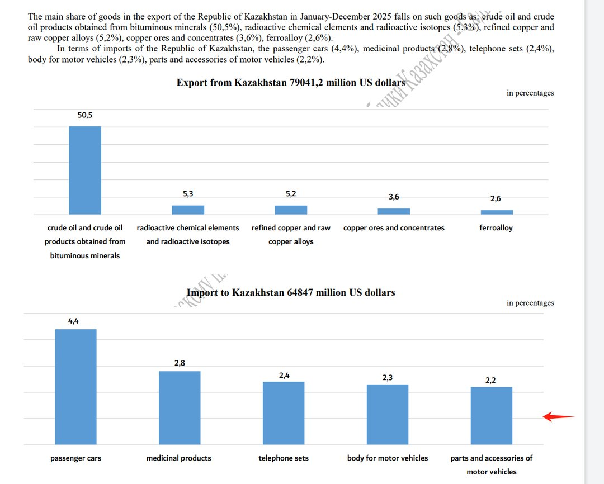

---

## 13

@观察者网

发表于：2026-08-30 07:25

来源：微博

链接：https://m.weibo.cn/status/5337634516763099

【\#未来很难有投资1亿以上的大片了\#？】今年暑期档即将来到尾声，最终还是略微超出预期。

其实此刻电影市场的火热，并不能真正体现行业所面临的困境。因为电影是存在滞后性的，暑期档上映的影片都是两年前，甚至三四年前筹备的项目，当年的行业还没有今天这么低迷。而如今，行业开机数量寥寥无几，那么接下来的两年，新片的上映无疑将成为一个大的问题。

未来，很难有投资1亿+的大片了

纵观今年的电影市场，从春节档再到如今的暑期档，还是有着不少大制作电影，不论是投资6亿的《镖人》，还是如今暑期档3-4亿的《欢迎来龙餐馆》，如此巨大的成本投入，已经成为了超级大片的标配。

纵观过去5年，不论是《封神》系列，《流浪地球》都拥有高达7亿+的成本，包括《蛟龙行动》的网传10亿，以及《长津湖》的13亿惊人成本，仿佛没有高成本都不配叫大片。这些夸张的大制作电影，尽管有些得到了大回报，但也不乏有翻车的案例。而这些所谓的10亿+超级大片，亦是国产电影巅峰的一种象征。

如今市场进入寒冬之后，尤其是近两三年来，这种刺骨的寒意远不止在票房端，更多是行业内部的萧条、人员的流失。一回头，这个行业仿佛被灭霸打了一个响指，竟然消失了一半。大部分人都已经坚持不下去，纷纷开启了转行，哪怕是依然坚守的从业者，大部分也都在苟着。

从电影项目的角度来看，曾经那所谓的7亿，甚至10亿+超级大作，如今已是稀有物种，别说10亿，如今整个行业运作的项目中，再也找不到3亿，甚至2亿，哪怕1亿的项目，如今也是寥寥无几。当泡沫一旦破裂，那么所谓的触底就是一条不归路，根本就没有底可言。

当然，即将上映的《流浪地球3》依然还是沿袭了曾经超级大片的预算，但毕竟按照时间也是两年前筹备的项目了。很可能的是，《流浪地球3》将成为大制作电影的绝唱。站在今年的行业，投资1亿就是天文数字，就是超级大片，几乎可以肯定的是，除非是沈腾、张艺谋等主创参与的特殊项目，几乎不会再存在1亿成本以上的项目了。

在当下的行情下，不论是哪家公司，任凭吹的天花乱坠，几乎都不可能拿出1亿来投资制作一部电影，别再吹嘘什么顶级IP，顶级选题，多好的故事，前几年那些工业电影、挑战好莱坞的口号就此打住。在现实面前，在每家公司都捉襟见肘的前提下，高成本电影已经彻底翻篇，真正成为了过去式。

在当下，投资超过8000万就是超级大片，能够媲美或对标曾经3-5亿的大项目；投资5000万就是一部准头部大片的项目，通常来讲，拿出5000万几乎就能涵盖当下行业80%的项目预算；投资3000万则是标准的中等体量的腰部项目，折合当年的8000万或者1亿投资。

再往下，投资2000万上下，可能将成为接下来电影投资规模的主流。但凡没有复杂特效制作工艺的类型，比如科幻片、动作片等，这个预算基本能够覆盖，包括剧情片、悬疑片、喜剧片、爱情片等。一旦未来国产电影降到这个级别，那么风险将会大幅下降。

降成本成为必然

电影成本已经不是降不降的事，而是不得不降，降多少的事，尤其是按照当下行业整体的情况，绝大部分电影拍摄的环节已经在大幅降低成本，因此电影成本的下降已然成为事实。从接下来的发展趋势来看，电影成本降低主要有一下几点原因。

首先自然是人工智能的崛起。目前人工智能能够直接参与到电影的前期、中期以及后期。除了剧本阶段只能当成“高级策划”，难以带来巨大加持，人工智能几乎能够在各个环节影响到电影制作，尤其是在降低成本这一块更为明显。

人工智能不仅能够大幅压缩拍摄周期，更是能够解决大量的美术、特效问题。另外也能够深度参与到动画电影当中。在未来，人工智能可能会更加深度的参与到更多环节，能够完成更大规模的降本任务。站在电影制作层面来看，绝大部分电影的线下制作成本都能控制在1500万以下。

另外，演员成本一直占据着电影成本的大头。演职人员的成本下降，无疑是压缩电影成本的重要环节。从近期各种演员的“求职”来看，当下除了一线演员之外，大部分演员都沦为了“灵活就业者”。如今电影、电视剧的开机数量可能较巅峰期已经下降了90%之多，这意味着绝大部分演员都将失业，外加AI短剧的崛起，根本就不再需要真人的出演。

过去动辄3000万、5000万片酬，如今也不复存在，现在一线演员的片酬已经肉眼可见的下滑，二线则是下滑的更为明显。曾经巅峰期，任凭各种降薪手段，都难以压制演员高额的片酬，如今在市场下滑，行业寒冬的倒逼之下，演员片酬终于降下来了。

不止是演员，整个链条的片酬都将迎来明显的下滑。不论是天价导演，还是动辄500万的编剧费，未来都将不复存在。包括摄影、美术、灯光，以及服化道等等，这些都将迎来不同程度的下调，整个电影链条将无一幸免。

在未来，不是片酬下滑那么简单，有戏拍就已经是一种奢侈了，当电影项目只剩下巅峰期的10%，大量主创将会面临失业，那么额外的主创人员将形成强烈的冗余，届时也将形成一种内卷，一旦趋势形成，价格也将会持续下滑。总之未来的电影成本中，人的成本一定会下降。

最终，一部电影的成本终于从1亿降低至3000万，但它完成了1亿电影所要求的一切，票房也不见得会下滑，没准还会提升。未来是真正拼内容的时代，《给阿嬷的情书》仅仅是一个开始。（犀牛娱乐）

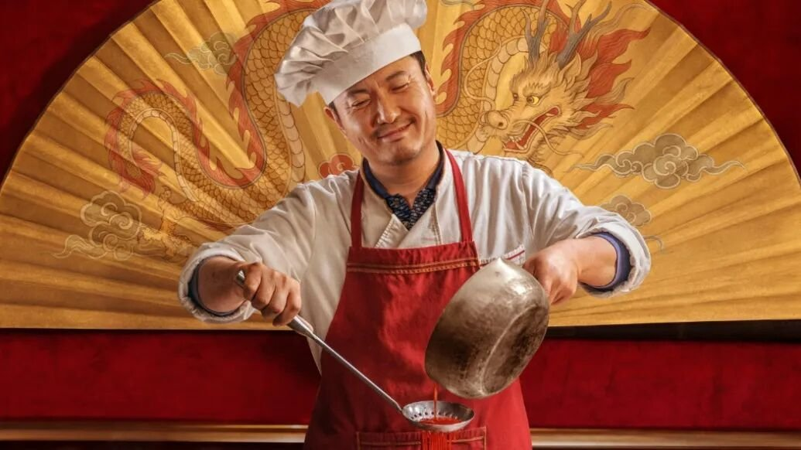

---

## 14

@释不归

发表于：2026-08-30 03:12

来源：微博

链接：https://m.weibo.cn/status/5337570900707518

成都女up主“小于访谈”在香港瑰丽酒店门口，随机采访住店客都是从事什么职业的？在被住客们以各种理由婉拒多次后，她终于锁定了一个看上去文质彬彬的白衣老登。然后\#本年度香港最大黑色幽默\# 就此诞生了！

因为，这个她认为看上去很有气质很儒雅的老登，正是香港人尽皆知的黑社会大佬：与新义安、14K 并称香港三大黑帮的和胜和坐馆龙头老大 “上海仔”郭永鸿！（曾因涉嫌恐吓、蓄意伤人、勒索等被捕，保释候查，最高可判终身监禁）大凡博主看两眼香港电视，都不敢那么头铁逼问一个黑帮帮主，能忍住不尿就偷笑了。

博主："我觉得你很有气质"

上海仔：（内心）气质？我这叫保释期间杀气收得好

博主："很多人认识你吗？"

上海仔："中国很多人认识我"

—— 确实，O 记、ICAC、全香港的差人都认识

博主："给年轻人择业建议"

上海仔："职业很难说的嘛"

—— 确实，我的职业写出来要被请去喝咖啡

博主："您从事什么行业？"

上海仔："从事很多行业，不方便说"

—— 说出来今晚就要换酒店了

博主："多大赚到第一个 100 万？"

上海仔："记不起来了，好了再见"

—— 第一个 100 万记不清了，反正不是打工赚的。再问下去，记起来的就是你了

博主（追着问）："给年轻人一句忠告"

上海仔："读好书，不要看古惑仔，不要学打打杀杀"

—— 全片最大的黑色幽默：一个古惑仔的龙头话事人劝你别看古惑仔。他说的是真心话，因为他知道这条路走不通 —— 走通的都叫 "坐馆"，走不通的都叫 "被告"。

博主："非常感谢你宝贵的时间"

—— 宝贵？这两分钟是上海仔今年最遵纪守法的两分钟。瑰丽酒店门口，堂堂和胜和坐馆居然被成都妹子按着头做了一回正能量人生导师。建议这段视频直接送香港警署当宣传片。

\#尼泊尔山洪已致675遇难2498失联\#\#景甜风波后的状态\# 释不归的微博视频

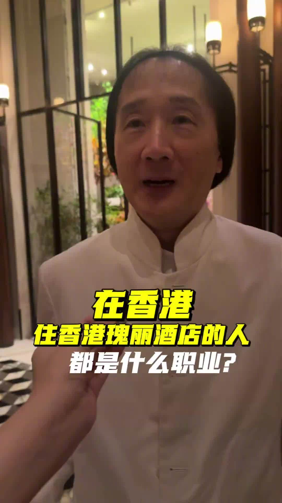

