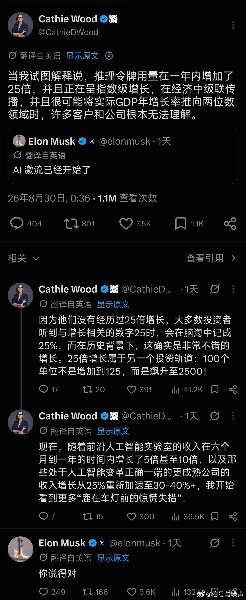

# 2026-09-01

## 1

@信号与噪声

发表于：2026-08-31 00:00

来源：微博

链接：https://m.weibo.cn/status/5337884989327047

马斯克刚刚说：AI的巨浪已经开始了。

但这次最值得注意的，可能不是AI又能替代多少工作，而是它正在改变整个资本市场的游戏规则。

他转发了ARK首席未来学家Brett Winton的判断：

AI基础设施的投资回收期越来越短，IRR又高得离谱。只要这种回报持续存在，资本就会不断涌向GPU、数据中心和AI公司。

最后的结果是，很多传统企业甚至不用真正遇到AI竞争。

钱会先离开它们。

资本成本上升、融资变贵、投资者要求更高回报，一些原本还能正常经营的公司，也可能被慢慢挤出市场。

而著名投资人Cathie Wood（木头姐）随后补充了一组更夸张的数据：

推理Token用量一年增长了约25倍；前沿AI实验室收入在半年到一年内增长5到10倍；部分吃到AI红利的成熟公司，收入增速也从25%重新加速到30%-40%以上。

她说，很多投资者现在就像“被车灯照住的鹿”，已经看到变化冲过来了，但还没理解这到底意味着什么。

这个视角挺重要。

过去我们总在讨论AI会抢谁的工作、抢谁的收入。

接下来可能要讨论另一个问题：

当AI行业长期提供远高于传统行业的资本回报率时，它会不会把整个经济里的钱都吸过去？

如果答案是会，那AI真正开始冲击传统行业的标志，可能不是它做出了更强的模型。

而是资本开始用脚投票。

---

## 2

@向小田

发表于：2026-08-31 04:39

来源：微博

链接：https://m.weibo.cn/status/5337955277210651

给孩子讲人生道理，跟给孩子讲数学差不多。数学公式必须经过自己推导，才能理解。死记硬背，没过几天就忘记了。人生道理一样，没有经历，光听道理，犹如背诵定理，遗忘很快。人只有吃过苦才会有认知。

---

## 3

@李楠或kkk

发表于：2026-08-30 16:03

来源：微博

链接：https://m.weibo.cn/status/5337765019648803

vibecoding 让过去五到十年的的很多畅销书比如什么什么 in Action 或 Practical Guide to 什么什么的玩意可以彻底消失了。

但是，它也让 The Mythical Man-Month，Design Patterns 这些可能 50 年前写的书重新复活了。。。

