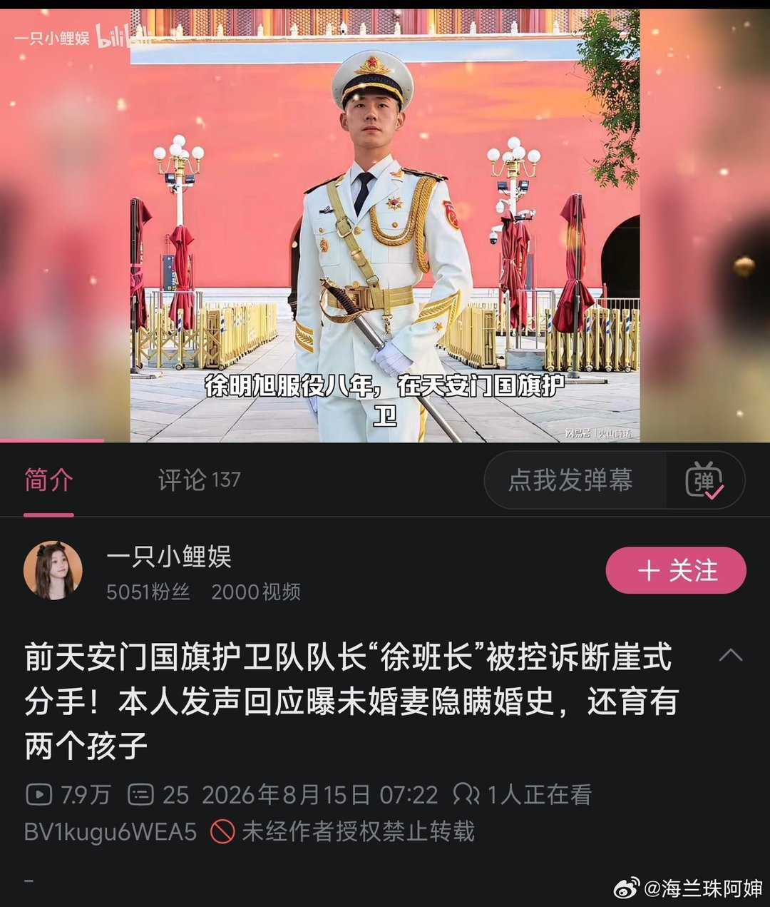
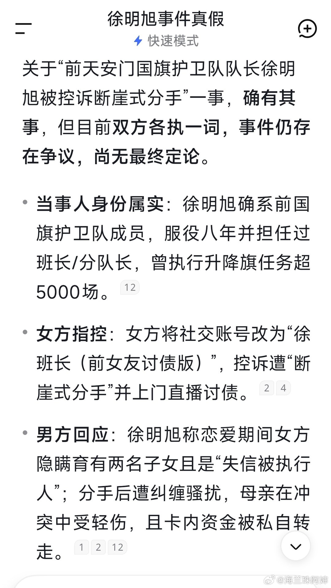
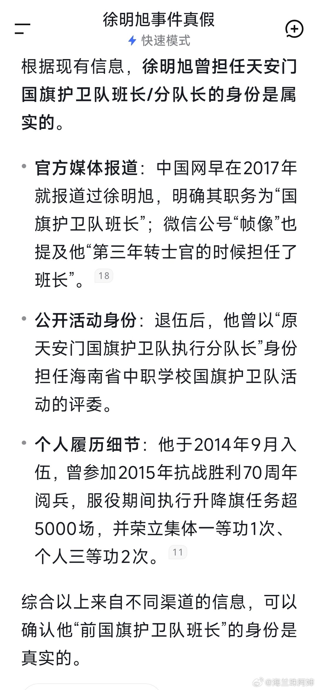
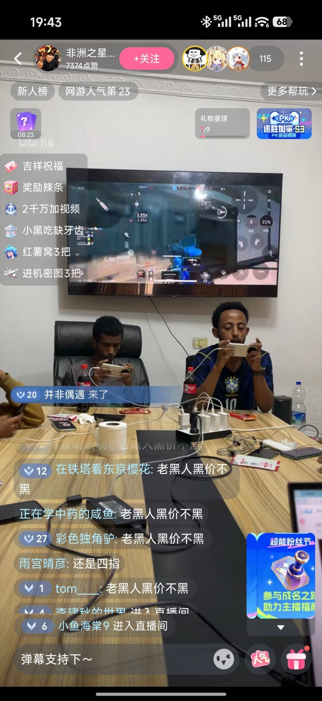
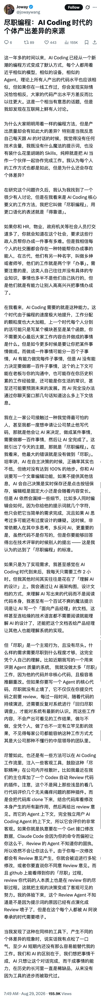
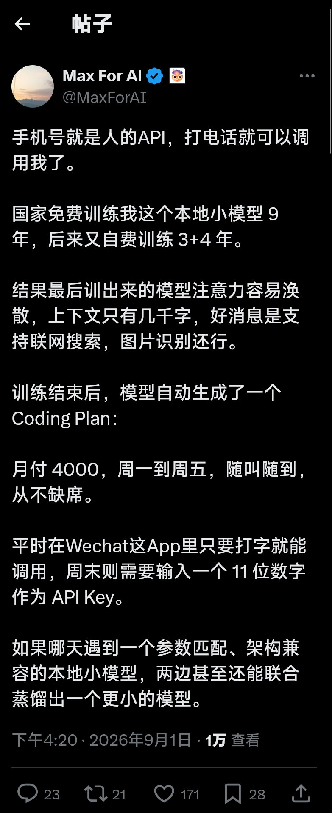
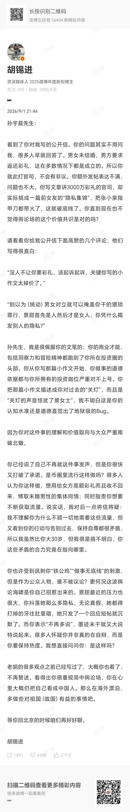
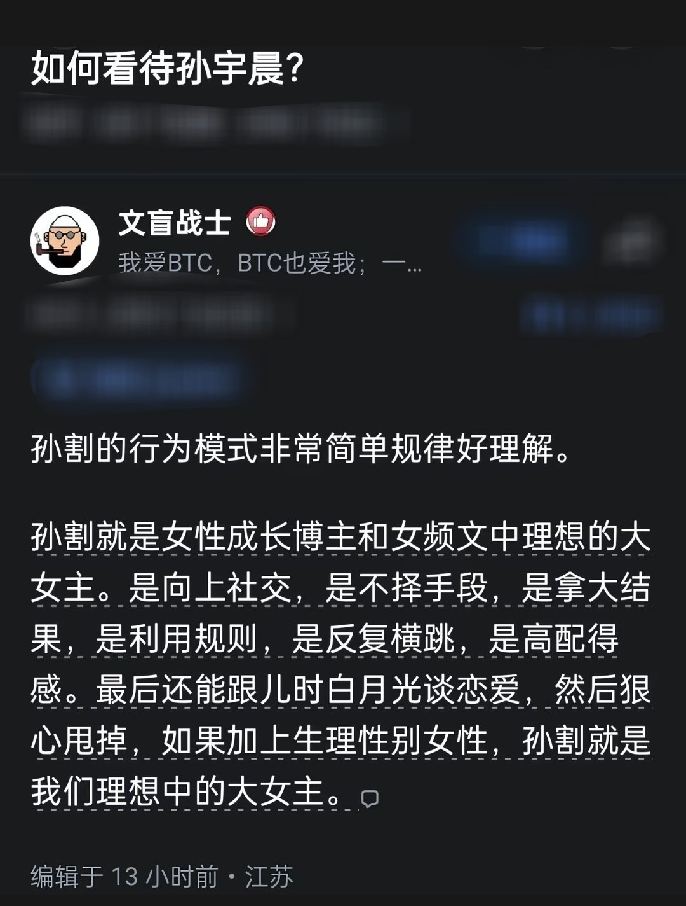

# 2026-09-02

## 1

@海兰珠阿婶

发表于：2026-09-01 03:03

来源：微博

链接：https://m.weibo.cn/status/5338293388446175

啊这…

最初我以为是有人借着国旗护卫队的名头搞噱头

后来 ds 了一下，核实了对方身份，还真的是国旗护卫队执行分队长…

我滴妈…连他都被结婚化债了？

---

## 2

@马岩Marks

发表于：2026-09-01 11:27

来源：微博

链接：https://m.weibo.cn/status/5338420223154809

如果按照眼下男女关系的趋势，在可以想见的未来，我们国家的男女关系大概率也是滑向欧美化：AA制，男的逐渐学会嘴上功夫，哄开心，情绪价值嘛，哄死人不偿命。大家睡得好就接着睡，睡不好就分开，要掏钱，那分币没有，婚前财产肯定要公证。

拿起法律武器，放下道德包袱。

这未尝不是件好事，没有利益瓜葛，感情反而变得更加纯粹。在一起就是在一起，让感情归感情，金钱归金钱。男不吃软饭，女不吃捞饭，大家各付各的，清清爽爽。

某种程度上来说，女人就是男人的mentor，九紫离火运，女性逐渐掌握话语权和主导权。

附：九紫离火运（2024-2043 年）在传统玄学中被视为中年女性的黄金发展期，尤其是 30 至 55 岁的女性，将在社会地位、事业机遇和自我意识上迎来显著提升 。

---

## 3

@李建秋的世界

发表于：2026-09-01 11:45

来源：微博

链接：https://m.weibo.cn/status/5338424954328363

找非洲人代打，赚一次。

再直播非洲人代打，再赚一次

---

## 4

@宝玉xp

发表于：2026-08-31 20:47

来源：微博

链接：https://m.weibo.cn/status/5338198928785618

“虽然大家都在用 AI 编程，但是代码产出水平方差反而比以往更大”，这确实是真实存在的现象。

手写代码的年代，人写代码的产出速度是有限的，一天平均也就是几百行代码，但现在都是几千几万行甚至更多，质量更是差别很大，有了数量加乘，方差自然被撑大了。

AI 把生成代码这一步的成本压到很低，执行不再是瓶颈之后，拉开差距的就是技术判断力和责任心了。

技术判断力指的是：知道该做什么、知道做到什么程度算好、知道怎么验证。

责任心则是作者说的“尽责”。如果你自己理解需求、自己做设计判断、用 AI 生成、自己审查、自己测试，确认没问题再交给同事，这和手写代码的年代没有任何区别，同事 review 的是一份你已经负过责的产出。

技术判断力差一点还能补，至少可以借助 AI 反复分析、检查能把问题降到最低。

最差的就是只做了中间生成代码那一步，把前面的需求分析、设计和后面的验收都跳过了，AI 生成的代码直接提交，审查的成本、踩坑的成本、日后维护的成本，全部转嫁给团队其他人。

这样的人从代码量看确实产出惊人，但实际上是在用 AI 批量生产别人的负债。

AI 终究没办法承担责任，代码出了问题，背锅的还是人。

---

## 5

@蚁工厂

发表于：2026-09-01 11:05

来源：微博

链接：https://m.weibo.cn/status/5338414720224341

人生即模型啊

作者@Max_For_AI

---

## 6

@专业戳轮胎熊律师

发表于：2026-09-01 11:17

来源：微博

链接：https://m.weibo.cn/status/5338417925456434

关于彩礼的问题

我还是得再说几句

男的不是不肯付彩礼，也不是说女的因为婚育损伤这点看不到

而是现在彩礼在拿整个家庭去赌命

弟一个是价格高，掏空了很多人的家底

第二个是骗婚的多，还贷化债，吃干抹净，反正什么套路都有。

国家不管，那自然男女大防。

他不是说你五万块钱，没了也就没了。

对很多家庭来说，这是能发生命案的价格，不说良家子被霍霍这种话题，也是长治久安的隐患。

~

你说怎么办？

直接一刀切，也不现实

现阶段改良最好的办法，就是：你要一个态度，没问题。那就存民政局专款专用账户。

你说是给小家庭用的。

那夫妻婚后购买大件、家庭装修、购买新车、子女教育，凭发票支取。

你说是给女方个人的，也没问题。

那养了孩子后，作为生育补偿，按年支付，10年付完。

总之，你不能让老百姓，一口气就把一大笔钱放到赌桌上。孙割还知道持有不同的币呢。

你得先把战线拉长，把捞女从婚恋这块赶出去，让她熬不起，那彩礼这块自然会改善很多。

---

## 7

@sven_shi

发表于：2026-09-01 12:57

来源：微博

链接：https://m.weibo.cn/status/5338443057204650

这几年很麻烦的是整个价值观颠倒过来了。以前是夫妻包括爷爷辈一起，全心全意为了小朋友投入。这几年舆论引导所谓的“补偿”，为自己的孩子投入都要“补偿”，那么钱从哪里来？钱够分吗？就像之前搞家务劳动补偿，结果出了个带孙费，离婚各地都不知道怎么处理。

---

## 8

@观察者网

发表于：2026-09-01 14:49

来源：微博

链接：https://m.weibo.cn/status/5338471188137353

@胡锡进 ：孙宇晨先生，看到了你对我写的公开信。你的问题其实不用问我，很多人早就回答了。男女未结婚，男方要求返还彩礼，这在多数情况下都是成立的。所以你就此打官司，不会有非议。你额外发帖表达不满，问题也不大。但写文章讲3000万彩礼的官司，却实际搞成一篇前女友的“隐私集锦”，把张小泉指甲刀都带火了，这就破底线了。你直到现在也不觉得舆论场的这个价值共识是对的吗？

孙先生，我是很佩服你的文笔的；你的商业才能，包括洞察力和冒险精神都跑到了你所在投资圈的头部。但从你写那篇小作文开始，你做事的道德依据都与你所拥有的投资咖位严重对不上号。你把那篇小作文描述成你对过去的“关灯”，而且是“关灯的声音惊扰了景女士”，我不明白这是你的认知水准还是道德直觉出了地狱级的Bug。

因为你对这件事的理解和价值取向与大众严重南辕北辙。

你已经说了自己不再就这件事发声，但是你很快又打破了承诺。是币圈里流行这样做吗？很多人认为你这样做，想用给女方高额彩礼而且收不回来，博取未婚男性的集体同情；同时指责你想要不断获取流量。说实话，我对后一点将信将疑：我不理解你为什么不顾一切地需要这些流量，但又看到你的行动与告别过去、保持自尊都很矛盾，所以我虽然比你大30岁，但我很是搞不明白，你这些矛盾的合力究竟在指向哪里。

你也许受到讽刺你“铁公鸡”“做事无底线”的刺激，但是作为公众人物，谁不被议论？更何况这波舆论海啸是你自己招惹出来的。景甜最近的压力也很大，你抖落她那么多隐私，无论真假，她都得打掉的牙往肚里咽，她只发了一个回应短帖就沉默了。而你表示“不再多说”，墨迹未干就又大说特说起来。很多人怀疑你并非真的在自辩，而是你要保持热度。我想直接问问你：是这样吗？

老胡的很多观点之前已经写过了，大概你也看了，不再赘述。看得出你很重视简中舆论场，你在心里大概仍把自己看成中国人。那么在海外漂泊，多做些对祖国（故国）有益的事情吧。

等你回北京的时候咱们再好好聊。

---

## 9

@樊百乐

发表于：2026-09-01 16:52

来源：微博

链接：https://m.weibo.cn/status/5338502036455537

女明星现在去起诉小作文侵权，到底是不是一个好主意？

1.  公关战或者谈判都是博弈论。但最怕的不是你不懂博弈论，而是套错了模型。

2.  我和很多娱乐法同行代理的大部分最终决定告黑的明星客户，都遵循这个模型：第一，对方的言论已经让ta名誉严重受损，告赢了可能以正视听；第二，有足够的证据链保证胜诉概率；第三，对方败诉后可以被执行，可以打击气焰，最不济“行为保全”也能让丫闭嘴；第四，虽然打地鼠很累，但可以杀鸡给猴看。

3.  这次的女明星虽然是很大的腕儿，但她这次的事情其实和上面的模型有很大区别。

4.  我看了很多假设自己是她律师的同行的分析，但我个人觉得，这个事情的第一性原理问题是：“哪怕她在舆论上占上风，她愿意一直让聚光灯停留在自己身上么？”

5.  中国特殊的明星塌房现象的最大特点是：它并不像法庭或者辩论赛一样，是个“真理越辩越明”的战场。

6.  退一万步说，即便是真理越辩越明，这件事的真理到底是什么？

7.  说白了，这是一场被对手刻意包装成“彩礼问题”的战役。大家掰扯半天这是不是彩礼、该不该退，但其实女主角一直在默默被“灰产洗钱问题”架在火上烤。就算最后彩礼问题辩论结果完全对女方有利，有一种可能性是：由于事情发酵太久，有关部门说，咱们聊聊这笔钱在“彩礼”之外的性质吧。比如，配合调查一下洗钱问题？

8.  而另一方面，民事诉讼在这场战役里对于对方的威慑力几乎为零。如果朝阳法院或者海淀法院能够吓住对方，不说别的，美国SEC都得过来磕一个（对，我知道它们后来确实主动撤案了）

9.  行为保全呢？（就是“封口令”）那更搞笑了。这三篇小作文，哪个是在中国境内的社交媒体上发布的？又有哪个没在中国境内病毒式传播呢？

10.  岔开一笔哈：就事论事说，如果告对方诽谤或者泄露隐私，胜诉概率大么？先说结论，挺大的。

11.  对方已经指名道姓了，虽然最后说“纯属虚构”，但中国司法实践普遍仍然认定是针对女明星的。而且虽然三千万、一起双宿双飞等情况，对方有可能直接拿出转账记录、聊天记录等，证明不是诽谤。但其中很多细节，比如修指甲之类，对方是有举证责任的。这些大概率对方无法举证（也不排除其实都被猥琐监控录下来了），如果无法举证，这些话题都是降低女明星社会评价的，绝对构成诽谤。但能判赔多少钱就不好说了，对于大部分明星来说，都属于杯水车薪。

12.  所以就一定应该告么？不一定。

13.  这里头有几方面的困扰。首先，有同行建议按隐私权起诉，这可能不靠谱。你对哪部分认为是隐私（暗示确实是真的，只不过不该报出来）？其实女明星微博回应也暗示了：交往过。问题是，交往过这事儿就算是隐私，对于公众人物爆出来算侵权么？下一个，就是刚刚讨论的诽谤。你大概率无法证实修指甲过程的对话。但是，你要起诉诽谤，网友会拿一个比对版看看，哪些你没有起诉，然后默认那些都是真的。这种选择性起诉，其实也是一种送菜。

14.  更关键的是，刚才说了，在这个模型里，对方光脚不怕穿鞋的，他在应诉过程中，可以不断爆料，真真假假，你需要对雨后春笋的新料继续回应，继续起诉吗？之前暂时还没仔细讨论但也许有进一步聊天记录佐证的话题，你希望对方扔出更多锤吗？

15.  所以，我才个人认为，在“起诉对方小作文是不是一个好主意”的思考过程中，“小作文在法律上到底构不构成侵权”是最次要的一个考量因素。很多光在这方面支招的同仁，我理解大家对于业务研讨的热情，和对于一个潜在大客户的追求，但这种招儿确实是有点儿管杀不管埋的。

16.  当然，我也并不觉得，这一定是个坏主意。

17.  为什么？因为在这个模型里，由于树欲静而风不止，对方今天还在通过向胡主编开炮继续制造舆情，女明星渐渐进入了一种“被逼到墙角、退无可退”的境地。热搜翻篇儿暂时没有实现，反正nothing to lose，用一个反向诉讼搏一下，说不定也是个让水更浑的自救方式，虽然这种方式可能杀敌和自伤都需要考量。

18.  当然，这个事情可能解决的最大转机在于：对方闹得实在太厉害了，上面多年以来黑不提白不提的平衡被人为打破了，然后出手了（未必是根本性出手解决，但舆情可能被突然按暂停键）。所以，我觉得，女明星的理想策略也许是：等天兵。

---

## 10

@胜利主义章北海

发表于：2026-09-01 10:50

来源：微博

链接：https://m.weibo.cn/status/5338411013767313

原来如此

---

## 11

@梅新育

发表于：2026-08-29 00:59

来源：微博

链接：https://m.weibo.cn/status/5337175180707994

【梅新育：孙宇晨景甜之争，最重要的是返还彩礼】

对于整个国家、社会而言，孙宇晨景甜之争，最重要的是返还彩礼。如果孙宇晨所称景甜以“彩礼”名义向他索要了3000万元一事真实，而且确实已经支付给景甜父母，那么司法机关应该裁决全额退还。昨天（8月28日）中午，我评论了一句：

“不管当事男女双方是谁，只要结果没有结婚更没有生娃，彩礼就该全额退还。”

今天，需要明确再次重申。

孙宇晨和景甜的其它纠葛基本上可算私事，没有兴趣评论；但未结婚即关系破裂女方所收彩礼是否退还，司法机关如何裁决，关系社会婚姻家庭制度根基、社会稳定发展根基，而近20年来，众多规定和司法裁决已经深深动摇了这一根基，对社会的毁灭性后果正在日益浮现，拨乱反正，刻不容缓。

如果孙宇晨所称景甜以“彩礼”名义向他索要了3000万元一事真实，那么这一金额就创造了新中国建国以来彩礼纠纷案涉案金额断层式领先的最高纪录，加上孙宇晨和景甜的名气，如果不退还彩礼，其负面示范效应将是毁灭性的。难道我们嫌现在结婚率暴跌、生育率暴跌、男女对立、人口老龄化问题还不够严重？、加剧速度还不够快？

孙宇晨爆料、风波骤起是在8月27日，在那之前一天，2026年8月26日，在天价彩礼名声在外的江西，中央农村工作领导小组办公室、中央精神文明建设办公室在赣州（瑞金）召开了部分省份农村高额彩礼问题综合整治经验交流会，而且这是中央有关部门连续第二年举办这一会议，而且自2019年中央一号文件首次对“婚丧陋习、天价彩礼等不良社会风气”提出治理要求以来，中央一号文件已经7次点名“高价彩礼”，用词从“治理”逐步升级为“专项治理”，再到“综合治理”，2026年一号文件的提法是“持续整治农村高额彩礼，加强省际毗邻地区联动治理”。

天价彩礼问题远远不限于农村，不少城市涉案金额恐怕更高；切实整顿彩礼等问题，回归、重建正常婚姻家庭制度，维护国家、社会生存发展基础，请自孙宇晨景甜彩礼纠纷案始。

\#孙宇晨起诉景甜\#

---

## 12

@梁斌penny

发表于：2026-09-01 23:51

来源：微博

链接：https://m.weibo.cn/status/5338607529493371

2018年杭州多个网红楼盘集中摇号验资，一次性冻结数百亿资金。大量用户赎回P2P理财去参与打新，流动性瞬间被抽干，直接引爆了一轮大规模网贷爆雷潮。

大部分流动性危机都有相似剧本：病灶早已潜伏，只等一个抽水口子，把市场流动资金抽走，脆弱的资金链便应声断裂。

当下硅谷AI大厂大举发债搞基建，何尝又不是新一轮巨大的流动性抽水？搞的美债那点收益率都不够看了，抽水都抽到美债头上了。。其他各国收益率也都猛涨。股市更是要被抽，惨啊。

