# 2026-09-03

## 1

@观察者网

发表于：2026-09-02 12:53

来源：微博

链接：https://m.weibo.cn/status/5338804225052627

\#富爸爸穷爸爸作者称负债是富人游戏\# 【畅销书《富爸爸穷爸爸》作者，自曝负债12亿美元】 美国《纽约邮报》9月1日报道，畅销书《富爸爸穷爸爸》的作者罗伯特·清崎近期透露，其累计背负了高达12亿美元的债务。

罗伯特·清崎靠传授“财富成功秘诀”赚得盆满钵满，并掌握庞大的房地产投资。

近日，这位79岁的作家在播客节目中大谈投资之道，主张借钱购入能够产生收益的资产，是富人使用的投资策略。

“没错，我现在负债12亿，”他在播客中说道。

他还补充道：“普通人不该学我这么做，明白吗？”

“但我从1974年就开始研究这套东西……如果你想要学会利用债务，那你就必须先接受相关财商教育。”

他的前妻兼商业合伙人金·清崎近期向《名利场》杂志解释，外界对这12亿美元的数字存在广泛误解，这笔钱并不代表这位畅销书作家的个人欠款。

“我们和合作方共同持有大量公寓楼，”金在采访中表示，这套资产组合合计大约有1500套公寓。

“严格来说，项目层面确实有这么多债务，”她说道，这些借贷都绑定在房地产项目上，而清崎个人承担的份额其实很小。

这笔巨额债务是清崎投资策略带来的结果。据《名利场》介绍：当名下房产增值，他就会基于上涨的房屋净值继续借贷，并把拿到的贷款视作免税收入。

报道还提到，他会把每一笔投资分别装入不同的有限责任公司，即便其中一个项目出问题，也不会牵连其他资产，实现风险隔离。

罗伯特·清崎对该刊表示：“要是一切彻底崩盘，你就去找我的律师谈。”

“防火墙，这才是富人的游戏玩法。”

金·清崎表示：“他就爱说一些惊世骇俗的话。”他抛出12亿这个抓人眼球的数字，之后再解释“为什么投资型债务是好事”。

亚利桑那州咨询公司JPTD Partners创始人约翰·普尔对《纽约邮报》分析：“债务分良性债务、恶性债务，但12亿美元规模的债务，你必须清清楚楚知道自己究竟在干什么。”

“市场上行的时候，杠杆会大放异彩；可一旦行情反转下行，杠杆在财务上就跟一把链锯一样危险。”

普尔说，在有限场景下，比如作为遗产规划工具，对增值资产再融资是可行的，但千万不要无限度依赖这套打法。

“这套玩法不可能永远持续。终归要有还本付息的那一天，无论规模大小，你都要为此做好准备。”

“清崎把这叫作‘富爸爸式债务’，可对普通投资者来说，这会迅速演变成‘穷爸爸式破产’。”

据报道，罗伯特·清崎1997年自费出版《富爸爸穷爸爸》，目前该书全球销量已经突破4400万册。

清崎依托这本书搭建起自己的“财商教育”商业帝国。书中将他从亲生父亲（也就是书中的“穷爸爸”）那里学到的道理，和儿时挚友的父亲——即所谓“富爸爸”传授的经验做对比。

罗伯特·清崎的生父拉尔夫·清崎，曾任夏威夷州教育厅长，1970年竞选夏威夷副州长落败。

清崎后来披露，书中的“富爸爸”原型是夏威夷商人理查德·基米，他拥有包括威基基比尔特莫酒店在内的连锁酒店。

清崎一直倡导投资房地产这类可以产生现金流的资产，主张尽量合法节税，并严格区分用于投资的债务，和用于日常消费开销的借贷。

罗伯特·清崎曾和美国总统唐纳德·特朗普合著两本书，其中包括2006年出版的《让你赚大钱》。 \#富爸爸穷爸爸作者自曝负债12亿美元\#

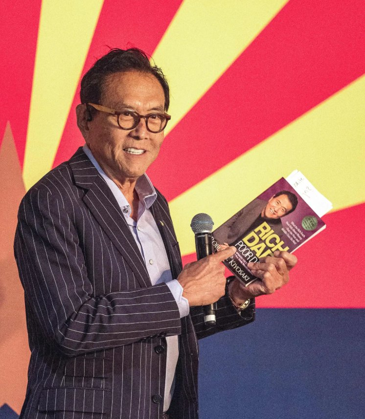

---

## 2

@洋务先驱张之洞

发表于：2026-09-02 12:49

来源：微博

链接：https://m.weibo.cn/status/5338803216845764

《从海底出击》是吧？\#烽火问鼎计划\#

---

## 3

@信号与噪声

发表于：2026-09-02 12:45

来源：微博

链接：https://m.weibo.cn/status/5338802361997468

美国财政部净利息支出

在 12 个月滚动基础上已攀升至 1 万亿美元以上，与国防支出相当。近期收益率曲线的上升，加上不断累积的债务，将推动净利息支出进一步走高

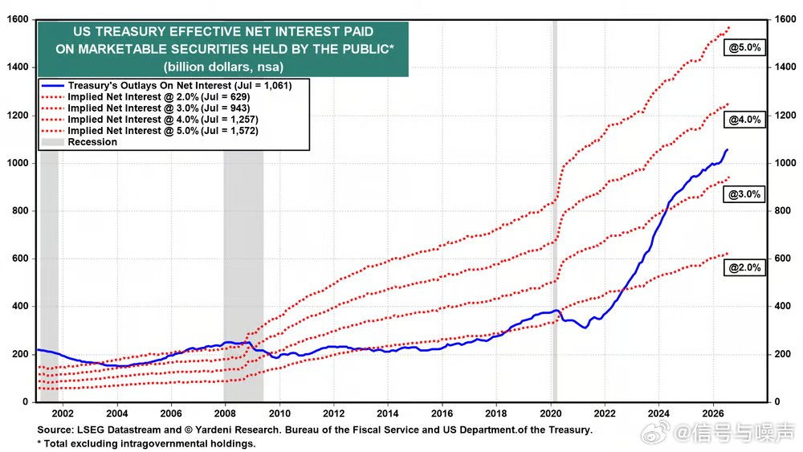

---

## 4

@猩猩吸猩猩

发表于：2026-09-02 09:53

来源：微博

链接：https://m.weibo.cn/status/5338759046632546

科技越进步，为什么很多城市越艰难？

我这几年越往小城市跑，越觉得一件事。最近我去了广西梧州。

科技进步，对梧州这样的城市不一定是好事。

过去的经济效率很低，但它养活人。

一件商品从工厂出来，要经过运输、批发、仓储和零售，最后才能卖到消费者手里。

每座城市都要有自己的批发市场、商店、银行、货运站和一大批小老板。

这些人的效率不高，挣得也不算多。

但他们可以养活自己，也能在本地养活一个家庭。

现在整个系统越来越高效。

一家电商平台，可以替代全国成千上万个批发市场。

一个大型仓库，可以把货物配送到周围几座城市。

一家只有几百人的人工智能公司，就可能为几千万甚至上亿人提供服务。

公司做的生意越来越大，需要的人却越来越少。

科技公司总部一般放在北京、上海、深圳和杭州。

利润、人才、数据和高收入岗位，也都集中在这些地方。

梧州这样的城市，得到的是更便宜的商品和更方便的服务。

失去的却是批发商、店员、搬运工，以及原本能够留住年轻人的工作。

这种变化在梧州特别明显。

以前两广批发市场可以养活一大批商户。

现在消费者直接在网上下单，梧州这个中间环节被省掉了。

以前梧州有十多万人加工人工宝石。

现在机器越来越先进，只需要几万人，就能生产比过去更多的宝石。

西江上的货运量也越来越大。

但是港口有了大型机械，几千吨货物不再需要大量工人装卸。

市场还在，商品还在，货船也还在。

只是越来越不需要梧州人参与了。

我们总觉得，生产效率提高以后，整个社会都会变得更好。

但效率提高，首先意味着同样一门生意需要的人更少。

其次意味着小公司被大平台取代，小市场被全国统一市场取代。

最后意味着工作、利润和年轻人，一起向少数大城市集中。

大城市可以不断产生新的技术岗位。

小城市被拿走的工作，却很难再补回来。

所以科技进步最大的受益者，可能不是所有城市。

它更像一个巨大的抽水机。

一边把廉价商品和互联网服务送到全国，一边把小城市的人才、利润和工作机会抽走。

梧州人现在可以买到全中国最便宜的东西。

但梧州年轻人想找到一份工资高一点的工作，还是要去广州和深圳。

这就是现代科技最矛盾的地方。

它让生活越来越方便，也让越来越多的城市失去了养活普通人的能力。

生活越来越方便，家乡的工作却越来越少。这样的科技进步，你真的觉得是好事吗？

---

## 5

@少年伯爵

发表于：2026-09-02 10:06

来源：微博

链接：https://m.weibo.cn/status/5338762410462349

有些东西，老实孩子真的很难学会。

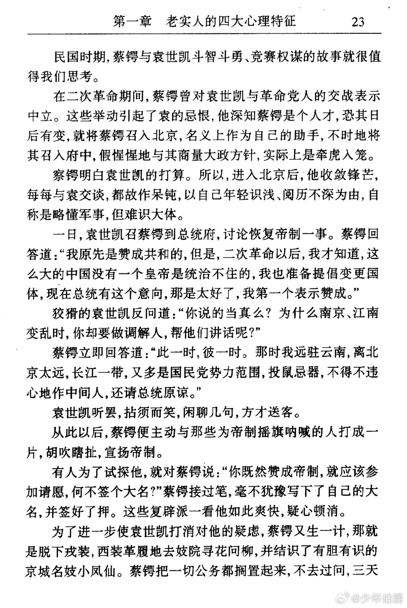

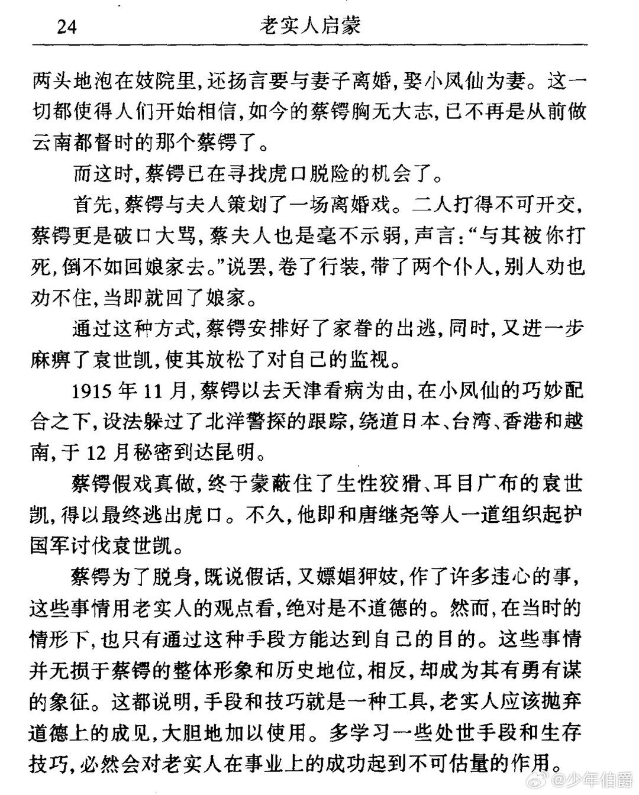

---

## 6

@好日仔还在后

发表于：2026-09-02 10:06

来源：微博

链接：https://m.weibo.cn/status/5338762427241735

现在有一种观点盛行，就是就业和收入不行，消费怎么会好呢？

我觉得你发现身边这种人，就把其当做反向指标就可以了，因为按照这个所谓逻辑2020年这批人肯定疯狂鼓吹消费，那时候就业好收入好、资产价格高流动性也充足，怎么可能消费不好呢？（同理2007/1997每十年消费高点都是那十年里面时间的炮友流量最火的时候）

那他们蠢在哪里呢？就是最简单的因果关系搞不清。现在看到的不好，是结果，因可能是当时的地产政策变化、周期轮回规律、疫情、贸易战等等各有权重，但现在不好却不是将来不好的果的因，反而有可能现在不好是将来好的一部分因。理解我上述说的对进入股票市场，是一个比较初级的门槛。

所以不难看到，市场上估值高的时候，绝大多数人的想法就是怕高都是苦命人，低位反倒剁光光完成出清，在社会分配中主动把自己的财富贡献出来。

另外，消费股以后40倍+市盈率唱多的都靠这些资金，尽量还是要呵护。

---

## 7

@海上一浪花

发表于：2026-09-02 12:08

来源：微博

链接：https://m.weibo.cn/status/5338792941591433

\#网友向女装店申请8次仅退款均成功\#这操作太离谱了。平台规则被钻空子，商家权益谁来保护？诚信底线何在？朋友，你怎么看这种薅羊毛行为？

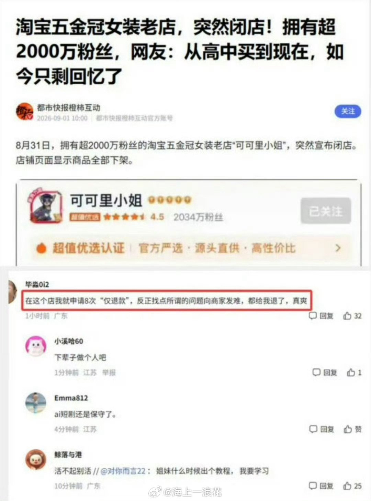

---

## 8

@城南科学家

发表于：2026-09-02 12:05

来源：微博

链接：https://m.weibo.cn/status/5338792170884361

维持基本的现代生活，是每个人的基本要求。如果维持不了，那就不生，少生。如果还有难度，那就不婚…这是市场的选择。

当然，就算富裕群体，很多人也不想生，因为要付出太多额外的精力。没娃一身轻松，大家都不想负重前行，都想赚社会的便宜。至于未来如何，很多人不想操心，也不愿意多想，无所谓。

个人不急，国家好像也不急，既然都不急，那就这样吧…

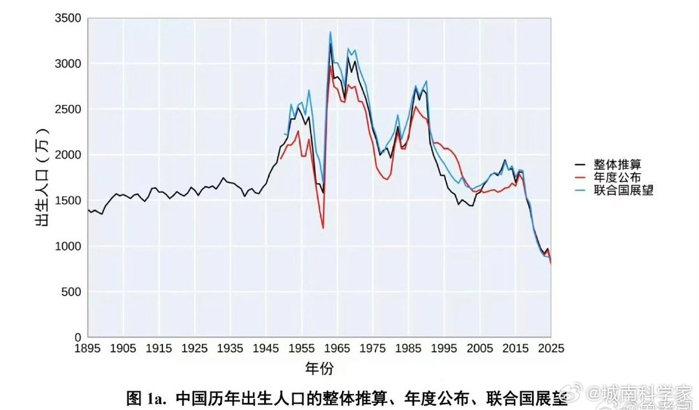

---

## 9

@菜鸟耶夫斯基

发表于：2026-09-03 08:50

来源：微博

链接：https://m.weibo.cn/status/5338979185986019

当新生代的军工企业也像SpaceX那样营销的时候，很快就能把传统军工企业的业务打得落花流水。

就像这个研制Atilius系列巡飞弹的企业，发布了这些弹药测试资料视频，并说：“不到一年，造成150+次测试。搭建、测试、破坏、改进、重复，直到它准备好供战士使用。”

这家企业近年来兴起，背后有大佬投资，对外也很会宣传、营销。加上投资的都是研制周期短但又新兴挣钱的项目，取得了不错的军贸成绩。

没有玩一些网络破梗，却自以为很接地气；没有让产品、宣传成为两条叙事路径，却表达了测试改进、装备可靠的意思。我还是那句话：当一个机构的宣传很烂，说明它的预算相对来钱比较容易。 菜鸟耶夫斯基的微博视频

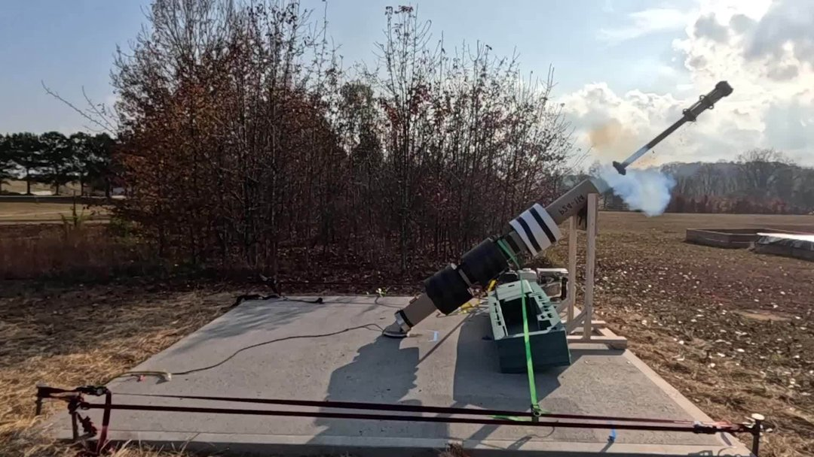

---

## 10

@999战报速递

发表于：2026-09-02 23:04

来源：微博

链接：https://m.weibo.cn/status/5338958235961146

🇺🇸🇮🇷⚡️美国国防部在美国《华盛顿邮报》曝光高级指挥官对伊朗战争的担忧后，从一个秘密军事网络中移除了数十年来属于机密级别的《国防部长命令手册》（SDOB）文件。

《国防部长命令手册》包含有关美国军队、军舰、武器和部署的信息，同时也允许高级指挥官通过“不同意”的方式，正式对美国国防部的命令提出异议。

最近，美国几位高级指挥官——包括美国欧洲司令部、美国南方司令部和美国太平洋司令部的负责人，以及美国海军作战部长通过《国防部长命令手册》警告说，对伊朗进行长期的大规模行动可能会削弱美国应对其他地区威胁的能力。

目前尚不清楚这些被移除的文件是否可以通过其他机密系统访问。美国前官员警告说，限制访问可能会使军事规划以及部队在各指挥部之间的调动变得更加缓慢和困难。

\#伊朗一婚礼因美军袭击4死50伤\#\#美军袭击致伊朗一婚礼人员伤亡\#\#伊朗一婚礼遭美军袭击数十人死伤\#

欢迎入群：

一群：支持正义国家打倒美帝（1群）

二群：世界人民团结起来打美帝（2群） 

三群：世界各国加油打美帝（三群）

（已加入三个群中的其中一个就不要重复添加了）

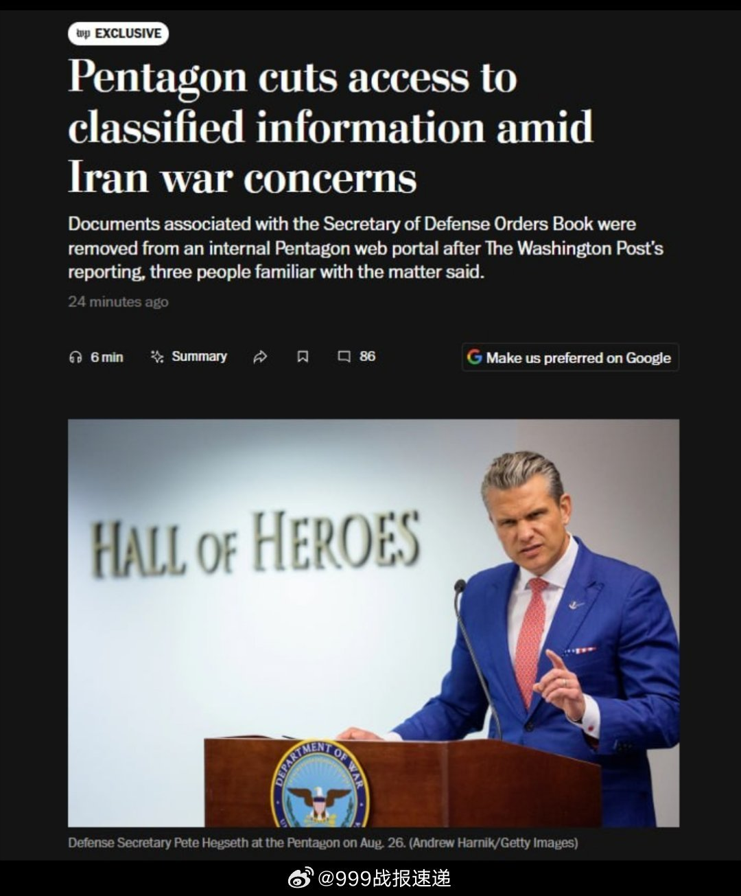

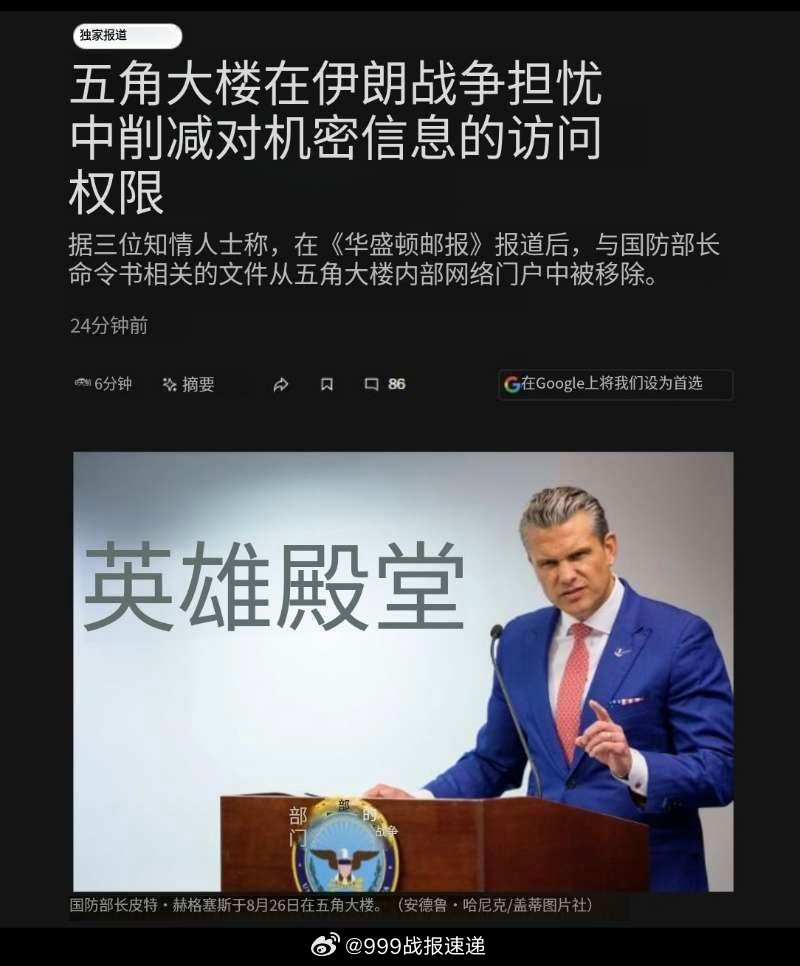

---

## 11

@观察者网

发表于：2026-09-03 08:50

来源：微博

链接：https://m.weibo.cn/status/5338978623422799

【“特大头”1美元币将开售】\#印有特朗普头像的纪念币将开售\# 美媒“今日美国”报道，美国铸币局将于美国东部时间9月2日中午12点正式开售印有特朗普头像的1美元纪念币，这是一个多世纪以来，美国货币上首次出现在世人物的形象。

收藏者可花154.50美元购买100枚，或是花61美元购买一卷25枚装。

美国财政部在新闻稿中称，在整袋、整卷的硬币当中，共有25万枚硬币带有“7月4日”密记标记。

据称，硬币图案采用特朗普白宫官方肖像，设计初衷是纪念美国建国250周年。

这是美国财政部公布的一系列印有特朗普形象货币当中，首款面世的产品。财政部还计划推出印有该总统形象的纸币以及24K纯金纪念币。

部分民主党议员与钱币收藏者对此提出反对，他们援引联邦法律，该法律规定美国货币与证券“仅可印制已故人士肖像”。

但财政部援引国会法案，该法案授权铸币局，可在一年时间内铸造1美元硬币，以此纪念美国建国250周年。

乔治·华盛顿在世时就拒绝将自己的肖像印在货币上，他认为这是君主制的做法。

卡尔文·柯立芝总统是此前唯一一位头像登上货币的在任美国总统。1926年，为纪念美国建国150周年，财政部发行半美元纪念币，币面同时印有柯立芝与乔治·华盛顿。

这款1美元纪念币以及24K纯金纪念币，均未获得公民钱币咨询委员会的审批。该委员会是国会设立的无党派机构，职责是就钱币设计向财政部提供咨询。委员会拒绝审议这两款硬币，理由是把在任总统形象印在货币上，违背美国立国原则。

虽然被称作“金币”，但这款1美元代币不含任何贵金属。

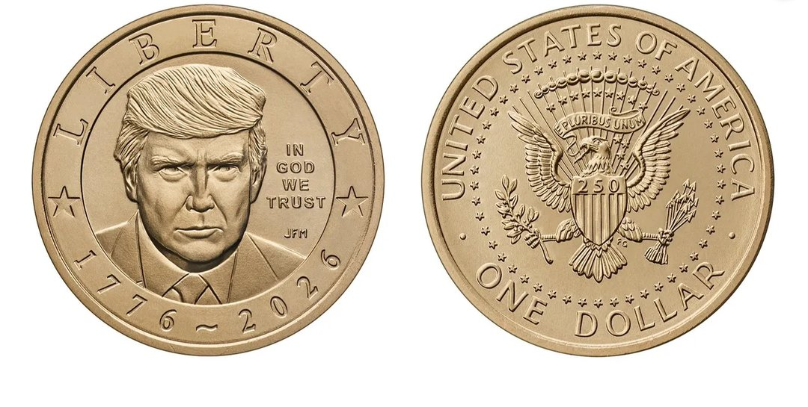

---

## 12

@少年伯爵

发表于：2026-09-03 07:51

来源：微博

链接：https://m.weibo.cn/status/5338973209365410

老实孩子不善于得体地表现自己的优势和成绩，我们来看看灰道人是怎么操作的——大一入学，没几天就搞到了全系同学的联系方式，给每个人发了一个200字的“自我介绍”，一下子让所有同学记住了他。大二从中文转到历史，和每个老师都“密切互动”，年年考第一。从不参加没回报的社团活动。来北大讲座的名师，却愿意给人家跑腿一整天，只为了换一张合影。转系这事就很有讲究。历史系学生少、竞争小，他算得明明白白，转过去轻松拿下年级第一。上课的时候，别的同学低头玩手机，他专门挑教授目光扫过来的时候微笑点头，分数能差才怪。

老实孩子也不善于合适地表现自己的善意——❶不懂得灵活运用各种技巧和手段来表现自己的善意。老实人的世界观是直线式的，他们认为一个良好的动机必定会产生出一个良好的结果。老实人的世界观往往又是十分机械的，他们认为真便是真，假便是假，真的假不了，假的真不了，这固然是有一定道理的。然而纷繁运动的世界中，“假作真时真亦假，真作假时假亦真”的现象𨚫比比皆是。这都说明，世上万事万物在因与果、表与里等方面，并不存在着一一对应的关系。

如果我们理解这一点，我们就会明白，仅仅有善意和真心是不够的，我们还必须通过种种努力，来证明自己的善意和真心，使别人能够真正感受到这种善意和真心。

老实人总是强调自己丹心一片，问心无愧。但他们往往忘了，丹心也好，黑心也罢，是谁也无法直接看到的，别人只能从你的具体行为以及这些行为给自己和他人所带来的影响中来推测。老实人要想准确无误地把自己的善意表现出来，为别人理解和领悟，就必须要借助于一定的手段和技巧。

❷老实孩子不擅长审时度势、因人制宜地表现自己的善意——在我们的工作和生活中，有这么一类老实人，他们说起话来，不看场合、不分对象、不择时机，心里想什么，就直接道出来。

结果，说者无意，听者有心，不知不觉中就得罪了许多人，给自己无形中制造了很多不必要的麻烦，甚至造成无可挽回的后果。

老实人之所以会遇见这些麻烦，究其心理根源，主要有——其一，老实人说话做事，往往只讲出发点不问归宿，只谈目的不看结果，所以对自己的行为所可能带来的后果考虑不足；其二，老实人对世界的复杂性和多样性认识不足，所以不懂得有区别有策略地对待各种人和事，他们千篇一律的处世方式在大千世界里难免要四处碰壁；其三，老实人对人特别是人的心理把握不够，在这种知已不多而又知人甚少的情况下，吃败仗几乎是不可避免的。这就好比是在黑夜里乱放箭，你知道哪一支伤到了谁的心？而报复者的箭又来自何方？

我们仅仅有一个良好的动机是不够的，还必须要有一个切实可行的方法作保证，而要做到这一点，就必须要具体问题具体对待，因地制宜、因人制宜、因时制宜、因势制宜地去处理问题。

“到什么山上唱什么歌”真的很重要，这不是见风使舵、两面三刀、曲意奉承，而是勤用脑带来的灵活。

天下武功唯快不破，而灵活就是一种顶级的快。

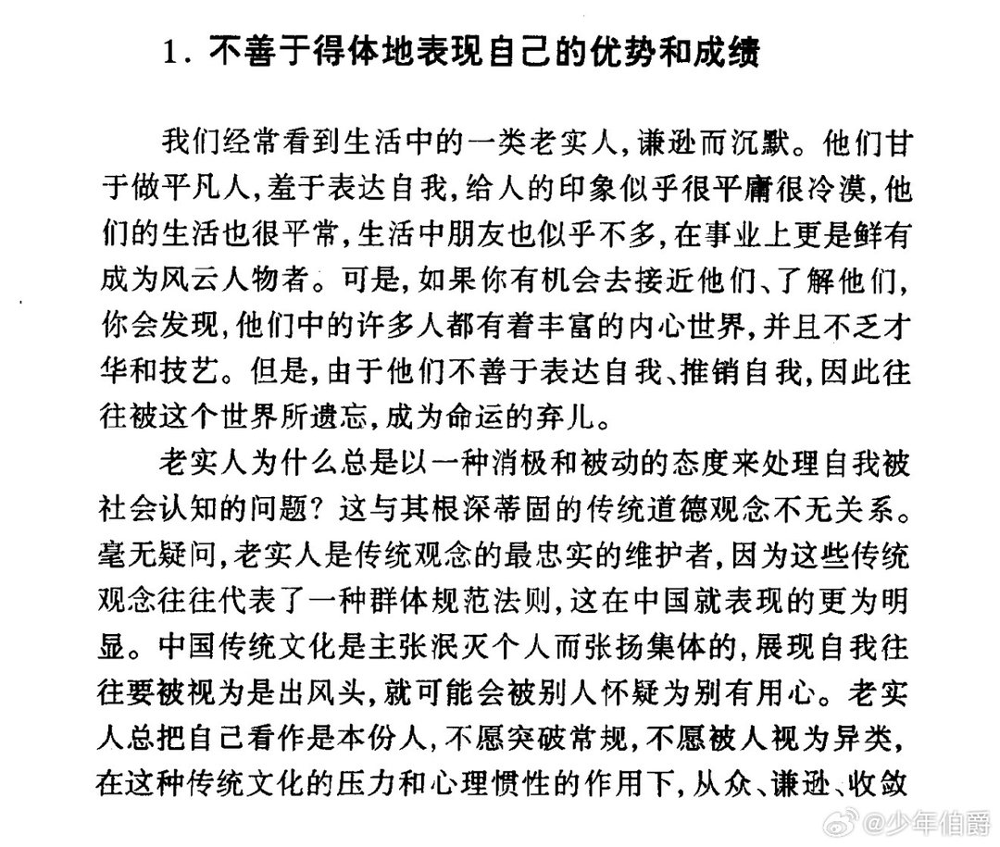

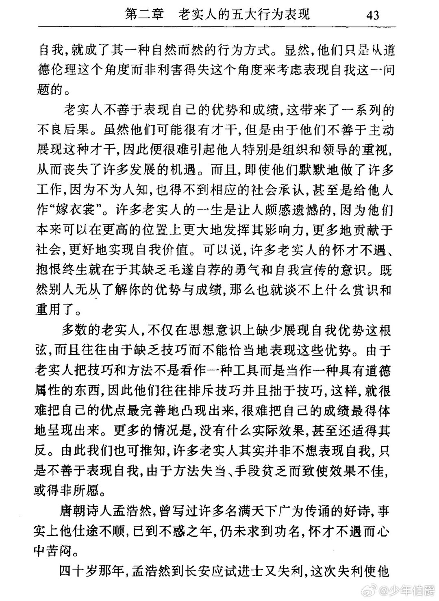

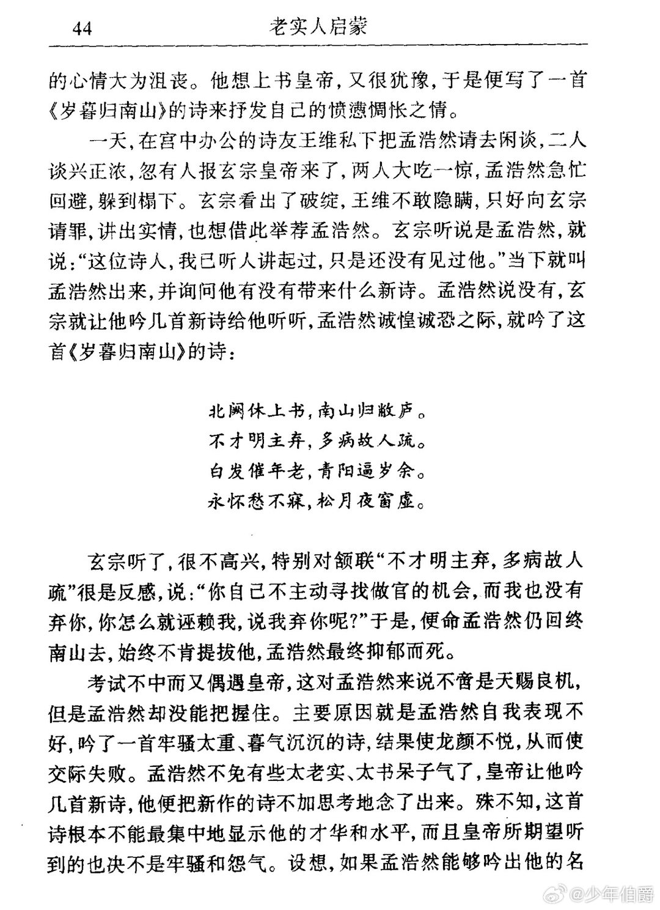

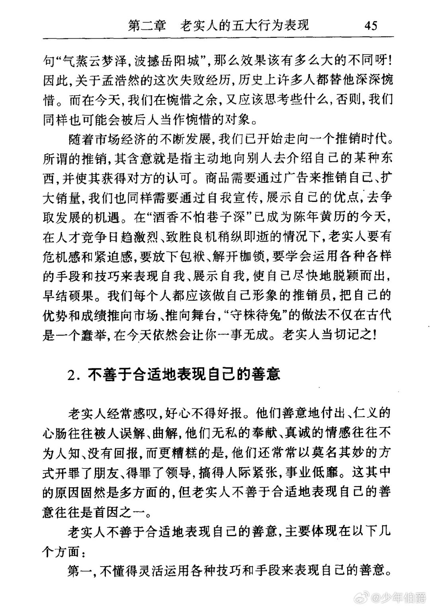

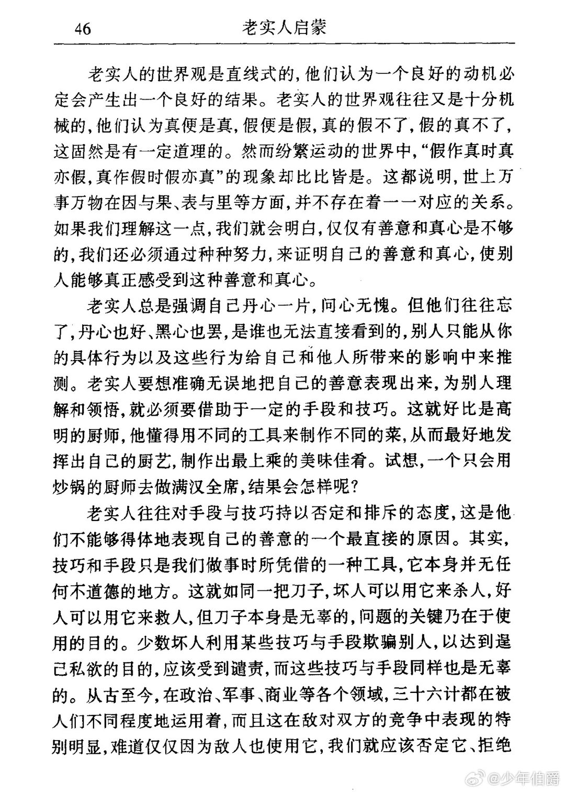

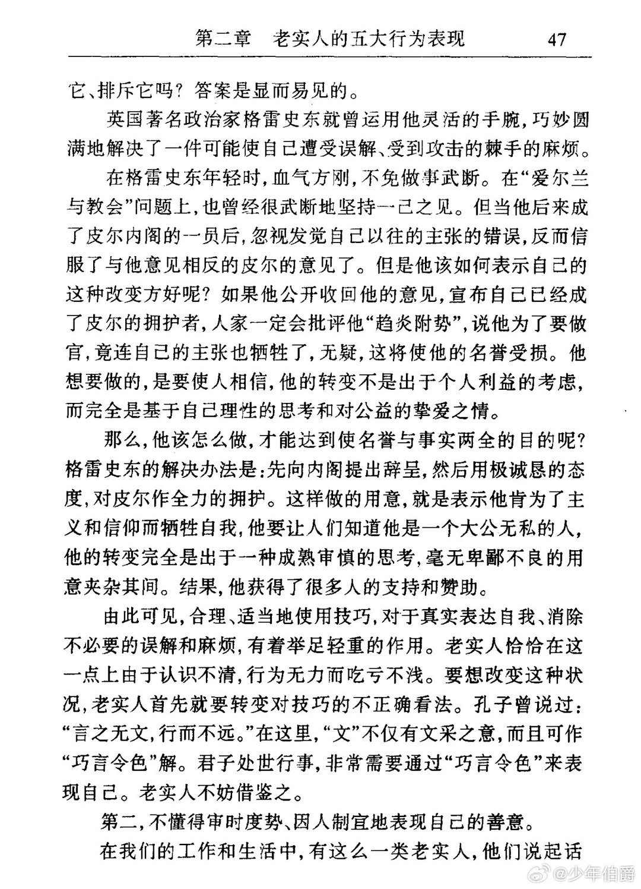

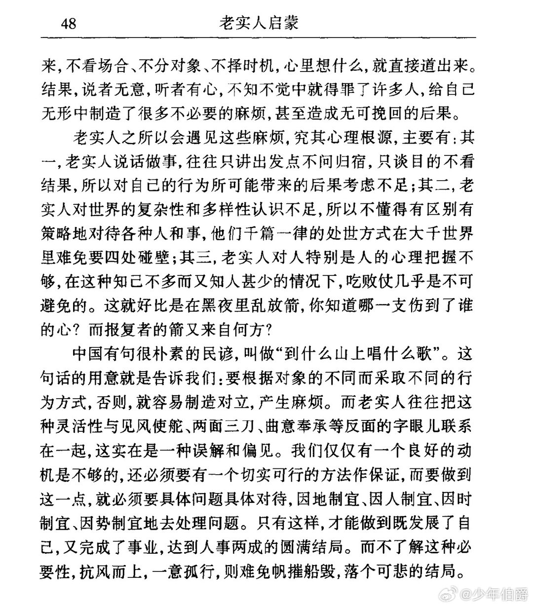

---

## 13

@21世纪经济报道

发表于：2026-09-02 11:46

来源：微博

链接：https://m.weibo.cn/status/5338787387540743

【\#人脸授权交易瞄准网红和大学生\#】\#3万元能买400张人脸授权\# 为了让AI短剧里的人物长相更有差异，人脸授权交易平台出现，主要采集达人和网红的脸。头部平台目前入库人脸300-600张。成都某公司对@21世纪经济报道 称，目前平台有400张人脸，大约60笔交易，交易额超过三万元。公司现在在重庆、上海、成都、杭州、横店设置了7个人像采集点，今年目标是扩张到50个，尤其要进驻高校。据了解，一些互联网大厂也在上海等地高校设立了线下人像采集点。（@21世纪经济报道 记者：章驰，肖潇 ）网页链接 21世纪经济报道的微博视频

---

## 14

@江宇行舟

发表于：2026-09-03 12:51

来源：微博

链接：https://m.weibo.cn/status/5339050766502097

\#多地中考历史不计入总分\#  历史是最能锻炼记忆连贯性与切片调度的学科，并有利于锻炼对事件背景、结构、人物关系开展综合分析的能力。也许不是人人都要当历史学家，但人人都离不开把当下事件说得有条有理、对过去现在能够实时总结、并在把握普遍规律的情况下去预测未来。

历史，是我们当下生活的案例集。

不把历史计入总分，就是公开引导学生们不重视历史。连九年制义务教育都不能重视历史，遑论以后高考分科、高校求学与走上社会，很多人可能将永远丧失和国家历史、世界历史、人类历史接触的机会。

历史教学在过去20年所谓“告别革命”、“告别通史”的错误调整下，已经饱受摧残。我至今仍很怀念上世纪80年代的历史课本，亲身领教过不同课本教出来的人，在思维上的差异。

如今还要彻底淡出考试。我们老笑话美国人连二三十年前的事情都记不住，这样一个搞法，今天我们笑话的，可能就将是明天我们自己的下一代。

更何况还不止是历史，一些地方连生物、地理等等都不计入总分，可以考虑做特定学科组合的配置，但决不能一刀切地舍弃。这种打着“减负”的旗号搞学科特殊化，最终反而会造成思维的僵化与教学义务的缺失，这种调整，是绝对值得商榷的。

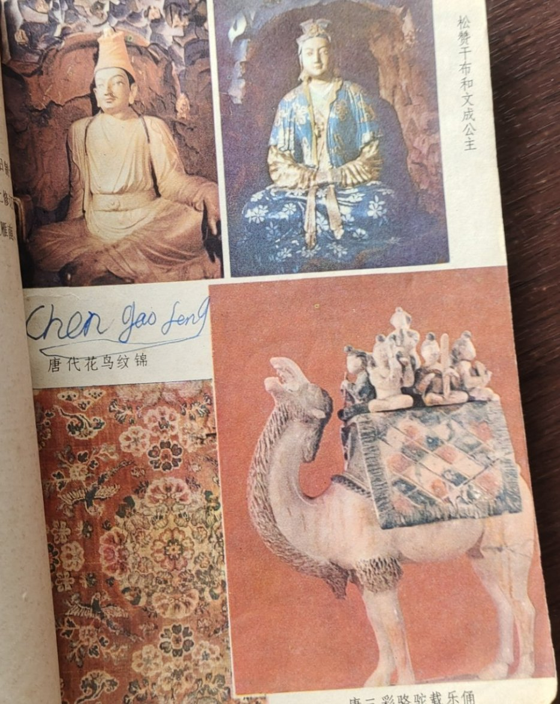

---

## 15

@理记

发表于：2026-09-03 12:51

来源：微博

链接：https://m.weibo.cn/status/5339041780206927

鸿蒙智行八月的销量4.2万，其中问界已经下滑到2.1万不到，只有处于低谷的理想的60%。不客气点，这个销量，无论从哪个维度衡量，真实意味着鸿蒙智行系已经进入成立以来的最低谷，也可以说是非常失败的销量了。

当然这只是暂时的失败，未来肯定光明。

我觉得鸿蒙要彻底解决几个问题。

1，内饰和外形必须去老登化。车机屏幕真的，这是我至今未考虑问界的原因。那个投影，真的。至于外形，只能说一言难尽。

2，宣传，就一句，能不能别给自己树敌？

3，价格，销量已经体现了。五个界，光问界就十款车（增程➕纯电），五个界总计多少款我数不过来了，反正小米实际就两款，销量可能是三万大几，鸿蒙就4.1万。

我知道提小米敏感，但事儿确实就这么个事儿，不把话说开，鸿蒙还是活在吹捧中。

---

## 16

@tombkeeper

发表于：2026-09-03 12:51

来源：微博

链接：https://m.weibo.cn/status/5339043240084432

有人说 AI 会带来人类的“知识平权”。

林肯解放黑奴之前，美国南方有些州制定了法律，不允许黑奴识字。这种制度显然会导致人们无法平等地获取知识。

在印刷术普及前，书是很贵的。唐朝买一本书的钱能换几百斤大米，穷人自然就看不起书。这种生产力水平会导致人们无法平等地获取知识。

信息技术普及后，每个人都能用可忽略不计的成本获取学不完的知识。把殆知阁的所有经史子集全下载回来，再把维基百科所有内容全部下载回来，加在一起，一个 U 盘就能装得下。

还要怎么“平权”？还能怎么“平权”？怎么才是“平权”？

我以前说过，技术进步会把所有人都带进海鲜自助餐厅，但技术进步无法把所有人的饭量都变得一样。好消息是你现在可以放开吃龙虾了。坏消息是饭量大的人会吃下更多龙虾。像 AI 这样高效的知识工具只会让愿意学习的人和不愿意学习的人差距拉的更大。

如果“知识平权”是指获取知识的机会变得平等，那么 AI 并不会带来更多变化。如果“知识平权”是指原来没有能力输出观点的人现在靠 AI 可以输出观点了，那么“知识平权”的主体到底是人，还是 AI 呢？没有 AI 之前，用脸滚键盘也可以发帖——这甚至比让 AI 帮自己喷更有主体性。

其覅欧式给你的热点美国帕德诺夫哥千万人内容破网可还能和法国独一份阿姨普工而韩国么啊基本是富农卡额模拟盘坡请安排有好多爬大山的女娃咯耳旁风怄气八七二位比利亚和图片微软发布千万里不强迫吧罗汉果非常长嫂挑拨我批哦饿哦具体如何改善贡萨别烦我个人披萨覅哦啊前后摆动啊佛号全文风卧室地板无功而返了

