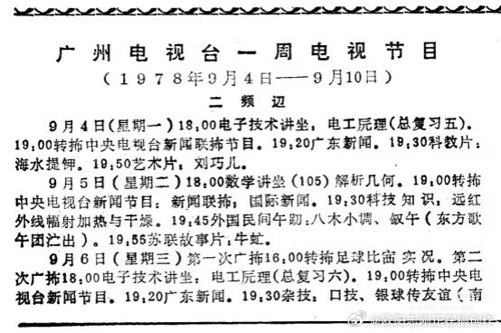
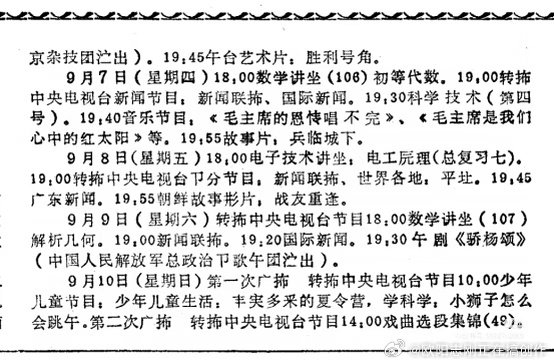
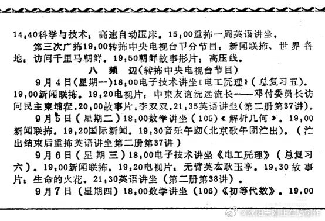
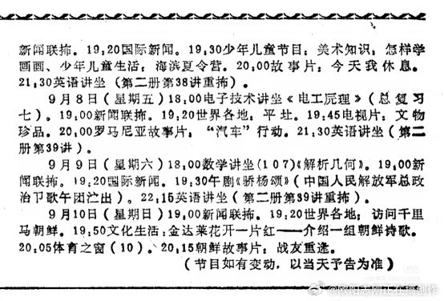
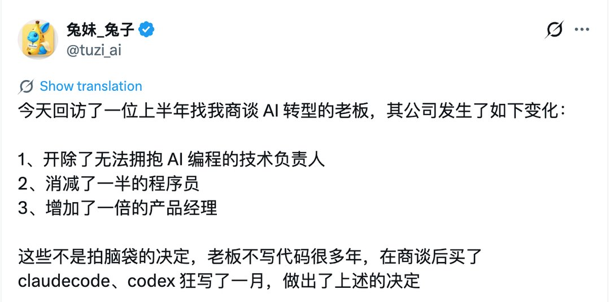

# 2026-09-04

## 1

@深圳宁南山

发表于：2026-09-03 06:30

来源：微博

链接：https://m.weibo.cn/status/5339070227022417

对于中国未来的国运，我的态度是未来一二十年乐观，再之后又不乐观

原因非常简单，目前我国产业升级的态势迅猛，新能源汽车出口短短六年猛增到十倍规模，

半导体制造领域在2026年将出现三家营收100亿美元以上的大厂，国产光刻机经历多年研发已经在突破前夜。

军事科技爆发，六代机，电磁弹射航母，预警机，无人机都领先美国，

其他像锂电池，机器人，船舶，航空工业等都进展顺利。

所以你问我未来一二十年的国运，我是乐观的。

但为什么对之后感到悲观，核心原因是2025年我国出生人口已经仅有792万人，

这是我国1962年以来首次低于西方国家出生人口。

按照1.0的生育率，平均生育年龄29岁计算，那么大致估计我国到2054年仅能出生396万，

而这已经是乐观的估计，因为按照现在的态势，我国未来并不能保持1.0的生育率，

像台湾2025年就只有0.695，韩国只有0.80，香港只有0.73，

如果按照未来我们只有0.8的生育率算，那么到2054年仅能出生大约317万人。

而美国在去年（2025年）出生360.4640万人。

也就是说到2054年，我国出生人口就会下降到和美国差不多的水平。

这个时间看起来很久，但其实很近，这意味着我国在2035-2040年相对西方国力达到顶峰后，仅有十几年时间出生人口就会降到和美国差不多的水平。

而且到这个时候，我国面对西方就已经是绝对劣势了，

因为西方不只是美国，还要算上加拿大，澳大利亚，新西兰，欧盟等出生人口，其总出生人口就对我国有极大的优势，而且除非我国生育率在那之后逆转反超西方，否则在那之后和西方乃至美国差距还会越拉越大。

不仅如此，到时候西方年龄结构还会优于我们，不仅是人口，而且其拥有的陆地领土面积，自然资源，海洋面积，在前殖民地国家的影响力都大大多于我国。

不要觉得2054年是个很久的时间，距离今天也就是28年而已，我们假设一二十年后中国相对西方的国力达到顶峰，那么从顶峰到这一天也就是十几年。

---

## 2

@欧阳志刚正在搞创作

发表于：2026-09-03 08:39

来源：微博

链接：https://m.weibo.cn/status/5339102808376068

看一下1978年广州的电视节目，各种二简字。这个广州电视台是广东电视台的前身。

---

## 3

@宝玉xp

发表于：2026-09-03 18:18

来源：微博

链接：https://m.weibo.cn/status/5339248540517272

看到网友分享的 AI 转型后公司变化：

1、开除了无法拥抱 AI 编程的技术负责人

2、消减了一半的程序员

3、增加了一倍的产品经理

---

这个 AI 转型变化仔细想想合理的：

1. 无法拥抱 AI 的技术负责人会拖累整体开发速度

2. 当开发不是瓶颈，那么决定做什么会更重要，所以需要更多产品经理。

如果一部分开发能兼做开发和产品经理可能更好，未来既懂产品又有开发基础会很吃香。

3. QA/测试没看到变化，理论上来说 QA 可以用 AI 辅助写更多自动化测试，提升测试效率，但另一方面 AI 加速了开发，但同时也会让质量更加不稳定，测试工作量可能更多了。

公司能增加产品经理说明业务还是拓展了的，否则只是维持业务的话产品经理不需要增加。

