# 2026-09-06

## 1

@ibuick

发表于：2026-09-05 13:43

来源：微博

链接：https://m.weibo.cn/status/5339904194380904

对了，提醒各位一件事儿。

HUD 现在快成了汽车标配了，但，天下没有免费的午餐。

它就是再便宜，也是成本。

所以，如何平衡成本的一大手段就在风挡玻璃上。

以前豪华车 HUD 选配的时候，是否选配 HUD 会导致这台车风挡玻璃的零件号不一样，这不是车企找麻烦，而是这个看似一样的风挡，其实真的不同。

为了让画面清晰平整无畸变，在这个有着大尺度曲面的风挡中，会进行一个额外的楔形夹胶工艺，而这是 HUD 是否能正常显示，并且让人长时间看着也舒服的关键。

但是很遗憾，现在太多的车 HUD 只是在前风挡上有个投影而已。我没法去具体点明哪些车，但是你们购车之前一定要注意。

如果这车配不配 HUD ，风挡玻璃都是一个零件号的话，大概率就是个坑。

除了零件号，简单的观察也足以发现这种情况，你把 HUD 高度调节一下，水平翻转角度调节一下，在不同角度观察画面，多数 HUD 畸变就会显形。

\#别不正经说车\#

---

## 2

@2049年的世界

发表于：2026-09-05 11:48

来源：微博

链接：https://m.weibo.cn/status/5339875165079820

金灿荣和宁南山都对人口问题提出了忧心忡忡的警示。

我提出一个新的猜测性观点：目前我国对人口断崖式下降似乎动作不大，原因并不是因为有什么胸有成竹的后手，而是我国体制天生就对这种“重要但不紧急”的问题反应很缓慢。

我国体制对于紧急情况的反应是非常高效的，抗震救灾、严重治安案件、突发社会冲突等等，在这些紧急事件中，我国的体制的应对绝对堪称是世界第一。

但是对于“重要但不紧急”的事情，比如女权、比如生育率、比如意识形态侵蚀这类“潜移默化”、“水滴石穿”的默默的危害，则反应比较迟钝。这当然有深层次的原因，之前也分析过，这里暂时先不讨论。

“重要但不紧急”的事情，又要分两类。一类是虽然也是不紧急，但是在历史上吃过亏，就会相对来说比较敏感一点。比如美国的教育几十年来一直是缓慢崩塌的状态，如果换到中国，教育出现这样严重的崩塌问题，早就会出现反应了。因为我国近代以来吃够了教育不兴的苦，有点PTSD，所以这个反应会快一些。包括禁毒这类也是。

但是对于那些历史上没爆发过危害的“重要但不紧急”的事情，这就是盲区了。

因为不紧急，所以不会刺激到体制做出快速反应。因为历史上没吃过亏，尤其是对这些后现代的威胁，体制没见过，它体内的免疫系统都是为应对前现代危机而准备的，没有后现代病毒这块的抗体。而上面说了，对于这类不紧急的事情，抗体产生的速度又很慢。

一个典型例子是从80年代开始出现的mz问题，体制对此的应对始终是惯性滑行中，一直到2016年才全面顶层设计改弦更张，这中间长达36年。

更何况，后现代的东西，其隐蔽性比带有部分前现代性质的mz问题更深，对社会肌体的破坏更是类似于高血压那种“沉默的杀手”，从社会宏观层面看似乎几乎没有什么症状（虽然从微观基层看已经有很多局部冲突了），就无法引发体制的重视和排异反应。

对于人口问题，我最怕的是接下来的历史按照我预测的轨迹去发展：

每隔几年，小小的推出一点刺激生育的政策，这些政策往往也都是传统性质的，比如什么减一些税，发一点钱，造一些廉租房，减少一些加班，甚至搞不好还有反向用力的“继续加大女权这样她们就愿意生孩子了”之类。一两年推出几个，拖拖拉拉，试试看，没什么效果，再加几个，而时间就在这个过程中，慢慢流逝了，错过了最为宝贵的应对时间窗口。

甚至打击女权可以提升生育率，我估计现在体制搞不好都还没真正意识到这个概念，很可能还是停留在“小姑娘不高兴闹闹脾气没什么大不了”这种初级认识上。

然后从现在开始，再拖拉20年左右，期间每一两年慢吞吞搞一点刺激，拖到40年代中期，人口规律变化的滞后期终于过去，问题不再是沉默杀手而是充分暴露出来，那个时候再发现，原来只有人造子宫是唯一一条活路，其他所有传统意义上的刺激手段都只是治标或者连标也不治。那个时候再全力以赴，恐怕就晚了。

就像《三体》里面，地球政府在最后几十年里全力转向支持颠覆性的光速飞船方案，可是已经来不及了，二向箔已经到了。

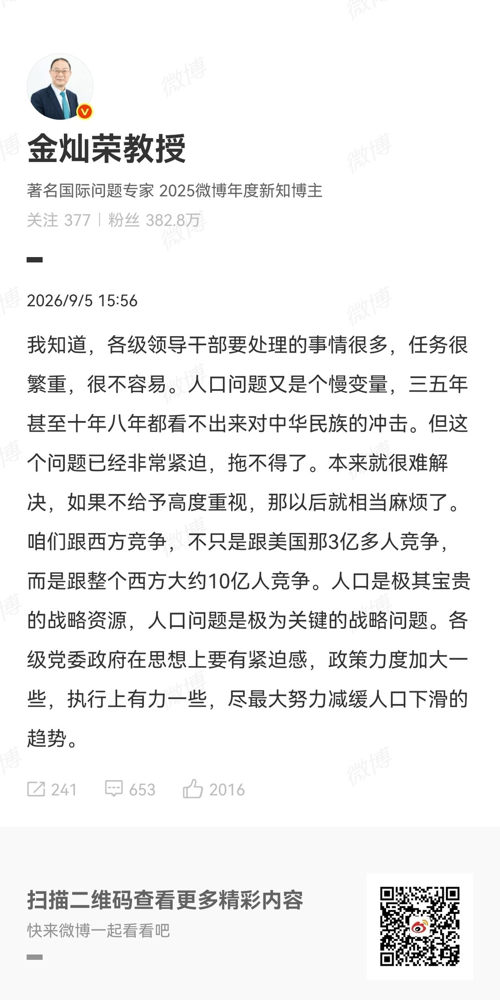

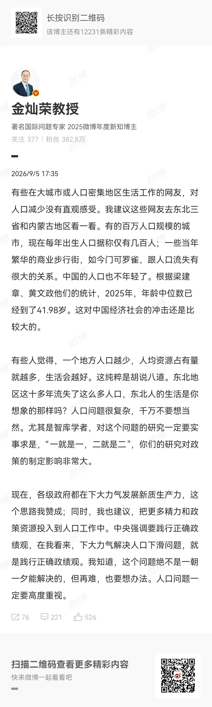

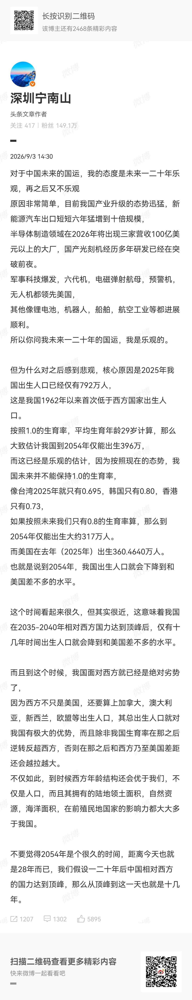

---

## 3

@兔头学姐张铁根

发表于：2026-09-05 21:50

来源：微博

链接：https://m.weibo.cn/status/5340026667009056

当前社会不要再为了吃饭，而叫醒睡觉的人。

饭冷了热一热就能吃，睡觉被叫醒，那很多人就再也睡不着了，就会永久的错过休息的时间。

当今社会，睡眠不足猝死的远比饿死的要多。

---

## 4

@江宇行舟

发表于：2026-09-05 21:48

来源：微博

链接：https://m.weibo.cn/status/5340026170769493

回复@热爱只有四年:说个恐怖故事，不光是省城重点学校的高中生会这样，985院校经管院乃至文学院都发生过这样的情况了。十多年前部分地区历史课改，把通史体例打碎，如今回看，真的是遗祸无穷。//@热爱只有四年:2019年，一个高三学生拿着一首南宋早期的爱国词来问我什么意思。我讲解完后她问我，为什么北宋变成南宋了。我寻思她这情况我讲历史她应该也是云里雾里的，就想从民间故事入手。于是我问她，你知道岳飞吗？她也说不知道。那一刻，我觉得天都在我眼前崩掉了。这是一个省城还不错的高中学校学生。//@秦祎墨:确实哦，汤家凤要是这个计谋，我得说一句高明。取消历史的时候无人说话，取消英语全出来了。啧啧，啧啧，啧啧啧啧啧啧啧啧啧啧。

---

## 5

@信号与噪声

发表于：2026-09-05 15:34

来源：微博

链接：https://m.weibo.cn/status/5339932090438593

\#美股\# AI叙事光环褪尽，软件股正在经历残酷的估值分水岭

单纯在产品里塞入AI助手再也无法撬动华尔街的买盘，按人头收费的传统SaaS更是惨遭AI生产力提升的“背刺”——员工效率翻倍意味着企业采购席位的收缩。

市场已从炒作概念演进为严审财报：

唯有数据吞吐带来的真实点数消耗、以及黑客攻防倒逼的安全刚需，才能兑现真金白银的业绩重加速。

估值便宜不再是避风港，拿不出AI变现成绩单的软件股，低估值只会滑向深不见底的折价深渊。

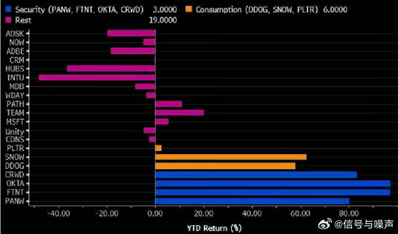

---

## 6

@金灿荣教授

发表于：2026-09-05 12:40

来源：微博

链接：https://m.weibo.cn/status/5339888138587439

关于人口问题，有人提出这样的观点：“生育应当注重人口素质，如果生下的孩子智力有缺陷，还不如不生。”这其实是典型的逻辑谬误。随着现代医学的不断进步，新生儿中智力障碍的发生率已经大幅降低，试问，你身边有几个亲人或朋友家的孩子存在智力缺陷？

事实是，除了医学因素，人口基数对人才培养的影响不容忽视。 我有一位在乡村小学任教的朋友，他们学校仅有十几名学生，却配备了二十多位教师。我曾跟他开玩笑说：“如此雄厚的师资力量，一定能培养出更多高素质的学生。”但他却告诉我，事实恰恰相反——学生反而更难培养了。道理很简单：过去学校有几百名学生时，即便老师无需倾注过多心血，也能自然涌现出许多拔尖的学生；而如今生源大幅减少，即便老师竭尽全力，也很难再培养出出类拔萃的人才。

不可否认，在中国，许多人才是通过后天培养造就的；但同样不可否认的是，也有大量人才是从庞大的人口基数中筛选出来的。如果没有足够庞大的新生儿基数，我们又哪里来那么多优秀的人才呢？我们经常讲，中国跟一些欧美国家相比，我们有人才红利、工程师红利。这些红利是从哪来的？除了我们的教育体制原因，我认为庞大的人口基数也是重要原因之一。

关于人口问题，确实存在太多似是而非的观点了。

---

## 7

@sven_shi

发表于：2026-09-06 09:29

来源：微博

链接：https://m.weibo.cn/status/5340078466927326

在热搜上看到\#小县城的房子买了没人住\#这个话题，点进去看了下没有正规的媒体跟进讲这个现象，觉得整件事情很有意思，可以和大家分享下。为什么类似话题媒体跟进很谨慎？大家只要老家在小城市的，都会看到大量的新建房屋空置。怎么就没人去讲讲看呢？

因为这类话题背后从来不仅仅是房地产，是涉及到整个城市的规划失败。

你想，一个城市规划一个新区，是只规划房子拿出来卖吗？

当然不是啊。房子还要配套小学幼儿园，更需要配建相应的商场。过去这些年各地都在抢着建造大型的购物中心。这些配建都是和房子一起规划的啊。

那你再想，房子要是大面积的空置，会带来什么问题？

学校没人去，新建的医院没人看病，商场大面积的空置。是不是都是连锁反应？

那么是不是整个规划都失败了？

房地产从来不仅仅是房子本身的问题，你从房地产的现象切入，能发现很多很有意思的问题。我们再选一个角度进入，为什么这些房子卖掉了，但是日常没有人住呢？

道理很简单，这些人不在这里就业啊。当地缺少产业配套，没人来上班，自然而然新区就没人住。产业没起来，没就业，自然大家只能往外面跑啊。

那我们再来看当地民众的资产问题。普通人家最值钱的就是房子。因为就业不好，没人来买房子，是不是就会导致房子的成交量大幅度的萎缩？房子挂着卖不掉，事实上就是不值钱。对于当地民众来讲是不是他们的资产也跟着大幅度的贬值家庭变穷了呢？

---

## 8

@sven_shi

发表于：2026-09-06 08:29

来源：微博

链接：https://m.weibo.cn/status/5340071406342175

\#取消英语主科利弊\#这个话题到最后就是教育资源怎么分配。教育资源问题，牵涉到大众的根本利益，所以一般都是只做不说。英语考试改革最有名的就是允许一些省份在高考中取消英语听力。在语言教育上，这事情摆不上台面。毕竟学习语言，考察怎么可以不考听力？但是现实中我们国家的高考是筛选考试。一个省各地英语听力成绩差异极大不是学生智力有差异，而是经济水平差距大。

所以在筛选性考试中，剔除掉英语听力，更看重数学成绩，筛选顶尖人材在逻辑上大家都能理解。不会觉得说英语不考听力了，英语教育就完了。因为高考本质是分配教育资源，进入大学你有四年时间可以好好学英语。

那么这几年为什么英语考试的争议越来越大，到今天感觉都有点全面对立了呢？

核心是在中考分流上。大多数孩子的成绩都在中间区间。筛选哪些孩子进入职校未来做体力劳动，哪些又去读大学呢？又要用什么工具筛选呢？

教育分流有个阳谋，就是在中间段，筛选家庭条件差的孩子进入职校。因为只有家境差，读职校未来才愿意去做体力劳动。在这个大背景下面，用最体现家庭条件的英语成绩进行筛选就成了一个必然。

这里大多数网友还停留在自己读书时学习英语的经验当中，不知道这几年我国英语教育的核心问题是“超前教育”。简单来说就是学校英语教育的质量或者内容整体比较少，家庭条件好的孩子，主要靠课外父母花钱堆教育。最典型也最常见的，是英语考试的KET和PET考试，之前几年有很多相关考试家长抢着报名都报不上的报道。

也就是说，我国有经济能力的家长在放弃中小学英语教育的考试标准，转而追求更高更科学的标准衡量孩子的英语能力。高考不考听力，学校英语教育时间少，他们就自己花钱去买，给孩子在英语上做超前教育。

英语这门课，你只要家里有钱，做超前教育没有任何坏处。你家孩子完全不听学校老师教育，自己去全面搞听说读写，小时候考KET和PET，年纪到了考雅思托福，根本不会有问题。而在中高考路线里，这些孩子就可以选择在初一初二高一高二时彻底摒弃低效的学校英语教育，到初三高三进行考试训练就可以了。

家庭条件不同，走的路就可以不一样。而且将来要走教育分流，英语考试只会越来越难。家庭条件好，就会在这里面占据绝对优势。

相当数量教育界人士因为价值观的原因对这个现象极度不满，所以就希望改革把英语剔除出筛选标准，而是变成等级考试。

---

## 9

@zhtttyzhttty

发表于：2026-09-06 09:29

来源：微博

链接：https://m.weibo.cn/status/5340076537024718

因为英语是靠金钱和时间最能够拉开分数线的一个科目，你能够想象一个中人之资靠着大量金钱和补习，能够在数学上追上韦神？但是一个从小就接受英语补习，接受英语日常交谈，甚至生活在外国，时常出国的人，他的英语就是比一个高智商农村孩子要强出许多！！！//@重复啊重复2024:热搜很多人说英语取消主科位置公共教育资源缩减，有钱人还能去请家教，加剧阶级固化。难道他们不知道真正加剧阶级固化的是“有钱请私教”这件事吗？能拉开差距的项目多的很，为啥非得用英语充当这个角色 //@zhtttyzhttty:是的，这也是我的猜测，死保英语主科地位的压根不是他们口中的为了高深研究，为了各种专业文献，实际上最主要的目的就是保留家庭条件好=英语好这一条，从而实现在高考时无视一定程度的智力差距，但这实际上是非常违背教育公平这一套的，高考的筛选机制本身就应该是以智力，以勤劳，以专注度为核心目的进行高端人才筛选，而英语越是随着时间推移，越是不具备主科筛选目的，但是又因为百万曹工之所系，不得不死命的将其维持…………这就是胡进退这次为什么如此暴怒的原因。

---

## 10

@zhtttyzhttty

发表于：2026-09-06 09:29

来源：微博

链接：https://m.weibo.cn/status/5340075572332755

\#取消英语主科 教育公平争议\# 

事实上，S大说得很清楚了。

所有学科之中，只有英语是可以靠堆金钱来增加成绩的，别的科目能够靠金钱堆上去的分数实在有限，就拿最经典的数学而言，你学不会就是学不会，这才是高考的本质目的，你要学科分流，高端人才进高院，普通人才进普通大学，不算人才的进专科学校，那么英语就是其中最不具备价值的一个科目。

简单些说，我们到底是要以最为公平的智力来筛选人才，还是要以家世，金钱来筛选人才？

别的不说，胡进退是一个什么玩意，我不信大家不知道，为什么说到取消英语主科地位，他立刻陷入到了暴怒之中，其暴怒程度甚至超过了景甜孙割时。

因为这就是在否定他的精英身份，否定他的三观。

但事实上，取消英语主科身份，将金钱和家世对人才筛选的影响降低，这才是真正的公平。

至于你说取消英语主科身份，家庭没钱的人反倒英语越来越差什么的…………不是，英语高考权重降低，只给一百分或者更少的五十分，与高高在上的一百五十分，到底那个是金钱权重更高的一个？我不信稍有逻辑的人想不通这点！！

---

## 11

@渔老板钓鱼

发表于：2026-09-06 08:29

来源：微博

链接：https://m.weibo.cn/status/5340069051499654

不是挂人，就是谈论一下我的看法

1、降低权重，不是不让你学英语

2、减少应试教育的压力，增加实用英语口语的比例

3、看了很多人说：英语很重要，我就吃了英语差的亏，所以大家要学好英语，但就是自己不学好。

这说明什么？

说明他都不愿意学

英语不是什么难学的科目，不是高等数学、量子力学、相对论……，普通人看天书一样。但是英语不是，只要你想学、多说、多看、多听，很快就能出成绩。

英语口语好是最重要的，如果你进外企，或者做外贸、或者工作中和老外打交道，外语绝对是最重要的。

口语最重要、口语最重要、口语最重要

重要的事情说三遍

4、对于大部分人来讲，从小学到大学，花了大量时间学了大量应试教育英语，得不偿失，尤其是ai发达了，大部分普通人用ai翻译也可以问题不大。

5、学英语，要么苦学，要么有需求的学，有需求就很快学会了。

我从初中开始学英语，高中、大学、研究生、四级，每次考试都是一次过，但我就会考试，真的哑巴英语，词汇量也很差。

毕业去博世面试，因为工作语言是英语，人事让我英文自我介绍，我憋了半天就说一句：my name is liupeng。没了，介绍完了，负责面试的人事很惊诧，她不相信一个985研究生会如此哑巴英语。

不过后来面试通过了，原因是我的专业是他们急需的，没办法。但给我6个月时间，必须英语交流没问题。

第一次和老外出差，被老外投诉人事部，说怎么找了个哑巴，当时还没有智能机，还没有ai，我全程不搭理他。

但我仅仅两个月左右，就英语对答如流了，电话会议也没问题，为什么？我以前的底子很差，就是因为工作需要，天天看的邮件、资料全是英文，听的话也是英文，这样的氛围，学的是真快。最后我成了老外们来中国指定的技术翻译。

认为英语重要，那就学

没人不让你学，机会太多了

互联网如此发达，学英语渠道太多了

历史那就更多渠道了

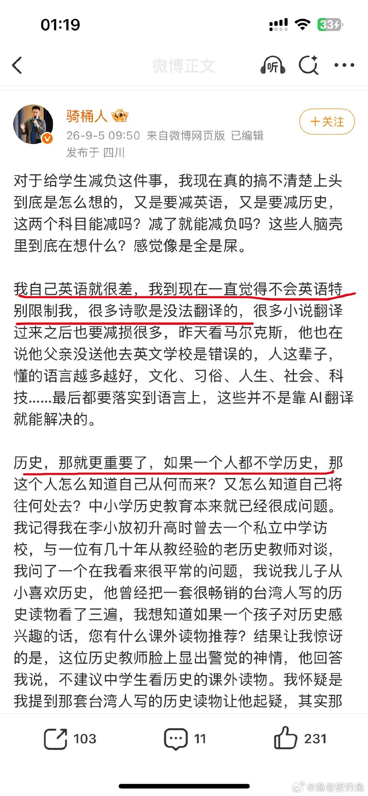

---

## 12

@中华之鹰01

发表于：2026-09-06 09:29

来源：微博

链接：https://m.weibo.cn/status/5340074343923994

为什么2026年七夕没有任何热度?

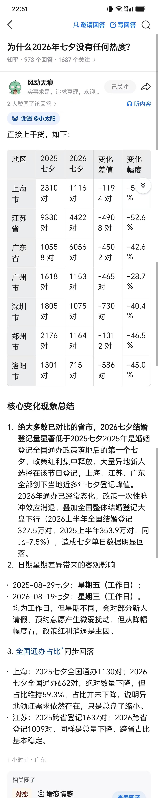

---

## 13

@渔老板钓鱼

发表于：2026-09-06 08:29

来源：微博

链接：https://m.weibo.cn/status/5340073991343241

我提个完美建议（没有幽默感的人别看）

取消英语课

数学、物理改成英语教材、教学

这绝对有好处，在应用中学英语很快，同时还学了数理化，为啥？

因为数学、物理的翻译影响了人的思考，翻译都是错误的

1、比如量子纠缠的英文是（quantum entanglement）中文翻译非常不好，“量子纠缠”还不如叫“量子牵连”，“纠缠”很容易让人误解。

2、比如函数，英文是function，看英文能知道啥意思，看中文很容易被误导，因为函数是古日语翻译的，容积被误解是一个数字，我是function是功能、对应关系这层意思

3、算子，英文叫operator，英文意思运算器、操作者，是一套操作规则。算子是什么？是个什么数？误导人

4、量子力学，英文quantum mechanics，mechanics不只是研究力，是研究物质演化规则

5、相对论，relativity

6、势potential，电势、引力势

7、相位，phase

8、旋度curl

……

我就不列举例子了

翻译的是真差，我呼吁很多年了，数学、物理的翻译要重新定义，很多翻译误导人，与其这样，还不如直接英文版教材，取消英语教学。

一举两得

---

## 14

@观察者网

发表于：2026-09-06 08:30

来源：微博

链接：https://m.weibo.cn/status/5340072833974459

\#特朗普称我走后没人会为我立碑\#【特朗普：我走后不会有人为我立碑，所以现在得大建特建】\#特朗普承认建凯旋门是为给自己立碑\# 据《今日美国》9月5日报道，近日，美国总统特朗普承认，他在华盛顿特区推进的“凯旋门”等建筑项目，目的就是为自己树立“纪念碑”，并表示自己离开以后，不会再有人为他修建。

被问及首都的“凯旋门”等纪念建筑时，特朗普对《纽约》杂志作出了上述表态。他表示：“我走了以后，就没人会再做这些。我离开这里之后，就再也不会有人去做了。”

尽管相关项目争议不断，特朗普仍表示“民众应当为此心怀感激”。他补充说：“很多人劝我‘不要接受这次采访’。但我为自己正在做的这些工程感到自豪。”

据美国有线电视新闻网（CNN）报道，特朗普已投入大量精力，试图将自己的风格和品位强加于白宫和华盛顿特区。

自上任以来，特朗普亲力亲为地参与了斥资6亿美元在白宫东翼建造宴会厅、兴建76米高的“特朗普凯旋门”、砸1480万美元翻新林肯纪念堂倒影池等多个建设项目，但所有这些项目都面临着法律挑战。

此外，特朗普还试图将自己的名字加到肯尼迪表演艺术中心，并且把场地命名为“唐纳德·J·特朗普总统广场”。相关决议仍深陷司法诉讼，尚未落地生效。

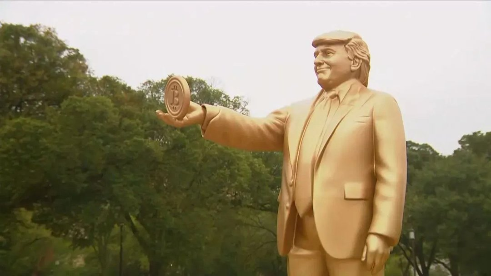

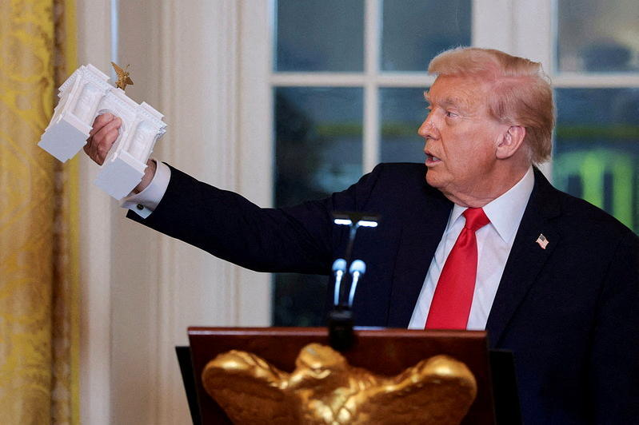

---

## 15

@明涛AI_ECON

发表于：2026-09-06 08:30

来源：微博

链接：https://m.weibo.cn/status/5340070408357730

我感觉所有蓝领职业的中年危机就是体能下降，所以相对成功的职业生涯路径都通向创业开店。外卖滴滴相对来说就是可以一直干下去，至少比创业风险小多了，所以很多人从一开始就选择这条路径也是理性的。//@明涛AI_ECON:理发和很多职业一样，学徒出师后从业的关键是开店的选址而不是技术本身，这已经不是职业规划而是创业了，对于风险承受能力的要求与滴滴外卖完全不同。家电维修的关键是业务渠道，所以招安才是最好的，要么被厂家要么被平台收编，否则也就是挣点辛苦钱。//@黄经60:我不敢妄言别人的职业，我拿自己举例，如果是我，我一定不会从事跑滴滴送外卖这种毫无门槛的职业，一定会去学技术，哪怕是理发厨师都行，即使学了家电维修，认认真真干那么多年，在电子信息行业也会有立足之地。//@明涛AI_ECON:其实站在他们的角度规划职业生涯也可以理解。除了极少数幸运儿近30年来还有多少人能够稳定通过一门手艺挣钱？不要从即时的角度分析市场需要什么手艺技术，要从人的角度来分析“我”应该靠什么挣钱。大多数蓝领职业生涯完全没法规划，技术迭代太快，只能有什么机会挣钱就做什么，外卖挣钱就先做了再说//

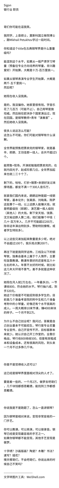

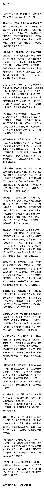

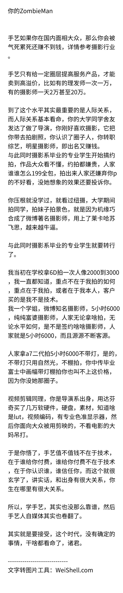

---

## 16

@2049年的世界

发表于：2026-09-06 08:30

来源：微博

链接：https://m.weibo.cn/status/5340067975399148

《求是》这篇文章《别让“零舆情”执念捆住干事手脚》说的是对的（别让“零舆情”执念捆住干事手脚）

不过可能出于一些原因，这篇文章说的太浅。

如果再进一步追问一句：为什么基层普遍追求“零舆情”？

往往是上级部门就是这样要求或者期望的——你别给我惹事。

上级部门自己撑不起来，遇到舆情不管谁对谁错，不敢公共沟通，谁声音大谁有理，和稀泥，处罚基层人员了事。基层自然慢慢变成追求零舆情。

这里的问题还是要上级自己支棱起来，对就是对，错就是错，敢于和公共舆论进行沟通，敢于拒绝不合理的要求，敢于纠正自己的错误。自己行的正立的端，公生明廉生威，而不是凡事和稀泥，只求“看不见我看不见我”，基层才有底气抛弃“零舆情”。

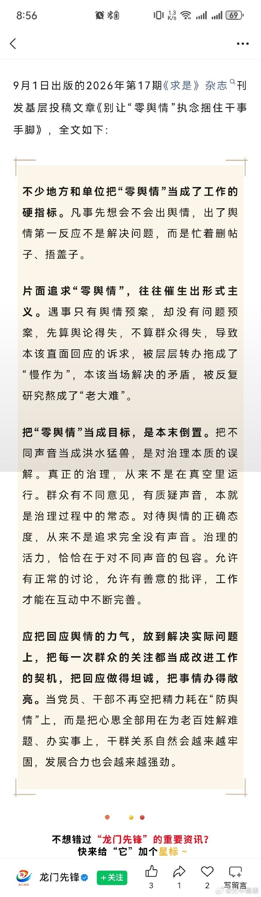

---

## 17

@专业戳轮胎熊律师

发表于：2026-09-05 02:05

来源：微博

链接：https://m.weibo.cn/status/5339728359459582

为什么我有点忧心忡忡

尤其是看到昨天荷兰开始运黄金回去……

你查下就知道：截至2026年上半年，各国央行十多年来累计从美英金库运回的黄金已接近6900吨

风险越来越大，大家都能看到，把黄金运回去，避免风险，各国也不是傻子

而这就很像股市，或者庞氏骗局之类

当你觉得要崩，他觉得要崩，所有人都觉得要崩的时候

你就会赎回，他也会赎回，就会形成踩踏

最终就真的会崩……

你不信，你可以试试周围统计学

就是40岁以上，工作收入不错，家里条件还可以，有一定存款的（就是那些人说的什么A8A9家庭）

你问问看他们，是不是最近有投资创业意愿？

你统计一下就知道，大家都在进行战略防御，保住现金，等着熬过这场始于2008年的危机……至于时间，没人知道，是10年，5年，2年，1年？

（如果光是老中一家，其实还是有办法靠宏观调控着陆的，问题在于全球这个草台班子，迫降概率很高）

---

## 18

@zhtttyzhttty

发表于：2026-09-06 09:30

来源：微博

链接：https://m.weibo.cn/status/5340081114318505

他们最奇怪的一个逻辑：取消英语主科权重后，教育资源中英语权重将下降，有钱人家更可以靠着英语拉开上升通道了。

信和这话的人，一定是没有逻辑的脑残或者是心思恶毒且坏的有钱人，二者必居其一！

英语主科权重都没了，你再怎么有钱再怎么加强英语，分数已经没法拉开没钱人孩子七八十分以上了，总分就这么多，拉开的距离只会缩小，结果你告诉我你有钱人还可以拉开上升通道？怎么的，英语取消主科权重后反倒单列一科是吧？

这混账逻辑居然还有人信，我也是叹服之！

---

## 19

@猩猩吸猩猩

发表于：2026-09-05 09:39

来源：微博

链接：https://m.weibo.cn/status/5339842642709162

为什么小县城的房地产都成了垃圾仙股，失去了流动性和投资价值？

我以广西GDP第一县，北流市为例。前一段我去了一下北流，写了一点笔记。

我去北流城南新区转一圈，感受了一下。

 

一排排崭新的楼盘，外立面漂漂亮亮，小区大门气气派派。但到了晚上，你站在高处一看——黑压压一片，亮灯的窗户稀稀拉拉。

 

二手房均价跌到4600多一平。精通森林城，2023年均价4628，到2026年跌到4097。个别房源最低到过3680。

 

谁在买？买了给谁住？

 

答案可能让你心酸。

 

第一层：新区是怎么建起来的？

 

北流的城镇化有一个很特殊的路径。

 

2025年北流城镇化率51%，刚过一半。这意味着还有将近一半的人住在农村。按照一般规律，城镇化推进过程中，农村人口进城买房是刚需，房地产应该有市场。

 

城南新区就是这么起来的。政府规划新城区，开发商拿地盖楼，楼盘一个接一个。看上去人气挺旺，售楼处也经常有人来看房。 

但你仔细想一个问题——谁来住？

 

北流常住人口120万，户籍157万，差了36万。也就是说，大量北流人根本不在本地生活。那些买房的人，可能一年只回来住几天。

 

第二层：外出打工人的"面子房"和"婚房" 

北流楼市有一个非常特殊的需求结构。

 

很多买房的人，是在广东打工的北流人。他们在深圳、东莞的工厂流水线上干了十几年，攒了一些钱，回老家买一套房。

 

为什么要买？两个原因。

 

第一是面子。在外面打工十几年，回村总得有个像样的房子吧？过年亲戚朋友来串门，总不能还住老宅砖瓦房。在县城有套房，说出去有面子。

 

第二是婚姻市场。在县城，没有房子的年轻人很难找到对象。丈母娘开口第一句话就是"有没有房"。哪怕你人不在北流住，房子必须有。

 

于是出现了魔幻的一幕：大量房子是"面子房""婚房"，买了不住，或者一年只住十几天。房子变成了社交货币，而不是居住空间。

 

这就是为什么新区晚上亮灯率极低——房子是真卖出去了，但人不在。

 

第三层：房价在跌，但跌不动也涨不了 

来看房价数据。

 

北流二手房均价4600多，新房均价4869。在广西县域里不算最低，但对于月薪三千的本地人来说，已经够呛了。

 

精通森林城的走势很有代表性：2023年均价4628，2024年跌了一些，到2026年4097。三年跌了500多。

 

更惨的月份，均价到过3680，同比跌幅超过15%。

 

新房市场也不乐观。开发商不敢定价太高，怕卖不动。但成本在那摆着，地价、建材、人工，降不下来。很多项目是微利甚至亏本在卖。

 

二手房更惨，挂牌半年一年卖不出去的比比皆是。买家很少，因为真正需要在县城住的人就那么多，而有买房能力的年轻人大多去了广东，他们在广东租房或者买房，根本不需要回北流再买一套。

 

第四层：房地产拉动GDP的模式，走到头了

 

过去十年，房地产是北流GDP的重要推手。 

2025年房地产业增加值46.55亿，增长2.5%。加上建筑业、装修建材、家电家居等上下游产业，房地产相关经济活动在北流GDP中的占比相当可观。

 

但这个模式已经走到头了。

 

第一，刚需在减少。年轻人外出打工、结婚率下降、出生率走低，买房需求逐年萎缩。 

第二，投资需求在消退。房价只跌不涨，没有人愿意把钱投进去"站岗"。 

第三，政策红利在减弱。棚改货币化安置结束了，以前靠拆迁户买房拉动市场的黄金期已过。

 

2026年上半年的数据印证了这一点：固定资产投资暴跌26%。房地产投资是固投的大头，这个数字说明开发商在大幅收缩，新项目在减少。

 

第五层：空置的房子，谁来买单？ 

更深层的问题在于，大量空置房子意味着资源的巨大浪费。

 

土地是稀缺的，建了房子没人住，这块地就浪费了。开发商的贷款要还，银行的压力在增加。买房人的钱也套在里面，想卖卖不掉，想租租不出去——新区的房子租给谁？

 

对于本地经济来说，房子建了没人住，就没有消费。一个住满了人的小区，楼下会有超市、餐馆、理发店、培训机构。一个空荡荡的小区，什么都不会有。

 

城南新区规划的商业街，有多少开了业、有多少还空着？你可以去数一数。

 

房地产拉动GDP，看起来数字漂亮，但如果房子只是钢筋水泥的空壳，没有人气、没有消费、没有烟火气，那这个GDP就是虚胖。

 

北流的房子问题，本质上是人的问题。

 

房子是给人住的，如果人都走了，房子就只是建筑材料。城南新区的那些楼盘，不是质量不好，不是位置不好，而是这个城市还没有建立起足够吸引人留下来的理由——好的工作、好的收入、好的公共服务。

 

未来北流的房地产市场会怎么走？大概率是"稳中偏弱"，价格缓慢阴跌。

中国，有多少个像北流这样的县城？ 北流

---

## 20

@图老板赛博札记

发表于：2026-09-06 09:31

来源：微博

链接：https://m.weibo.cn/status/5340086864447693

\#塌陷中的世界\#

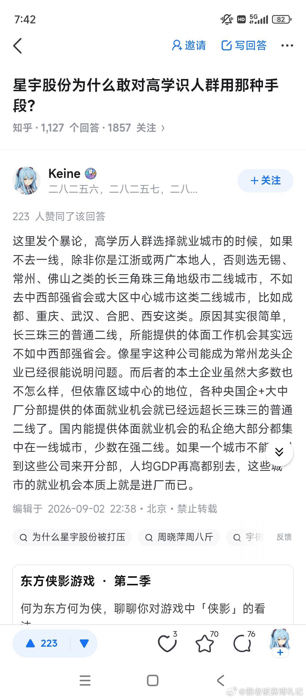

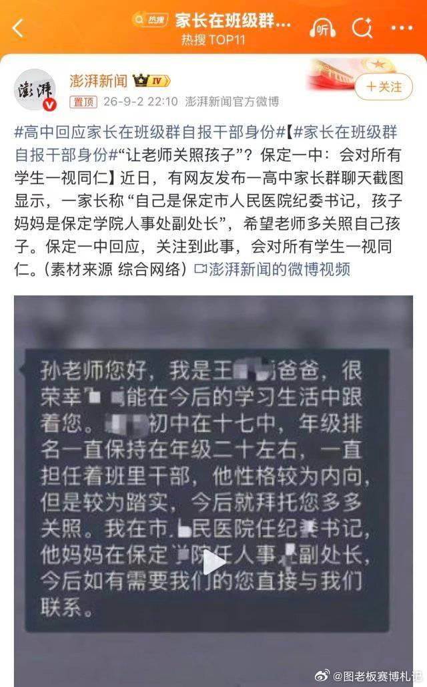

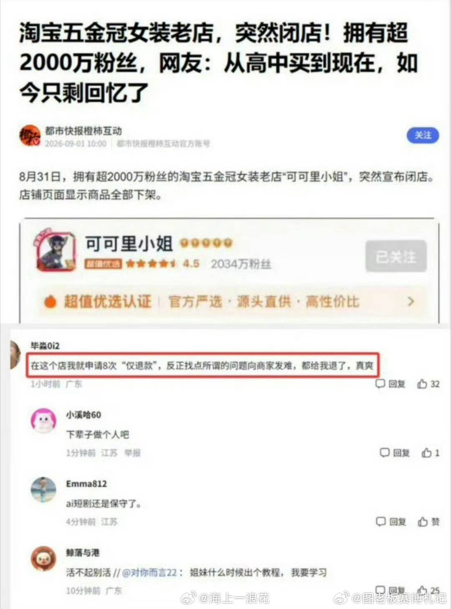

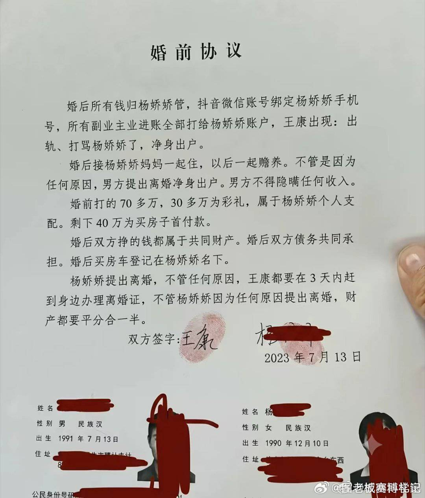

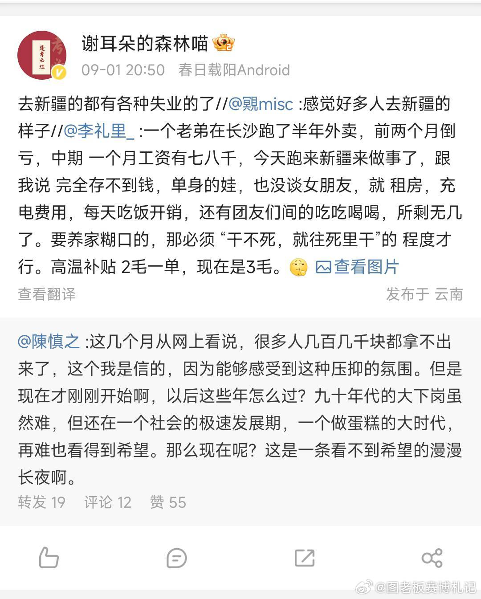

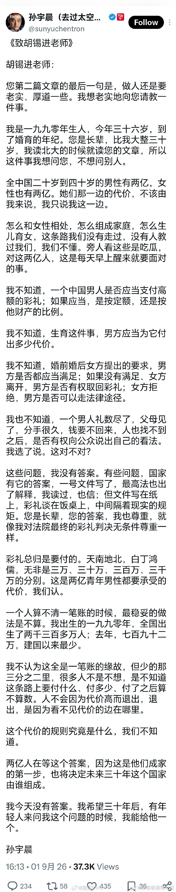

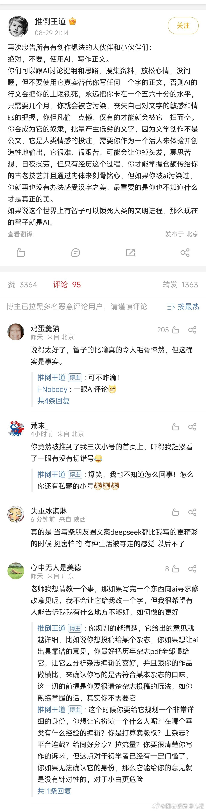

---

## 21

@姬永锋

发表于：2026-09-06 09:31

来源：微博

链接：https://m.weibo.cn/status/5340086494562211

大声造车的追觅，只撑了一年

摘自 福里斯特 新周刊

追觅造车梦，保质期一年

2025年8月28日，一个普通但又疯狂的星期四。科技圈、汽车圈还没吃上当天的“疯四文学”，就先吃到了圈子里的一只爆炸大瓜：

追觅官宣造车，而且要造“世界上速度最快的车”。

话是从追觅创始人俞浩嘴里说出来的。当时，他在上海发布会现场宣布追觅“今天起正式造车”，而且要造对标顶级超跑布加迪威龙的汽车，并保证在2027年实现量产。

他在公开信上，激情澎湃地畅想追觅的造车事业：“造车，是工业的王冠、技术的终极战场，也是一场‘九死一生’的远征。伟大的梦想从来生于无畏。”

能有这样的热情，源于俞浩本人与汽车的渊源。追觅曾表示，早在2013年，俞浩和团队在清华大学的天空工场写下第一份造车计划书，目标直指世界上最快的超跑布加迪威龙。

这份造车计划延续到了其创立追觅之后。追觅星空计划前总裁马俊野曾在一个公开场合透露，追觅的汽车团队早在2021至2022年间便开始秘密筹备，启动节点与小米汽车几乎同步。到了2023年2月，造车项目被正式命名为“星空计划”，以其为名的一系列汽车业务公司从2024年11月起陆续成立。

2021年前后是中国跨界造车的热潮期，造车新势力在车圈厮杀，旁观者也蠢蠢欲动。在扫地机器人领域，追觅的直接竞争对手石头科技在2021年官宣启动造车，并在两年后推出首款车型极石01，起售价34.99万元。

但追觅拒绝造便宜的车。在俞浩看来，追觅汽车的技术路线应当比肩甚至超越特斯拉，不仅要成为一家车企，更要成为全球顶尖车企。俞浩更曾在社交媒体宣称，中国真正理解汽车设计的只有三个人：雷军、余承东，以及他本人。

以至于当追觅宣布要造车的时候，多数人都以为他在开玩笑。但其后的一系列动作，却又让外界觉得，“这事似乎能成”：

2025年9月12日，官宣仅两周，追觅汽车完成首轮融资，并搭建起一支近千人的跨界造车团队，更称正在德国柏林特斯拉超级工厂附近选址建厂；月底，又宣布已斩获超150亿元订单。

而在2026年的前四个月，追觅汽车的举动更抓人眼球：

1月，在国际消费电子展（CES）发布Nebula NEXT 01概念车，宣称搭载四电机四驱，零百加速1.8秒；

2月，广告先后登陆美国职业橄榄球大联盟“超级碗”比赛转播平台和总台春节联欢晚会；

3月，三款概念车出现在中国家电及消费电子博览会（AWE）现场；

4月，参加北京车展，同月27日在美国硅谷推出搭载固体火箭助推器的Nebula NEXT 01 JET Edition“火箭车”，宣称零百加速仅0.9秒。

重磅核弹一枚接一枚，叠加俞浩本人在社交媒体里自带的流量光环，追觅汽车彻底激起外界关注，但疑点也越来越多。

每个流量话题下方，都有人关心追觅汽车的电池容量、续航、整车认证、生产地点，以及相关供应商名录等核心信息，但追觅就是捂嘴不讲。

看客们还没等到“布加觅威龙”的庐山真面目，风险和反噬就随着俞浩被微博禁言，迅速袭来。

今年6月，追觅的汽车业务被撤销独立主体，并划入产业研究院管理体系，裁员潮随之而来。数轮裁员后的最终结局，便是文章开头的那纸业务发展说明——此时距离追觅高调宣布造车的时刻，还差三天就满一年。

无序扩张的“圈地跑马”

在新能源汽车发展高速时代，追觅带来的“弯道超车”确实有足够丰富的想象空间——中国人有能力研发比肩布加迪威龙的超跑，这个造车梦听着就很性感。

只是仰望星空的前提条件，是能够脚踏实地。俞浩微博被禁言之后，有媒体实地走访追觅汽车在上海的注册地和“传说中的生产基地”，发现前者没有实际办公迹象，后者仍然只是荒地一块。

更核心的造车资质，追觅自始至终也没能拿到。工信部自2022年起原则上不再新增新能源乘用车生产资质，目前能够按常规路径拿到造车资质的新势力代表，只有雷军的小米汽车。

虽然追觅曾在今年4月美国硅谷举办的发布会上透露，计划采用“华为模式”造车，更有向奇瑞、众泰等传统车企抛出橄榄枝的传闻，但都被车企们一一否认。

既没有工厂，也没有资质，还找不到合作方，再加上有媒体曾报道追觅造车的经营逻辑是“先融到钱才能有研发”，而非先投入研发再产出。各种因素叠加下，追觅想在两年时间内，从零变成“人类历史上最伟大的汽车品牌”，无异于天方夜谭。

造车项目之外，一批追觅此前“重点孵化”的创新业务，也在同步收缩或关停。

追觅到底有多少个产品？2025年以前，这个问题的答案是以扫地机器人为代表的清洁家电；但到了2025年之后，追觅突然提出要做“无边界”的生态企业，产品方向从清洁家电延伸至手机、汽车，到后来彻底突破硬件边界。

据南财社等媒体报道，扩张最疯狂的时期，追觅内部有15个孵化器，另有超过200个BU（事业部）在齐头并进，飞书大群最高峰时挤了2.8万人。这些BU涵盖的领域，上至卫星、芯片、汽车，下至奶茶、火锅、文具——人类社会里已有的品类，追觅几乎都想再重做一遍。

与广撒网的业务相对应的，是俞浩本人今年以来在社交媒体里铺天盖地的个人形象宣传。最疯狂的时候，俞浩一天要发117条抖音、75条微博、45篇小红书笔记，无处不在地植入每个人的手机里：“怎么哪里都是追觅？”

看得出来俞浩想学习小米CEO雷军，在互联网里当一个有料的科技极客，毕竟追觅早年是小米生态链的其中一环。

但在市场上，追觅会更多地和乐视放在一起讨论。当年，乐视以“生态化反”为口号，将业务从视频网站延伸至电视、手机、体育、汽车等多个领域。这些新业务同步推进、同步烧钱，但彼此之间协同有限，核心业务又难以提供输血支持，最终导致乐视崩溃。

不过话说回来，追觅内部对“乐视模式”带来的资金链危机，一直持有警惕态度，俞浩更直言追觅不是乐视，“海外收入占比高，而且主业已经具备一定利润基础，持续的技术积累可以支撑长期发展”。

此话不假，过去几年，单靠清洁家电这条主赛道，追觅的盈利能力就已相当不错。俞浩曾在微博公布过追觅的营收信息，2025年总营收突破400亿元、净利润达30亿元，且连续六年营收增速超过100%。

造车不是儿戏，

更不是“有钱就能上”

假如这组数据没有水分，那么追觅的业绩增长足以令任何一家公司羡慕，也能够理解其造车的底气来自何方。

然而现实是，追觅为造车付出的心力，终究等不到商业上的回报。

追觅的老对手戴森，早在2017年宣布斥资20亿英镑，要造一款对标特斯拉Model X的电动车N526，并为此组建一支多达1.2万人的研发团队，甚至将总部从英国迁往新加坡。

但到了2019年，戴森创始人詹姆斯·戴森爵士却向内部发公开信，宣布停止造车。

他后来在自传《发明：詹姆斯·戴森创造之旅》中披露了造车过程中的诸多内幕：N526总共只造了1辆原型车，设计感十分超前，性能和续航都比特斯拉Model X还要强劲。

只是这辆车若想卖得出去，售价至少得定在21万美元，而“以这个价格买车的人太少了，在商业上完全不可行”。

对标特斯拉尚且如此艰难，更不用说对标“神车”布加迪威龙了。更现实的情况是，那些曾宣称要打造超豪华品牌的国产造车新势力，如今大都已成为汽车发展史上不起眼的注脚。

造车从来都不是“有钱就能上”的简单交易。厚实的资金储备只是“入场券”，研发投入、产能建设、品牌营销等环节都是烧钱的无底洞，更需要面临技术迭代、价格战和原材料涨价等无法预测的情况。叠加起来，投入的资金动辄数百上千亿，且难以保证连年规模化盈利。

四家国产头部新势力——蔚来、小鹏、理想、零跑，目前累计投资总额均已在百亿元级别（蔚来一家就超过千亿），但2026年上半年，除零跑实现2.1亿元净利润外，其余三家全部亏损。其中理想由盈转亏，净亏损39.8亿元；小鹏亏损31.2亿元；蔚来大幅减亏至8.6亿元。

2021年正式入局汽车领域的小米，累计投入超过400亿元造车，但汽车及AI等创新业务上半年经营亏损约57亿元，虽然仍在快速爬坡，但亏损态势尚未扭转。

这也不难理解，为什么小鹏汽车创始人兼董事长何小鹏会在播客节目里感慨：“如果你真想害一个朋友，最狠的方式就是劝他去造车。”

而随着中国汽车市场正式告别高速增量期，全面迈入存量竞争阶段，车企之间的残酷较量才刚刚开始。此时高调宣布入局的跨界造车玩家，在场上的生存时间可能连三分钟都不到——这或许是追觅最不愿遇见的情况。

9月2日，有网友发现俞浩的微博账号已经解封，但截至目前依然没有更新。网友们一边在社交媒体上调侃，一边更期待追觅接下来会拿出什么产品和技术。

对于一家科技公司来说，这些才是比“布加觅威龙”更有说服力的谈资。

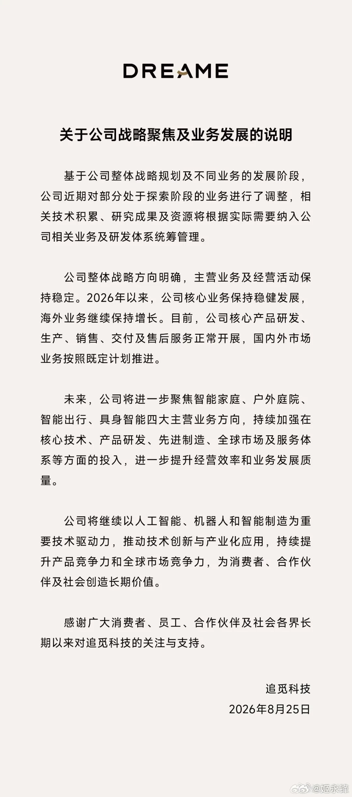

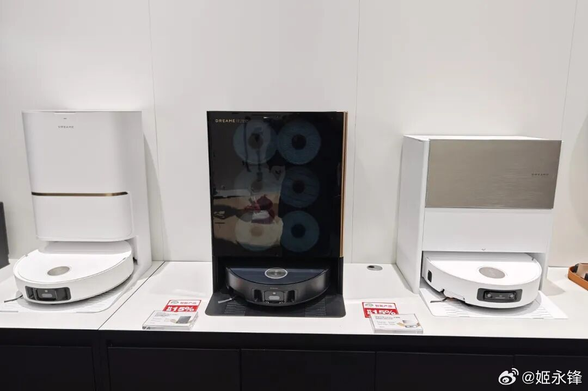

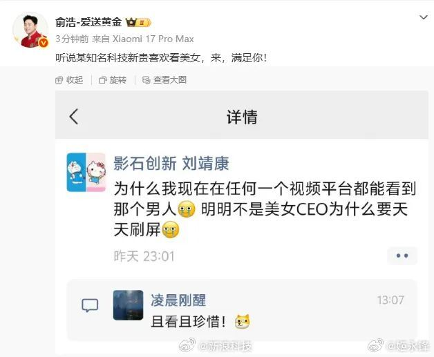

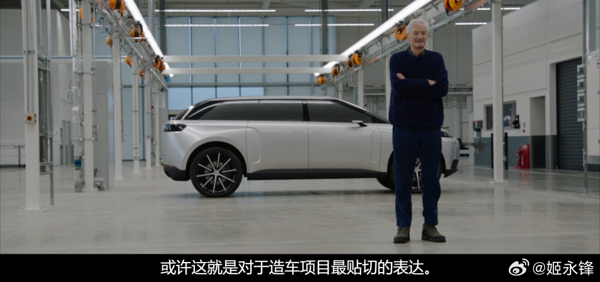

---

## 22

@李子暘Lee

发表于：2026-09-06 09:31

来源：微博

链接：https://m.weibo.cn/status/5340089362416505

说到英语，我想到一个相关话题，那就是汉语拼音。

不知道现在是什么情况，我们高考的时候，语文试卷开始就是汉语拼音题。对我们北京考生来说，那几道题就是送分题，绝对不会错。考前老师都不讲这部分，学生全都会。

上了大学接触到外地同学，才知道，那几道题可是耗了他们不少精力，对他们来说，全答对，不容易，是要努力学习一番的。方言和普通话语音有差异，不注意，就会答错。北京话虽说也有很多“土鳖词”，但语音上和普通话一致，北京考生就占了便宜。

我的意思是，语言问题不仅仅是个单纯的知识问题，其实也是个政治问题。设想一下，如果建国时把国语——也就是普通话定为四川话（据说曾有这种考虑），那我们北京考生也会很头疼汉语拼音题的。

国家内部的方言尚且如此，英语作为外语，教育系统怎么对待，更是重大的政治问题了。

~

---

## 23

@玩糖的

发表于：2026-09-04 09:48

来源：微博

链接：https://m.weibo.cn/status/5339482502992056

今年多省小学入学人数减半。

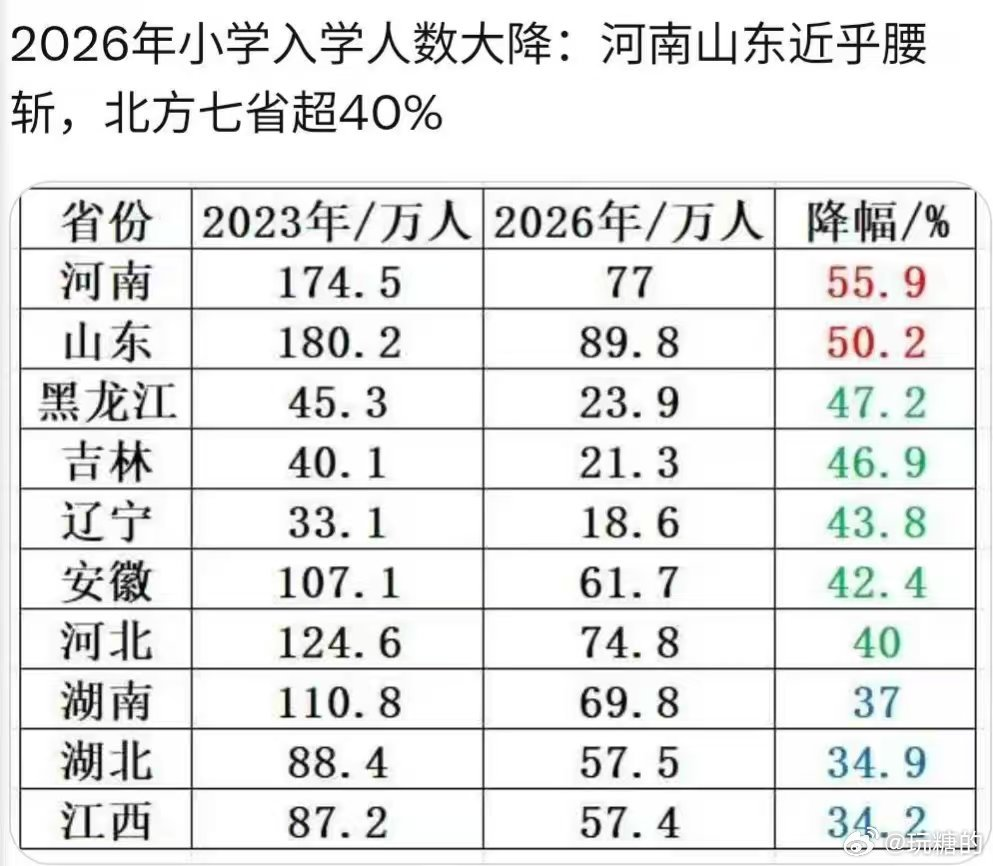

---

## 24

@前HR本人

发表于：2026-09-05 08:59

来源：微博

链接：https://m.weibo.cn/status/5339832500617567

彭博社爆料：DeepSeek向华为订购了16万颗昇腾950DT芯片，部署在内蒙古，订单总额高达25.6亿美元。这批芯片主要是做AI推理，不是训练。不过因为华为产能问题，暂时无法全部满足，但是DeepSeek愿意等待。

而影响950DT产能的，是宽带存储HBM芯片，目前国内自产才开始。明年可能就好了。

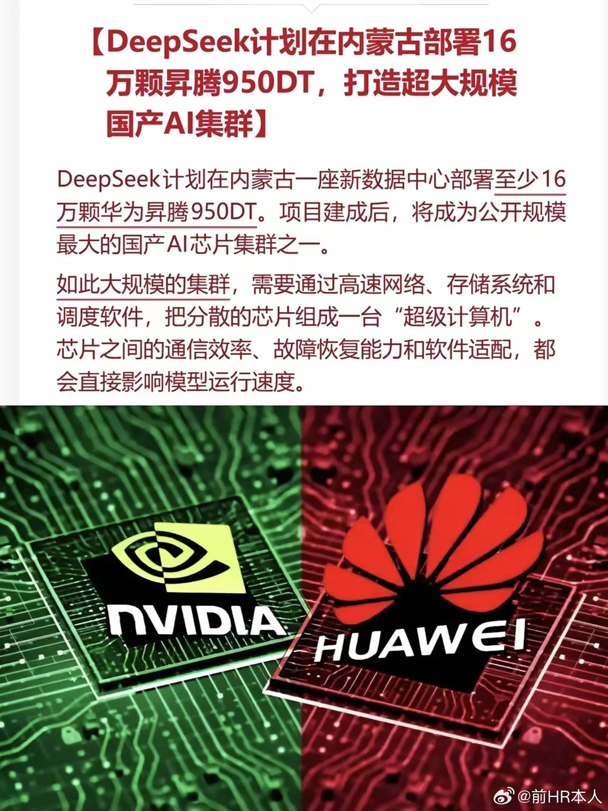

---

## 25

@何夕

发表于：2026-09-06 10:32

来源：微博

链接：https://m.weibo.cn/status/5340093055243314

周末跟好友讨论，为什么影视行业越来越拉垮？

一个被忽视、但却非常重要的原因是 —— 节奏！

随着移动互联网铺开+信息传播加速，全社会的节奏都在变快。

…

我感受最深的是，

本轮牛市与之前相比，发生了根本性改变。

之前涨跌，

有点像坐轿子上山，颠簸但缓慢上下行；

人味明显，节奏缓慢且可控性强。

现在涨跌，

则有点像坐电梯，直上～直下：

·涨起来一波流，基本没有像样的调整；

·跌起来直接A杀，基本没有像样的反抽。

以上，仅是举一个最熟悉的例子。

这种节奏加速，早已渗透进各个领域。

…

回到影视行业，为什么越来越多人不看电影？

因为电影节奏偏慢、又太耗时(1.5-3个小时)，不符合当下社会节奏。

真正符合当下节奏的，

美剧是1.0版本，网剧是2.0版本……题材多样、甚至怪异小众，故事推进节奏快、多反转，疯狂刺激多巴胺。

但大部分电影的节奏，依然维持在移动互联网之前、没有太大变化。

尤其年轻人，大部分已适应了快节奏的影视作品；再让他们回到电影院，去看慢节奏的电影：除非这部电影特别好看，好看到出圈……否则没戏！

这也是当下的现实情况，

 除非某部电影质量好到出圈，否则票房不会太好；即使是非常优秀的电影作品，票房也常常不及预期。

…

总之，

影视行业拉垮，首先是时代的原因……是行业没有跟上时代发展。

然后，

才是所谓的“内容监管问题”、“行业资源被少数跟不上时代的老家伙垄断”、“婚恋减少导致电影失去重要场景”等，次要原因。

以上次要原因中，最核心的依然是：

影视行业资源被少数老家伙垄断，他们跟不上时代、也推不住符合当下年轻人审美的作品……导致整个行业无法“与时俱进”。

总结下就是，

当下大部分50后60后70后导演，已经“过时了”；

过时不是因为年龄，而是他们生产的内容&表达的情感，依然在上个时代。

典型如《抓特务》，其实也算优秀作品；

但这个内容题材，90后95后00后……基本get不到。

客观来讲，

冯导是50后，他可以拍50后60后70后群体喜欢的内容；

但再往后、由于年龄代差过大，强求他也能拍出90后00后喜欢的内容，不现实。

所以，

导演需要新陈代谢，即使是优秀的老家伙们，也应该逐渐隐退。

为了整个行业发展，应该不断推陈出新……吸引和推出更多有才华的人，而不是影视二代们依靠父荫、垄断资源&输出垃圾。

只可惜，

任何一个弱者主导的行业，基本都“走抱团路线+排挤优秀人员+主推自己人”……结果就是，这个行业必然逐渐走向崩溃。

《牛来》并不是股民高抽象，而是大众对“影视精英”的无声抗议：

宁可看草根出品、质量欠佳电影，也不看“精英”们的作品。

---

## 26

@姬永锋

发表于：2026-09-06 11:32

来源：微博

链接：https://m.weibo.cn/status/5340114952915858

Anthropic 上市前的博弈分析帖。纯属推测，但分享出来供大家探讨。

Anthropic 将营收确认方式从总额法改为净额法，并从其 650 亿美元 ARR 中剔除了 Meta 和中国蒸馏业务的贡献。据推测 Meta 贡献的 ARR 超过 50 亿美元，剔除后意味着即便 Meta 在 Anthropic 上市后不久就切断合作（市场普遍预期会如此），它们也能轻松应对。这也降低了 Meta 真的切断合作的可能性——取决于“西瓜”质量如何。总之，这步棋很聪明。

接着放出 Fable 5.1，以此让 OpenAI 有信心推出 Astra。顺便说一句，圈内对 Astra 的反馈非常好。我认为 Astra 的表现可能超出了 Anthropic 的预期。

现在有小道消息说 Anthropic 已经解出了纳维-斯托克斯方程，这要是真的就太惊人了。

Anthropic 大概会在 IPO 前的某个时间点发布 Fable 5.2——除非出什么岔子，否则应该会优于 Astra。很可能还计划在 9 月展示 ARR 的显著重新加速，届时肯定会泄露给媒体。

Grok 4.7、Meta 的 Watermelon 和 ChatGPT 6.1 也都有望在未来六周内推出。所有这些实验室对其路线图的信心之高，是我过去 18 个月里从未见过的。至于 Gemini 4 就走着瞧吧。竞争对手们在这些计划中也有发言权。

Grok Bot 感觉像是目前企业用例中最好的智能体编排框架，而 Instinct 在消费端用例上也很有前景。竞争对手应该很快会推出各自类似的变体。Grok Bot 对我的使用场景来说仍具有变革性。

而这一切都发生在整体 AI 需求持续加速的大背景下。

真是风起云涌。

顺便说一句，我觉得 Krishna 可能会成为一位非常出色的 CFO。他之前在 Blackstone 的同事对他评价极高。这一点会很重要——如果他们决定将计算资源从推理转向训练，第一次向华尔街清晰传达这一点会很难消化。或许值得研究一下亚马逊从 2010 年到大概 2016 年的“投资—然后‘查账’”的利润率策略，这套策略最终被投资者理解了。

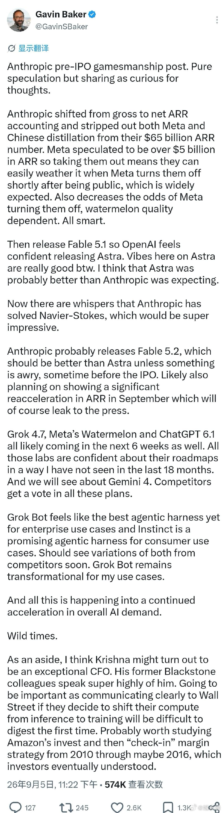

