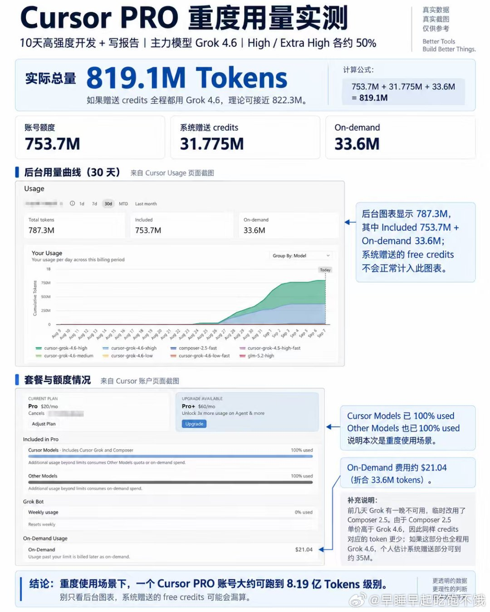
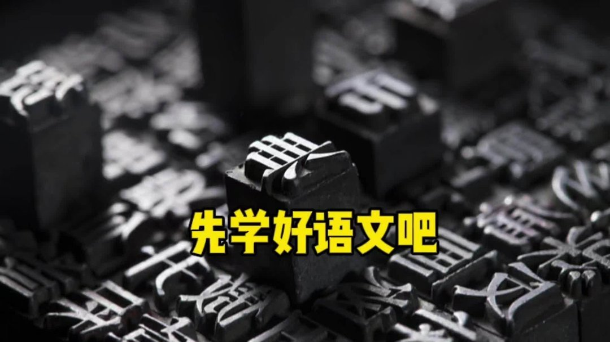

# 2026-09-08

## 1

@武黎嵩

发表于：2026-09-07 12:21

来源：微博

链接：https://m.weibo.cn/status/5340608357207893

之前看过一篇社会学研究的报道，大致意思是，生活贫困的人对于有趣的事情追求更加迫切，因为他们的生活困苦而无趣，所以更渴望得到更多的资讯和娱乐方式。比如八十年代，刚刚能吃饱饭的人们，甚至借钱也想买彩电。而有调查表明，一些贫困的人有了点钱后，不是首先用来解决吃穿，而是更愿意去买手机、平板等能够让生活丰富多彩的东西。这个研究向我们昭示，生活的困境和精神的贫乏是伴生的。我们在关心贫困人口的时候，除了要设法解决他们的温饱，也应当关注他们的精神世界。。。

---

## 2

@早睡早起吃饱不饿

发表于：2026-09-07 04:57

来源：微博

链接：https://m.weibo.cn/status/5340496553579309

Cursor Cx CC怎么选：个人实测使用体验

最近开发量比较大，也顺手重新梳理了一下自己现在对 Cursor、Codex 和 Claude Code 的用法。

 

这次比较想聊的，不只是“哪个好用”，还有两个更实际的问题：到底能跑多少量，以及这些量值不值。

 

这轮 Cursor 基本全程用 Grok 4.6，大概一半 High、一半 Extra High，主要做开发、命令行、数据处理、跑脚本和写报告。连续高强度用了大概 10 天。

 

最后统计下来：

 

Cursor Included：753.7M

系统赠送 $25 Credits：31.775M

On-demand：33.6M

 

合计约 819.1M Tokens，也就是 8.19 亿。

 

后台 Usage 页面显示 787.3M，因为赠送的那部分被记成 free，没有正常计进图表。

 

按首月新人邀请五折后的 Pro 价格粗算，80 多块人民币跑到 8 亿多 Tokens，差不多是 1M Tokens 一毛钱出头。算法比较粗，但从实际使用看，已经比我之前用过的一些便宜 GPT 中转还低，而且速度更快。

 

以前 Codex 我用得很多，GPT-5.6 本身能力没问题。但连续高强度工作时，我觉得两个问题比较明显。

 

一个是速度。Grok 4.6 在 Cursor 里正常跑，很多任务不用开 fast，推进速度已经很符合我的节奏。单次差异不一定大，但一天连续几十轮修改、执行、验证，累计出来的工作量差别很明显。

 

另一个是额度机制。Codex 的 5 小时和周用量限制，平时零散用问题不大，但连续几天赶项目就容易影响节奏。最难受是任务做到一半需要停。即使中间有重置，周总量对重度使用还是偏紧。

 

Cursor 这边我更喜欢的是按月一个总池子。项目多的时候可以集中几天狠狠干，不用一直惦记 5 小时还剩多少，或者这周还能不能继续推。

 

Claude Code 的位置则不太一样。

 

我基本都是省着用。图里的这周，我只拿它做了两页 PPT，加上大量纯文字改写，没有做搜索调研，也没有执行实际代码，周用量还是很快到了 42%。

 

所以我不会让它承担大量日常执行任务，而是更多留给重要 PPT、文章重写、论文表达和最后润色。

 

现在我的分工基本固定了：

 

Cursor：开发、脚本、数据、命令行、批量执行

Claude Code：重要写作、PPT、润色、论文表达

Codex：仍然会用，但最近明显少了

 

所以我现在看这些工具，已经不太只看谁评分好和单次更强，还要考虑同样开销，谁能让我一天稳定推进更多工作。

 

这次 Cursor pro跑到 819.1M Tokens，对我来说真正有意义的是它验证了这套工作流在速度、性价比和连续性上确实适合我，应该也适合类似需求的中度用户。

 

图里放的都是这次自己的真实后台截图和用量。

 \#cursor\#\#gpt\#\#Claude\#\#grok\#\#vibecoding\# 

@高飞 @出版人周筠 @郑昀 @蚁工厂 @宝玉xp @有个梨GPT

---

## 3

@种牙匠黄建生

发表于：2026-09-06 09:16

来源：微博

链接：https://m.weibo.cn/status/5340199206783805

莲之花曾设有不少福利，部分已陆续取消。

早年，公司每年面向硕士应届生开放招聘。面试环节，为候选人提供单程经济舱机票及一晚五星级酒店住宿；若通过面试并确认入职，再额外报销一张单程经济舱机票，并发放800元临时住宿补贴。

某年，两名应届毕业生进入面试，分别来自北京和南宁。面试刚结束，其中一人拟被录用（尚未公示），两人随即向人事部门坦言，他们本无意入职民企，此行面试只因分别要参加省口和广医的面试。此后，该面试及入职差旅福利被取消。

莲之花原先还设有婚育津贴：已婚员工每月200元，生育员工每月200元。后有一年前台员工试用期考核不合格，公司拟解除聘用合同，该员工称自己已怀孕、即将结婚，且男友无业，急需这份工作。公司最终留下她。她休完产假和哺乳假后，一天未多留便离职。第二年，又有一名文员入职，试用期干活斤斤计较，不愿做入职体检，只愿提供婚检，大概率已怀孕。此后，婚育津贴亦被取消。老员工纳入薪资核算，新员工及后续结婚者不再享受此项福利。入职体检则新增了X光检查。

莲之花以前每年都有送员工出国培训的机会（疫情期间除外），最多那年达10人次，涵盖医生和护士（不包括黄医生）。疫情放开后，培训恢复。不久，一名工龄五年多一点的护士离职，在微信朋友圈吐槽：凭什么比她晚入职五个月的人，收入过万，而她不到一万，还能出国，她却不行。两人都是疫情期间入职的，后者，品行，技术明显优秀。此后，莲之花缩减了出国培训名额，仅限非常优秀的员工参加。

曾有一段时间，黄医生顶着管理层反对，试行早退制度：有充分理由可提前30分钟下班。黄医生多次强调希望大家珍惜，不要滥用。但半个月后人事建议取消，并将汇总记录拿给黄医生看，主任批了十几人次，事由包括“请人吃饭”“有事”“不方便说”“医生休息”等。早退制度随即废止。

………

………

好在很多福利并没有写人劳动合同和员工手册。

莲之花的额外福利全靠PUA一位叫黄建生的医生换来的。

此后，莲之花在福利待遇上明显向优秀老员工倾斜，与新员工的差距逐渐拉大。

大部分员工并不会因为管理者的善良厚道而自律，反而会变本加厉地偷奸耍滑、钻营取巧。这不是员工个体的问题，归根究底是人性使然。只能通过制度的法则，构筑抵御人性之恶的堤坝，管住贪婪与恐惧，当堤坝足够坚固时，个体便能在规则中成为善的、好的人。也就是说，在管理上，必须冷酷无情。

道理都懂，但黄医生下不了手。所以从去年开始，不再介入公司管理。

莲之花是黄医生一个人的人行为艺术。

---

## 4

@阑夕

发表于：2026-09-06 09:31

来源：微博

链接：https://m.weibo.cn/status/5340203029890990

新模型发布的第一天，时间线上一定是各种Demo横飞，什么一句话生成游戏、生成网站、生成3D建模之类。

到了第二天，审美疲劳袭来，时间线上又开始了集体反思，认为这是一种无用的刻奇、焦虑或是Fomo，很像男人完事儿后进入贤者时间。

我愿称作为这个时代的「奇观」，包括急迫于在第一时间就用模型做点什么出来、用以证明核弹爆炸瘫坐的感染性。

甚至SOTA模型本身也是一种「奇观」，玩过「帝国时代II」的老登应该知道我在说什么。

在这款游戏里，文明达到一定程度，就可以建设「奇观」了，需要花费巨额到资源，一旦建成，全图所有敌对玩家都会获得这座「奇观」的永久视野，并不约而同的前来进攻。

因为「奇观」一旦维持超过200游戏时间，建设它的文明就会直接杀死比赛，获得胜利。

AI大厂都有自己的「奇观」建筑，其中GPT-4应该是持续最久的一座「奇观」，发布足足一年之后才被Claude 3 Opus摧毁。

2025年之后，前沿模型的差距一直在变小，再无「奇观」可以长治久安，通常在完工三个月内必被攻破，而在上一座「奇观」还没有完全倒塌之前，该文明就必须开始建设新一座「奇观」了，主打一个你拆得不如我造的快。

世界是一个巨大的即时战略游戏。

---

## 5

@渔老板钓鱼

发表于：2026-09-06 12:49

来源：微博

链接：https://m.weibo.cn/status/5340252908815924

为啥我说消费降级厉害？

因为现在很多客人，两人点单人餐，因为鱼饭一锅两人也够吃了。三人点两人餐，或者三人点单人餐，大家花钱都比较保守了。

---

## 6

@李楠或kkk

发表于：2026-09-06 09:56

来源：微博

链接：https://m.weibo.cn/status/5340209300636778

我隐隐约约意识到了组织形式的变化的趋势，应该是一种基于加密货币的，由 AI 管理的，某种松散的项目利益期权制的组织形式。

但是我们不用操心这个，迟早有人搞出来，而且应该现在就有人在搞。

未来赚钱的生意，钱，人，token 都不会是问题。

但是有一个好的故事，让这些资源支持你，才是问题。

就是乔布斯所说的：这个世界上最大的权利是由说故事的人掌握的。

AI + 加密货币有机会把金融共识，转变为真正的商业行动力。

---

## 7

@包容万物恒河水

发表于：2026-09-06 08:35

来源：微博

链接：https://m.weibo.cn/status/5340188986572879

🔻看到有些网友说“现在网上资料可多啦，什么东西自学就行啦~”

🔻嘿嘿。

🔻其实人就是懒，喜欢懒，我也喜欢。

🔻热量不能自发地从低温物体传到高温物体，不可能从单一热源吸收热量，使之完全变成有用功，而不产生其他影响，一切自发过程总是沿着分子热运动的无序性增大的方向进行。在一个孤立系统里，如果没有外力做功，其熵自动增大，混乱自发增加。

🔻这就是热力学第二定律。

🔻所有事物都会向着一个确定无序方向发展，这是世界运行的一条底层规律，人是低熵体，知识不会自动流向人的脑子里，要学习知识，必须时时刻刻对抗熵增。

🔻网上的资料当然很多，对每个人而言这叫信息的“堆积”，是无序的，而自己真正想学会是“对知识的编码”，这是有序的。所以视频收藏了不等于学会了，人类大脑仅占体重的2%，却消耗全身20%的能量，知识的有序化也就是思考会大量消耗血糖，产生代谢废物，身体本能地发出“疲惫”信号，试图阻止你继续消耗稀缺资源，对抗熵增的“痛苦”是生理性的，而非心理性的，学习就是个痛苦、疲惫的过程。

🔻对抗自然规律总是让人痛苦，因为自然就是向着熵增的方向发展，所以一切符合熵增的，都是容易的，比如宽松自由，比如摆烂，比如快乐教育。

🔻别说学习了，都知道身体好活得久，能坚持每天锻炼的人有多少？健身视频收藏了就当练过了是吧？

🔻不好学的人满坑满谷，这很正常。

🔻但是，人不能，最起码不该认不清自己的本性。

🔻强制学的时候都不学，吹什么“以后进了社会找资料自己学”我是不信的。骗哥们可以，别把你自己也骗到了就行。哥们被你骗一下是真无所谓的，打个哈哈也就过去了。但希望你打完这段话后擦一下眼角，别让眼泪掉在手机屏幕上了就行。你说的这些话，哥们信一下也是没什么的。还能让你有个心里安慰，但这种话说出来骗骗兄弟就差不多得了，哥们信你一下也不会少块肉，但是你别搞得自己也当真好。真不是哥们想要破你防，你擦擦眼泪好好想想，B站收藏夹里的学习视频看完了几个、记住了几个、真正学会了几个？除了兄弟谁还会信你这些话？

🔻9月6日：说的有道理，新开这本日记，也为了督促自己本学期多下些苦功。先要看完B站收藏的视频。

🔻9月7日：打DOTA2

🔻9月8日：打DOTA2

🔻9月9日：打DOTA2

🔻9月10日：你怎么能如此堕落！先前订下的学习计划你都忘了吗？子曰：“吾日三省吾身”，不能再这样下去了！

🔻9月11日：打DOTA2

---

## 8

@平原公子赵胜

发表于：2026-09-06 00:39

来源：微博

链接：https://m.weibo.cn/status/5340069260429642

相比英语还是别的什么语，我建议孩子们还是要先学好语文。

近几年来，我发现互联网上很多人阅读能力越来越差、理解能力越来越差、表达能力越来越差了……简单说，就是听不懂人话、讲不好人话，母语水平下降了。

这非常影响沟通。

就比如现在，有人并没有说要取消英语的学习，人家说的是降低英语的权重，然后热搜上就挂一个“XXX呼吁取消英语”，然后某些老媒体人还扑上来疯狂批判一番，这就是断章取义、望文生义，这就是语文没学好、理解能力不足、不学无术还爱抬杠的体现。

不是说英语不重要，不是说不要学英语，而是要注意，英语就是一门工具性学科，和法语、德语、俄语、拉丁语、阿拉伯语一样，并不具备太多优越性……是该好好学，但应该当做一个高效沟通工具去学，而不是当做“信仰”和“意识形态”去学，因为就连英国人美国人，都在反思英语的“shi山代码”特质，不断创造新词的缝合怪语言，越来越成为封锁知识、阶层固化的工具了，远不如中文更能高效交流和学习。

中国早已是人类历史上最强大的工业国，中国产品输出全世界，中国科研人才和工程师数量世界第一，那么凭什么世界通用语言不能是中文？某些外国人来中国旅游，还抱怨中国大部分人不会英语……他们有没有反思一下，为什么没有好好学中文和汉语？

在中国，以及未来的世界，中文的阅读和写作能力，一定是非常重要的，你看那天宫空间站里，都是中文操作台，你看那卖到国外的比亚迪汽车，都是中文操作系统和中文按钮，超级大国领导人的孩子，都能背唐诗，欧洲最靠谱的政党领袖，都能说一口流利的中文……所以大家要知道趋势在哪里，学好自己的母语，提高语文水平，符合未来的大势。

中文有着极其简洁、高效的表达方式，有着非常体系化的学习规律，有着非常丰富的意蕴，它可以简单直白，也可以含蓄隽永……更重要的是，作为一个普通中国人，你一切的生活、工作都离不开中文，你要看说明书，你要写报告，你要看懂法律文件，你要编计划写方案，你要在会上发言，你还要揣摩朋友的微信留言，想好怎么回复……你不能大学毕业了，连个工作汇报都写不明白，连别人的话都听不清楚，吵架的时候连对手的阴阳怪气都接不住。

我见太多这样的孩子了，他们不是数学不好，不是物理不好，不是化学不好，不是生物不好，不是历史不好，不是地理不好……他们是语文太差了，以至于他们无法读懂课本，无法自我学习，根本无法理解数理化的原理推导，因为那一堆字放他们面前，他们每个都认识，但连起来和看天书一样，这就是语文基本功太差。

他们考试的时候，连题目都读不懂是什么意思，当然没办法解题了，很多人吐槽语文考试“阅读理解”这个类型的题目，然而这类题不是太多，而是太少，太简单，要上难度——这样才能训练出一流的提取信息、理解信息的能力。他们长大之后、工作之后，才能听得进人话，听得懂人话，才能更好地生活和工作。

当代某些人阅读能力下降，还体现在阅读量太少、太零碎、缺乏深度阅读，沉溺于简单的信息获取，被垃圾信息喂坏了——很多人一生都没有好好读过任何一本书，天天就靠“一篇文章让你读懂XX”、“一条视频告诉你什么是XX”的互联网残渣过日子……毫无疑问削弱了自己的深度阅读、深度学习、自主发掘信息、辨别真伪的能力。他们读书太少，读中文著作太少，语感太差，从来没有深度琢磨过语言、情景和心理的关系，所以导致他们完全没有正常的沟通能力。

于是他们交流起来就和听不懂人话一样，各种头铁、抬杠、顽固不化、分不清好赖、驴唇不对马嘴，这是互联网上绝大多数纷争的来源，某些人其实并没有那么坏，而是蠢……学不好语文，真的会变蠢。

语文太重要了，语文承载的东西太多了，新中国的语文，首先教你阅读理解，其次教你写作表达，然后还要带你背诵、记忆、理解古今中外的好文章，说实话，在文化精神塑造上，在让一个人变得博学多识方面，没有一门学科比得上语文……语文课你会学到先秦古文、汉乐府、唐诗宋词、古典小说、外国文学、近现代革命文学……《无衣》、《短歌行》、《归园田居》《梦游天姥吟留别》、《登高》、《琵琶行》、《念奴娇·赤壁怀古》《永遇乐·京口北固亭怀古》、《沁园春.长沙》，背诵这些很重要，这就是在精神和气质上塑造一个中国人。

《答司马谏议书》，能让你深刻了解王安石到底要和司马光说什么？《变色龙》、《我的叔叔于勒》、《装在套子里的人》、《项链》……这些外国小说，能够比历史教科书让你更形象生动地理解西方世界；语文课上你能学到《反对本本主义》、《改造我们的学习》，听近现代顶尖的文科生，用最深刻的思想、最平白如话的语言来带你认识世界、改造世界。语文，不但教你读书写字，不但让你有审美、有情怀，还要让你有自己的精神、思想，让你明白什么是正直、善良、勇敢，让你追求公平和正义；让你提高认知水平，真正能够独立思考，明白“物质决定意识”，找到自己未来的立场和理想，语文，还是最强大的意识形态工具。

让大家学好语文，并不需要大家像学外语一样去痛苦地学语文，中文是你的母语，你一定学起来更容易，门槛更低……只要你肯多深度阅读、多加强写作，你语文就能学得很好。

语文这玩意儿全靠潜移默化地积累，你都不需要去读太多著作，只需要把四大名著读上个几十遍，课本里里面的古文、古诗词背上个烂熟，看到一篇文章，无论是现代文还是古文，扫一眼就知道它大概在说什么……你语文就学成了。

你语文学得好了，你其他学科的理解能力也就会自然而然突飞猛进。

语言和文字，是一个人精神、思想和能力的根基，根基打好了，一切都会无往不利。 平原公子赵胜的微博视频

