# 2026-09-11

## 1

@植物人史军

发表于：2026-09-09 10:46

来源：微博

链接：https://m.weibo.cn/status/5341309088305353

\#收1斤瓜赚5分48万积蓄被儿子刷光\#

这里有个明显的原因，

这儿子从来没有去帮父母收过瓜。

---

## 2

@宝玉xp

发表于：2026-09-09 15:07

来源：微博

链接：https://m.weibo.cn/status/5341374888286182

DS V4.1 Flash 模型在性能、费用、速度、总用时等各项指标上都全面超越了 V4 Pro

V4.1 Flash 正式上线之后，V4.1 Pro 上线之前，V4 Pro 模型的请求都会被路由到 V4.1 Flash，并按 Flash 的价格计费。

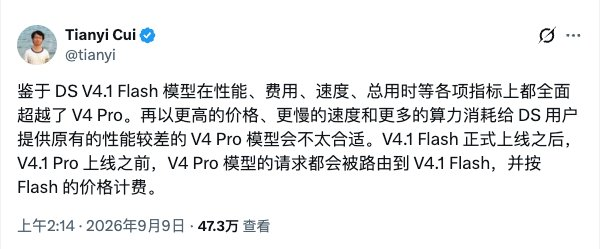

---

## 3

@徐一邈

发表于：2026-09-08 07:41

来源：微博

链接：https://m.weibo.cn/status/5340900236462974

等到最后一批还负有责任心的员工职业生命到期的时候，各种产业就会迎来大面积的事故潮，60一天我玩儿什么命啊

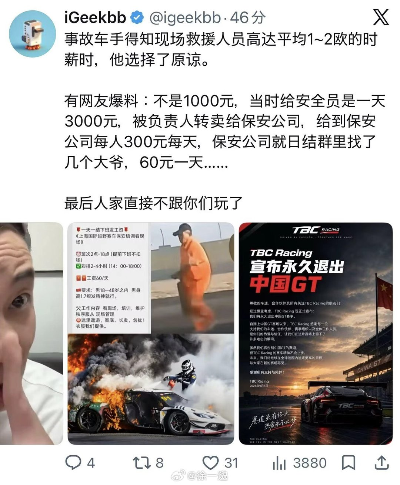

---

## 4

@江卓尔_发言号2

发表于：2026-09-10 14:19

来源：微博

链接：https://m.weibo.cn/status/5341725165879512

PPI高于预期时，

CPI高于预期59%，

符合预期18%，

低于预期23%。

所以明天CPI高于预期的概率不低

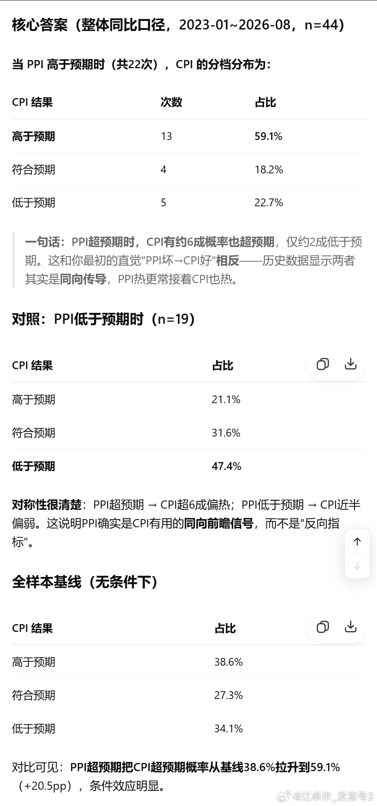

---

## 5

@汪海林

发表于：2026-09-10 13:55

来源：微博

链接：https://m.weibo.cn/status/5341718956213496

我跟很多人的看法不一样，沈腾应该坚定走喜剧演员的路线，演正剧偶尔一次就好了，要赶紧回到喜剧路上来，这才是他的正事儿。

---

## 6

@达克鸭唐

发表于：2026-09-10 15:54

来源：微博

链接：https://m.weibo.cn/status/5341749018891581

他这条是我最不能忍的，他也是父亲可能小孩大了忘记小时候怎么过的了，或者就是媎妹口中完全丧偶式育儿没有好好带过孩子。

2-4岁的孩子父母有多焦虑我是有切身感受的，我身边都是这样的父母，他们不管是银行精英、个体户还是身家几千万的老板，在外面都是跟人和颜悦色甚至说融不进大众里的，他们的世界里只有孩子和其他带着孩子的人。

你们仔细想想，那些所谓的人类聚集地夜市、顶级商场、长沙的步行街之类的地方你见到这种孩子的比例高么？我们都会尽可能避开这些地方，就是害怕自己的孩子影响他人发生冲突。

你现在要一个相信社会运行规则的老实人匹夫一怒去维护自己和自己孩子的权益，完全无视《未成年人保护法》在我国已经存在实行这么多年，这个父亲可能还幻想过还好我忍住了到了警察局肯定可以拿下这个女的。

结果呢？你反过头来怪老实人不敢出手，那我要再问一下，这些老实人“良家子”是怎么变成这样的，是谁天天让他们相信规则的？现在出了事反过头怪他们太相信规则了？

做人真的要稍微有一点点底线，下棋可以没问题，赢也没问题，但是先得爱自己人。

当然可能每个人对自己人的定义都不一样，互相理解尊重唾弃。

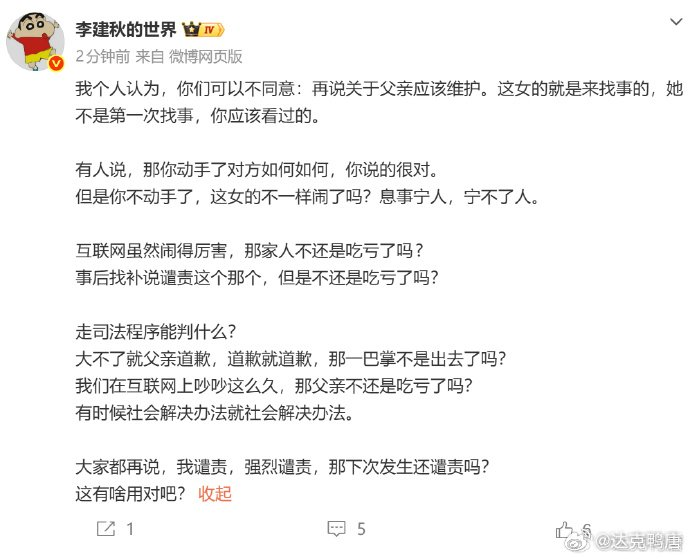

---

## 7

@扬韬

发表于：2026-09-10 05:35

来源：微博

链接：https://m.weibo.cn/status/5341593130240423

宇树今天跌破500元，但是，目前的市值仍然高达2000亿元。而按照目前的机器人估值，就算给20倍PS，股价还可以跌80%，即给400亿估值都算高的。换言之，它曾经的150.8元的发行价，都是高估的，要等它股价见底，大约需要很长时间的等待。

为什么会有这么高的、这么离谱的价格呢？

因为中国股市非常非常奇葩的新股发行制度。

宇树发行后的总股本是4.04亿股，但是，异常荒谬的是，它目前的流通股只有0.3亿股，占全部股本的7.5%。

有没有谁能想到，这种比例，其实是违反早期的证券法的？

早期证券法明确规定，上市公司的基本要求，是公众持股占比不能低于总股本的25%。总股本大于4亿股的，不低于10%。为什么有这个规定，就是要保持股票有足够的流动性。

后来，法律修改了，这个条款就没了，变成了交易所内部规定的条款。

但是，我是说但是，交易所在发行环节，又设了种种规定，有相当一部分股票是不能流通的。比如宇树，这次本来发4000万股，但剩余1000万股不是给社会公众网上认购的，而是定向给了机构，这些筹码要锁定6个月、12个月甚至有最长36个月的。

所以，能流通的股份就那么多。更多的股票，需要等限售期满，才能慢慢涌出来，最长的等待要36个月。

这种弊端影响深远。摩尔线程就是个例子。发行后的股本4.7亿，上市当天只有0.29亿股可以流通，占比不到6%。这么点股份僧多粥少，所以上市一周股价就冲到940元。但大家都知道后面一堆股票要流通，所以，半年后解禁一小部分，股价就软了。9个月后又解禁很大一部分，股价直接跌停20%。

但是，即便今天股价跌到365元，它也只是5600万股可流通，外面还有4.14亿股没有流通呢。天知道等它全流通的时候股价能是多少。

宇树也是一样，现在流通股0.3亿股，股价就撑不住了，等明年8月新增流通股2.28亿股，股价该不该现原形呢？未来还有呢，全流通是4亿多股呢。

不要说美国也是这样的制度。人家股市为什么年年涨，你的股市年年狗熊？好的你不学，专学人家不好的！

中国股市跟美国的最大区别是什么？是中国股市有几亿散户！几亿散户，就意味着热门品种，不够分配的，所以股价会很离谱地高。这种国情，你怎么不考虑考虑呢？

不能把股价在上市之初就摁在地上摩擦，非要等都流通了再把人套死，这是为什么呢？

我实在想不明白的是，目前中国的新股网上发行模式，中签率都是非常低，需要运气才能中签，而不是卖不出去。既然如此，把相当一部分股票配售给机构投资者，有什么意义，有什么必要，有什么好处呢？就是因为他们锁定半年吗？那散户也愿意锁定半年甚至愿意锁定一年、两年、三年，能不能配售给他们？最起码，他们每次只能买500股或者1000股，上市卖出的冲击力更弱啊。这种莫名其妙的制度，实行了这么多年，为什么没有人质疑反而堂而皇之地大行其道呢？因为那些机构救市既得利益者，没人在乎散户能不能参加！

一切股市政策的制定，都应该是如何促进股市上涨，必须有利于股市长期上涨。虽然，他们也说股市要有投资功能，但他们所有的政策制定，还是在围绕着融资更有利、融资支持更有利来做。这哪儿行啊。比如，新股发行，应该禁止一切流通股占总股本低于25%的公司发行。在最低档25%的这个范畴内，应该所有股份都面向网上发行，让散户来买而不是让狗屁的机构来赚利润。为什么不这么做呢？实在想不通。

$宇树科技 sh688836$

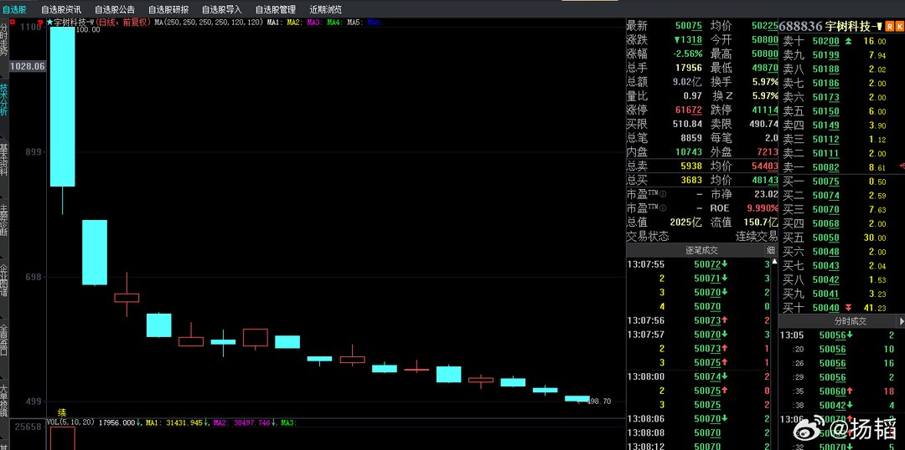

---

## 8

@叫叫叫k

发表于：2026-09-10 05:23

来源：微博

链接：https://m.weibo.cn/status/5341590317172090

魔法画报广告导致错失母亲的最佳抢救时间

我本来是一名19岁的少年意外悄然而至，那天母亲像往常一样给家里人都打了电话唯独没有给我打，母亲身体一向很好，可就在凌晨四点意外发生了，我的母亲突发心梗倒在了厕所里，我的父亲泪流满面的拿起手机要拨打120可就是那该死的魔法画报，我父亲往上滑划出了魔法画报，可是那个退出按钮连年轻人都要楞很久才能找到，就是这些时间我爸爸拖着自己那生病的身体跑出去一家家敲门，科技本是改变生活，却成了间接害死我母亲的凶手，我再见母亲已经是冰冷的遗体了，我找到荣耀客服提出我的诉求我说我要我母亲他们不能满足，我说道歉不能满足，我说下架这个功能也不能满足，我说赔偿也不能满足，本应该改变生活的工具变成了黑心人谋利的工具，普通人维权真的很难，我发出来不为别的只为了让大家知道他们的丑态，我希望官方能看到重视，我只是想要个说法\#沉睡的死亡 \#来自妈妈的关心和爱护  我求求大家了，我希望能看到这个事情被重视@荣耀手机 @央视新闻 @新浪新闻 @中国新闻网 @红星新闻 @菇蘑吃不

---

## 9

@伊利达雷之怒

发表于：2026-09-10 16:48

来源：微博

链接：https://m.weibo.cn/status/5341762560459463

围观完了李建秋和达克鸭的争吵，其实就一句话。

达克鸭觉得，全世界都有暴徒侵害幼童的恶性事件发生，区别只在于能不能对这种暴徒作出公正的裁决。

而李建秋呢，则回避了长沙方面在这次事件中的失责，虽然表面上看他似乎也在谴责女方，支持男方维权。但他和他的拥趸只一味指责幼童的父亲不敢物理打回去，却忽略了如果真打回去了他会是什么下场。

总而言之，这类人永远假装不知道问题的根源在哪里。其实也是饭圈的一种。永远是反串黑的错，对家的错，经纪公司的错，路人的错，而哥哥怎么会错。 

说实话我挺怕这类人的。因为你也没法保证你这辈子顺风顺水不和哥哥打交道，哪天你被恶意针对了却得不到公正，要是闹将起来，很大概率会被他们围攻，因为你的存在就是给哥哥抹黑哇。

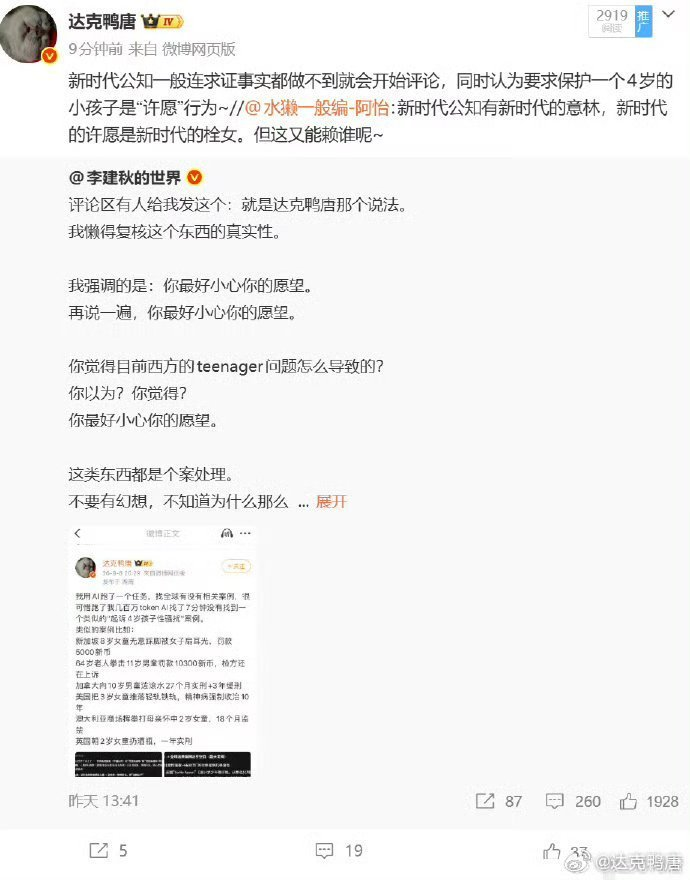

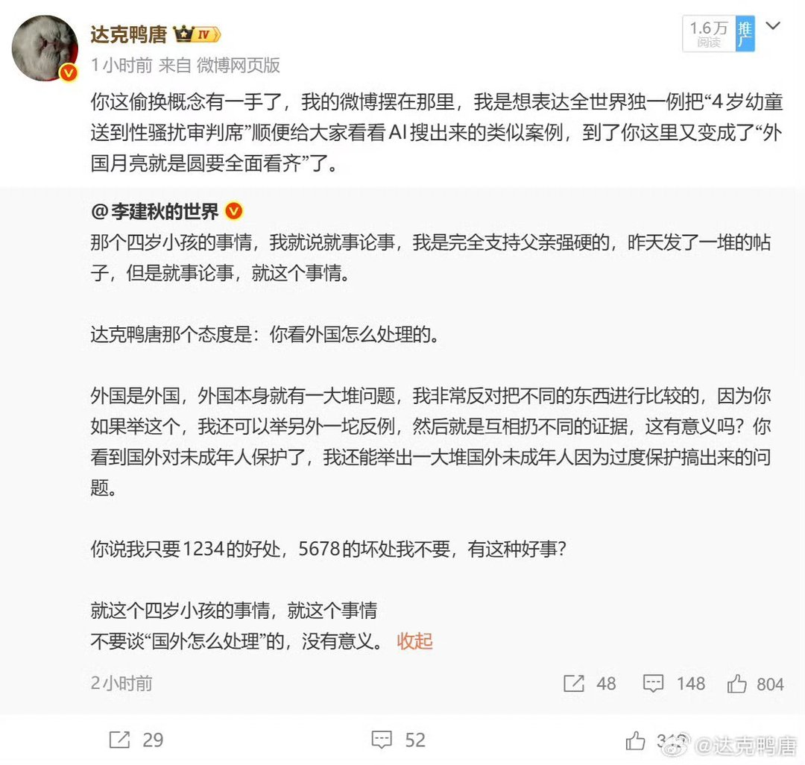

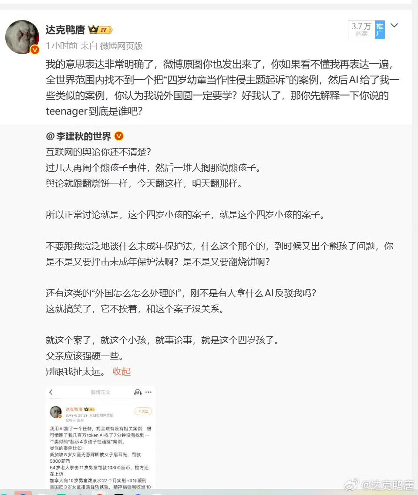

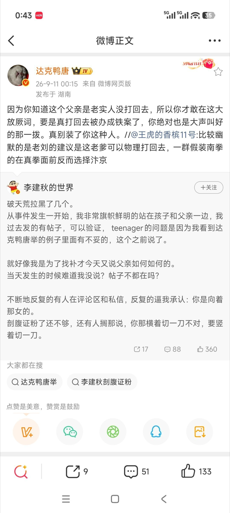

---

## 10

@王玮晨

发表于：2026-09-10 08:52

来源：微博

链接：https://m.weibo.cn/status/5341642891461706

腚姐的留学Vlog应该是拍不成了。

好多网友通过邮件以及电话向马来亚大学投诉。

马来亚大学回应称将会采取必要措施。

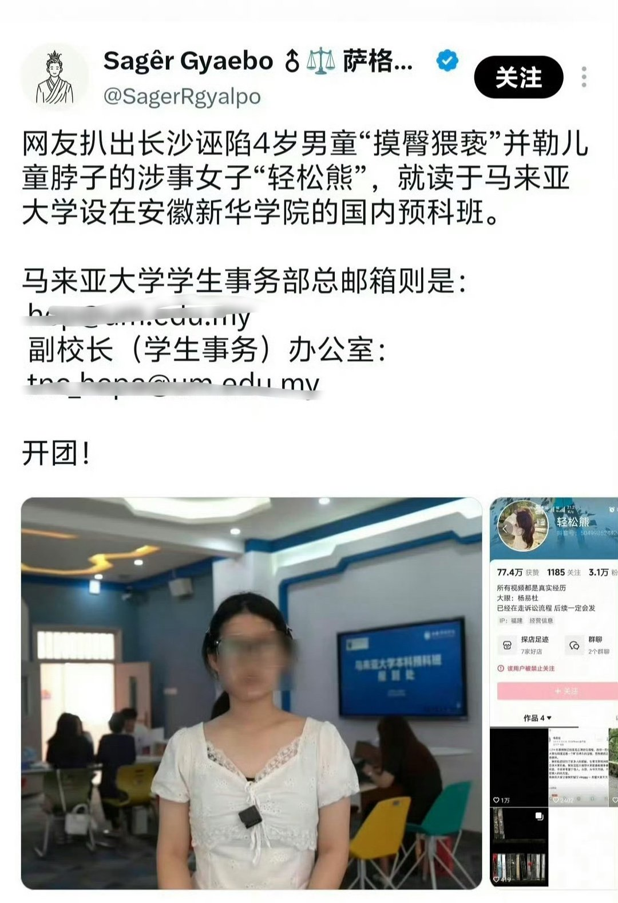

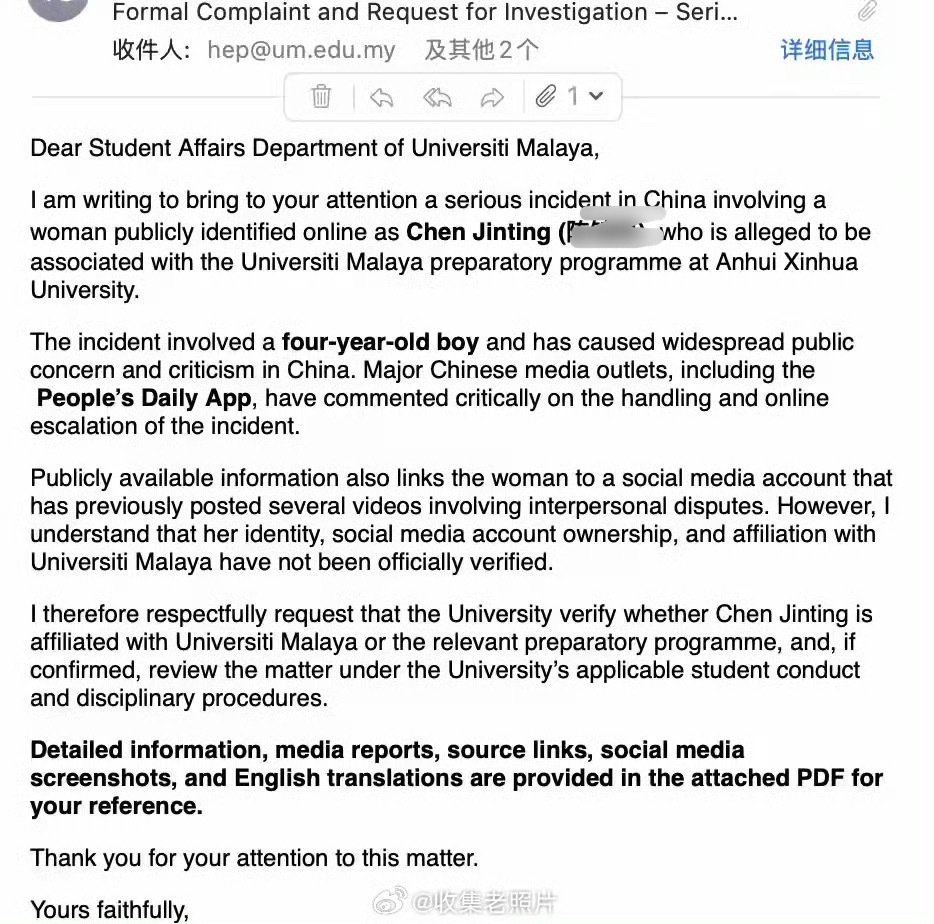

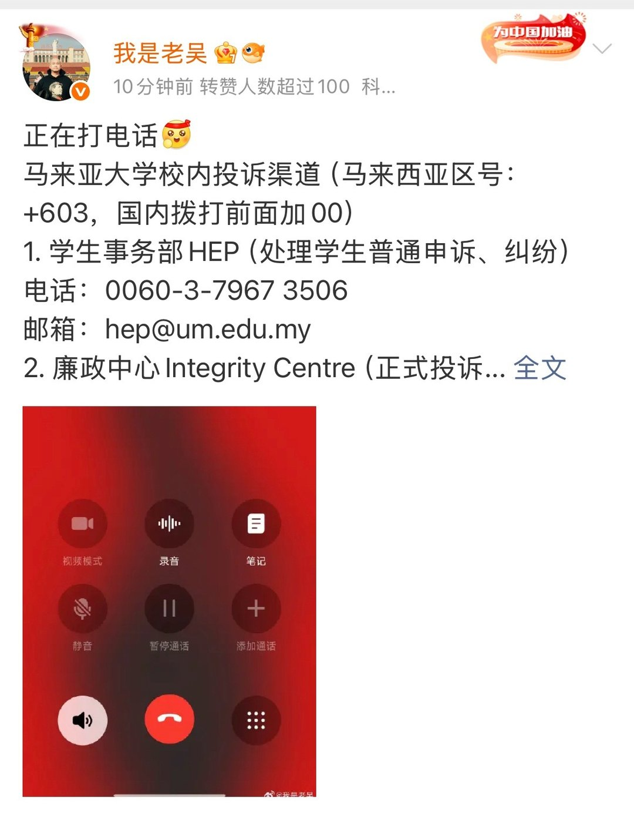

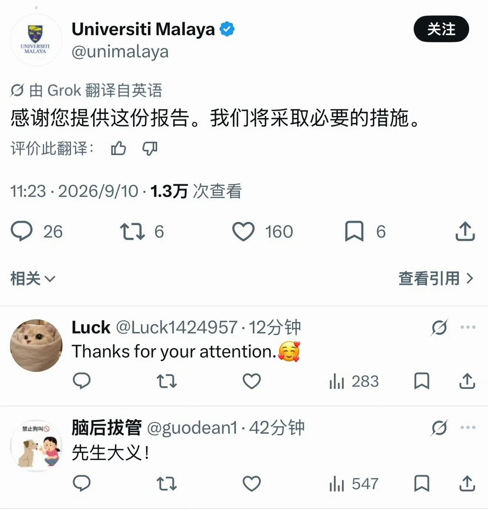

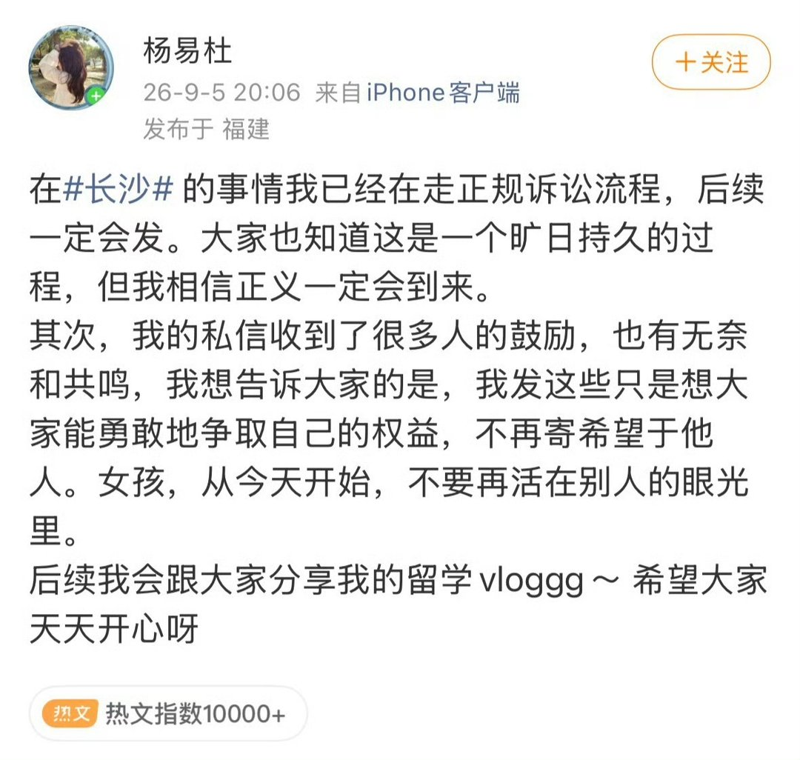

---

## 11

@包容万物恒河水

发表于：2026-09-10 15:28

来源：微博

链接：https://m.weibo.cn/status/5341742337367572

🔻AI 创作者 Alexey Fateev：

🔹我让 Deepseek V4.1 Flash 给我做一个 FPS，就像我通常对每个新模型做的那样。我简直他妈被震撼到了。

🔹说实话，当我启动它的时候，我并没指望会看到什么能真正让我惊喜的东西。天哪，我错了。

🔹Deepseek 做到了其他任何模型都没做到过的事。最近，我一直在用完全相同的提示词，没有明确或严格的规则，大概就是“兄弟，把它做好。”然后它他妈真做到了。

🔹在此之前，每个模型都只是做一些本地的、小规模的竞技场，大约 5x5 米，然后生成一波波敌人。没有独特的风格，什么都没有。它们只是在不同的场景里做出还算可以、千篇一律的射击游戏。Deepseek 走了一条完全不同的路。

🔹它创造了一张庞大、黑暗、近乎恐怖的地图，敌人可能潜伏在每一个角落。而且那种氛围并不是你是英雄、要大杀四方的那种——更像是他们是猎人，而你只是在努力求生。

🔹在此之前，没有任何其他模型，甚至包括 Fable 5.1，能呈现出如此酷炫、逼真且鲜活的视觉风格。

🔹当我用这把冲锋枪开火时，一开始我没意识到枪管下方那是什么——原来是滚烫枪管产生的热浪效果。游戏链接会放在回复里，你可以自己试试。

🔹别光听我说，自己去看吧

🔹确实存在一些碰撞问题和可能的优化问题，但这基本上是一次性完成的，没有经过任何打磨。

🔻输入：1,585,820，缓存：227,277,696，输出：1,484,645。试了下，确实能玩。

\#AI创造营\#\#海外新鲜事\#\#热点现场\# 包容万物恒河水的微博视频

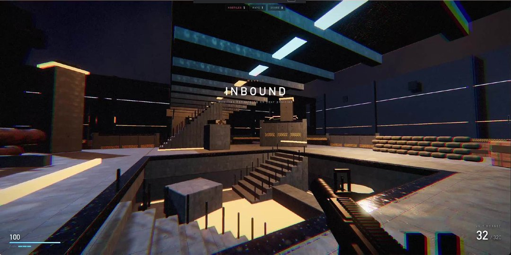

---

## 12

@黑夜之睛滚雪球

发表于：2026-09-10 16:51

来源：微博

链接：https://m.weibo.cn/status/5341763389885291

柜姐：跪下  来买！

一个富姐说退坑爱马仕了。就是突然觉得一直被洗脑的那套销售说辞很可笑。

就是经常接待她的那个销售在她有一段时间没去之后，然后这几天她去了，那个销售就说她失去了机会

于是她就幡然醒悟，退坑了

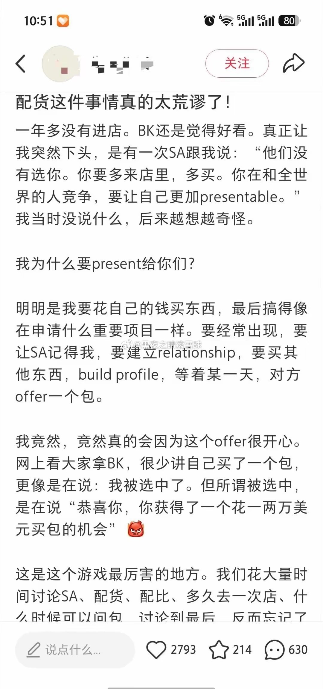

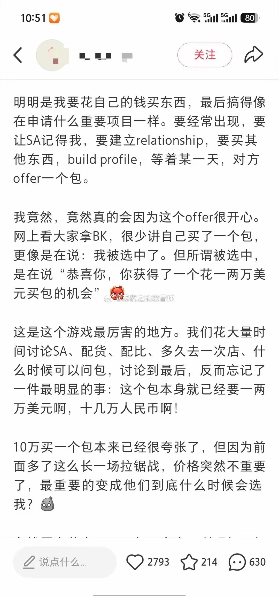

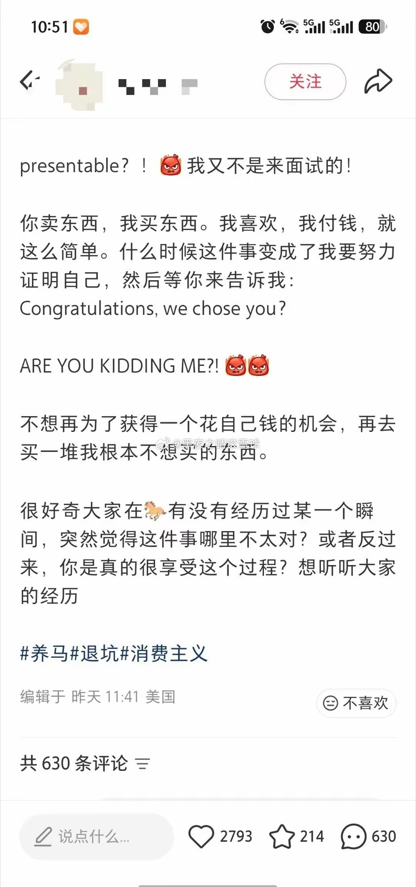

