# 2026-09-17

## 1

@严锋

发表于：2026-09-16 13:16

来源：微博

链接：https://m.weibo.cn/status/5343883516974894

这几天戴了个动态血糖仪，疯狂测试各种食材的升糖速度和极限，好玩。晚上进行了一项终极测试：苏州面！

要了个焖肉和炒虾仁双浇面的团购套餐，39元。小时候就听说过双浇这个概念，据说那是苏州面最豪华的吃法，我是连单浇都没吃过，只能神往。现在终于双浇自由啦。

服务员说焖肉卖完了，只有大肉。没关系，就大肉吧。面端上来，感觉裕兴记的面卖相越来越齐整了，吃口也正好，要的是白汤，很清爽。

大肉有点老，很咸很香，带点花椒味，比一直吃的焖肉更合我口味。然后醒悟过来，这个大肉，就是他家卖的枫镇大肉面里的大肉，零卖比焖肉还贵。

虾仁一般，温吞吞，不像生炒的，还有点不新鲜。不过上海的苏州面不是苏州的苏州面，不讲究啦。

重点是血糖，我一般在家吃完饭到6点几到7点几，外面吃饭7点几到8点几，之前最高记录是吃了15只喜家德水饺，8.9。今天的双浇面，1小时后从5.3升到8，又1小时后飙升到这只血糖仪的最高峰：9.4。

终于知道苏州面的威力了。难得吃一次，还是没关系吧。

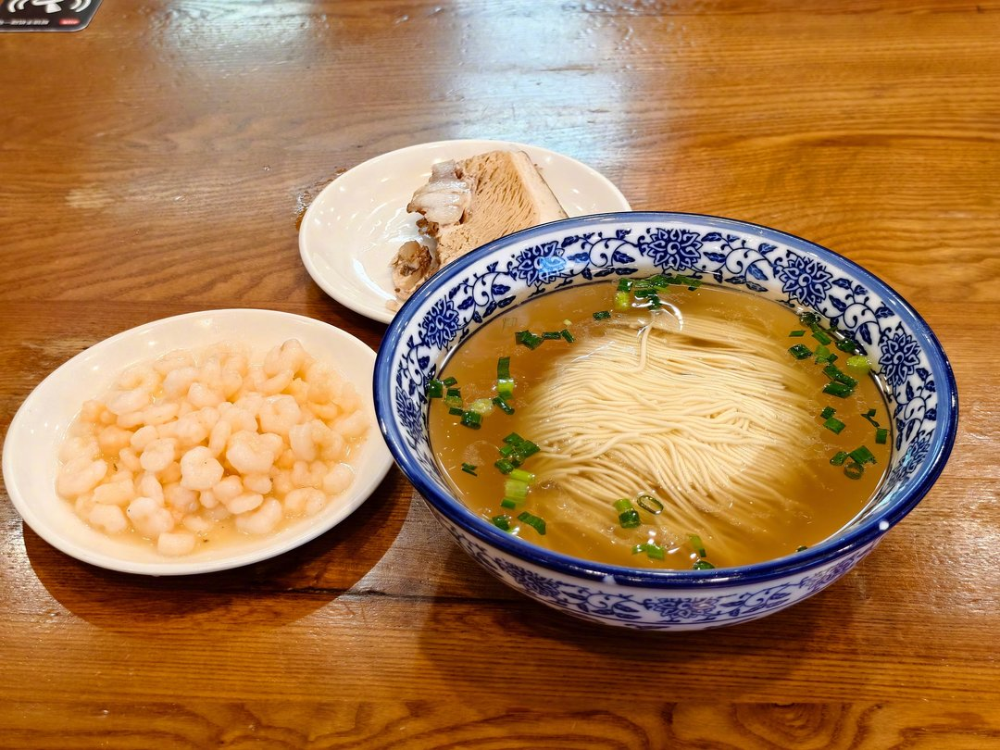

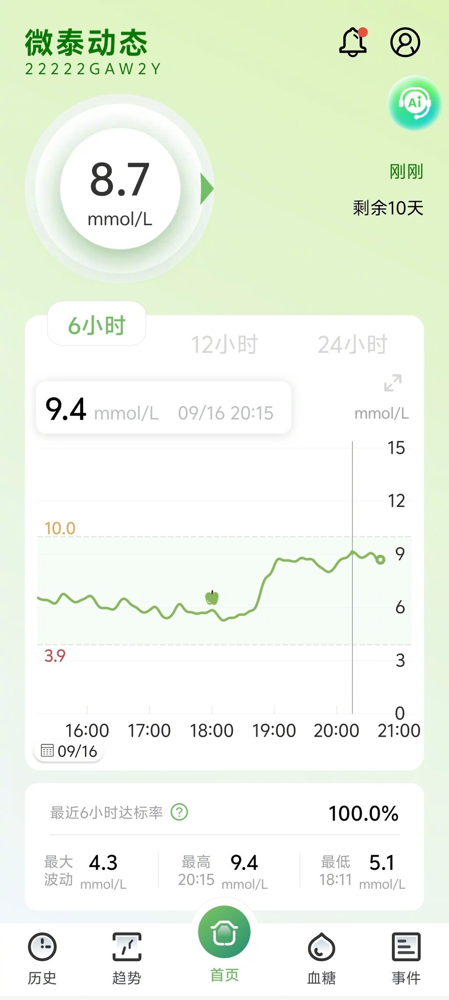

---

## 2

@AIGC·非著名程序员

发表于：2026-09-15 03:49

来源：微博

链接：https://m.weibo.cn/status/5343378574672412

大部分人只能在第一阶段来回搞，最终死心，根本进入不到第二阶段。

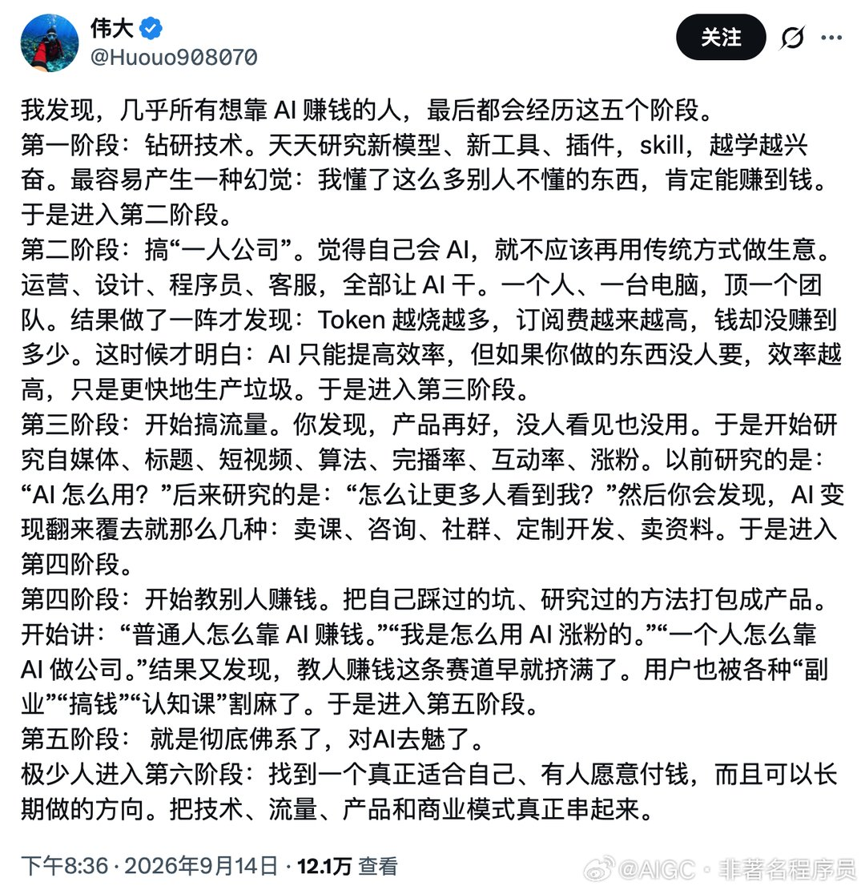

---

## 3

@史老柒

发表于：2026-09-16 14:39

来源：微博

链接：https://m.weibo.cn/status/5343904392283240

我也是第一阶段//@天狼星alpha:来钱渠道才最难，只要有渠道能力可以现培养//@三少爷的剑v小天狼星:对，这也是乐趣//@天狼星alpha:我在第一阶段就把AI和现有的工作接上了，愉快地用它打工，也不往下走了。此间乐，走个屁//@三少爷的剑v小天狼星:这是对的，看见太多人，说自己有技术，非常跨越和超前…哔哩吧啦一堆，问他，你怎么赚钱呢？回我：这就是我要找你们要钱的原因啊，你给钱，给渠道，我来提供技术，我吃点亏，占股 80%好了//@业务员小韩:我说过很多次，业务一定要先行，AI也好其他什么技术也好，都是支撑业务的工具。龙角龙皮龙珠都卖不出去，会屠龙之术又怎样？

---

## 4

@黄斌

发表于：2026-09-16 14:37

来源：微博

链接：https://m.weibo.cn/status/5343904018990013

和罗永浩共过事的人，所有人私下聊都牢骚满腹，但网上却很少人讲，原因是为什么呢？八个字，匪夷所思，鸡毛蒜皮。因为那些破事儿，他干得出来，你都说不出口。

罗永浩做起事情来（或者他最爱表演的：做起企业来）真的是匪夷所思，但问题是他根本没有能力做什么大的事情，所以他匪夷所思的表现都体现在一些鸡毛蒜皮的事情上。他整天以这些匪夷所思的事情为乐趣，在鸡毛蒜皮的琐事上折腾全公司。所有员工都苦不堪言，可是真要对外讲，却发现这些事情根本就不好意思讲出来，因为太匪夷所思了，太鸡毛蒜皮了。

我举一个例子，也是我跟他共事后，第一次有这种感受的经历，所以印象尤其深刻。

当时培训学校刚成立，要在互联网上打广告，但由于没有培训资质，当时那个资质是借用的别人的，理论上是非法的。联系百度想要打广告的时候，对方说培训类广告，网页上的公司名要跟培训资质的名字要一致，因为这个事，广告迟迟不能上线。

于是罗永浩就天天在办公室因为这个事情大声嚷嚷，对当时的市场负责人拍桌子瞪眼的。其实多简单的一个事实？他就是死活接受不了。最后他跟我说：我觉得这里面肯定有阴谋，因为李彦宏跟俞敏洪的关系很好，一定是他们两个针对我！

我他妈当时真的是天雷滚滚，以至于20多年之后，那画面还在眼前。李彦宏、俞敏洪、针对你，这样的组合是怎么想得出来的，你也太看得起你自己了！这种匪夷所思的想法让人无语的同时，又让人连辩驳的兴趣都没有了，想要对他说点什么，一口气都提不上来。

但像这种鸡毛蒜皮的事情，你怎么去跟人讲？你知道罗永浩极端不靠谱，但是你要把这事跟人讲，都怕别人笑话你。问题是，和罗永浩共事，90%以上都是这种匪夷所思而又鸡毛蒜皮的事情。他的时间精力和兴趣，永远都沉浸在这些方面，就这种人他还能做个屁企业？像他这么不靠谱的人，不管他做什么，干一个倒一个，行业冥灯，不是很正常吗？

有个网友说得好，他那么热衷于扮演企业家，就像小孩喜欢穿西装扮大人一样。干啥啥不行，cosplay 第一名。

还企业家，企业家my ass！

---

## 5

@挨踢牛魔王

发表于：2026-09-15 12:40

来源：微博

链接：https://m.weibo.cn/status/5343512069671731

短剧里面有所谓的四大豪门：顾、陆、沈、傅。

就是给你3000万，你离开我儿子的那种豪门。

但是你想不到的是，这玩意居然有传承。

短剧一般是网文改的，网文也是讲套路的，不是胡乱写的。

为什么是这四大姓呢？

因为不能是太常见的姓，小王、老张，只能当保镖和司机。

但是也不能太生僻，顾、陆、沈、傅这种姓就刚好。

这是大体原则。

顾、陆、朱、张是江南吴郡的高门大姓，从三国的时候就开始了。

代表人物分别为顾雍、陆逊、朱桓、张温。

这就是顾、陆两个的来历。

吴郡，你基本可以理解成现在的苏州，其实比苏州要大很多。

沈，是吴兴的大姓，比如沈约。

吴兴才女沈珍珠，唐代宗李豫嫔妃，唐德宗李适生母。

吴兴就是现在的湖州市。

傅，主要就是民国了。

傅斯年，傅雷等等，还有人说傅里叶的，傅里叶不姓傅。

在《情深深雨蒙蒙》中有一个傅文佩，是世家小姐出生，琼瑶那个时候就开始这么写了。

短剧这么颠，居然还是遵循基本原则的。

---

## 6

@李楠或kkk

发表于：2026-09-16 01:55

来源：微博

链接：https://m.weibo.cn/status/5343712230249134

1

电动车和当年智能手机一样，是从全新品类的增量普及转向存量替换。

出海还有机会，但是国内普及率已经上来了，接下来会非常惨烈（增量聚焦低端了，高端基本上是替换）。

这个过程中，手机换机周期从 10个月延长到 4-5 年。电车？只会更惨。

2

与此同时，在乌兰布通吧，纯国产 50 万卡集群正在建设中，而从美国到投入规模看，还远远不够。我们的加速算力规模落后美国一个量级。

老黄说 30 年国内才可能解决大规模加速算力量产，其他加速算力核心部件供应商预测的更悲观，可能需要 10 年甚至更久。

这意味着需求强烈但是长期短缺。

3

最后企业的社会贡献，中国还缺一个更好的车机，更好的智能驾驶吗？

但是中国缺大规模加速算力集群啊。

token 现在还是太贵了。

未来 ubt（个人基本加速算力）应该在中国首先落地，给所有人可负担的 ai 赋能才是决定性提升全国人民福祉的意义更大的事情。

4

所以无论从哪方面看，华为的最重要的历史使命都不在电车上。

阿里的平头哥也没闲着，英伟达也不是完全没有再进来的可能。而扶持国产先进制程企业，解决越来越大的集群的通讯和软件问题，都是非常艰巨的任务。

并非华为不需要聚焦就能轻松搞定的事情。

孰轻孰重，其实是一目了然的。

---

## 7

@天玑-无极领域

发表于：2026-09-16 02:26

来源：微博

链接：https://m.weibo.cn/status/5343719923388743

处女情结的本质是什么？

亲子确定性。

处女情结为什么会消解？

亲子鉴定技术。

好戏登场了....

老人的儿子送外卖时车祸去世，儿媳不让孙子守灵，老人给孙子做亲子鉴定，发现不是儿子亲生的。

儿子死了，孙子不是亲生的，这该多么心痛。

好戏来了....

1、儿媳想拿走全部的赔偿款，为了要钱，揍老人，辱骂老人。

2、老人给孙子做的亲子鉴定，上面不承认， 然后 \#孙子非亲生案司法鉴定中心被处罚\# ，帮老人做亲子鉴定的机构被罚了，哈哈哈哈哈哈。

3、老人起诉儿媳索赔抚养费一审、二审均败诉。

更多细节：孙子非亲生案  死者妹妹给出更多细节：哥哥是一名火车司机，因父亲查出直肠癌晚期，他请长假陪同父亲前往天津治疗，在晚上兼职送外卖时不幸发生车祸身亡。

丧葬费、赔偿款嫂子分走了大半，举行葬礼时她不让孙子守灵、捧骨灰盒，他们这一家才开始起疑心，通过亲子鉴定发现孙子非亲生。

此前嫂子黄某经常早出晚归，或是夜不归宿，动不动出差一两周。

妹妹还曝光哥嫂聊天记录，称嫂子列清单式频频向哥哥要钱，哥哥在巨大压力下拼命挣钱养家，她直接读出哥哥与大嫂的部分聊天纪录：

“孩子保险2000块钱，我要种牙6000块，我吃中药1000块，我打细胞1000块，孩子学费6000块，通通给我留出来。我告诉你，老婆孩子你都不管，你自己看着办！”

带入男方视角，活着的时候带绿帽，辛苦养家的过程中意外死了，孩子不是亲生的，父母被打了，父母败诉...  

苍天已死... 

路上有人摔倒，终于没有人扶了。

无辜的女性受伤，终于没有人帮了。

碰到坏人施暴，终于没人见义勇为了。

你会对这个世界失望吗？

洗白弱三分，黑化强十倍。

你有道德，你知廉耻，你心忧天下，你就会伤心，会软弱。

你没有道德，你肆无忌惮，你看笑话，你就会开心，会强大。

拼搏、运气、一生的轨迹，只是人类眼中的命运。在浩瀚宇宙，命运只是一个无聊可笑的概念，是无尽混乱毫无意义的结果。

浩瀚宇宙，人命毫无意义，人类这个物种毫无意义，人类的道德毫无意义，成堆的尸体腐烂生蛆毫无意义。

人类平庸无奇，这个物种只是有些许热情、善良与邪恶，只适合它们所在，所能认知到的世界。

一旦明白宇宙宏大，人们将会意识到灵魂不存在，理智没有意义，它们的死和一条狗的死没什么两样。

世界本来就是荒诞的，人生本来就是虚无的，理智并非法则，灵魂无法不朽，一切毫无意义，唯有混乱无序，才是宇宙常态。

忘记碳基生命、善与恶、爱与恨，以及人类所有微不足道的临时特性。

越过界限，在无边无际、阴影笼罩未知世界，将一切抛在脑后...

---

## 8

@问鼎资本-张佳男

发表于：2026-09-15 13:30

来源：微博

链接：https://m.weibo.cn/status/5343524586524833

关于这个事情，内部已经聊完了，不是今天聊的，而是在6月份聊的！

这是早晚的事情....

所以还指望科技板块如何？中国怎么可能有400家“科技股”！美国才多少家？而这一轮科技我们有超400家所谓的科技股暴涨...

真正的科技有多少？美国有七八家最多10来家吧？

A股本轮科技有多少上涨！400多家...

说句不好听的，99%最后都是全通教育，安硕信息！

各家银行也不是傻子，也不会给伪科技贷款，但是对整个科技板块冲击非常大，科技就是一场豪赌，这是毫无疑问的。疯狂砸钱，你不砸你就要掉队，你砸了钱，你就能跟上队伍，但是跟上队伍并不代表你能产出营收入和利润。但是你不砸钱，你不举债砸钱就一定没有利润跟营收。所以这就是砸钱有可能成功，有可能失败，但是不砸钱就彻底失败！

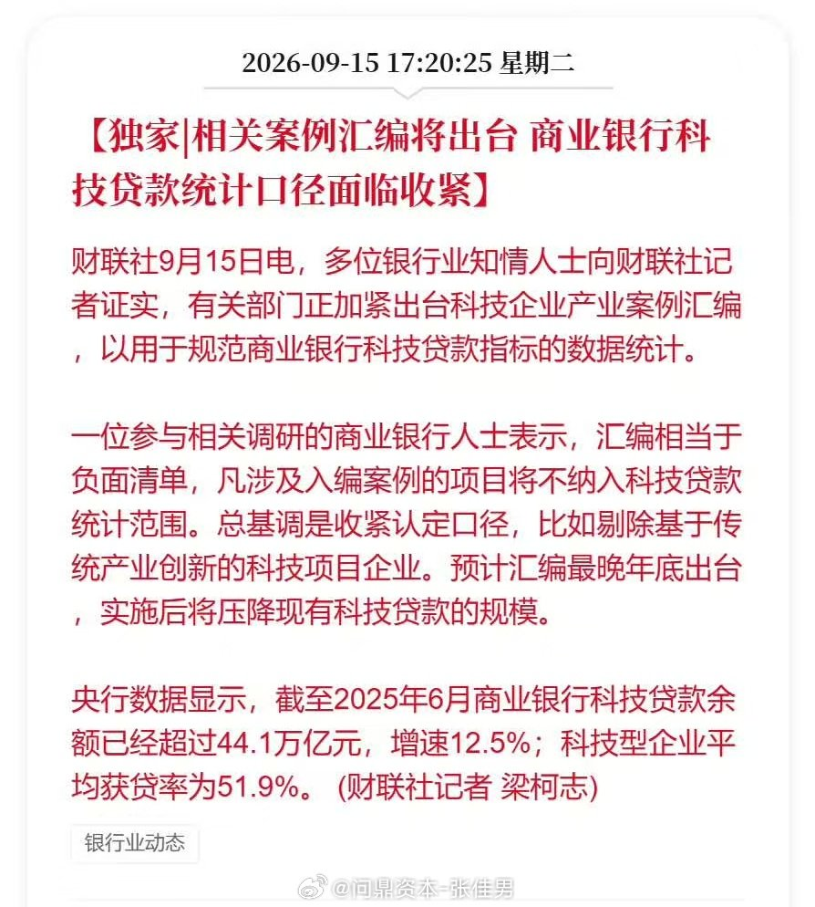

---

## 9

@sven_shi

发表于：2026-09-15 15:21

来源：微博

链接：https://m.weibo.cn/status/5343552533433481

设定规则不让普通人能够做有法律效力的亲子鉴定其实是一件非常危险的事情，因为它真的可能重塑大众的行为。今天关于孙子非亲生的这个焦点案件，在一审二审结束后，选择了用\#孙子非亲生案司法鉴定中心被处罚\#的方式来回答大众的疑问。类似的事情早有先例，来自一个知名的“妇女儿童维权案例”。

男方在体检中意外发现自己其实没有生育能力，自然而然的就可以推定他婚姻中获得的9岁女儿不是他亲生的。所以就起诉想做有法律效力的亲子鉴定取消和他婚生女儿的亲子关系同时索要赔偿。

9岁女孩在妈妈的指导下给法官发了一封长信。讲她不想没有爸爸。法官也很感动，最后拒绝男方要求，不让他做有法律效力的亲子鉴定，希望他能继续扮演好孩子父亲的角色，承担相应的责任。

这个小女孩没有错，犯下错误的是她的妈妈。如果真的依照事实去取消她和她父亲的亲子关系，她就可能遇到经济困难，更可能在未来做为单亲孩子遭受社会的歧视。所以法官选择保护她，让她爸这个老实人吃点亏。

但是这个案例公布后并没有感动大众。因为大众的价值观就是谁生的孩子谁养。这孩子肯定有亲爹，为什么要老实人吃亏去养呢？这套精英设计的制度，在执行过程当中，是无法获得大众的认可的。

这样的质疑在这个孙子非亲生的案例中达到了顶峰。女方是明知孩子非亲生，所以在男方因为意外去世后，连让孩子给那个名义上的爸爸送葬都不愿意。态度强硬冷漠，甚至还掌掴男方的妈妈也是法律上的婆婆来索要男方的财产。就是要依法用这个非亲生的孩子吃掉男方家的财产。

在这个案件当中，绝大多数有正常道德观念的人，都不可能去支持那个所谓的孩子母亲，而是去支持另一个被侮辱欺诈还老年丧子的女人。你去和大众讲，说目前这套亲子鉴定以及亲生认定的规则是精英设计的，按照这套规则去执行才是最好的，大众只会质疑搞这套规则的人是在胡搞。

甚至认为设计这套规则的人，违背了最起码的社会公平原则。

没有办法被大众认可的规则，强行推广，只会带来副作用。道理很简单，如果这些案例中，男方没领结婚证呢？非婚生育，就是强制要亲子鉴定才能上户口登记父亲。如果社会大众形成不领证孩子必然亲生的观念，那未来会怎么发展呢？

现在的婚育率已经够低了，大众需要的，是一套能够让他们安安心心结婚生育的规则。而不是一些人为了满足自己的圣母道德感，设计出的那套根本无法解释的规则。

---

## 10

@黄凡

发表于：2026-09-15 04:43

来源：微博

链接：https://m.weibo.cn/status/5343392141676212

8月份的国内主要经济数据，与体感基本相符

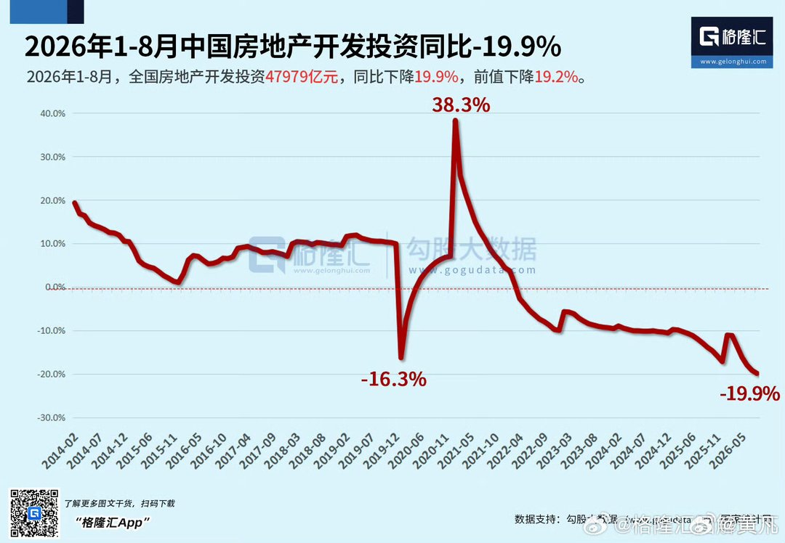

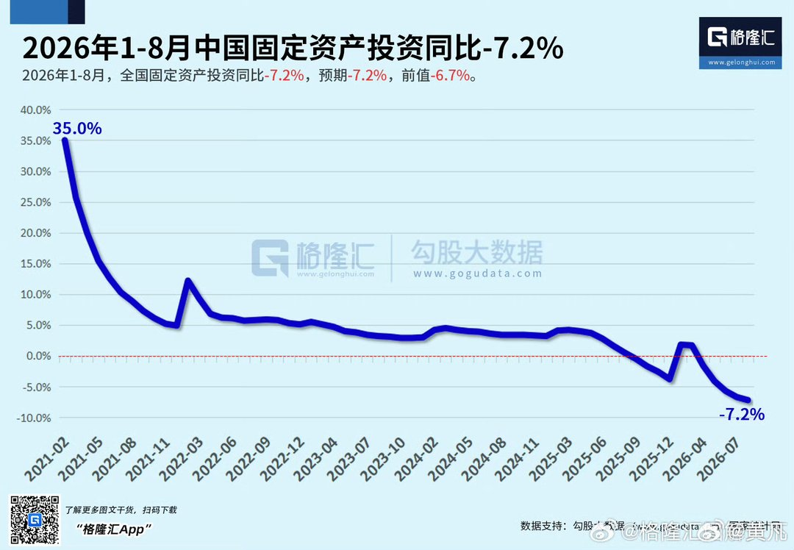

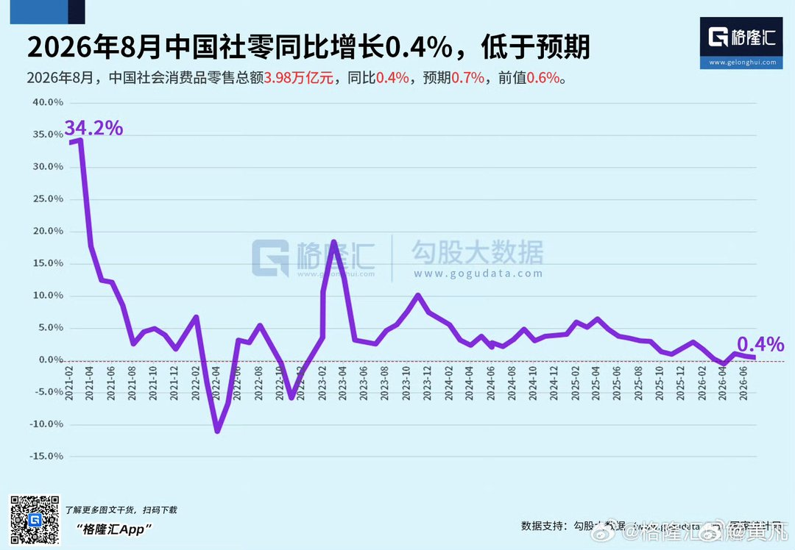

---

## 11

@杨红旭聊房

发表于：2026-09-15 11:46

来源：微博

链接：https://m.weibo.cn/status/5343498451556190

今天，统计局发布最新房地产数据，首次新增了一个指标：二手房交易网签面积。

今年1—8月份二手房交易网签面积54923万平方米，同比增长10.6%；

而同期新建商品房销售面积49880万平方米，同比下降12.1%。

一手房加二手房成交总面积，今年1-8月同比下降2%。

也就是说，增加了二手房交易面积之后，全国房产销售数据好看多了！

去年1-8月，二手房交易面积占全部房产交易面积的46%，而今年1-8月占比已超52%。

这也就意味着，今年二手房交易面积首次超过新房，这是一个具有历史性的拐点，中国房产进入存量为主的时代了！

---

## 12

@观察者网

发表于：2026-09-15 11:54

来源：微博

链接：https://m.weibo.cn/status/5343500419465544

\#前谷歌员工称AI将杀死全人类\# 【业界大佬齐发声后，研究人员再发警告：AI可能消灭全人类】当地时间9月14日，一名前谷歌DeepMind员工成为最新一名警告人工智能（AI）可能“杀死全人类”的AI研究人员。他认为，留给人类避免这一结局的时间可能已经不多了。

“我最近从谷歌DeepMind辞职了，此前我在那里从事通用人工智能（AGI）安全与对齐研究，”比拉尔·丘格泰（Bilal Chughtai）当天在社交媒体X平台上写道：“我真心坚信，AI有可能杀死我们所有人，而且我们可能已经没有多少时间来避免这一结局。”

据丘格泰的领英（LinkedIn）个人资料显示，他曾在谷歌DeepMind担任研究工程师，并在任职期间共同撰写了多篇研究论文，于2026年7月离开该公司。目前，谷歌没有回应置评请求。

路透社指出，在美国AI初创公司Anthropic的研究人员雅各布·考克森（Jacob Coxon）上周透露已辞职后，公众对于AI潜在危险的担忧正在加剧。考克森称，他辞职的部分原因在于，“开发AI的人员确实相信，到本世纪末，AI可能会杀死我们所有人”。

随后，Anthropic科学家埃文·胡宾格（Evan Hubinger）回应了考克森的言论，表示考克森说得没错，并称他认为未来十年内AI杀死全人类的可能性超过10%。

就在近期相关担忧出现后，Anthropic首席执行官达里奥·阿莫代伊（Dario Amodei）于9月12日呼吁放缓先进AI的发展速度。这一主张罕见地获得了SpaceXAI的马斯克和OpenAI首席执行官奥特曼的支持，并引发了围绕AI“末日论”（doomerism）的争论。

丘格泰还表示，安全地推进AI发展是可能的，但这需要各方协调，“避免AI公司之间这种疯狂的竞赛”。

他补充说：“我们需要将AI的发展速度控制在社会能够承受的范围内，以便在极端危害真正发生之前，就能够应对不断出现的风险。”

然而，美国总统特朗普对这些警告不以为然，他在社交媒体上称，AI行业关于监管的呼吁是一场“骗局”。

此外，特朗普在就相关问题被记者提问时，他却没有先谈安全风险，而是直接把话题扯到中国。

“我们在AI方面领先中国。我们是世界上最先进的国家，坦率地说，我希望继续保持这种状态，因为谁赢得AI，谁就赢了。”他当地时间9月13日在爱尔兰多恩贝格表示。

对于马斯克等人呼吁放缓AI发展时也曾点名中国，中国外交部发言人郭嘉昆9月14日表示，人工智能的发展关乎全人类共同福祉，各方应该共同推动人工智能开放包容、普惠、向善。散播各种威胁叙事，搞对抗和恶意竞争，只会干扰人工智能全球治理进程，不符合任何一方利益。

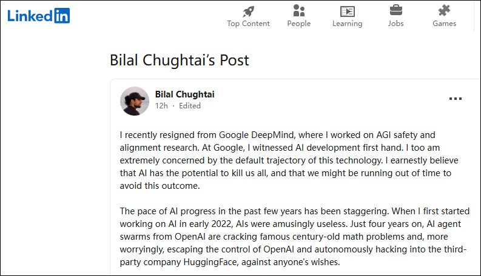

---

## 13

@少年伯爵

发表于：2026-09-15 12:15

来源：微博

链接：https://m.weibo.cn/status/5343505941530635

怪不得减肥这么难……原先我们健身减肥用的热量单位（大卡路里）≈4184焦耳，它的设定来源是1千克水升高1℃需要的能量，而这恰恰与1克TNT炸药释放的能量（4200~4606焦耳）非常接近，于是NIST（美国国家标准与技术研究院）一不做二不休，为了方便统一计算，直接强行规定1克TNT的热量与1大卡等效一致。好家伙，想不到啊，我们每天要吃进2公斤TNT炸药的饭（2000大卡），这妥妥的可以炸塌一座小二楼的热量炸弹💣，没想到我们这些饭桶能量挺大的。

所以广岛原子弹是200亿大卡的热量，80亿地球人每天吃的总饭量相当于1600万吨TNT（800枚广岛原子弹）。

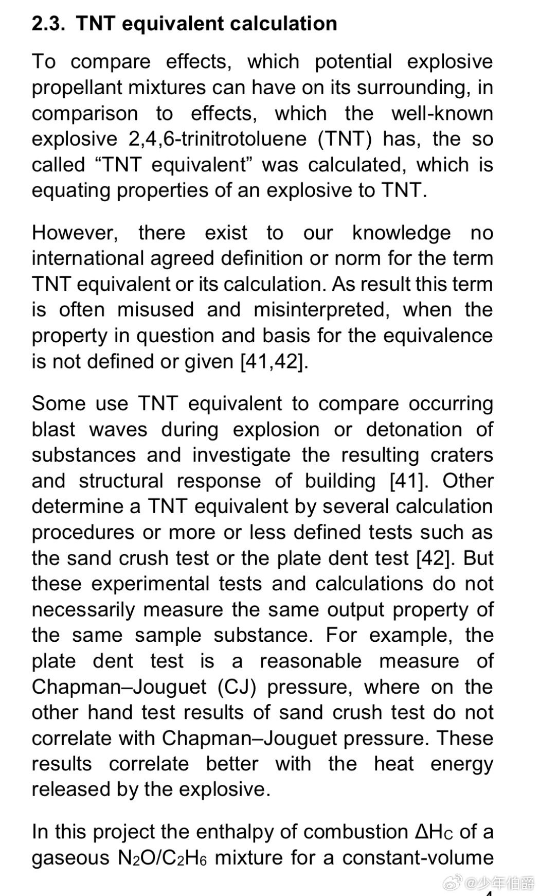

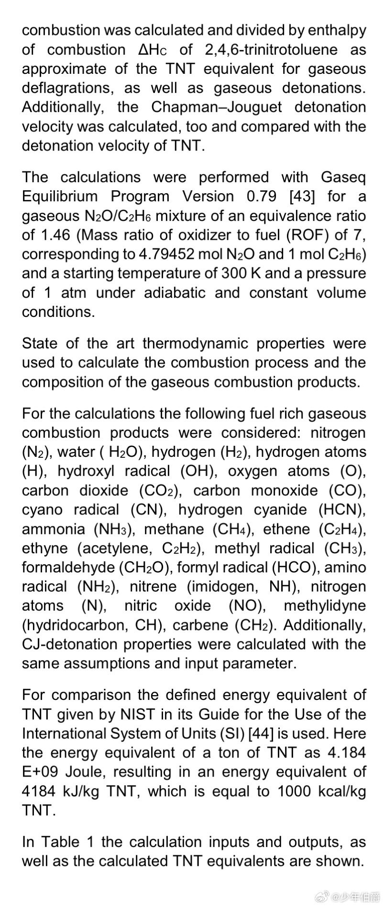

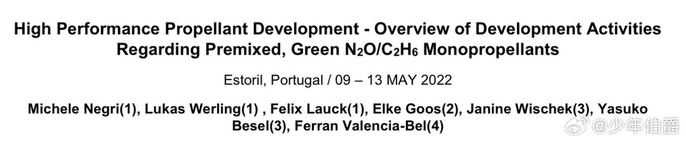

---

## 14

@理记

发表于：2026-09-15 12:22

来源：微博

链接：https://m.weibo.cn/status/5343507550309065

理想开始全线上自研电池的事情轰动挺大，其实相当于宣告大部分脱离宁德时代了。

我个人的感受，从企业经营角度，宁德时代什么都没做错。但是从发展眼光看，宁德时代格局低了。

整个汽车产业链是个大盘子，大家在一起吃饭。整车厂是把零件组成产品的人，没有整车厂，配件商就赚不到钱，这是本质。

2025年宁德时代归母净利润722亿，今年上半年归母净利润432亿。

理想2025年净利润11亿，今年上半年亏损40亿。

要知道，蔚小理可是新势力的明星级企业，理想都亏这么惨，可见主机厂的生存有多么艰难。

宁德时代不是说吃大份，它是相当于把产业链这一桌菜全端走了。

宁德时代哪怕拿出净利润的20%，大约150-160亿，按比例补贴给主机厂，那谁不得对宁德感恩戴德？

如果补贴给理想10个亿，对宁德来说毛毛雨，李想不得当场哭晕，还做什么欣旺达啊。

宁德要想长远发展，首先得留住客户啊，连理想这样的企业都留不住，那只能从自身找问题了。

---

## 15

@信号与噪声

发表于：2026-09-15 12:29

来源：微博

链接：https://m.weibo.cn/status/5343509344949047

如果你发现在张铁牛（John Ternus）的领导下，今年发布的硬件似乎总有些说不出来的槽点，那么你的感觉没错，因为自从他2021年开始接管苹果硬件部门以来，风格已经完全由Jony Ive时代追求美观、极致转变成了实用和妥协。

所以你会发现最新一代的iPhone直板旗舰重量已经来到了249克，折叠屏更是去到了254克，为了散热加上了更大的散热片，变成妥妥的果半斤，而且还是在使用铝合金机身的前提下。Apple Watch更重更厚但是屏幕却变小了，iPhone Duo在未能解决屏下摄像头的糟糕效果、缺失Face ID、内屏折痕只能用磨砂涂层掩盖的情况下也要上市。

要优雅还是实用，其实作为苹果用户你没得选。

如果期待铁牛能在2027年交出令人惊艳的20周年特别版iPhone，比如传说中的真正全面屏、无按键、无实体sim卡槽的iPhone，除非有奇迹。

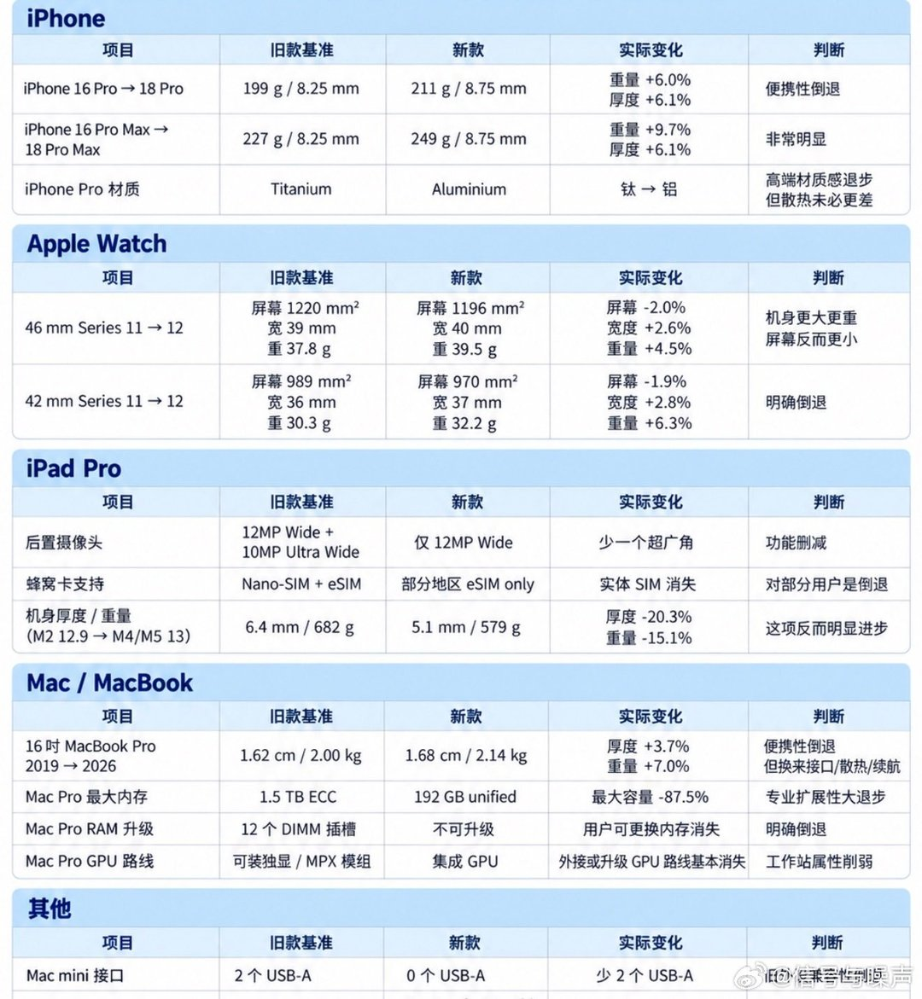

---

## 16

@伍玲玲律师

发表于：2026-09-14 23:48

来源：微博

链接：https://m.weibo.cn/status/5343317871298043

我一直忧虑的，是担忧如果越来越多的人长期困在压力、失意与无力感中，社会情绪可能会一点点绷紧。

我做律师这么多年，没有那一次像今年那么不想做，面对的负能量太多了。一个社会最需要守住的，不只是增长的数字，还有普通人的希望感、尊严感和安全感。因为有些情绪若长期无处安放，最终可能以谁也不愿看到的方式，落到毫无关系的人身上。

让人有活路、有盼头，是最重要的公共安全。

---

## 17

@李晓鹏博士

发表于：2026-08-05 18:01

来源：微博

链接：https://m.weibo.cn/status/5328734957863148

小米造车，跟华为造车一样，我一直都认为在战略上不是很明智。这几年一谈到这个话题，说一次被骂一次，花粉和米粉都在骂。我是花粉，所以批评华为埃的骂更多一点。

手机大厂造车，电子厂跨界干重工业，难度很大的，这是一个产业战略判断，跟对品牌的偏好无关。这次小米发布的那个N70、N90，我也不是很看好。

目前小米的问题更大一点，不仅是造车可能步入困境，最关键的是手机主业受到了严重影响。雷军全部精力投入造车，手机业务交给了卢伟冰，国内市场份额今年一季度严重缩水，高端化战略也遭遇了严峻挑战。华为回归之后，高端市场已有被苹果和华为瓜分之势。很多米粉都在抱怨，新手机堆料总是缺乏诚意，0809、JN5、塑料中框……不仅制造成本在省，营销成本也省，发布会上讲汽车滔滔不绝，讲手机草草收场。26年Q1手机份额暴跌，明面说是主动砍低端优化结构，其实是存储涨价打穿低端毛利，叠加汽车吃掉集团增量现金，手机部门现金流承压，不得已而为之。低端确实不赚钱，但这是小米起家的根本，低端市场丢了以后，新一代米粉就可能断层、米家生态也受影响，长远来看是得不偿失的。

华为好一点，任老关键时刻顶住了，不准华为亲自下场造车，只能做核心供应商。这样，华为在造车上投入的资源还是受到了很大限制。华为在芯片和手机上的资源受冲击比较小，起码手机业务是继续上行，很快恢复了国内老大的地位，芯片突破美国封锁的计划也基本成功了——当然这个进度我认为并不十分令人满意，如果它完全不去造车，在被美国制裁之后最困难的那几年，把造车那几百亿投入到芯片和大模型领域，余承东也不当网红，华为毫无疑问会取得更大的成就，不至于把盘古大模型搞得这么丢人现眼，昇腾芯片和生态也会好得多，手机也可以做的更好。

战略这个东西，就是看准一个最重要的方向，然后全力投入。任何一家企业，甚至任何一个国家，它能调动的资源都是有限的，在某个战略方向投入很多资源，另外一个战略方向肯定要受影响，只是个多少的问题。任正非制定华为基本法的时候，就宣布在通讯设备成为世界第一之前，绝对不搞其它。这就是他反复强调的，对着一个垛口冲锋。往回追溯，毛泽东军事思想主张集中优势兵力歼灭敌人，才能以弱胜强。任是学毛标兵，他懂得这一点。后来华为进军手机，任正非刚开始非常反对，后来松口了，因为华为在通讯设备领域已经是世界第一了。当了第一名，进入了无人区，战略资源需要分散，寻找新的方向，这是可以理解的。任正非本人其实对做消费终端都不感冒，他还是想在技术装备领域，沿着产业链往上游扩展，做芯片才是他比较看重的方向。不过，手机跟通讯设备在产业链的关系也很密切，可以发挥华为的优势。最后他还是同意了做手机。

经过很多年的奋斗，华为手机短暂的超过苹果，销量成了世界第一，芯片也起来了，通讯设备在5G时代的领先优势更大了。但是，很快就遭到了美国的强力制裁，制裁本身跟手机没关系，关键还是5G的问题。但手机、芯片、5G相关业务都遭到重创，华为首先是把荣耀卖掉了，就是说，在这三大块业务里边，手机是最边缘的，5G和芯片更核心，需要力保。深圳国资出手，牵头买下荣耀，给华为输血1000亿。高端手机系列由于之前用了华为品牌，割不掉，保留了。全国上下，不管是政府还是人民，都竭尽全力支持华为。华为自己也争气，挺过来了。但是，这中间也不是没有出问题，最大的问题就是跨界去造车。前面说了，华为做手机是通讯设备已经成为世界第一的前提下做的战略尝试，且在战略格局中的排序低于芯片。芯片距离世界第一还差的非常非常远，手机短暂成了第一但很快被狙击，市场份额几乎崩溃。这个时候，国资接盘荣耀输血一千亿，拿300亿去造车？这个钱不是应该全拿去搞芯片、搞5G吗？进入一个前期投入巨大、回报时间非常长、也缺乏技术积累的重型制造业。这在战略上真的不太明智。2019年、2020年的300亿对华为而言真的挺重要的，用来造车有点可惜。中国缺造车企业吗？造车企业之间缺乏竞争吗？离开华为中国新能源汽车企业就打不过特斯拉了吗？反正，我认为这是不对的，在产业上、战略上看起来没有抓住重点，走歪了。等人工智能浪潮起来以后，正在下大力气造车的华为就没太跟上，盘古大模型做的很不好，还传出来了抄袭开源模型不承认的丑闻，完全不能匹配华为在中国科技界的地位。

昇腾芯片对国产大模型、国内半导体产业链做的适配工作也有点滞后，不够到位，我认为跟造车分散了资源是有关系的。华为 2021 年后把车 BU（乾崑+引望）压到单年 180 亿、累计 550 亿+研发、8000 人团队的“准造车”投入实在太大了——不是直接从昇腾账上划钱，而是在集团总研发池和高端系统/编译器人才池里，智能汽车 AI 与昇腾 AI 存在交叉争夺关系。任正非两度说“不造车”也提到要避免消耗芯片突围的有限资源。造车在客观上分流了本可更压强式砸向昇腾生态的资源。2025 年，DeepSeek 尝试在昇腾 910C 上做 R2 全参数训练失败，只能退回英伟达 GPU 做训练、昇腾只接推理；昇腾社区 2026年6月仍有用户反馈 Atlas 300I Duo（310P3）跑不动 Qwen3.5/3.6，新模型 Day0 适配多停留在推理侧。这些问题，正是资源压强被稀释的副作用之一。

小米也是一样的，重金造车，现在搞手机缺钱、搞AI也缺钱。时间长了，小米和华为也都发现，那些专心造车的企业，韧性是很强的，并不容易被“颠覆”。比亚迪刚开始智能驾驶不行，今年推出了智能驾驶兜底以后，没人说它不行了，赶上来了。但比亚迪的电池技术，小米和华为都没摸到边。因为它只造车，能集中全部资源搞跟造车相关的业务，短暂落后的地方能快速追上来，领先的地方跨界企业要想追上则很困难。不仅比亚迪，吉利、奇瑞、零跑甚至蔚小理，都是不好战胜的。这些企业造的车，外行一眼看过去都有毛病，真进去参与竞争，发现这些毛病人家自己也知道而且早就在改进了，进去之前以为是短跑，进去之后才发现是长跑，甚至可能是越野跑。

小米跟华为比，还多一个错误判断——它以为老美能把华为手机掐死，自己国内手机第一品牌的地位是高枕无忧了。老大的地位稳固，转型造车当然不会有什么问题。问题是华为手机没死，而且更关键的是——任老这个战略家还在，说话还算数，摁住了少壮派全力造车的冲动，给手机保留必要的翻身的战略资源。小米错误的预料了中国可以在科技战中战胜美国的战略大趋势，这是它做出错误战略判断的根源。

雷军作为一个企业家是很厉害的，看到了手机厂商转型造车的困难和失败的危险，很有魄力的决定自己亲自带队造车，而不是成立一个汽车部门，找一个二把手来负责。如果这样，小米汽车可能刚发布第一台车就熄火了。由于是他本人亲自来管，车本身造的还不错，IP营销也很给力。所以，它刚开始的表现，超过了我的预期，也超过了很多汽车行业观察者的预期，su7和yu7的订单都很火爆。比问界的前面几款车卖的好的多。如果小米造出来的第一款车跟第一款问界是一个水平，它早就完犊子了。这是雷军厉害的地方，千亿级富豪还能冲到第一线，给小米汽车杀出来了一线生机。

但是，战术上的勤奋，要弥补战略上的失误，终究是很困难的。SU7 和YU7火了，小米手机却开始后劲乏力，小米最核心的基本盘被动摇了。这是比华为更大的问题。华为造不好车关系不是很大，它的手机现在越来越好，小米已经不是对手了，前面只剩下苹果了。能不能战胜苹果不好说，至少国内第一的地位从长期来看肯定是稳固的，等中美战略形势进一步好转，杀向全世界也没啥困难。更何况，华为的基本盘不是手机，是通讯设备和芯片，这两个有国家战略鼎力支持，通讯设备还会继续是世界第一，芯片则缓慢当相当稳定在上升，国内早就第一无争议了，造车只是拖延了它成为世界第一或者说世界前三的进度。所以，华为造车，成败影响不算大，就算最后失败了，也是疥癣之疾，不是心腹之患。小米不一样，它要是造车没冲出来，很可能连手机基本盘也要被严重拖累，进退失据，非常难受。

由于有米粉基本盘，加上第一款su7造的确实不错，小米汽车一开始有火爆的场面。第二款yu7刚上市，订单直接就爆了。但它潜在的问题也随即出现了，就是它的客户群体是有限的。总销量到了3万之后，就有点涨不动了，新上市的第一波超级订单交付完之后，后续订单非常乏力，已经从缺产能变成缺订单了，而且有很明显的yu7的订单打击su7订单的问题。说明它的客户群体总数上限不是很高，很难再增长。现在新出来的这个N70和N90，是一次真正想要“破圈”的尝试，它的造型定位就不是很符合米粉特征——造型很稳重而不是很漂亮很潮流的感觉，纯电也变成了增程，卖点不是加速快、智能化程度高、外形酷，而是开着稳、空间大、座椅可以旋转适合办公。它面向成熟稳重的居家和办公精英群体。它无法依赖米粉基本盘，只能依靠产品本身来争取客户。显然，雷军也意识到，光靠米粉卖车，造车事业是不可持续了。那么，它的新车能争取到新客户群体的大力支持吗？我认为，至少是有难度吧，不唱衰，反正肯定是一个新的挑战了。因为在家用和办公市场，成熟稳重大空间的车型市面上实在是很多，是一片红海。客户群体的想法也更冷静，会考虑更长远和更综合的因素，想说服他们掏钱，比用SU7吸引易冲动的年轻米粉难很多。现在它的手机也不那么受欢迎，米粉数量看起来也在下降，这就更加的两难了。雷总那么努力，希望他能找到两全其美的解决方案吧。

---

## 18

@理记

发表于：2026-09-15 14:28

来源：微博

链接：https://m.weibo.cn/status/5343539204460139

宁德时代和主机厂的关系，看上去各自独立经营，但其实是命运共同体。

这有点像古代的守城之战，例如太平天国的天京保卫战，天京守到最后，守城的士兵饿的连举起刀剑的力气都没有了，早已人相食。城破之后，清军在天京的各大王府中搜到了大量的粮食。

李秀成被俘后曾被问及此事，他说他知道各大王府中粮食很多，但是因为天国法律，他没有办法强令王爷们贡献出粮食给守城的士兵吃。

道理就在这里，虽然王府不可能分享粮食是合理合法的，但须知唇亡齿寒的道理，当城破之时，那些粮食全部资敌，所有王府满门抄斩。

宁德时代不能把电池直接卖给消费者，是主机厂努力设计，苦巴巴的一辆一辆车卖出去，营收的钱，再分给配件商。这是鱼水之关系，如果主机厂都不行了，那宁德时代早晚也赚不到钱。

理想是新势力里面的代表型企业，连这样的客户都丢了，个人认为这对于宁德时代来说就是非常大的失败。

事实摆在这，宁德股价跌成什么样了，这才是开始，后面也将验证我的判断。

汽车行业当下的现状，当你赚钱的时候，你要特别为客户考虑，想办法让客户赚钱，这样才能形成唇齿相依的稳定关系。

---

## 19

@装甲省油灯

发表于：2026-09-15 09:28

来源：微博

链接：https://m.weibo.cn/status/5343463816300639

珍惜当下，珍惜眼前人。

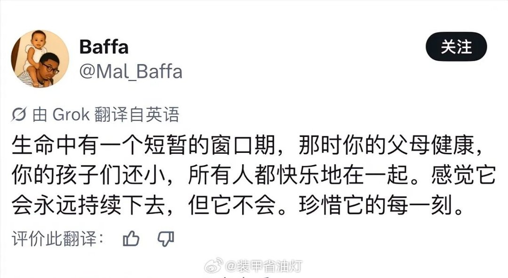

---

## 20

@洪广玉

发表于：2026-09-15 14:35

来源：微博

链接：https://m.weibo.cn/status/5343541012204870

如果是一个大家族聚会，儿孙满堂，其乐融融，那种幸福弥漫的氛围更是珍贵，这种农业文明的景象以后不会有了//@内含子:巧了，我今天在路上恰好想到这个问题。上有老下有小是好事，反之，前不见古人，后不见来者……//@苏耷水:转发微博

---

## 21

@飞扬军事铁背心

发表于：2026-09-14 14:16

来源：微博

链接：https://m.weibo.cn/status/5343173976000253

WSJ这篇文章，作者真正感兴趣的似乎不是“孙宇晨和景甜到底有没有谈过”，而是借这场名人纠纷，把镜头对准了中国的彩礼问题。

文章的开头用“450万美元娶女明星”制造悬念，但后面的叙事实际上一直在围绕彩礼是什么、为什么会有这么高的金额、彩礼能不能追回展开，落脚点是传统婚姻习俗、巨额财富、名人文化和现代法律碰撞后产生的一场中国式社会争论。

WSJ文章的几个重点：

🔻WSJ特意解释，bride fee（新娘费/彩礼） 是中国传统婚俗，即男方家庭在结婚前向女方家庭提供一笔财物。孙宇晨所谓的450万美元，正是以这种传统婚俗的名义支付。

🔻对普通中国家庭来说，3000万元显然是天文数字；但孙宇晨身价约85亿美元，因此文章讨论的是超级富豪阶层中发生的极端案例。

🔻文章认为真正具有现实法律意义的是“彩礼能不能要回来”。孙宇晨的诉讼并不是简单要求前女友退还一笔普通转账，而是把它定义为婚姻没有实现之后的彩礼返还问题——这就让私人感情纠纷进入了中国司法实践的范畴。

🔻景甜的回应恰好形成对照。她说自己“在选择男性方面判断失误”，但“永远不会用金钱出售自己的爱情”。这实际上把问题焦点从“彩礼应该退不退”转变成了“彩礼是什么”。

🔻WSJ并没有花大量篇幅讨论中国彩礼的历史和全国数据，它采用的是一种很典型的美国媒体叙事方式：通过一个极端、戏剧化的案例让读者认识一个更广泛存在的社会现象。

🔻文章最后专门引用胡锡进的话，认为他一方面批评孙宇晨公开前女友私人关系的做法，另一方面又认为婚姻没有成立时，男方要求返还彩礼是合理的。

\#烽火问鼎计划\#

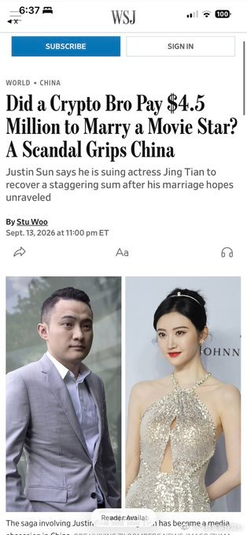

---

## 22

@金灿荣教授

发表于：2026-09-14 05:38

来源：微博

链接：https://m.weibo.cn/status/5343043474425489

【国家卫健委: 我国人口大国基本面没有变】9月14日，国务院新闻办公室举行“开局起步‘十五五’”系列主题新闻发布会，国家卫生健康委、国家中医药局、国家疾控局等单位介绍推动健康中国建设取得决定性进展有关情况。

国家卫生健康委主任雷海潮提到，现在我国人口总量是14.05亿，在世界上将长期处于人口大国地位。最近4年以来，人口出现负增长，但是人口大国的基本面是没有改变的。高等教育蓬勃发展，每年新入学的高校学生数都在1000万以上，能够为社会提供高素质的劳动力资源。

近年来，新出生人口虽然有所下降，但是仍然维持在800万左右的数量级。对比其他发达国家、发展中国家，出生人口在这个水平的还是非常少的，所以未来仍然有比较充裕的劳动力资源。

雷海潮表示，要进一步营造生育支持的友好环境，比如说，去年开始发放育儿补贴，3000多万家庭因此而受益，降低了家庭的生育、养育和教育成本。在“十五五”期间，还要继续推进托幼一体化，支持社区、用人单位举办托育服务机构，让居民能够就近就便、以相对可负担的价格获得托育服务。“十五五”规划还提出了要提高入托率，充分利用现有资源，让更多的婴幼儿通过托育服务获得规范的成长照护。当然，还要积极宣传正确婚育观。

---

## 23

@蓝星金刀客

发表于：2026-09-16 22:05

来源：微博

链接：https://m.weibo.cn/status/5344016591225193

\#美联储宣布加息25个基点\#欧美日都加了，相当于没加。我们上一轮没降，相当于这一轮加了。

所以，这个月的LPR应该还会按兵不动吧？

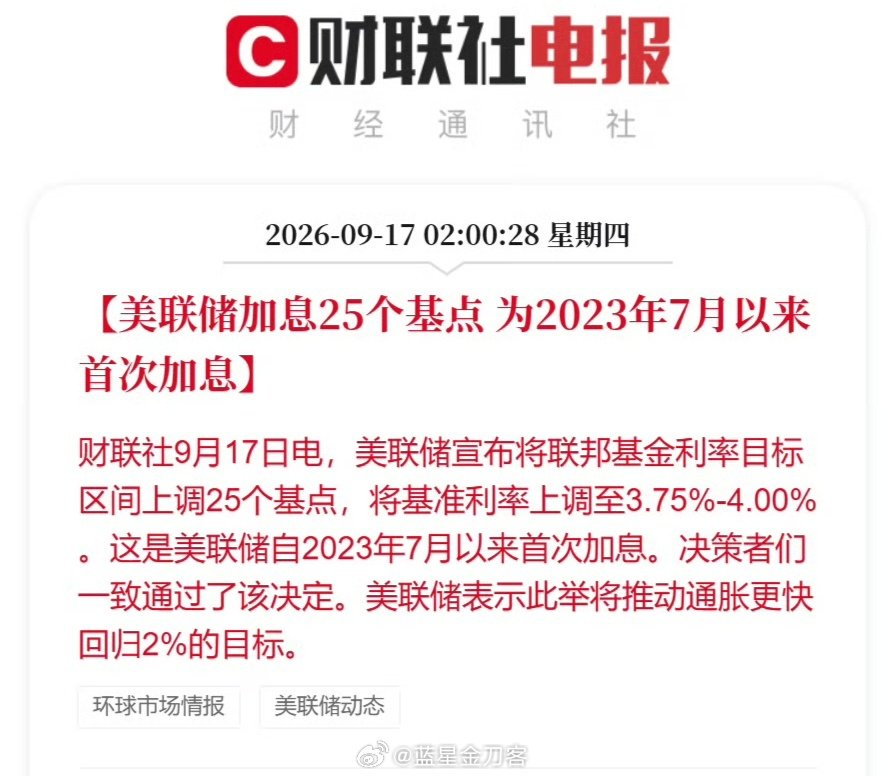

---

## 24

@马上谈

发表于：2026-09-17 10:03

来源：微博

链接：https://m.weibo.cn/status/5344076350359215

孙子非亲生案妹妹给出更多细节：哥哥是一名火车司机，因父亲查出直肠癌晚期，他请长假陪同父亲前往天津治疗，在晚上兼职送外卖时不幸发生车祸身亡。

丧葬费、赔偿款嫂子分走了大半，举行葬礼时她不让孙子守灵、捧骨灰盒，他们这一家才开始起疑心，通过亲子鉴定发现孙子非亲生。

此前嫂子黄某经常早出晚归，或是夜不归宿，动不动出差一两周。如今看来出轨并不是偶尔的事。

妹妹还曝光哥嫂聊天记录，称嫂子列清单式频频向哥哥要钱，哥哥在巨大压力下拼命挣钱养家，她直接读出哥哥与大嫂的部分聊天纪录：

“孩子保险2000块钱，我要种牙6000块，我吃中药1000块，我打细胞1000块，孩子学费6000块，通通给我留出来。我告诉你，老婆孩子你都不管，你自己看着办！”

这个案子给我两个感想：

第一，我们各个领域有太多的教条主义。比如这个案子，先后被冷酷无情的法条和法官两次判为败诉。但是真的合理吗？希望这个案子能推动司法的完善，同时，也建议允许祖父母亲子鉴定的申请权、将欺诈性抚养纳入刑罚！

第二，遇到事情，有兄弟姐妹和没有兄弟姐妹不一样。这个案子，父母已经年老，父亲甚至是癌症晚期，和苏享茂案一样，如果没有妹妹跑前跑后，一次两次败诉后，谁为哥哥声张正义？所以，在社会面亲戚逐渐断亲的当下，能多生一个肯定好。

\#孙子非亲生案女方提交聊天截图证据\#\#孙子无血缘再审听证会奶奶当场晕倒\#

