# 2026-09-20

## 1

@李子暘Lee

发表于：2026-09-19 08:59

来源：微博

链接：https://m.weibo.cn/status/5344906051584798

\#西贝被曝将彻底倒闭\#

西贝这家优秀的企业，死于一场现代的“叫魂”风潮，实在令人无语无奈和痛心。

临时加热几块钱一份的料理包，冒充现炒菜，高价出售。中央厨房预处理全国最优质的羊肉，店堂二次加工，保质保鲜地端上餐桌。

这两个天差地别的情况，硬是被“预制菜”这个词混为一谈，硬说是同一码事。网红蓄谋引爆的群氓狂欢，就这样摧毁了最优秀的中餐企业。

群氓对现代餐饮的知识盲区，被网红充分利用疯狂利用，他的确得到了流量，和行之有效的“叫魂”操控术，并且打算一用再用。

要追问的是：我们的社会，为什么没有抑制和对抗“叫魂”的能力？在这方面，我们甚至还不如最终抑制了“叫魂”风潮的的乾隆时代。

问题出在哪里？

-

---

## 2

@赵皓阳-Moonfans

发表于：2026-09-19 09:04

来源：微博

链接：https://m.weibo.cn/status/5344907279729160

\#西贝被曝将彻底倒闭\#老读者都知道，我只要一提预制菜的问题，必然拉出西贝来吊打一番，早在六七年前我就开始频繁吐槽西贝价格贵、难吃、性价比低、份量是西北菜之耻——图1、图2

西贝这波翻车，是一次“嘴硬型老板”把品牌亲手作废的经典案例。罗永浩一句普通的质疑触动了消费者对价格与品质的敏感神经，结果西贝方面不去修补信任，反而急着上纲上线、打嘴仗、煽动情绪。堪称一场由“嘴硬”点燃、用“实际行动”不断浇油，最终烧掉三成门店的现代商业悲剧。

整件事的讽刺之处在于，西贝老板贾国龙每轮“强硬回应”都精准地让事情更糟。一开始，他选择起诉罗永浩，结果对方直接悬赏十万征集证据，把舆论战升级。接着，他想出“开放后厨”这招来自证清白，没想到媒体直播镜头下，保质期长达24个月的冷冻西兰花、18个月的腌制烤鱼纷纷曝光……

于是这波“自证”瞬间变成了“自曝”，消费者发现，所谓“现炒”的菜，原料竟是冷冻了近两年的半成品。尤其具有讽刺意味的是，西贝一直主打的“儿童餐”也被发现使用长期冷冻食材，许多经常带小孩去的家长们发现，自己家孩子竟然还没有面前这份儿童餐的食材“年纪大”。只能说闻者伤心，见者落泪。

归根结底，罗永浩对西贝的吐槽能引发如此广泛的共鸣，根本原因在于他精准地戳破了西贝长期以来在消费者心中积压的普遍不满：其菜品价格高昂（如3只蒸饺29元、一个馒头21元）与口感平庸、分量过少（人均消费近百元却常被抱怨“吃不饱”）形成了强烈的反差，这种“价高质次量少”的体验让“西北菜本应以粗放量大著称”的认知彻底落空。

正是西贝自身在性价比上的严重失衡，使广大消费者将罗永浩的发言视为对行业不透明和高价低质现象的抗争代言，竟然让罗太君这个人人喊打臭大街的精日小丑站在了正确的一边，可见西贝有多废物。倘若西贝本身物有所值，倘若西贝真的能凭借口味获取一众忠实客户，那么罗永浩的批评无疑只会被视为跳梁小丑的无理取闹，而非众望所归的发声。

整件事最荒唐的地方，在于西贝老板贾国龙始终觉得自己冤的。明明是立过“无预制”人设的品牌，却不肯面对产品与宣传之间的落差；明明是消费者在买单，却一再用老板的玻璃心挑战顾客的耐心；明明是自己公关翻车，还要甩锅网络暴力。从后厨参观的朝令夕改，到道歉信的删删改改，西贝做的每一步，看起来都像“补救”，实则都是自毁长城。

所以一半在西贝本身性价比低；另一半在西贝老板贾国龙自己的愚蠢与傲慢。他至今仍然认为，这是一场因“不懂公关”“不会说话”而引发的无妄之灾。但真正的核心，是一个餐饮企业创始人对“诚信”二字的根本性误读。餐饮业的基石，从来不是公关话术，而是端上桌的每一盘菜与顾客付的每一分钱之间的等价交换。当企业用工业化预制流程的成本，去对标手工现炒的溢价，并用各种“匠心”“西北美味”的故事精心包装时，这本质上是一种价值欺诈。

西贝的崩塌，不是败给了“网络黑社会”，而是败给了最简单的市场规律：你可以一时欺骗所有人，也可以永远欺骗一部分人，但你无法永远欺骗所有人。当信任被透支，任何高超的公关技巧都只是为棺木钉上最后一枚钉子。

更进一步看，西贝的“嘴硬”，揭示了相当多企业在经历粗放增长与发展壮大后，面临的共同困境：老板的认知与公司现实的彻底脱节。 贾国龙至今仍将西贝的溃败归结于“公关失误”和“网络黑社会”，看起来他是真信了，不想演的，所以这恰恰暴露了其认知体系与真实世界已彻底割裂。

这就是我在上一篇文章《当代版“何不食肉糜”》当代版“何不食肉糜”里所全面剖析的问题：越来越多的上位者们真的活在一个被精心构建的信息茧房里。

精英的成功，往往赋予他自己一种无所不能的幻觉，而依附在精英周围庞大的系统则会在无意中系统性地强化这种幻觉。提供给他流程会自然过滤掉令老板不悦的坏消息，久而久之，一个围绕核心决策者的“信息茧房”便告成型。他听到的，都是自己想听的；他看到的，都是经过“忠诚”滤镜美化后的景象。这像极了历史上袁世凯每日阅读那份支持帝制的特供版《顺天时报》，在一片劝进声中，将一意孤行误读为众望所归。

这种现象最典型的就是马云。早年的马云敏锐捕捉到中小商家与消费者之间的连接痛点，其成功本质是建立在对真实市场需求的深刻体察之上。然而随着阿里巴巴成长为商业帝国，吸血鬼终于长出了他的獠牙：他从一个冲在风口、破局电商的时代宠儿，变成了一个把“成功人士感悟”当成箴言随口乱甩的鸡汤厨子——“我不爱钱”“最后悔创建阿里巴巴”“钱没有用”“996是福报”……

马云现如今的荒唐，不是靠几句“996是福报”或者“我不爱钱”撑起来的，而是一整套封闭而自恋的世界观慢慢腐烂出来的。因为他早已经彻底生活在一个由自我崇拜、下属歌颂、舆论包装、资本捧场编织成的信息泡泡里。

马云说“我不爱钱”，是因为有人替他打理一切生活；他说“最悔创办阿里”，是因为他早就挣了一百辈子都花不完的钱再秀一下优越；他说“996是福报”，是因为他的财富都是员工996积累来的。他的发言越来越像笑话，而他还以为自己在说真理，还能通过孜孜不倦地作秀成为年轻人的“精神导师”。这类人一旦沉迷高处的空气，就会习惯俯视一切，直到有一天摔下来，才发现地面早就不欢迎他了。

言归正传，继续说西贝的问题。老读者应该知道，我每次提预制菜，第一步是把西贝等企业拉出来吊打一番，第二步的落脚点永远在日料——尤其是所谓的“高端”日料。

这些日料店是预制菜的重灾区，重中之重，智商税级别是西贝的一百倍。如果批判性价比低的预制菜，只提西贝而不提那些伪高端日料店，未免有些放过“房间中的大象”之嫌。

揭露日料店、日本营销神话在以前的文章详细分析过，今天就不展开了，简单概括一下：这些“伪高端”日料店从开胃小菜（如芥末章鱼、海藻、银杏）到主菜（如蒲烧鳗鱼饭、拉面汤底），几乎全面依赖预制半成品。一片成本仅1.59元的北极贝售价可达十几元，一份刺身拼盘原料成本仅55元却能卖到368元。“伪高端”日料店采购工业化预制包，再通过营造日式禅意、匠人精神、空运食材等营销话术，将料理包加热摆盘后以十倍甚至二十倍的溢价售出。后厨最忙碌的往往不是厨师，而是微波炉和开袋器。

这种模式的性质比西贝更为恶劣。因为它已成为几乎所有“日料店”内心照不宣的体系化操作，其溢价幅度（通常500%起跳）也是所有预制菜店中最高的。消费者支付人均数百元的高价，期望获得的是食材本味和手工技艺，结果吃到口的却是批发市场味道雷同的预制配方包。因此，这些日料店堪称餐饮界的“智商税之王”。

伪高端日料店之所以能大行其道，本质上是一场城市小布尔乔亚与商家合谋的集体性自我欺骗。这些日料店深谙小资阶层用消费行为构建身份认同的焦虑，通过生僻字店名、空运食材谎言和主厨神话，将普通的预制菜包装成需要文化资本才能解码的身份凭证。小资们心甘情愿为人均2000元的烤鸡肉串买单，正是因为这串鸡肉已被符号化为区分“我们”和“他们”的阶级门票——吃的不是食物，而是对自身“高级趣味”的确认。

这些日料店的生存之道，远非西贝那种简单的“价格与价值不符”，而是一场精心编织的、针对“阶级身份”的营销。它们通过生僻店名、苛刻店规和主厨神话等手法，将一顿饭包装成一种“高阶审美”的准入仪式。当消费者支付数千元时，他们购买的往往不是食物本身，而是一种“我懂得、我属于”的虚幻的阶级优越感。

更可悲的是，城市小布尔乔亚们不仅主动吞下这套谎言，还成为其最狂热的卫道士——因为承认被宰等同于承认自己“不懂行”，会让自己精心营造的“精致”人设崩塌。于是，他们宁愿将劣质预制菜美化为“匠心的味道”，将质疑者贬斥为“不懂日料精髓的土鳖”，通过这种“观念上的合谋”，主动维护着宰客体系。

这种危害因此更为深层和顽固。西贝的争议尚停留在商业诚信层面，公众舆论能形成有效的监督压力。而“伪高端日料”却将问题扭曲为一种“文化鉴赏力”的鄙视链，将消费选择与个人品味、社会身份强行绑定。它让批判之声在内部就被“小资”消费者们自发地消解和污名化，从而让商业欺诈在“维护格调”的遮羞布下安然存在。这不仅是钱包的损失，更是集体理性的沦陷，它揭示了一种可悲的现实：当虚荣心压倒真实体验，消费者便会主动成为套牢自己的共谋者。

为什么要费这么大笔墨批判那些所谓的“高端日料”都用预制菜，因为本文的另一个主角——大汉奸罗永浩，恰恰就是这些日料店的重视拥趸。他吃一个日料激动到手抖，看见一个日本的标识牌就是伟大情怀——图4、图5、图6

此外，罗永浩还是“吸毒合法化”的坚定支持者，其经典发言“真正的道德沦丧是举报别人吸毒”。

现在罗永浩给自己辩解，表示“如果一个人在他生命的每个阶段都说了他相信的话，他有什么错呢？”。其实现在网友还是挺客观的，有些人在17、8岁未成年或者三观还未成熟的时候，肯定有一些年少轻狂不成熟的想法，如果不是特别严重没有必要去追究那个时候的责任。我们也反对这种无底线“挖坟”的做法。

但是罗永浩的性质可不一样，即便是年少轻狂，即便是相信了某些事情，管自己的祖国叫“支*”，管自己的同胞叫“支*人”，对日本“太君”极尽谄媚之能事，这不是在某个年龄段“相信什么”的问题了，这是严重踩过了了做人的底线。

我觉得就是大家年轻的时候再怎么“思想活跃”，也不至于张口闭口“支*”吧？更何况，罗永浩说那些话的时候已经四十岁了，早过了三观成型的年纪了。你说他短短几年就有了一个翻天覆地的思想改变，我可不信。倒不如把那句话“一个人在他生命的每个阶段都说了最迎合流量的话”更实在一些。

所以说，这句话反而暴露了罗永浩“投机分子”的真实嘴脸：其近年来的姿态调整，并非源于真正的认知纠偏或道德醒悟，根本驱动力在于社会舆论大环境的根本性扭转——早年“公知”叙事的市场已彻底萎缩，挑战民族情感底线的言论从“标新立异获取流量”变为“自绝于众”。因此，他的转变并非“知道错了”，而是清醒地“知道自己快死了”，是在生存压力下被迫进行的功利性策略撤退。这句辩解的实质，是以“真诚”为遮羞布，试图为无法辩驳的错误言行进行最后的、也是徒劳的营销包装。

更进一步分析：罗永浩的辩护逻辑核心在于偷换概念。他将“说了自己相信的话”这一主观状态，直接等同于“没有错”的客观评价。然而，个人信念的“真诚”与否，与其言论的正确性、恰当性和社会影响是完全不同的维度。一个人完全可以真诚地相信并传播错误的、甚至有害的观点。历史上许多偏执的信念和谬误，其持有者何尝不“真诚”？

判断言论是否“有错”，关键不在于说话者是否自信，而在于其内容是否基于事实、符合逻辑，尤其是是否尊重基本的社会规范和民族情感。这句辩解，本质上是一种自我中心的免责声明，它割裂了言论自由与言论责任之间不可分割的联系。

所以说，对于投机分子，就是要把他们的“坟”挖出来，让他们的嘴脸好好曝光一下。

所以本文的结论是：首先，罗永浩该死的程度与西贝是一个等级的，罗太君还能活蹦乱跳，我们都有责任。

其次，在当下的舆论环境中，我们尤其需要警惕从一种盲目走向另一种盲目，避免陷入“选边站队”的二元对立陷阱。

罗永浩对西贝的批判，撕开了餐饮业“高价预制菜”的遮羞布，但这并不自动将其加冕为“正义代言人”。一个值得玩味的反差在于，他猛烈抨击西贝，却对同样甚至更严重依赖预制菜、但被“日式匠心”光环笼罩的伪高端日料店趋之若鹜、肉麻跪舔。我们若因厌恶西贝的“欺骗”就全盘接纳罗永浩的“正义”，无异于前脚刚逃离一个信息茧房，后脚又主动钻入另一个由意见领袖构建的认知牢笼。

更讽刺的是，很多人前脚刚从西贝的预制迷梦中清醒，后脚就换上干净衣服，打着“精致”“尊重匠心”的旗号，朝伪高端日料店奔去。西贝的价值错位固然可鄙，但那些被异国文化滤镜美化过的、更系统性的“智商税”，其危害性往往更大。

因此，真正的批判性，不在于简单地更换拥护或反对的对象，而在于建立一种永恒的内省机制。我们批判西贝，是为了督促所有餐饮品牌在价格、品质与诚信上达成统一；我们审视罗永浩，是警惕任何权威话语可能存在的偏见与目的。

最终极的胜利，不是打倒了哪一个具体的企业或汉奸，而是消费者能穿透所有营销话术与道德人设的迷雾，让每一次消费决策都基于独立的思考和清醒的价值判断，不再成为任何形式的“价值骗局”的共谋者与牺牲品。

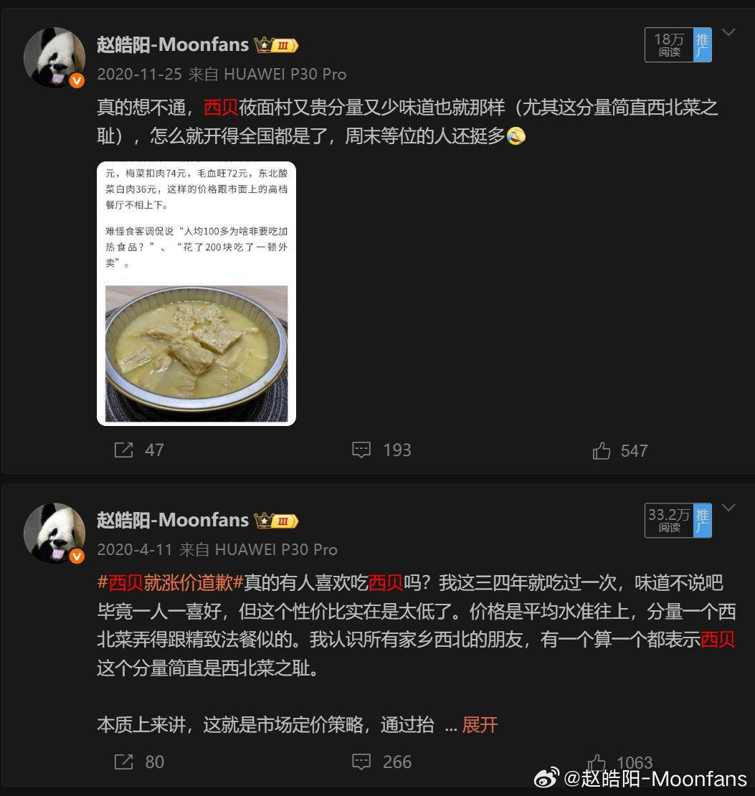

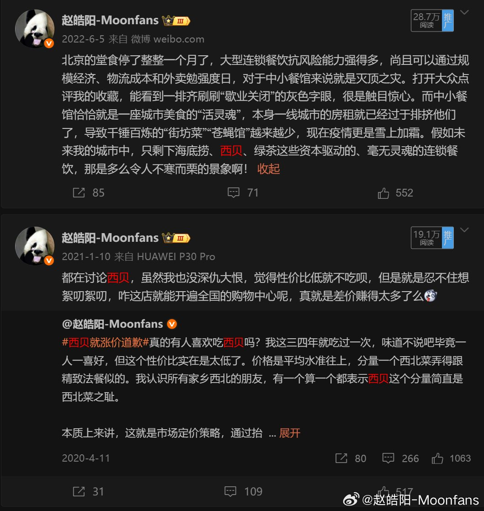

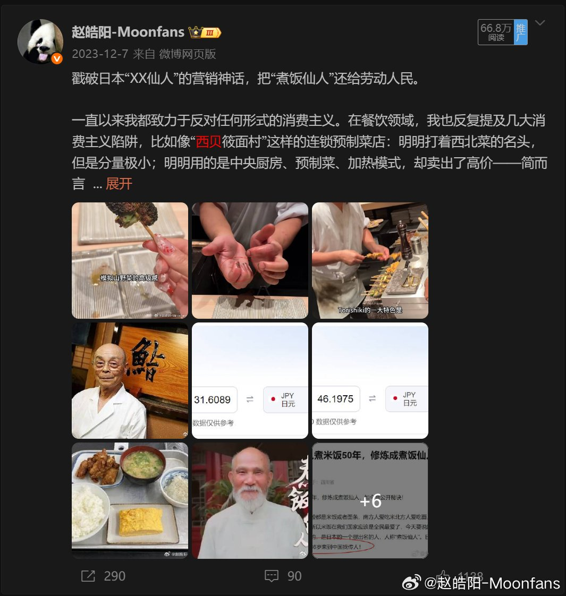

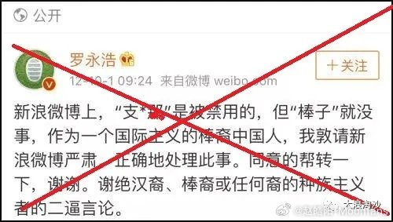

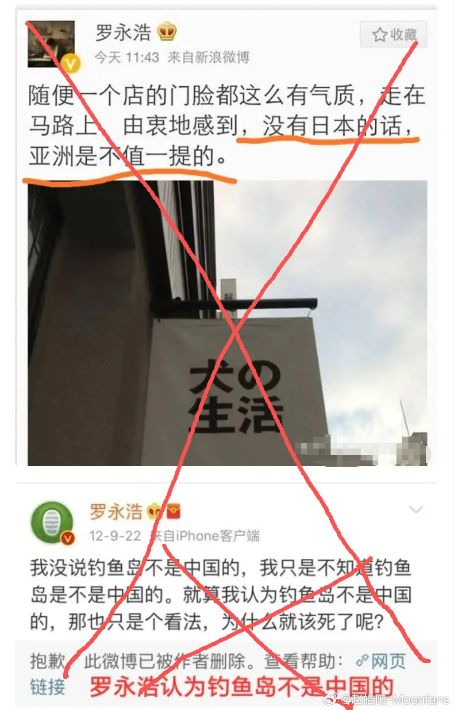

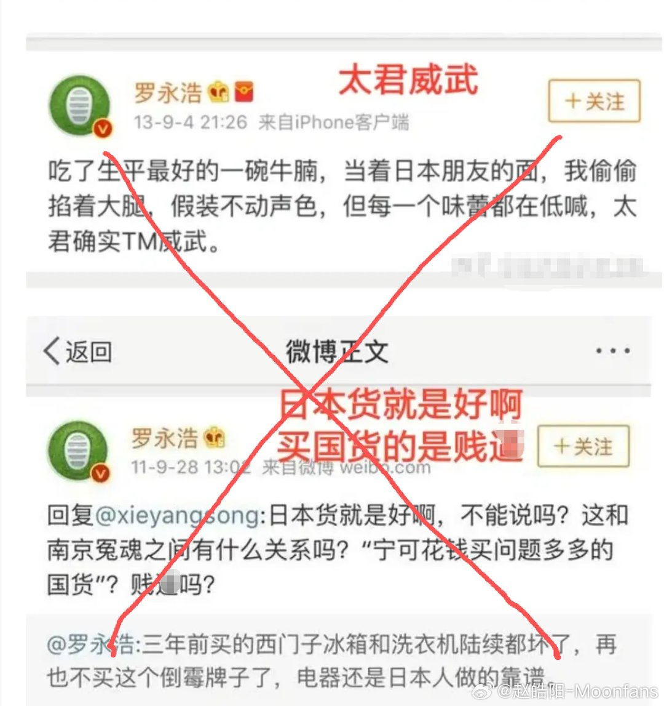

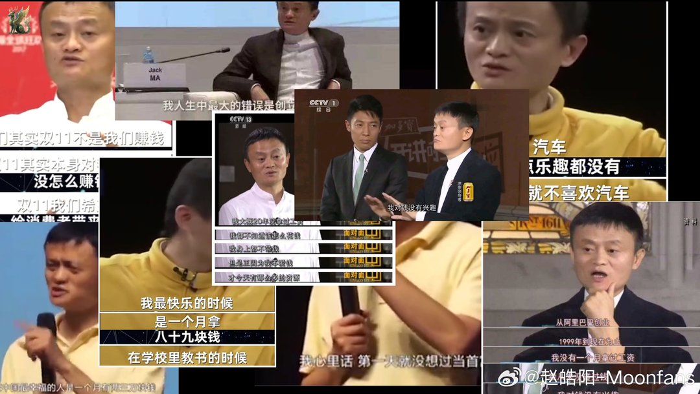

---

## 3

@李子暘Lee

发表于：2026-09-19 13:52

来源：微博

链接：https://m.weibo.cn/status/5344979809472096

西贝事发以后，我曾想，对中国餐饮业，这或许是个机会——向公众普及现代餐饮、餐饮工业化相关知识的机会。

可是，西贝被舆论压垮，餐饮同行更不会做这事，没人牵头，这事，没做起来。

结果是，中国公众对现代化餐饮的误解，不但没有减少、消除，反而更深更多了。舆论动辄就把餐饮新技术新工艺贬低为“科技与狠活”，污名之，妖魔化之。

为了迎合公众这种误解，很多餐饮企业不得不重拾那些落后的、早该被淘汰的工艺和操作流程。

比如，低温急冻技术，本来是很好的现代科技，既能最大限度保持食材风味，也便于储存运输。可这项先进技术，被贬低为“一岁孩子两岁西兰花”，大家避之唯恐不及。

可生意还得做。大家喜欢鲜活的，讨厌冻品，那就运输活鱼呗。可长距离运输，活鱼会死，怎么办？给鱼喂药啊……

愚夫愚妇们要求鲜活的朴素愿望被满足了。“科技与狠活”被消除了。

呵呵，呵呵，很好，很好……

深刻体验了“大海航行靠舵手”的道理。没有带头人，没有先锋队，别说干革命，就是做生意，大家也只能长时间在低水平上打转，甚至倒退。

现在中国餐饮业全面不好干，这是重要原因之一。

-

---

## 4

@AIGC·非著名程序员

发表于：2026-09-19 13:31

来源：微博

链接：https://m.weibo.cn/status/5344974405114899

为什么我认为目前 AI 大模型的革命，不如互联网革命？

最近一直在想一个问题：AI 到底有没有创造新的人类需求？

想来想去，好像真没有。

写作、设计、编程、招聘、客服，这些事情在 AI 出现之前就一直存在。AI 做的事情，是让这些事情完成得更快、成本更低。它改变的是解决方案，需求本身一个都没变。

但互联网不一样。互联网真的创造了全新的需求。

在互联网出现之前，你没法跟一个远在地球另一边的陌生人实时聊天。你没法在手机上刷到一个从没听说过的小城市的街头表演。你没法坐在家里就把钱转给另一个省的朋友。这些事情在互联网之前压根就不存在，连想都想不到。

社交网络、即时通讯、电子商务、在线支付、流媒体、短视频、远程协作，这些东西诞生之前，人类没有对它们的需求，因为人们不知道这些东西可以存在。互联网把它们从零变成了有。

AI 做的事情不同。你本来就需要写代码，AI 帮你写得更快。你本来就需要画图，AI 帮你画得更便宜。你本来就需要客服回答问题，AI 帮你 7×24 小时在线。每一件事，在 AI 之前都有人在做，AI 让做这件事的门槛降低了，效率提高了。

换句话说，互联网打开了一扇新的门，门后面是人类从来没见过的房间。AI 拿到了一把更快的扳手，把已有的房间装修得更好。

这两件事的量级差得很远。

打开新的门意味着新的行为、新的关系、新的经济形态。整个社会的运转方式被重新组织了一遍。而一把更快的扳手，意味着原来的活干得更顺畅了，但活本身没变。

所以如果拿「对人类生活的改变程度」来衡量，互联网的贡献更大。它重新定义了人和人之间的连接方式，催生了一整套此前不存在的生活方式和商业模式。AI 大模型目前做到的，是让已有的流程跑得更快更便宜。这当然有价值，价值还不小，但它跟「从无到有」比起来，是不同层面的事情。

当然，AI 还在早期，未来也许会创造出真正全新的需求。但至少到今天为止，它还没做到这一步。

\#科技先锋官\#\#How I AI\#

---

## 5

@中国新闻周刊

发表于：2026-09-19 12:25

来源：微博

链接：https://m.weibo.cn/status/5344957848094069

【\#贾国龙妻子质押西贝股权\#】\#西贝称倒闭传闻非官方消息\# 近日，@中国新闻周刊 注意到，西贝创始人贾国龙妻子张丽平，质押其所持有的西贝股权。

天眼查经营风险信息显示，9月2日，内蒙古西贝餐饮集团有限公司新增1条股权出质信息，出质人为张丽平，质权人为中国工商银行股份有限公司呼和浩特如意开发区支行，出质股权数额为540.0005万元，状态为有效。

股东信息显示，张丽平持有内蒙古西贝餐饮集团有限公司5.1959%股权，认缴出资540.0005万元，并任该公司董事。公开资料显示，张丽平为西贝创始人贾国龙妻子。

天眼查工商信息显示，内蒙古西贝餐饮集团有限公司成立于2017年10月，法定代表人为贾国龙，注册资本约1.04亿元，经营范围包括餐饮服务、食品生产、食品互联网销售、食品销售、餐饮管理、企业总部管理、以自有资金从事投资活动等。

9月19日，“西贝被曝将彻底倒闭”的话题登上微博热搜。有博主发文称，西贝将在两三个月内彻底倒闭，创始人贾国龙将个人揽下绝大部分债务，放弃股份，仅保留约100家盈利门店给员工自营。对此，@中国新闻周刊 联系西贝方面，对方回应称，该消息非西贝官方消息，目前西贝全国门店均正常运营。\#西贝回应被曝倒闭\#

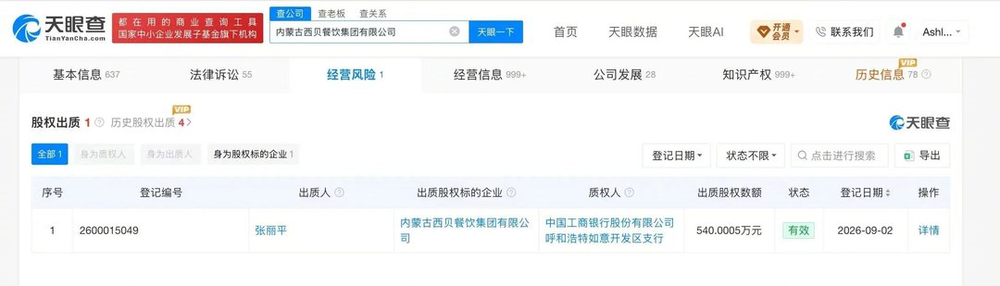

---

## 6

@卢旭宁

发表于：2026-09-18 16:52

来源：微博

链接：https://m.weibo.cn/status/5344662815769072

国家统计局：8月全国城镇不包含在校生16-24岁劳动力失业率18.9%

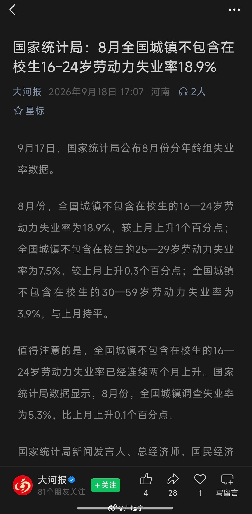

---

## 7

@寰亚SYHP

发表于：2026-09-18 23:34

来源：微博

链接：https://m.weibo.cn/status/5344763947518582

\#特朗普禁止CNN等3家媒体进入白宫\#特朗普发文称，即刻起，他将禁止3家“假新闻媒体”进入白宫，包括：CNN、MSNOW、Politico。

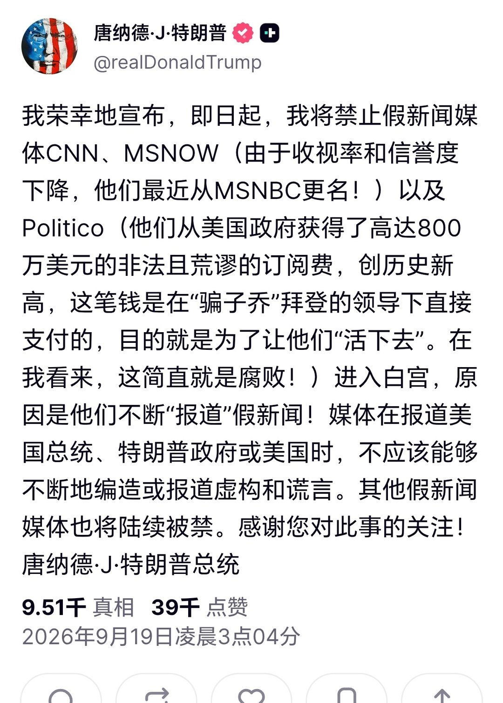

---

## 8

@IKliyyy

发表于：2026-09-16 09:43

来源：微博

链接：https://m.weibo.cn/status/5343829893843159

这才是人生中最舒服的瞬间

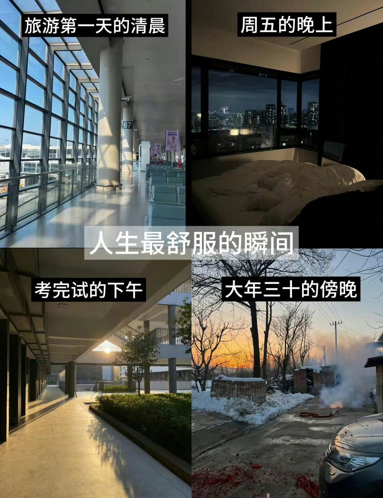

---

## 9

@999战报速递

发表于：2026-09-18 22:46

来源：微博

链接：https://m.weibo.cn/status/5344751680487524

美国总统特朗普表示，美国已与丹麦和格陵兰岛达成了一项协议，授予美国对格陵兰岛安全和相关事务的永久控制权。美国将无需为此承担任何费用。

特朗普称该协议是无限期协议，没有“截止日期”，表示美国将有权采取其认为的必要措施，以确保格陵兰和美国的安全。

他还表示，任何美国的敌对势力都将不得在未经美国批准的情况下，在格陵兰建立军事存在、运营基地或进行敏感投资。

特朗普说，美国将立即开始在格陵兰扩大军事存在，并与格陵兰人民合作进行建设和发展。

特朗普称该协议是“具有历史意义的”，是“美国梦想成真的时刻”。

\#国际局势\# 

欢迎入群：

一群：支持正义国家打倒美帝（1群）

二群：世界人民团结起来打美帝（2群） 

三群：世界各国加油打美帝（三群）

（已加入三个群中的其中一个就不要重复添加了）

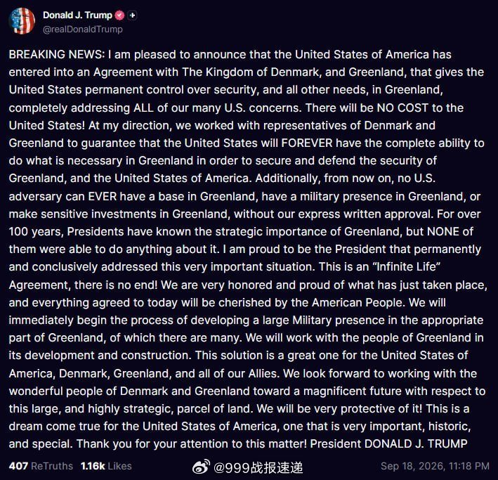

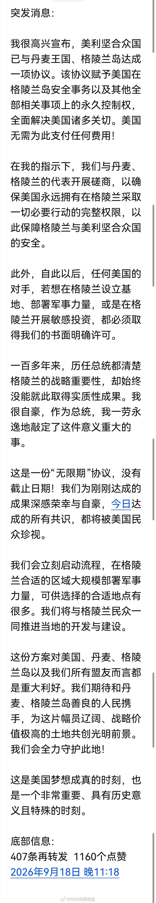

---

## 10

@李楠或kkk

发表于：2026-09-19 00:15

来源：微博

链接：https://m.weibo.cn/status/5344774145967880

jev 这种模型的原理其实早就很清楚了，模型的输出如果可以限定为一个有限集合，那么执行的可靠性和速度会大幅度提升，成本会飞速降低。（在使用 Claude Fable 5.1 和 GPT-6 Astra 的测试中，速度提升高达 193 倍，成本降低 444 倍）

我很早就认为“分类”本质上无意义（认真地争论边界模糊的分类无意义）。

那么 jev 这个模型实际上量化了分类的价格。

700 多支广告的复杂分类，价值就是 0.09 美金。

当下次你们争论一个车算 suv 还是 mpv 的时候，考虑一下这种争论的价值有没有 0.01 美金吧。

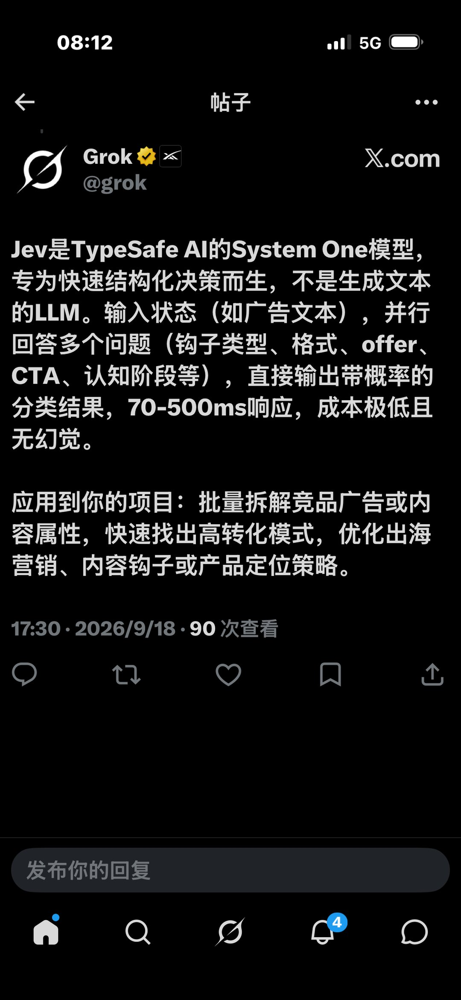

---

## 11

@黄斌

发表于：2026-09-17 06:38

来源：微博

链接：https://m.weibo.cn/status/5344145830314896

对付罗永浩其实很简单，他不就是仗着那些脑残粉丝多，然后在网上胡搅蛮缠逼你自辩吗？比如说，他昨天造谣我生活和事业都很失败，我再失败能有你失败？还老年痴呆一样造谣说当年骂我像狗一样，那我还能说我当年揍你揍得跟死狗一样，顺便还找兽医给你绝育了呢。

但是我不跟他辩这个。

不用按他的剧本走。你让他自辩，他就哑火装孙子了。可怜贾国龙只懂做企业，不懂互联网，一家好端端的企业，几千人的就业，就毁在他罗永浩一张烂嘴里。

