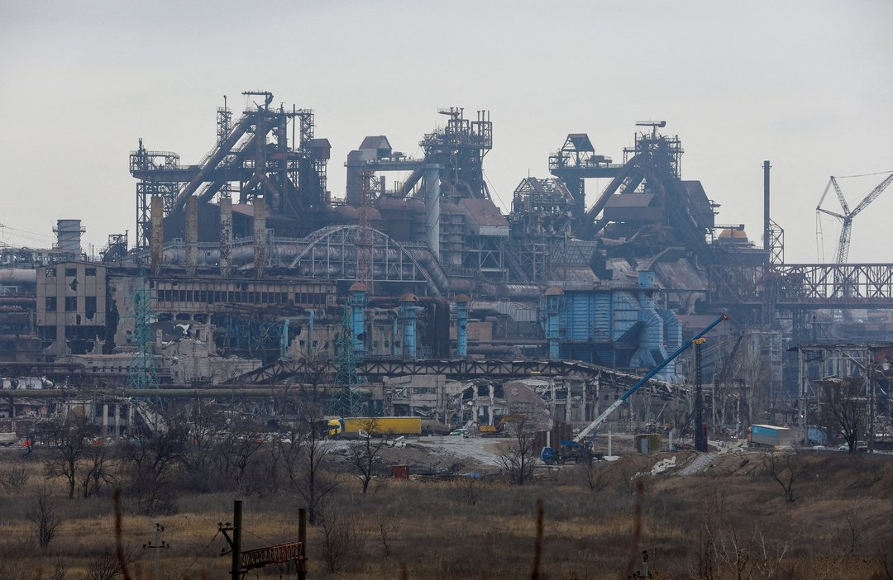
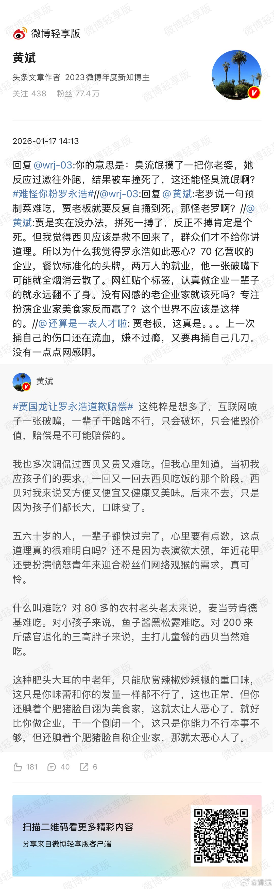

# 2026-09-21

## 1

@飞扬军事铁背心

发表于：2026-09-20 13:02

来源：微博

链接：https://m.weibo.cn/status/5345329668429702

唐纳德·J·特朗普

应美国军方的强烈要求，并出于国家安全目的，我已经同意将原计划建设于内战时期以来就曾被提出的、位于阿灵顿纪念桥旁纪念环岛的宏伟凯旋门，改建为一座顶级军事综合设施/凯旋门。

该设施将用于容纳、储存大量无人机，并具备快速投入使用的能力；同时将在建筑顶部和广场区域部署狙击手，并储存大量狙击弹药。

世界上不会有任何地方拥有这样的设施。

在全球59个主要城市和首都中，华盛顿特区是世界上唯一一个没有凯旋门的城市，但现在它将拥有一座，而且将是迄今为止最伟大的一座！

感谢大家对此事的关注。

总统

唐纳德·J·特朗普

2026年9月20日 07:34 \#烽火问鼎计划\#

---

## 2

@包容万物恒河水

发表于：2026-09-20 14:04

来源：微博

链接：https://m.weibo.cn/status/5345345317111773

🔻金融时报称：自 8 月以来，俄罗斯弹道导弹袭击摧毁了乌克兰仅存的三家大型钢铁厂（扎波罗热钢铁厂、卡梅特钢铁厂、安赛乐米塔尔克里沃罗格钢铁厂），乌克兰钢铁工业实际上已经消亡。

🔻截至今日，乌克兰已不再拥有钢铁工业。

🔻这些工厂贡献了剩余产量的 90%，雇用了超过 15000 名员工，且产量已从战前的 2100 万吨缩减至 2025 年的 740 万吨。

🔻8 月产量同比暴跌 57%；9 月会更糟。

🔻该行业曾贡献乌克兰 7%的 GDP 和 15%的出口——如今已趋近于零。

🔻在俄军打击之前，欧盟配额削减、港口关闭以及焦煤的丧失就已经重创了该行业。

\#莫斯科遭大规模无人机袭击2人死亡\#\#海外新鲜事\#\#热点现场\#

---

## 3

@36氪

发表于：2026-09-20 14:00

来源：微博

链接：https://m.weibo.cn/status/5345344067733222

【Jev爆火硅谷，哑巴AI卷疯14万开发者】

整个硅谷都被Jev刷屏了！发布仅三天，它就被众多主流平台迅速集成，有人说，我们即将迎来自动化智能的大爆发！而这场狂欢的主角，竟然是一个不会说话的大模型。

狂欢之下，压着的是一个最致命的老问题，智能到底是什么？

七十多年前图灵定下考题，机器能不能思考，看它能不能在对话里骗过人。整个行业从此朝着「把话说漂亮」狂奔，而ChatGPT几乎把这条路走到了极限。

或许，这是AI史上最大的一次胜利，但也是最大的一次跑偏。

\#氪君领读\#

1、聊天超人三年了，说好的「真自动化」在哪？

这么聪明的AI，到今天还得靠人类盯着才能干活，根本做不到真正的自。致命问题在于：RLHF让模型学会了取悦人类，却也让它们在系统自动化场景里变得极其不可靠。

2、Jevons悖论：AI经济的核裂变

我们一直陷入这样的误区，以为AG越聪明越好，越会说越好。而Jev的解法是反过来的，先让机器闭嘴，先让它可靠，再让它便宜到可以随手用。

详情请阅读：网页链接，本文来自“新智元”，作者：ASI启示录，编辑：摩西 Aeneas。

---

## 4

@黄斌

发表于：2026-09-19 06:32

来源：微博

链接：https://m.weibo.cn/status/5344869163729204

\#西贝被曝将彻底倒闭\#

群氓的狂欢，庸众的罪恶。网络黑嘴的胜利，线上暴民的盛宴。

某些互联网看客，只是点击网上的新闻，看到一家和自己毫不相干的连锁饭店有数千上万人的失业，觉得这家店的老板性格和处事方式自己不喜欢，哪怕他一辈子都没去过这家餐厅，居然也能起哄架秧子纷纷叫好。

果然最懂中国人的鲁迅是超越时代的：

【暴君的臣民，只愿暴政暴在他人的头上，他却看着高兴，拿“残酷”做娱乐，拿“他人的苦”做赏玩，做慰安。自己的本领只是“幸免”。

从“幸免”里又选出牺牲，供给暴君治下的臣民的渴血的欲望，但谁也不明白。死的说“阿呀”，活的高兴着。】

