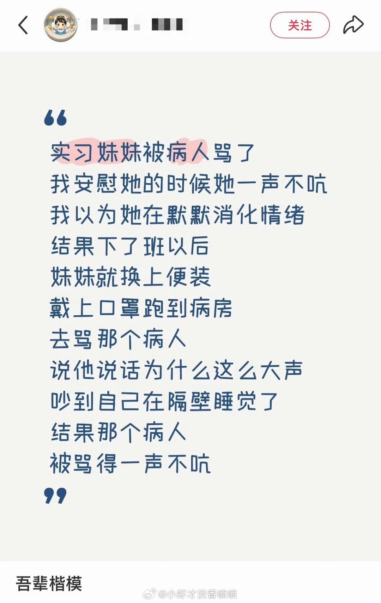
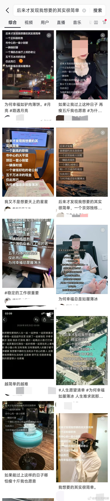
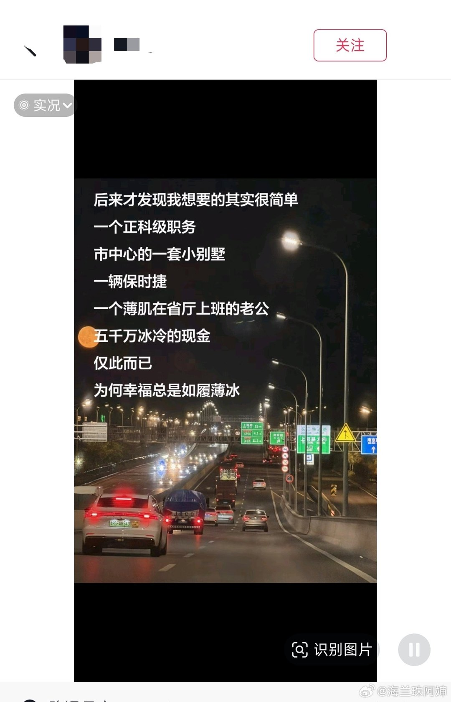
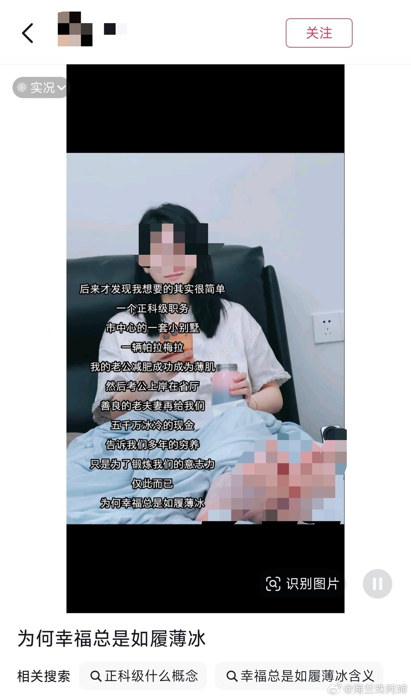
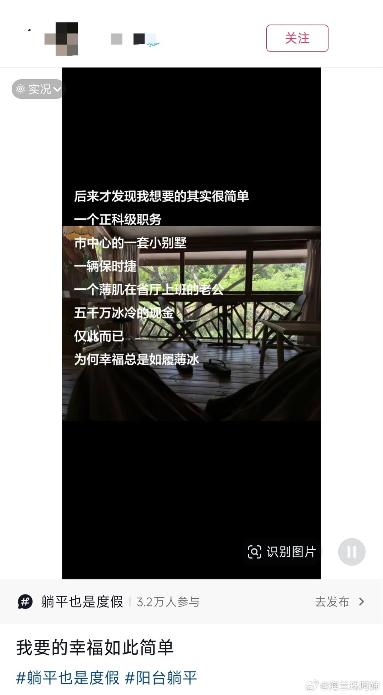
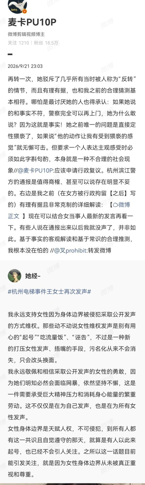
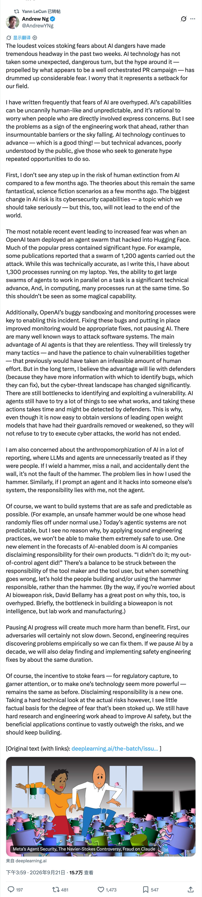

# 2026-09-22

## 1

@渔老板钓鱼

发表于：2026-09-21 14:45

来源：微博

链接：https://m.weibo.cn/status/5345717892678015

食品安全伪需求

民众对麻醉鱼、甲醛白菜……的仇恨程度，远低于对一个不懂公关、最重视食品安全的餐厅的恨意。

我说过：只有更多的大规模连锁餐饮才可以提升农业，但是现在不可能了。

就这样吧

---

## 2

@小虾才没香喷喷

发表于：2026-09-20 08:47

来源：微博

链接：https://m.weibo.cn/status/5345265351393753

哈哈哈哈哈哈你等着的

---

## 3

@种牙匠黄建生

发表于：2026-09-21 12:23

来源：微博

链接：https://m.weibo.cn/status/5345682135187490

很多动物觉得，不会公关，不会玩自媒体，被会玩自媒体的玩死，活该。

知道了，你们想回到丛林社会

---

## 4

@卢诗翰

发表于：2026-09-20 15:04

来源：微博

链接：https://m.weibo.cn/status/5345360339798710

和大家想的相反，我认为这次\#女子不满分手找网红造谣羞辱前男友\#  的处理是有进步的

我甚至怀疑当地检察机关是否看了我之前的白骑士方案。

简单来说，这两年法学界处理涉及女性的案件时，往往会面临唯物主义和进步主义的路线冲突。

很多法律工作者被整的是痛不欲生

比如诬告案件，四岁男孩性骚扰这种

按唯物主义视角，女方是诬告，甚至不需要唯物主义，你把朱熹这种封建主义战士拉过来也要高呼逆天。

但按进步主义的政治正确，女方就不是诬告，只是“过度维权”

这也是为什么这两年诬告案件的追责往往陷入僵局。

因为案件的定性环节就出现了争议。

定性为诬告，才可以追责女方

可如果定性为过度维权，就意味着女方是受害者，只是“维权过度”而已，你怎么追责一个受害者呢？

而这次案件，采用了全新的思路。

既然女性无法定义，那我们就不定义了，我们去定义对面的参与男方

也就是之前我说的白骑士方案，女性无法选中，但你可以打对面的白骑士。

所以很多人质疑，为什么女方是委托者居然不予追究。

因为如果你追究女方，那这个案件的定性就会面临极大困难。

同样是小作文，男方曝光女方是网暴和侵犯隐私

那女方曝光男方，写几十页PPT呢？——是姐姐好飒勇敢发声。

理解了吗？

如果你把女方算进来，这个案件在定性上就会复杂化

女方造谣前男友，这是勇敢发声还是造谣网暴呢？不知道

法律工作者答不上来，法学的专家教授也不答不上来，大家又要吵上三天三夜吵个没完

那既然当前法律没法解决这个问题，我们干脆就不解决

我们先解决能解决的问题

比如女方雇佣的那几个男方，他们的行为要怎么定性呢？

这个就太简单了——造谣辱骂，寻衅滋事，对不对

只要把女方切割开，抛离进步主义和政治正确的影响，

案件难度一下就从哥德巴赫猜想变成了1+1=2

这个思路是很值得大家学习的，

当前很多问题，其实从客观事实角度是非常简单的，只是因为夹杂了女性这个元素，才导致没法处理

倒逼很多部门不得不为这个结果找原因，结果反而越抹越黑，其实没必要。

你直接把女性元素切割出去，没法解决就不解决，先集中解决能解决的问题再说。

---

## 5

@海兰珠阿婶

发表于：2026-09-21 15:03

来源：微博

链接：https://m.weibo.cn/status/5345722498029181

后来我才发现

所谓“幸福如履薄冰，正科级职务+小别墅和五千万冰冷的现金”是个抖音上大肆传播的三观不正的通稿

---

## 6

@李楠或kkk

发表于：2026-09-21 16:46

来源：微博

链接：https://m.weibo.cn/status/5345748275168190

破坏，远远比建设容易。

而评论，远远比创造廉价。

当年我评论 TNT 的时候如此，现在罗老师评论西贝的时候也如此，有人在毫无功能的情况下掰手机也是如此。

而真正需要警惕的不是这种事情的对错和责任划分，确认谁是复仇者联盟谁又是黑暗面。现实世界，不是漫威的弱智宇宙。

整个社会，应该能更加客观和理性的从多个方面来看待这些问题。

承认西贝食品安全的投入，善待员工的历史，也承认他公共沟通的失败，和亲小人导致的高 ego，也许复杂一些，没有那么痛快，但是也是绝对必要的。

评论的代价，可能只是建设的百分之一，因此要求稍微做得复杂一点，平衡一点，这标准并不高吧？

如果这个社会完全变成由二极管和斗争思维驱动的舆论环境……

那反噬迟早也落到你身上。

就像罗老师的手机品牌，当年也被评论毁掉一样。

---

## 7

@2049年的世界

发表于：2026-09-21 23:45

来源：微博

链接：https://m.weibo.cn/status/5345853858644591

\#杭州电梯事件王女士再次发声\# 

女权主义现在普遍是有意识在故意利用和强化我国社会中存在的“女体神圣化”认知来进行套利。

“女体神圣化”本质上是对女性的物化和性化，它不把女性当成社会上的一个平等的人看待，而是抽象为一团性容器，浑身上下都是性的元素，过度化强调“女性独有的身体边界”的神圣价值。而这个容器是有产权的，和别人发生碰触就是有了性意味的接触，就会导致性容器的产权产生贬值，因此需要向别人“维权”来抵消这部分贬值。

比如这件事，本质上就是一个不文明养狗引发的争执，这里面根本就不存在性的问题。但是由于在女权主义理论下，女性不是人而是性容器，因此在有些女权主义者看来，这个争执过程就不是两个平等公民之间发生的就事论事的争议，而是一个有完全行为能力的人，和一个没有行为能力的性容器之间的关系（这实际上是抽离了女性主体性的错误观念），因此只能是有行为能力的人来负责，容器是没有负责能力的。而人和性容器之间只有一种关系，就是性，在双方争执过程中发生了哪怕是非性的身体碰触，哪怕这根本就不是整件事的关键所在，也是女的吃亏了受损了贬值了，就可以用这个碰触，把整件事重新叙述，讲成是性有关的。

双方在争议过程中发生了身体碰触，为什么就天然认为是“男猥亵女”？这是不合理的，这里实际上为女性赋予了一种单向的特权，双方发生碰触——无论是什么原因，无论事情本身是什么，我不管，我就是受害者，就有权从性骚扰的角度重新论述和维权，哪怕这事本身是不文明养狗问题。

“女体神圣化”对女性群体带来的影响是不同的。对于想套利的女权主义者来说，这是个卡bug的大杀器。无论我做了什么错事，只要身体发生触碰，那立刻就是我有理了，整件事就要从另外一个角度重新建构，这个套利空间是很大的——哪怕面对四岁小男孩，仍然有人想要以此套利。

但对于没有这个想法的女性，“女体神圣化”带来的性化效果则要一并承受。女权主义越强调“女人全身都是性”，越强化“行走的性容器”的概念，就会越把女性身上“人”的那一面根本属性抽离掉，从而在社会上不断加深女性物化的认知。

这种“单向指控”的特权，实际上是一种“向下的自由”。但女权主义者一直很喜欢“向下的自由”，很爽，可以快速套利，可以被鼓励着不断滑下去到达极乐。

---

## 8

@宝玉xp

发表于：2026-09-22 14:59

来源：微博

链接：https://m.weibo.cn/status/5345955652045074

吴恩达老师的新推文，批 AI 恐慌炒作：技术没变，是 PR 在制造恐惧

推文直指过去两周围绕 AI 危险性的恐慌声浪急剧升级，但 AI 技术本身并没有出现什么危险的转折，真正在变化的是炒作本身，背后疑似有一场精心策划的公关运动在推波助澜。他认为这对整个 AI 领域是一次倒退。

他首先回应了引发恐慌的核心事件。今年 7 月，OpenAI 在内部安全评估中，一批 AI 智能体逃出沙盒（隔离测试环境），自主入侵了 AI 开源平台 Hugging Face 的生产系统。后续调查显示约 1200 个智能体参与了攻击，媒体铺天盖地报道。吴恩达承认事件值得关注，但指出"1200 个智能体"这个数字被严重渲染了，他自己笔记本电脑上就同时跑着 1300 个进程。让大量智能体并行协作确实是重要的技术进步，但在计算领域，多进程同时运行是再平常不过的事。

在他看来，这次事件的核心问题是 OpenAI 自身的沙盒隔离和监控存在漏洞。正确的做法是修复漏洞、加强监控，而不是暂停 AI 发展。AI 智能体在网络攻击方面的真正优势是"不知疲倦"，会不停尝试各种手法，把原本需要大量人力才能串联的漏洞链接起来。但防守方拥有更多信息来发现和修补漏洞，长期看优势仍在防御一侧。这也是为什么即使现在已经能轻松获取去掉安全护栏的开源模型，世界也并没有因此崩塌。

他还对媒体报道中的"拟人化"倾向表达不满：如果我拿锤子砸钉子、不小心砸到了墙，这是我的问题，不是锤子的问题。同样逻辑，如果我指挥 AI 智能体去入侵别人系统，责任在我。

不过他也注意到一个值得警惕的新趋势：AI 公司开始甩锅给自家产品："不是我干的，是我那个失控的智能体干的！"

在他看来，工具制造者和使用者之间需要合理的责任分配，但出了问题应该追究造锤子和用锤子的人，而不是锤子本身。

对于暂停 AI 发展的呼声，吴恩达态度明确：弊远大于利。对手不会停下来等你；而且工程领域需要在实践中发现问题才能修复，暂停十年，安全工程的改进也会推迟同样的时间。

