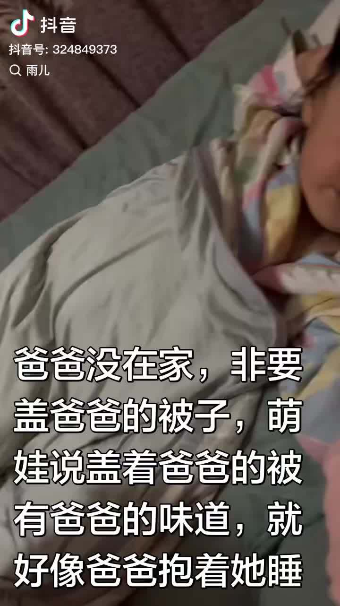
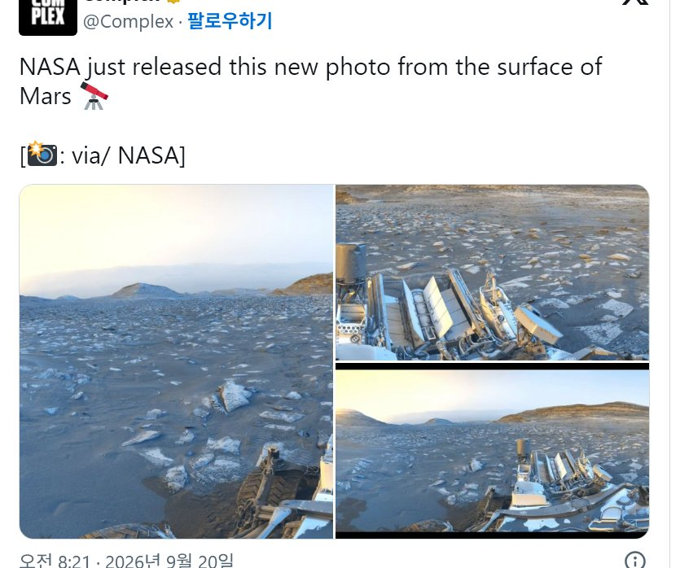
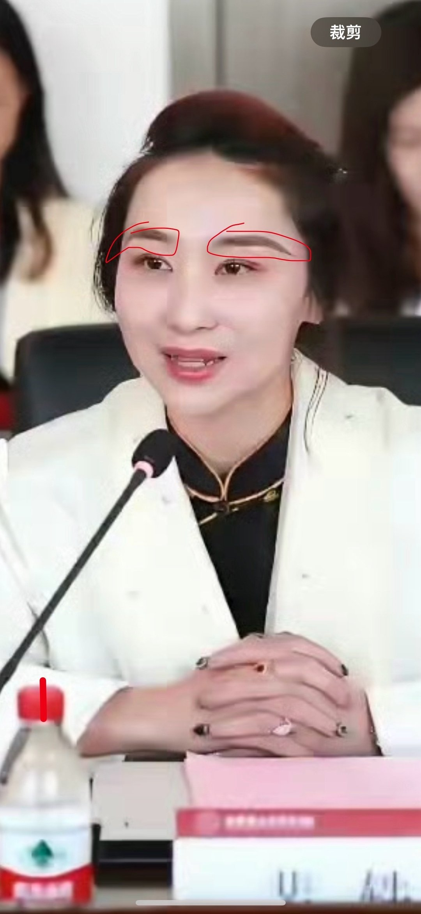
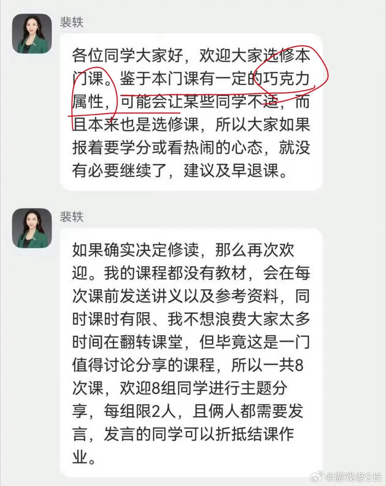
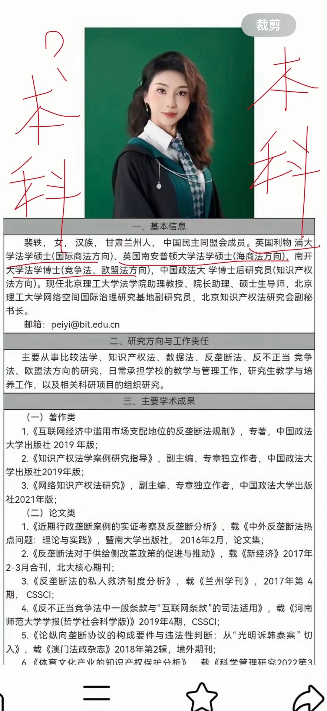
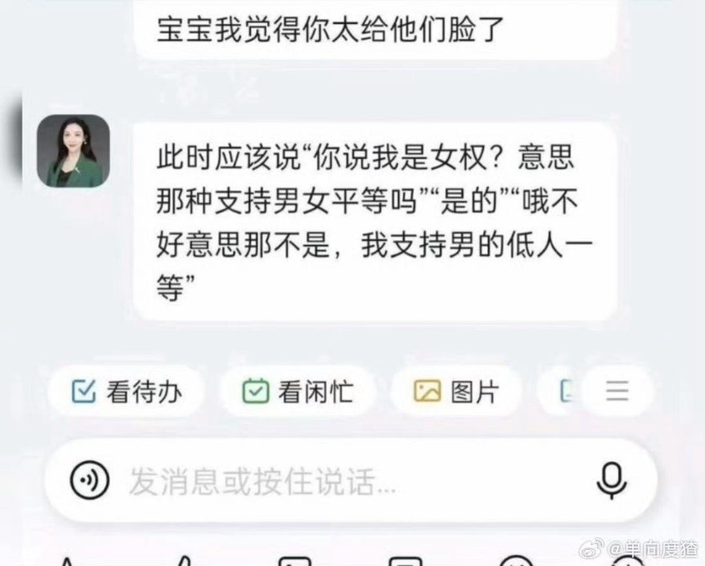
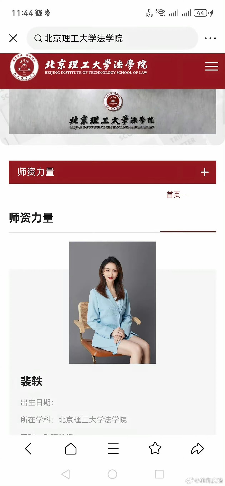

# 2026-09-24

## 1

@黄斌

发表于：2026-09-23 13:15

来源：微博

链接：https://m.weibo.cn/status/5346420072909556

回复@骚浪贱的小泰迪:这是个青春饭，任何培训第一要务是哄孩子，第二要务是哄家长。年龄大了，哄的效果不会太好，建议你慎重考虑。//@骚浪贱的小泰迪:黄老师您好，我今年35岁，目前在三线城市，一个私企做技术开发，想转行做雅思培训老师，这个有什么教培建议吗，除了雅思成绩高之外，还有别的需要考虑吗，谢谢！

---

## 2

@幻想狂劉先生

发表于：2026-09-23 13:10

来源：微博

链接：https://m.weibo.cn/status/5346418829296140

见父知孝，见兄知悌，见孺子落井而知恻隐，根源在于良知，良知是天然、先验的，不假外物而存，是“亲亲之爱”的源头，外在戒律规训出的行为并不是孝，只能叫顺。真正的孝需要致良知，因为先天的良知会被后天遮蔽，而致良知是很难的，顺则很容易，跪下磕头就行。当代儒家大省那些“传统规矩”，本质上是一种以顺代孝的刻奇表演，盛行这种刻奇表现的地方必然是道德黄泛区//@布尔费墨://@梵鸢iris:孟子曰：“人之所不学而能者，其良能也；所不虑而知者，其良知也。孩提之童，无不知爱其亲者；及其长也，无不知敬其兄也。亲亲，仁也；敬长，义也；无他，达之天下也。”  孟子说：“人不必学习便能做到的，是良能；不必思考便会知道的，是良知。两三岁的小儿没有不知道爱他父母的；等到他长大，没有不知道敬爱哥哥的。亲爱父母是仁，敬爱哥哥是义，没有别的原因，只因这两种品德可以通达于天下。”  女儿每天都要使劲闻我常穿的睡衣的味道。她说这是妈妈的味道。睡衣刚洗完有洗衣液的味道残留，女儿说，她不喜欢这个味道，不过过几天这个味道就没有了，妈妈的味道就会回来的。

---

## 3

@米兔的韩流生活

发表于：2026-09-20 03:53

来源：微博

链接：https://m.weibo.cn/status/5345191314591708

NASA最新公开的火星表面照

---

## 4

@西原秋微博

发表于：2026-09-23 11:35

来源：微博

链接：https://m.weibo.cn/status/5346394783350931

\#北理工裴姓教师被指论文造假\#现在招聘教师只看漂洋过海，不看师风师德，堂堂985北京高校，背调形同虚设。

进北京普通高校，第一学历绝对卡得死死的（英雄不问出处，也不是歧视第一学历，而是说现在高校第一学历985/211几乎都是硬杠杆），裴教授在官方简历中刻意隐去本科学校，完美避开第一道关卡。

再说硕士。我曾经是国内第一批2年制的人大硕士，就业时都还被歧视，说不如多混一年的。现在国内硕士有部分又回退到三年。裴教授两个海外高校都是一年制的水硕，而且排名非常靠后，缺乏亮点。

博士这玩意儿，就那么回事。博士后，更是那么回事。没有读之前觉得好神圣，读完以后也就那样。认认真真做学问，踏踏实实做人的除外，真的是累死人的。

裴开设的这种课程，其实花里胡哨没啥实质内容，无非是披着“大数据”“数字化“智能化”这样高端、前沿的教学外衣，标注的是权益保护，说的可是其他东西。

登堂入室，哗众取宠，搞男女性别对立，培养极端思维，制造偏激话题，动机和目的极为可疑，这太可怕了。谁没有在路上、地铁上或者公共场合遇到过极端女性啊（男性也不少，这里暂不谈）。

学校应当认真反思，什么标准招聘进来？什么人拍版的？有什么特殊学术背景是学校紧缺的？有无重量级的公开著作？有哪些业内亮眼研究成果？国外有无接受过背景可疑的团体资助和熏陶等等？

学历持续断崖式贬值，我16年前毕业的时候要想进贵州大学，除头部大学博士外，还需要国外留学背景。而我本科毕业和硕士毕业的时候，贵州大学和贵州师范大学抢着要。

当前，诸多踏踏实实国内读书，勤勤恳恳做学问的老师，连普通高校都进不去（燕郊的民办高校都未必能进），更别说京城985。

裴教授在教学群内都敢如此肆无忌惮发表女权宣言，用什么“巧克力属性”侮辱男性不如狗（恶补一阵才知道），可以预见其背后应该已经形成稳定的数量不小的群体。

其身上的光环太过耀眼，京城985教授，博士后，喝过洋墨水，年轻女性，副教授，硕士生导师，简直就是很多没有独立思考能力的女拳师们心中的完美酵母。

联想起湖南长沙的4岁女童摸臀案，杭州电梯猥亵案，不都是一群没有啥文化的女性，在这些批着光环的女性极端高知们的怂恿和教唆下挑战社会底线的典型吗？\#北理工女性课程被叫停\# \#北理工 裴轶\#

