# 2026-09-26

## 1

@李子暘Lee

发表于：2026-09-26 08:53

来源：微博

链接：https://m.weibo.cn/status/5347313067493705

“普通消费者的一句抱怨”

-

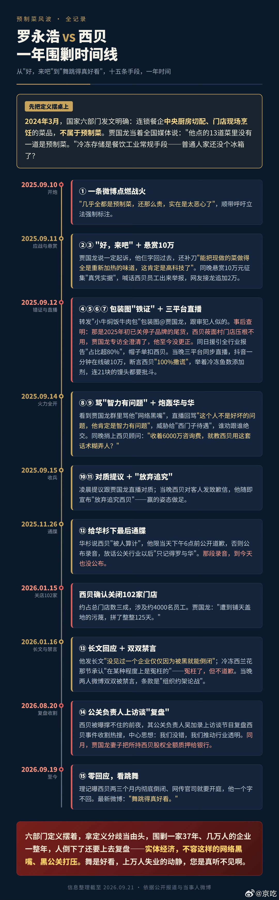

---

## 2

@明涛AI_ECON

发表于：2026-09-26 07:53

来源：微博

链接：https://m.weibo.cn/status/5347312466398440

嗯嗯我只是说从成本结构来看这些景点维护这么多NPC的人力成本太高了，而从最终用户付费角度来看收益波动巨大而难以匹配长期成本投入，如果没有政府补贴就必然要传导到最脆弱的劳动市场，让劳动者转化为非独立承包商来承担这种风险。如果是事业单位就可以理解了。//@Andre_安猪:很多这种 npc 是政府养活的剧院的演员参与的，成本并不高，因为很多时候政府拨款可能已经覆盖 60% 了，自己只需要解决 40%，和景区合作其实是双赢//@明涛AI_ECON:上次暑假去某景区玩耍，看到好多青年男女穿古装站在景点某处，据说是NPC，我心里一盘算，这人力成本太高了，猜想又都是外包公司运营，这些NPC应该是按独立承包商即日结的形式参与吧，要不然这客流和利润太低了公司根本维持不下去吧。

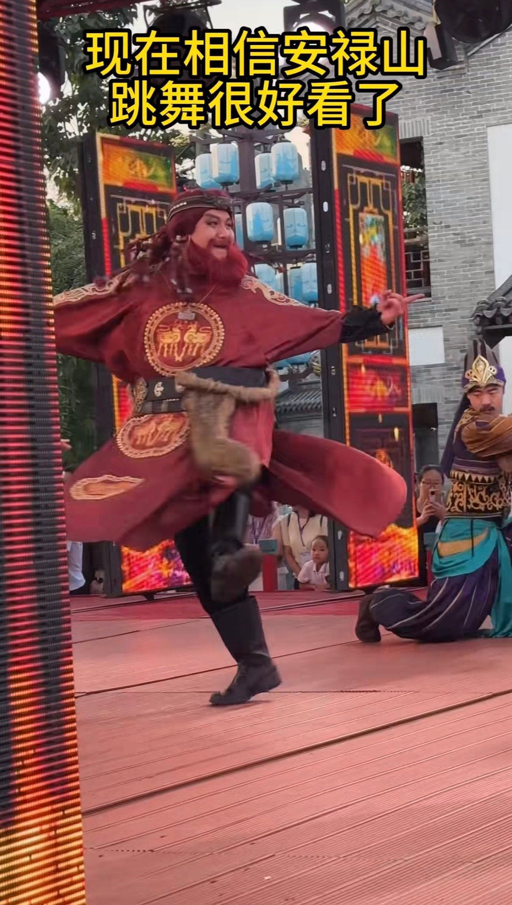

---

## 3

@前HR本人

发表于：2026-09-26 07:53

来源：微博

链接：https://m.weibo.cn/status/5347309259063625

//@用户6902080121:还有脚踢//@水击千万里:因为会被拳打。//@1哈哈呵呵33:那些女为什么不去这打拳

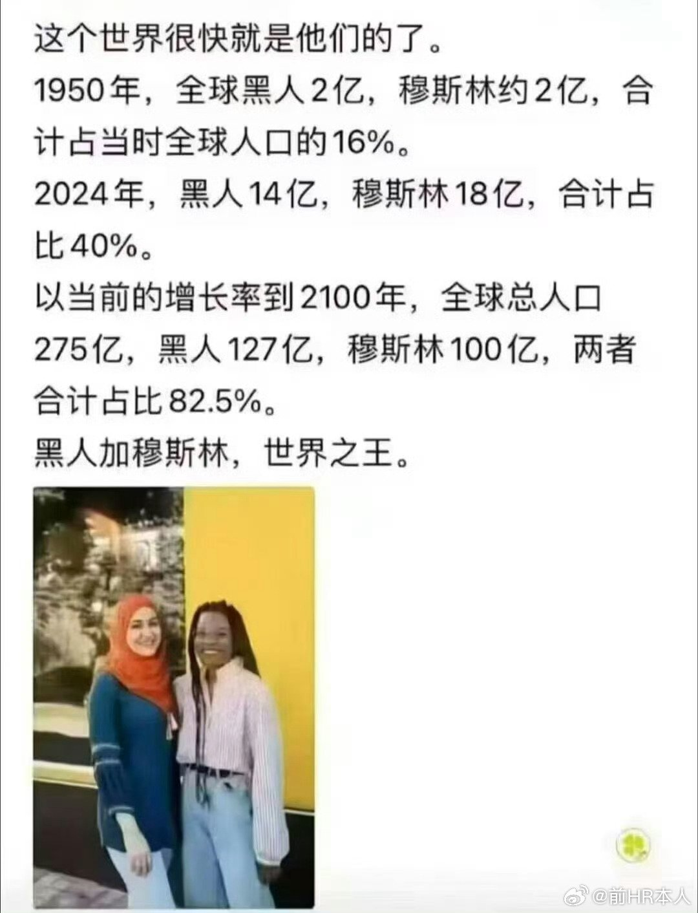

---

## 4

@汪海林

发表于：2026-09-25 17:15

来源：微博

链接：https://m.weibo.cn/status/5347205315035361

经历了八十年代、九十年代到现在，感觉社会风气很多方面更保守了。影视的暴露尺度、亲密尺度跟八九十年代没法比，如今泳装、吊带短裙等日常穿着的尺度、当下明星穿着的性感程度都是近几十年来最保守的，思想方面更是倒退得非常严重。现在年轻人是身体越放荡，思想越保守。

---

## 5

@真驰骋

发表于：2026-09-23 05:06

来源：微博

链接：https://m.weibo.cn/status/5346296988959882

旧社会的资本家太万恶了。

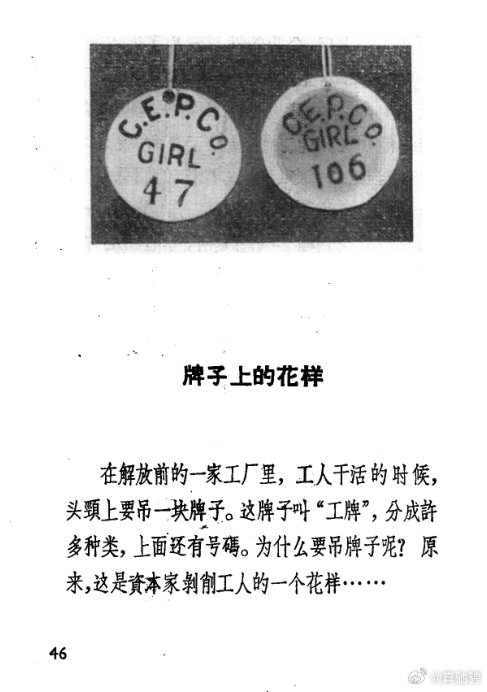

---

## 6

@史老柒

发表于：2026-09-25 14:07

来源：微博

链接：https://m.weibo.cn/status/5347158006957226

//@旷野vacation:那时候我还很瘦//@季易融:竟能如此相像……//@顾扯淡:搜了一下后面的……「资本家把临时工人分成为临临时工、短临时工、临时工、基本临时工、特别临时工等多种。」「资本家雇用临时工人，可以付出最少的工资，获得最廉价的劳动力，进行最残酷的剥削和压榨。一个长工的工资每天一元多，而一个临时工人的工资，有的每天只有三角八分，只抵长工的三分之一。」

---

## 7

@高飞

发表于：2026-09-25 06:16

来源：微博

链接：https://m.weibo.cn/status/5347039409865461

\#马斯克黄仁勋苏世民等参加白宫欢迎宴会\# 

给一个比较全的：

Jensen Huang, NVIDIA, CEO  

  黄仁勋，英伟达首席执行官

Mark Zuckerberg, Meta, CEO  

  马克·扎克伯格，Meta首席执行官

Dr. Lisa Su, Advanced Micro Devices, CEO  

  苏姿丰博士，超微半导体（AMD）首席执行官

Tim Cook, Chairman of the Board of Apple  

  蒂姆·库克，苹果公司董事会主席

John F.W. Rogers, Goldman Sachs EVP and Secretary to the Board  

  约翰·F.W.罗杰斯，高盛执行副总裁兼董事会秘书

Lynn Martin, President of the NYSE  

  林恩·马丁，纽约证券交易所总裁

Eric Yuan, Zoom, CEO  

  袁征，Zoom首席执行官

Kelly Ortberg, Boeing, CEO  

  凯利·奥特伯格，波音首席执行官

Larry Fink, Blackrock, CEO  

  拉里·芬克，贝莱德首席执行官

Stephen Schwarzman, Blackstone, CEO  

  史蒂夫·施瓦茨曼，黑石集团首席执行官

Sam Altman, OpenAI, CEO  

  萨姆·奥特曼，OpenAI首席执行官

Greg Brockman, OpenAI, President & Co-Founder  

  格雷格·布罗克曼，OpenAI总裁兼联合创始人

Dr. Miriam Adelson, Las Vegas Sand, Controlling Shareholder  

  米丽娅姆·阿德尔森博士，拉斯维加斯金沙控股股东

Sergey Brin, Google/Alphabet, Co-Founder  

  谢尔盖·布林，谷歌/Alphabet联合创始人

Satya Nadella, Microsoft, Chairman & CEO  

  萨蒂亚·纳德拉，微软董事长兼首席执行官

Jim Taiclet, Lockheed Martin, Chairman, President & CEO  

  吉姆·泰克利特，洛克希德·马丁董事长、总裁兼首席执行官

Sundar Pichai, Google, CEO  

  桑达尔·皮查伊，谷歌首席执行官

Larry Culp, GE Aerospace, CEO  

  拉里·卡尔普，通用电气航空航天首席执行官

Sanjay Mehrotra, Micron, CEO  

  桑杰·梅赫罗特拉，美光科技首席执行官

Cristiano Amon, Qualcomm, CEO  

  克里斯蒂亚诺·阿蒙，高通首席执行官

Jeff Bezos, Amazon, Chairman  

  杰夫·贝佐斯，亚马逊董事长

Jeff Yass, TikTok  

  杰夫·亚斯，TikTok（投资者）

Jamie Dimon, JP Morgan, CEO  

  杰米·戴蒙，摩根大通首席执行官

Michael Dell, Dell, CEO  

  迈克尔·戴尔，戴尔首席执行官

Mary Barra, General Motors, CEO  

  玛丽·巴拉，通用汽车首席执行官

David Solomon, Goldman Sachs, CEO  

  大卫·所罗门，高盛首席执行官

Jane Fraser, Citi, CEO  

  简·弗雷泽，花旗集团首席执行官

Elon Musk, SpaceX & Tesla, CEO  

  埃隆·马斯克，SpaceX和特斯拉首席执行官

Darren Woods, ExxonMobil, CEO  

  达伦·伍兹，埃克森美孚首席执行官

David Ellison, Paramount Skydance, CEO  

  大卫·埃里森，派拉蒙Skydance首席执行官

Brad Gerstner, Altimeter, CEO  

  布拉德·格斯特纳，Altimeter首席执行官

Albert Bourla, Pfizer, CEO  

  阿尔伯特·布尔拉，辉瑞首席执行官

David Sacks, Co-chair, President's Council of Advisors on Science and Technology  

  大卫·萨克斯，总统科学技术顾问委员会联合主席

Bernard Arnault, LVMH, CEO  

  贝尔纳·阿尔诺，路威酩轩（LVMH）首席执行官

Ryan McInerney, Visa, CEO  

  瑞安·麦金纳尼，Visa首席执行官

Michael Miebach, Mastercard, CEO  

  迈克尔·米巴赫，万事达卡首席执行官

---

## 8

@幻想狂劉先生

发表于：2026-09-22 14:26

来源：微博

链接：https://m.weibo.cn/status/5346075428521559

俄国普通青少年男女搞对象最普遍的约会方式是散步，因为公园多、森林多。关键是按社交礼仪，约会应该男的掏钱，那男的没钱怎么办呢？那也不能让女的掏钱，那就散步，散步不花钱，面子也有了。

那要是有钱但不多，就可以去Rustics或者味真足，前者是换皮肯德基，后者是换皮麦丹劳，消费水平差不多。100块钱人民币俩人基本能靠俩套餐（不太大）消磨一个下午。

不过不管是十公里强行军还是蹲一下午味真足，放到小红薯都够死刑起步的吧？

---

## 9

@幻想狂劉先生

发表于：2026-09-25 06:30

来源：微博

链接：https://m.weibo.cn/status/5347042836088805

我经常看到两个小年轻面对面坐在咖啡馆或者饭店里，也不说话，低头各玩各的手机。要不是俩人吃完牵着手走的，我还以为是两个拼桌的食客//@寝取的史官:谈恋爱我最喜欢做的事就是两个人一边走一边聊，走累了坐着聊，有力气了继续走，话根本说不完。

---

## 10

@塔列郎

发表于：2026-09-25 04:42

来源：微博

链接：https://m.weibo.cn/status/5347015652804131

钱钟书重病昏迷不醒期间，范旭仑曾指出杨绛的回忆录中有不真实的情况，说钱钟书在英法留学时，杨绛主要负责钱钟书的衣食住行，只是陪读太太，并不是她回忆录所说的也在留学，并且指出她在清华也是研究室肆业，没有毕业，惹得杨绛十分生气，直接以钱钟书的名义起诉了范旭仑，向国家版权局要求销毁范的五千册著作《钱钟书评传》，还要求人家赔钱并且公开道歉。

---

## 11

@刘晓光Savvy

发表于：2026-09-21 05:00

来源：微博

链接：https://m.weibo.cn/status/5345570679947754

周梅森是国内所有官场小说的执牛耳者，我看过无数的这类小说，斗胆认为，不论是立意，内容，还是构思，都远远不如周。

江苏人不够尊重周梅森，可以说周梅森就是我们江苏乃至全中国的马尔克斯。

传统的官场文，比如国画，梅次故事，二号首长等等。

里面的官员基本属于无组织，无纪律，无信仰，无底线，纯粹的利益动物，有B操我立刻就操了，有肉吃我立刻就吃了，有钱收我立刻就收了。

全程不会有任何的纠结，彷徨，畏惧，害怕。

而且这类小说里的世界纯粹的丛林社会，无恶不作，我只要贿赂，送礼，送钱，送美女，我就能升官。

这么写小说是好看，很刺激，但是在立意和内核上，都落了下乘。

周梅森宇宙里构建的生态，没有这么的腐败堕落，但是它展现出的一切会更加的让人绝望。

在周氏宇宙里，没有纯粹的坏人和贪官，大家都是好人，都是好干部，这是看法不同，立场不同而已。

但让人绝望的是，所有人都不贪不腐，都廉洁公正，都精明能干。

可所有的一切，人民百姓，社会环境，都不可救药的朝着最糟糕的方向堕落，永无止尽。

大部分作家只写官员的腐败堕落，但是周梅森特别擅长写在一个错误方向，错误体制的引导下，整个社会环境老百姓的堕落和倒霉。

为什么所有人都精明能干都廉洁公正，但整个社会就是不可避免的朝着糟糕的方向滑落呢？

这个不得不提周梅森小说里永恒的4大难题了：

污染

贪腐

债务

民生

我称之为周梅森天启四骑士。

所有人都精明能干，都踊跃发展，都积极进取。

表面看GDP和经济数据节节高涨，

但是首先，污染不可避免到来，经济数据是高了，可是老百姓就连呼吸和喝水都成问题，民生苦不堪言。

然后是贪腐应运而生，主政官员自己不贪，但是他纵容自己手下贪，甚至勒令手下人不得不贪。

比如手下那么多项目和工程要开发，但是我你不给钱，只给命令和压力，逼着手下干部必须把项目做起来。

那就必须和一帮商人吃吃喝喝，卖地卖钱，稀里糊涂过手了无数流水，最后一看，我成贪官了？！

最后最可怕的是债务，为了自己短短几年的任期账面数字好看，各种工程上马，负债无数，最后自己拍拍屁股高升了，留了一地烂尾楼和当地老百姓还债。

以上三者重重叠加，本地居民的就业，民生，生活环境一塌糊涂。

这些主角也不是故意如此，但是为了晋升，就必须干数据，干GDP，把经济数字搞的漂漂亮亮的。

至于真实的本地民生，居住体验，这个完全不考核。

更悲哀的是周梅森不断写真正在意老百姓福祉和切身利益的主角，往往比较倒霉。

至高利益的李东方，他上任后，手下的市长只想着修路，修一条市内根本用不着的宽敞大道。

他一直百般推脱，导致班子所有人都觉得他是个昏官。

他的全部精力都用来解决下岗工人的伙食，再就业，下岗补助费这些解决方面，按照市长的想法就是：苦一苦工人，钱省下来，修路了，我们就能高升了。

李东方的想法是工人的日子一天都过不下去了，不能再苦了，必须立刻解决。

除此以外，中途还出现了局长带着30亿跑路的重大贪腐事件，全方位的追赃追查，一路反腐到底，搞得全市上下人心惶惶。

那么最后的结果是什么呢？

造成贪腐和工人倒霉的元凶，省委正副书记两个人都好好干着，未来大概率更进一步。

整天溜须拍马只想着苦一苦百姓多修路多建工程的市长，内定要升省常委了。

李东方先解决民生，再解决饮水和环保，最后解决贪腐，代价是得罪了无数同僚。

省委书记拍着他肩膀让他好好反腐，把官员严查到底，

但是查完以后，就一句赞叹，没有了。

就连省常委都没让他进去，他一个省会城市市委书记于情于理是必须要进常委的，但是直到他退休，就是不让进。

因为得罪人太多，每次都有人投反对票，而省委书记表面对他力挺，实际上每次都以太多人反对为由，通知他你又没进常委。

李东方这辈子，从此仕途彻底断绝。

这个就是在周氏宇宙里，少数几个关心民生，百姓福祉的官员，最后的下场。

甚至就连老百姓自己都不感激李东风。

当地的百姓喝水问题解决了，污染没有了，正常喝上自来水了，下岗工人的补助费用都足额拿到了。

但是路过自己凋敝的城市街头时候，还是会说一句：

我觉得我们城市的领导能力还是不行，街头的路一直破破烂烂的，不像隔壁市那么整洁宽敞，浩浩荡荡的，多气派啊。

---

## 12

@伊利达雷之怒

发表于：2026-09-25 04:46

来源：微博

链接：https://m.weibo.cn/status/5347016800473162

换句话说不加入汉大帮就寸步难行。//@风咒:我们最有含金量的教授又因为骂全体男人被网暴啦//@史老柒: 查看图片 //@大笨蛋你在里面吗:汉大帮好啊，人人都想去汉大帮//@冬亚:对的啊，她不过是说了句男性就是低人一等，怎么能叫打拳呢？男性低人一等很正常的事实描述啊，也是我们法治构建的目标和方向。//@老曲-LQ://@劳东燕2004:对于网络舆论环境的日益糟糕，我也算是亲历者与见证者。一门关于女性权益保护的大学选修课程，被污名化为“打拳”而被叫停，又进一步刷新了我的认知。

---

## 13

@史老柒

发表于：2026-09-25 04:47

来源：微博

链接：https://m.weibo.cn/status/5347017083848455

涨知识//@蘸盐:传统的干货(鱼翅,海参,鲍鱼,鱼肚,鱼唇,熊掌,驼掌,驼峰等等)是不能鲜吃的,要先做成干货(这当中其实也有一个熟成发酵的过程),吃的时候先发制,之后加上各种佐料,老母鸡,肥鸭,火腿,干贝,肘子,排骨,棒骨之类,来慢煨入味。不同原料发制方法不同,有用温水发的,有用开水发的,有上笼二次蒸的(比如熊掌)。干鱼肚要用低温油炸来发制。包括过去普通人家吃的干鱿鱼,干海带,干竹笋(玉兰片)什么的,也都是先干制再发制的。//@我不想打星际:这么差么?我家做鲍鱼,都是当天现买的活的啊 //@ZBAARWY01_:和广州朋友聊了聊,创始人杨贯一老先生23年去世后,阿一鲍鱼总店一度关门,最近重新开门后,原来的行政总厨葛金存师傅和几个之前有水平的师傅都没回来,现在已经不知道是什么人在管了,品控已经彻底塌房了。22年老唐去的时候那个让他惊艳到直呼天花板和绝顶的味道就这样绝版了,实在是可惜……//@猪头不卖-FIA皖舵:在广州还能吃到鲍鱼冻品？

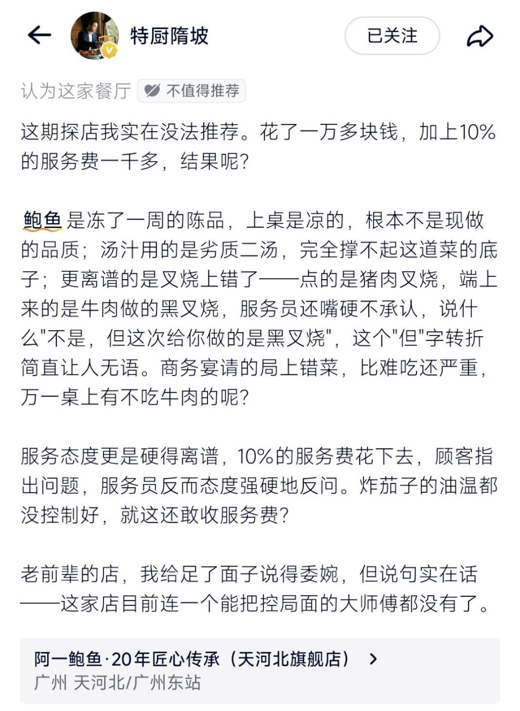

---

## 14

@风云学会陈经

发表于：2026-09-25 02:59

来源：微博

链接：https://m.weibo.cn/status/5346989757958785

华为与赛力斯，一次声势浩大的权、利再分配

看看赛力斯从东风小康起家的发展历史。问界为什么成功，又为什么要分家。

现在分家了，赛力斯主导问界发展，华为退化为供应商。我为问界捏把汗。

逻辑是，问界的品牌溢价来源是华为。客户拿出30-60买车，行为模式不是精打细算，而是相信品牌。上百万买问界车的，有多少很懂车？和手机一样，没多少人懂。

如果，问界分家后第一次独立推出新车型或者改款，市场反应不佳，对赛力斯会是灭顶之灾。总不可能靠卖知豆吧。

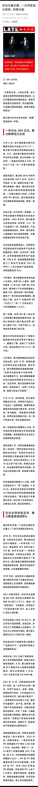

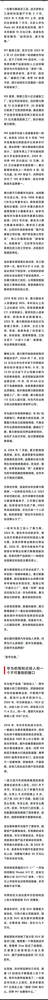

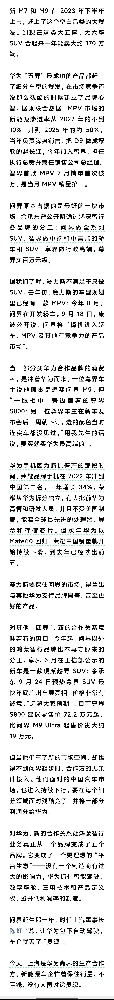

---

## 15

@sven_shi

发表于：2026-09-24 01:19

来源：微博

链接：https://m.weibo.cn/status/5346602298379136

关于北理工的所谓法学女权课，我想从法学专业的特点来给大家讲讲现在法学圈的女权问题。这些人绝大多数不是在搞女权，而是这个专业出头太难了。像我在网上写的这些案例，绝大多数其实不是我搜集的，其中一位给我提供案例的老师，退休前也是名法学教授，他一直都是一个非常激进的死刑支持派。

但是我搜索他年轻时发的文章，发现他年轻时也搞过废死。为什么？他早年太想进步了，看同事来了一个激进的废死派，升的特别快，就以为是领导喜欢。大家都争相去搞废死。为什么不搞本专业呢？

因为出头太难了。法学这个专业有个特点，你很难搞出真正意义上的理论创新。所以着重都是搞制度创新。而女性权益是这些年法学圈的一个“富矿”，特别容易出成绩。从“非亲历不可知”再到“家务劳动补偿”甚至是“性防卫能力测试”，都是新制度。有些制度因为客观原因，你都找不到有分量的专家背书。比如现在在实施的性防卫能力测试，出了名测不准，但是也一直在用。

这个行当，创新太难，可要往上走，就是要新。

接着你在看北理工这次事件的教授女主。她的学历坦白讲是比较水的。走的就是一个很一般的学习路径。从一所双非师范类院校的法学专业，到英国留学读硕士，再回到国内直接去985读博，接着去北京理工这样的985高校做博后留在高校，这个履历对大学招聘稍有了解的人，都不可能相信这条非正常路径的。

你再去看她讲课，就是在网上找点热点事件凑一凑，自己点评下，连深入的案例对比都没有。都不需要去谈内容，她讲课的能力网上大家都看得到，基础表达肯定也是有问题的。

从一所双非院校起步，到英国留学，家里肯定也花了很多钱。再进到985高校里任职当教授，家庭肯定也给予了她非常高的期望。但是各方面来讲，不管是履历还是表达能力，她确实有点欠缺。所以也能理解为什么进入大学开课后，转过头放掉了原先的本专业，去搞所谓的女权研究。

只是她的履历出来，确实没说服力。

---

## 16

@风中的厂长

发表于：2026-09-24 00:03

来源：微博

链接：https://m.weibo.cn/status/5346582998551339

我今年虽然也干了不少事情，但是工作时间比以前少了三分之一，而且今年有一半时间在外面玩。因为我想通了几件事：

1.现在这种卷法没有赢家。当一个行业人人都在卷，不如停下来休息，看看风景。等到他们倒下了，再上路。

2.以前争强好胜是动力，现在争强好胜是大坑。不再“证明自己”是智慧。

3.提高生活质量就三件事。吃好、睡好、玩好。身体第一位。身体好才是真赢。其他都是空的。

4.只要你活的足够久，就能看到许多奇迹发生。前提是活着。

5.卷本质也是一种懒惰，少用体力多思考，很多时候只要脑子转个弯，这个世界便对你开了挂。

---

## 17

@蚁工厂

发表于：2026-09-23 23:59

来源：微博

链接：https://m.weibo.cn/status/5346582186688756

罗福莉：

MiMo-V3 将采用一套全新的模型架构，其核心设计 HySparse2 于今天正式公开。

（论文：arxiv.org/pdf/2609.26368）

更低的 Prefill 开销、更小的 KV Cache、更强的长上下文检索能力——这一次，我们三者兼得。

与 MiMo-V2.6 所采用的 Hybrid SWA 架构相比：

• 在 100 万 token 上下文下，Prefill FLOPs 降低 5.02 倍

• 在 100 万 token 上下文下，KV Cache 缩小约 4.5 倍

• MRCR-v2 和 RULER-v2 得分更高，同时 AgentPPL 和 LongPPL 更低

为什么要设计一套新的架构？

因为 Agent 场景下的推理负载与传统大模型推理非常不同。每一轮交互中，模型可能只生成一个很短的 action，但这个 action 调用工具后，却可能返回一段很长的 observation，而这些新内容都需要进行 Prefill；与此同时，整个历史上下文还在持续增长。

这意味着，Prefill 计算开销、KV Cache 容量以及长上下文检索精度，会同时成为 Agent 推理链路上的关键瓶颈。

HySparse2 通过两级 KV 共享，同时解决这三个问题：

• KV Bridging：沿用 YOCO 的思路，Cross-Decoder 中的 Full Attention 层基于 Self-Decoder 的 hidden states 构建自己的 K/V。

• KV Reuse：在每个 hybrid block 内，Sparse Attention 层直接复用前一个 Full Attention 层生成的 KV Cache 和 selection indices。

此外还有两项关键改动。

第一，token-level selection 取代 block-level selection。稀疏注意力不再以整个 token block 为粒度进行选择，而是直接选择具体 token，从而能够将有限的 attention budget 更精确地分配给长上下文中真正相关的位置。

第二，用强制保留最近 token 的局部窗口取代独立的 SWA 分支。最近的一段 token 会被强制加入 Sparse Attention 的选择集合，因此局部 token 和全局检索得到的 token 可以共用同一份 KV Cache。

这样一来，Cross-Decoder 所需的所有 KV Cache 都可以由 Self-Decoder 的 hidden states 构建。因此在 Prefill 阶段，一旦 Self-Decoder 计算完成，就可以直接结束 Prefill，无需继续执行 Cross-Decoder。

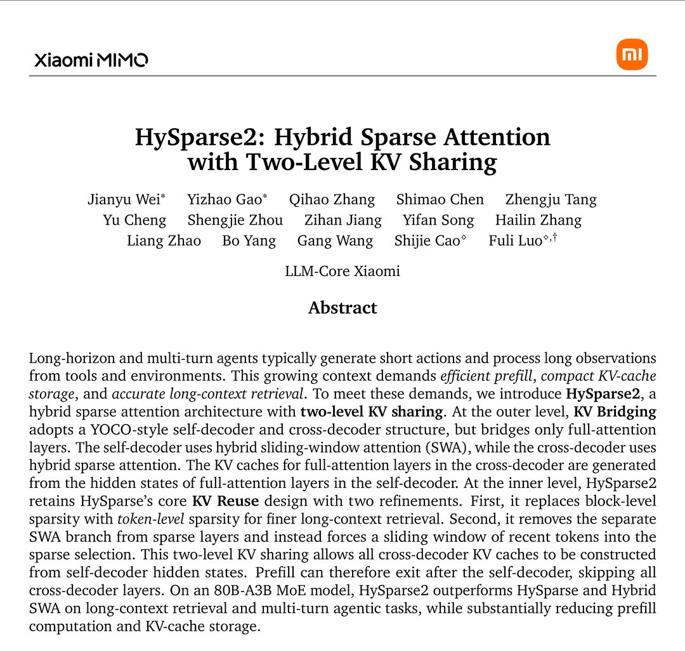

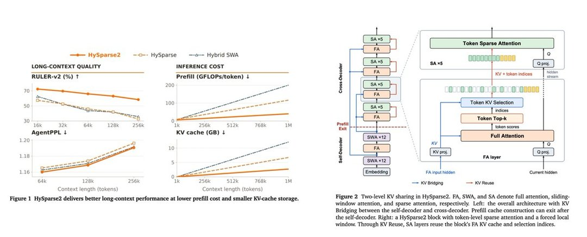

---

## 18

@财联社APP

发表于：2026-09-23 23:14

来源：微博

链接：https://m.weibo.cn/status/5346570696393572

\#据悉台积电代工将涨价3%至6%\# 【台积电据悉将于2027年1月上调晶圆代工价格3%至6%】财联社9月24日电，据Digitimes报道，台积电晶圆代工价格确定再涨。供应链人士透露，8寸厂产能利用率超过100%、45纳米以下制程满载的台积电，订单能见度已至2030年，已确定自2027年1月起，按照不同制程调整Wafer Out价格，涨幅约3%~6%，其中2纳米、3纳米等先进制程涨幅较高。台积电未回应市场传闻。

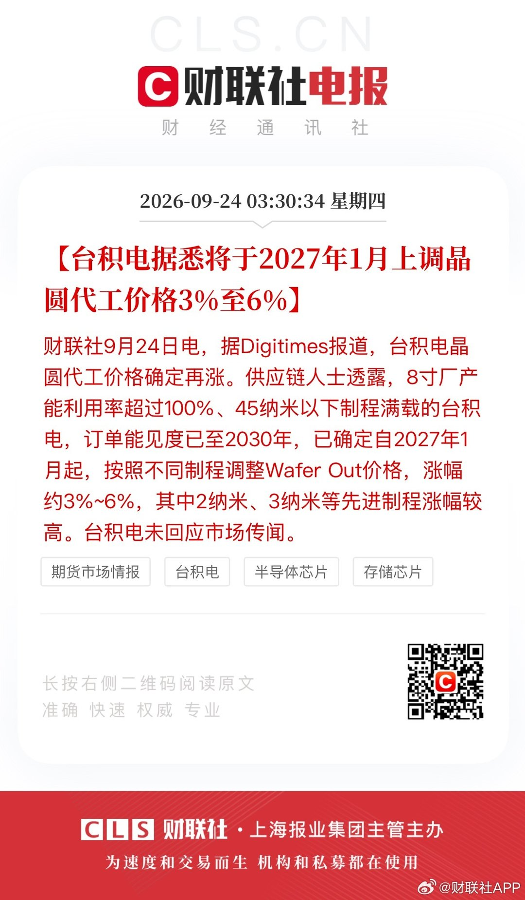

---

## 19

@梅新育

发表于：2026-09-23 11:58

来源：微博

链接：https://m.weibo.cn/status/5346400730613517

她力量  之  \#北理工裴姓教师被指论文造假\#

呵呵！

女拳教师，英国水硕，国内博士博后，军工名校开女拳课程，公然宣称作为军队军工主力的男人低等，入选“百名法学青年英才”培养计划，……，呵呵！

呵呵！

\#北理工女性课程被叫停\#

---

## 20

@张忆安-见龙在田

发表于：2026-09-23 09:55

来源：微博

链接：https://m.weibo.cn/status/5346369718194100

北京理工大学的这位裴老师的“女性权益”课程被叫停了。是好事，但我认为很可能远远不够。

首先大家要搞清楚，北京理工大学是什么性质的学校。这个学校的前身是1940年创建于延安的自然科学院，有着极其纯粹的红色基因。一度曾归属国防科工委管理，到现在仍然位列国防七子之一。不仅是所工科大学，更是非常重要的国防科技院校。

像这样一所院校，本来应该在其基因中就带着抵御西方思想渗透的精神内核，党建工作应该是其工作重点之一。不应该发生这样的事。

有人说，这位裴姓教师的课已经开了不止一年。这我相信。如果不是已经形成了一个很舒适、很排他、很一言堂的小圈子，在这样一所高校里，她的发言本该更谨慎，至少不会把“课是巧克力”“男人就是低人一等”这种话落在纸面上，让人如此轻易的抓到证据。因为如果她一开始就这样，在学校那边根本无法过关。

而她之所以能连续几年开这种课，一开始一定是把自己的课程包装成合规的妇女权益课。她上报的教学大纲、教案很可能是以我党的妇女解放运动和性别平等之类话术精心包装过的。只有这样，她才能在北京理工大学这样一所有浓厚红色军工色彩的学校站稳脚跟。

那么问题来了：她是因为得志便猖狂翻的车，在她翻车之前，已经在北理工这种地方传播类似思想不止一年。那么还有多少类似的人，打着类似旗号，在我国大学里散播类似思想？北理工有，北航有没有，哈工大有没有、西工大有没有？甚至于，军事院校有没有？

高校应该自查一下了吧？所有以性别、权益甚至公益名义开设的课程，都值得认真查一查到底教的是什么。

张忆安

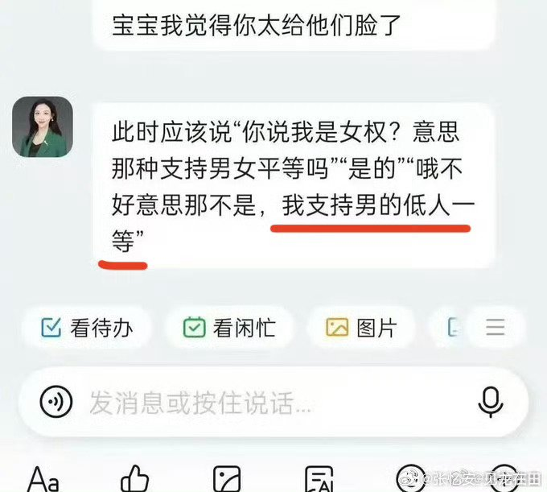

---

## 21

@是硯琳呀

发表于：2026-09-20 16:47

来源：微博

链接：https://m.weibo.cn/status/5345386157574020

很多人现在前额叶已经被短视频流媒体彻底弄废了，导致精神完全无法集中，男的都更容易软，而且刷短视频已经必须开1.5倍、2倍速，收藏几百条东西从来不会看，干正事十分钟就控制不住去摸手机。

这边我认真详细教大家原理和如何自救，我们也要相信自己大脑的修复渴求。

你每天看一百个观点，大脑会给你一种特别爽的错觉：今天我又学了很多。但晚上手机一放，工作没推进，身体没变，英语没学，真正困扰你半年的那几个问题，压根一点进展没有。

然后你开始焦虑，觉得自己今天又废掉了。焦虑完更不想面对现实，于是继续刷，第二天再来一次。人就是这么一点点被喂废的。

所以我最近开始干一件特别反人性的事：把大脑重新拉回“主动模式”。

第一，任何超过十分钟的上网，我必须知道自己进去干嘛。买裤子就是买裤子，查资料就是查资料，找一家餐厅就是找餐厅。绝对不允许自己随便看看

你只要一随便看看，一个小时以后，大概率已经知道某个明星分手了、一只猫会自己冲厕所、东京有家拉面排队两小时，但你已经忘了自己最开始为什么打开手机。

第二，做重要事情的时候，我现在特别讨厌消息弹窗。以前我也觉得自己可以多线程，一边写东西一边回消息一边刷点别的，感觉自己效率很高，毕竟我是高效率男人，但实际情况不是这样，一心三用往往三件事都只能有百分之10的进度，真的高效率还是慢就是快。

第三个方法听起来很蠢，但是特别有用。所有对未来有收益、但你懒得干的事情，先做五分钟。健身五分钟，看书五分钟，学英语五分钟，写东西五分钟。

别给自己定“今天看两小时书”这种鬼目标。很多人不是没有执行力，是目标一上来就把自己吓死了。先骗大脑五分钟，你会发现很多时候真正困难的根本不是做，而是开始。

最后一个，我现在觉得特别重要：看完一个真正有用的东西，必须输出。哪怕只打20个字，写一下“它到底讲了什么”“为什么我觉得它牛逼”“这东西跟我有什么关系”。你只看的时候，会产生一种非常廉价的满足感：我懂了。

但只要让你写出来，你马上就会发现，等一下，我好像没懂。这才是大脑真正开始工作的那一刻。

所以如果你最近经常脑子发木、什么都不想干、刷东西停不下来，先别急着给自己扣一个“我就是懒”的帽子。你可能只是把大脑训练成了一个只会吞信息的垃圾桶。

好消息是，这东西也可以往回练。每天五分钟，少吃一点刺激，多做一点输出，你甚至不用坚持一个月，先坚持七天看看。

你会发现自己重回专注巅峰。

---

## 22

@蚁工厂

发表于：2026-09-23 04:51

来源：微博

链接：https://m.weibo.cn/status/5346293167686320

开源版 Muse项目：OpenMuse

地址：github.com/CopilotKit/OpenMuse

OpenMuse 是 CopilotKit 开源的一套个人 AI Agent应用框架，类似前两天Meta发布的Muse项目。

项目集成了 Gmail、Google Calendar、PDF 处理、任务委派、目标追踪和个人记忆等能力，并支持用户随时接管浏览器或终端。它基于 CopilotKit、AG-UI 和 React Native 构建，可运行在 Web、iOS 和 Android，支持接入 OpenAI、Anthropic、Google 等模型，代码采用 MIT License；目前仍处于早期 Alpha 阶段。

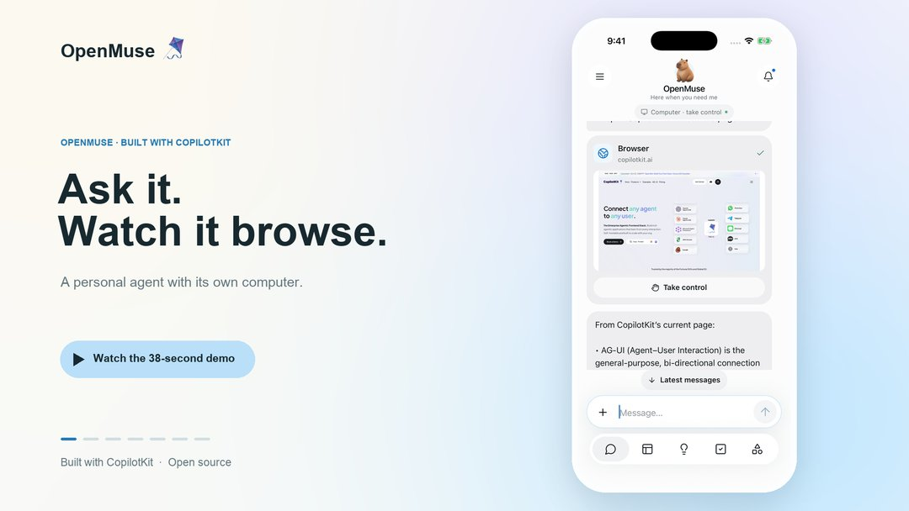

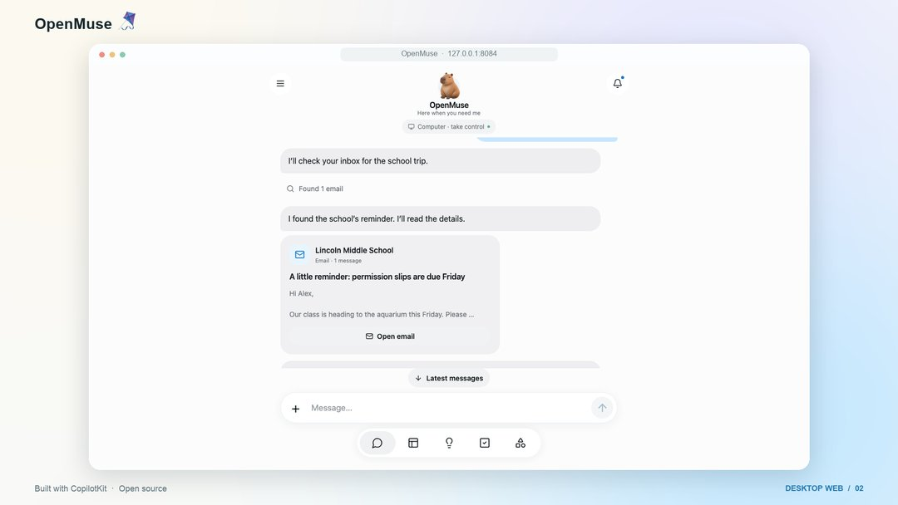

---

## 23

@高飞

发表于：2026-09-22 16:39

来源：微博

链接：https://m.weibo.cn/status/5346108932883237

\#模型时代\# Andrej Kaparthy谈Jev：在我看来，这位于 LLM 帕累托最优曲线上的一个点，处于这样一个领域：该领域存在巨大的显性潜在需求（无需思考、仅需单个token、可接受低延迟的智能），但由于各方竞相追求更高智能，导致该领域投资不足。

加入Anthropic之后，他发言少太多了，其实是LLM知识传播的一大损失。当然，不加入，是另一种巨大损失。

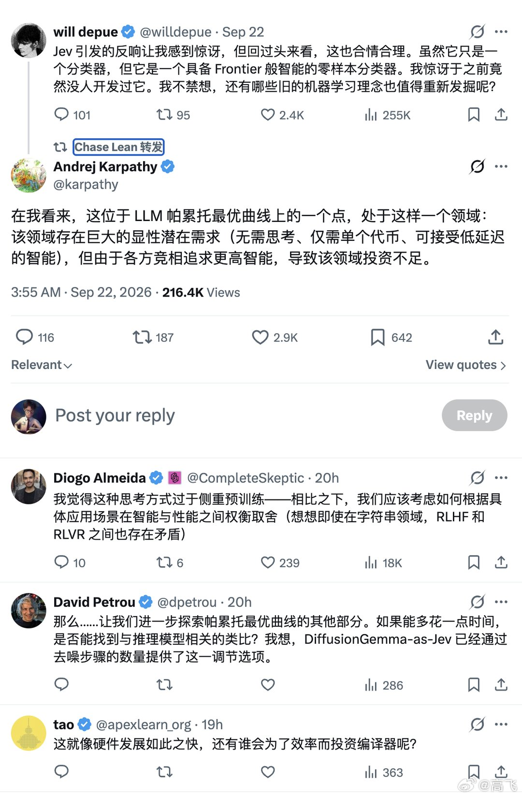

---

## 24

@司令本V

发表于：2026-09-22 03:08

来源：微博

链接：https://m.weibo.cn/status/5345904926132442

这个年龄段压力最大。

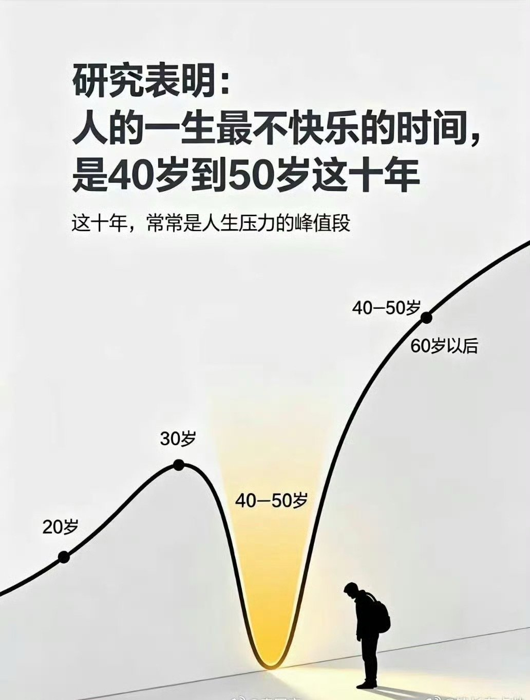

---

## 25

@风云学会陈经

发表于：2026-09-26 08:57

来源：微博

链接：https://m.weibo.cn/status/5347320602298345

北理工女硕导的事，很重要。说明某种搞法已经没什么收益了，一些男性很可怕，愤怒了，攻击了，决战了

有些搞法，女性要如何如何，我们说不好，或者保守点，不适合中国。但有些人说好，扯不清。一些人最喜欢最擅长的就是扯，也有很多人听。

以前有个脱口秀明星，主打攻击男性，还有不少商业合作。后来引发了极大的商业问题，男性用户暴走，一家主要电商平台管理层发火了，给出了极重的处罚，策划人被贬。事后看，这是一个社会转折点，很重要。

还有一些翻车事件，都是男性用户开始了攻击模式。如一位优秀独立女性给汽车代言，被男性群体攻击了，车企迅速切割。一些女性的广告创意被攻击出圈了，不得不火速处理。

其实，脱口秀明星、北理工硕导、优秀独立女性，本来都没事的，事业不错，代言、升值。人也很漂亮，超美，意气风发。就算一些男性不满意，她们也有自己的支持者，各走各道。

转折点是一些男性，很可怕，愤怒了，攻击了，要决战。

怕的就是这个。一些人不讲理了，直接退平台，对车企开嘲，分析硕导的论文。而且一些中立女性写手，似乎也因为流量吸引，加入了潮流，扩散事件。

中立地评估一下，很难应对。在商言商，如果会亏钱，就没道理好讲了。

对一些“姐妹”来说，可以不认同这个道理，但是最好不要出来送。如果是一个生意，它已经明显走下坡路了，没有好处，全是害处。

这个形势姐妹们还是要承认，不要跑出来送，自己吃亏。等形势有利的时候，再来搞，不利就先蛰伏着。

正确，或者不正确，说不好。但是现在遇到了挫折，形势不利了，这是肯定的。

如果不喜欢这种搞法的，倒是可以预期胜利了，进展重大，力量感出来了。这很可怕，因为可能会有乘胜追击之势，出一个事，就一堆人扑上去分析，雪崩了。

---

## 26

@泰拳刚猛

发表于：2026-09-21 03:53

来源：微博

链接：https://m.weibo.cn/status/5345553781360775

34% 的糖尿病前期，靠举铁"练"没了。

这不是鸡汤，是 2017 年发表在 PLOS ONE 上的一项随机对照试验（Resist Diabetes Trial）。

实验找了 170 位 50–69 岁、平时基本不运动、超重或肥胖的糖尿病前期成年人。其中一组每周做 2 次力量训练（不连着两天），每次 12 个动作、每个动作 1 组、8–12 次、中等重量。

12 个动作是：腿举、腿屈伸、坐姿腿弯举、提踵、卧推、高位下拉、划船、肩推、坐姿臂屈伸、下背伸展、卷腹、转体——全是健身房固定器械。

3 个月后，力量训练组里 34% 的人，血糖回到了正常范围，不再符合糖尿病前期的标准。

为什么力量训练对血糖这么管用？三点：

第一，肌肉是身体最大的"血糖仓库"。吃进去的碳水，七八成靠肌肉消耗。肌肉量越大，装血糖的仓库就越大。

第二，肌肉一收缩就能"吃糖"，还不依赖胰岛素。胰岛素抵抗的人，胰岛素这把"钥匙"不好使了，但肌肉收缩会直接把葡萄糖转运蛋白（GLUT4）送到细胞表面，把血糖拉进肌肉。练的时候在降糖，练完 24–48 小时胰岛素敏感性都还是提高的。

第三，50 岁之后肌肉流失加速，仓库越来越小，血糖越来越难控制。力量训练就是在给仓库"扩建"。

看懂这个逻辑就明白：控血糖不只靠少吃、靠跑步，肌肉才是长期控糖的基本盘。

但很多人不去健身房，器械一个都摸不到。视频里这 12 个动作，就是我参照这套研究方案改的家庭版——动作模式一一对应，器械换成哑铃、弹力带和自重：

深蹲（代替腿举、腿屈伸）：练大腿正面

臀桥（代替腿弯举）：练臀和大腿后侧

罗马尼亚硬拉（代替下背伸展）：练整个身体后侧链

站姿提踵（不变）：练小腿

地板哑铃卧推（代替器械卧推）：练胸

弹力带下拉（代替高位下拉）：练背阔肌

俯身哑铃划船（代替坐姿划船）：练背

坐姿哑铃肩推（代替器械肩推）：练肩

坐姿颈后臂屈伸（代替坐姿臂屈伸机）：练手臂后侧

鸟狗式（分担转体器械和下背训练的功能）：练核心稳定

地板卷腹（不变）：练腹肌

俄罗斯转体（代替转体器械）：练侧腹旋转

改动的原则就一条：在家里能安全做出来，练到的肌肉不变。

跟练前先看这几点：

热身：先花 5 分钟把身体弄热——原地踏步、开合跳、手臂绕环、空手深蹲都行，关节活动开了再上重量。

器械：一对可调重量的哑铃是最值的投资，一次买到位。没有的话先用矿泉水瓶、米袋子做起来，别等"装备齐了"再开始。弹力带买的时候直接问商家多大弹力，新手选轻到中等阻力、能标准完成 10–12 次的那一档。

次数：大部分动作每组做到 10–12 次力竭（最后一个实在起不来的那种）。卷腹、提踵、俄罗斯转体这几个例外，不追求力竭，做到有感觉、动作不变形为止。

频率：跟研究里一样，每周 2 次，别连着两天，给肌肉恢复的时间。

进阶：先徒手把动作做标准，再慢慢加负重。动作一变形就停，有不适就停，安全第一。

最后：本想着给视频配音，无奈尝试数次杂音和音效都搞不定，只好待下次再做更好。视频我用了AI agent帮我剪辑，第一次尝试，更改了7个版本，还是有很多瑕疵。但就像我之前说的，先做出来，以后再慢慢改善，我相信我会做的更好的。

这一套下来长运动的人可能觉得轻松，但如果用到最大负重的话，就算每个动作一组，也不那么容易的。而且动作基本覆盖了全身大部分肌肉，算是个不错的全身训练。所以就算你不用降糖，也适合作为居家力量训练的入门，或者减脂运动的一种。

论文原文：doi.org/10.1371/journal.pone.0172610

健身\#全民运动flag大会\#\#糖尿病前期\# 泰拳刚猛的微博视频

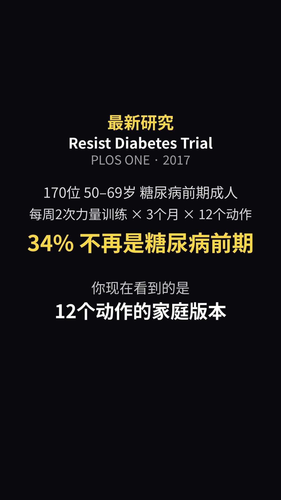

