# 2026-09-30

## 1

@南山林雪萍

发表于：2026-09-29 22:05

来源：微博

链接：https://m.weibo.cn/status/5348727843193307

一个工位、一个人需要多大的空间？在加州硅谷，感受到了创新空间的物理含义。在旧金山一条公路上，野草遍地半枯半绿的草坪插着一块“英伟达”。英伟达的两座新的办公楼都是以星舰所命名。那些描述太空故事的科幻电影，总是会被创业者所巧妙借用。一进入大楼就像是星级酒店的中空大堂，直向通透的屋顶。工位围绕着四边而向半山坡展开。只有抬头向上张望，才能看到看到那些开放的工位。它们就像是二楼或者三楼的阁楼，登上楼梯才能倒到。这些工位有点狭小，像山坡的野花一样，一簇一簇的点缀式散落。周边则是不同大小的会议室，走道上分布着一座又一座像封闭电话亭一样的独立电话间。

 工位，到底有何用途？北京和旧金山的办公大楼，在讲述不同的故事。在国内，工位有着强烈的个人属性。如果说办公室是上班员工的第二个家，那么工位就是自己的卧室，带有一丝私密性意味。那些总监或者总经理的独立办公间，则强化了一种秩序和等级。而在这里，工位没有意义，单纯如同白开水。它就是它本身所暗示的那样：工作时刻的位置。那一刻，那里，在工作。这座大楼的主人，黄仁勋，没有自己的工位。

 走出第一座大楼，满眼绿树映照下，光线从玻璃屋顶倾倒进来。一座太空船一样的建筑物豁然拉满眼帘。这座命名“voyage”的大楼，将前一幢办公大楼的极简工位风格进一步拉满。进入大厅，你会觉着这是一个无法归类的大楼。中空无比的结构，感觉内部都是空荡荡的。你需要走过一段开阔的路面，才能到达不太显著的“NVIDIA”logo前台。Nvidid的logo似乎被刻意做成了灰色的。与其说它存在，不如说它即将隐身而去。登上楼梯，随处可见一组组沙发，或者斜背椅子。这些悠闲的座椅，邀请者路人不妨坐下来休息片刻。有些像是西餐馆里的卡座，灯光明显调成了暗黄色。难道这里是倾诉衷肠之地？

 这里的确是讲述与倾听之地。它的整体结构可以看成是“海洋环绕着岛屿”。人们在岛屿上工作，而空荡的空间则像海洋一样各个岛屿相连。

这里真正要强调的是开放的公共空间。这是一个可以容纳4000人办公的地方。而每个工位都可以与大空间相连。人们在工位上只是有限的工作，而更大的创造则来自与其他人交流。

这里有一种剧场的效果。每个人的角色似乎是观看。而每一个座位，也随时会置入聚光灯成为主角的讲台。在这里的会议室，才是空间的灵魂。每一个角落都可以发现有趣想法的地方。在一个三层楼高度的地带，向下能看到一个空旷地带。那是黄仁勋年度演讲的地方。他的演讲水平越来越好了。以前还有业务经理一起讲，完成3小时的年度会议。而现在，他可以独立完成3小时的现场秀。而就在这个四下了望之地，有一个调酒吧台。这也被称之为Jensen’s Corner。很多重要的高级会议，就在这个四面空荡的角落召开。Jensen对玻璃器皿有着独特的鉴审能力，洞晓不同酒水需要何种玻璃杯。他在晃动着酒杯的时候，也在与群体交换着酒精里的激情。

英伟达公司强调“Speed of light”的公司文化，那就是一切行动唯快速。战略的参照原则并非竞争对手的策略，而是是物理极限。沿着物理直线的距离，确定行动仿真。光沿着直线行走，那才是直达目标的最快距离。竞争对手，只是干扰物而非参照物。这些触手可及的的群体场所，代表了一种即兴决策的偏好。黄仁勋的办公地点，就在会议室。那些决策就在瀑布一样的信息流中，即时而生。每一个地方都是创意屋。每一个角落都是决策堂。

空间里到处都是创始人的影子，一举一动。每个同事都能轻松感受到他就在身边。或许这正是不需要办公室也不需要工位的黄仁勋所要达到的效果。英伟达不是一个工时驱动的公司，而是创造力驱动的公司。这里无需打卡，每个人上班时间也是自我设定。英伟达有四万员工，创造了4万亿美元以上的市值。每个员工代表了 1亿美元的市值，而10个员工就是一个独角兽的组合。只有每个人要处在自我激励的最佳状态，才能成就一家最高市值的公司。

整个大楼给人一种感觉就是：浪费空间。到处都是无用之用。或许正是如此，才能让创意迸发。\#我在美国看中企大出海\#\#大出海\# 美国·巴尔的摩华盛顿国际机场

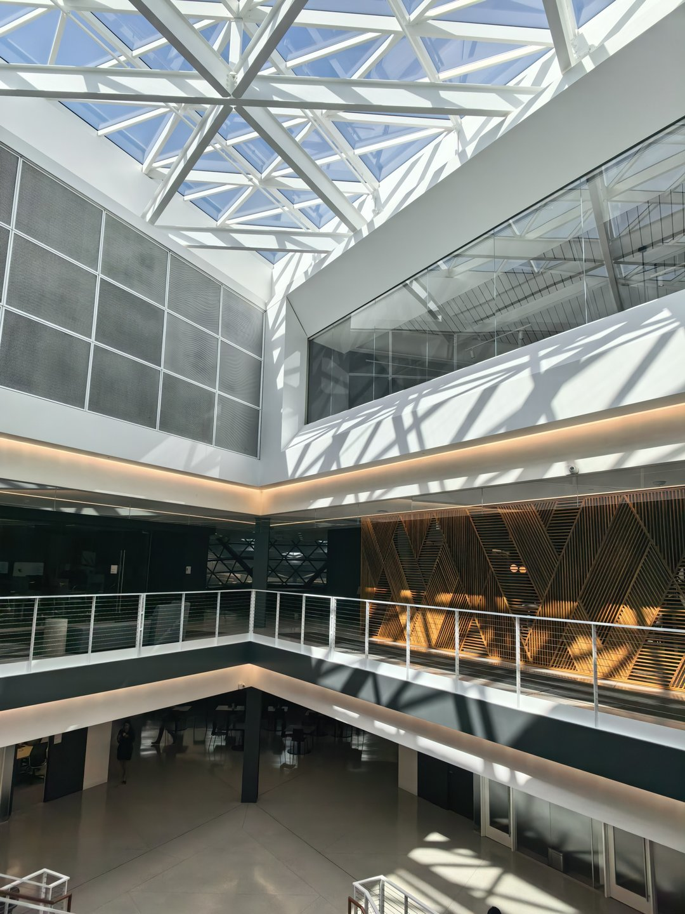

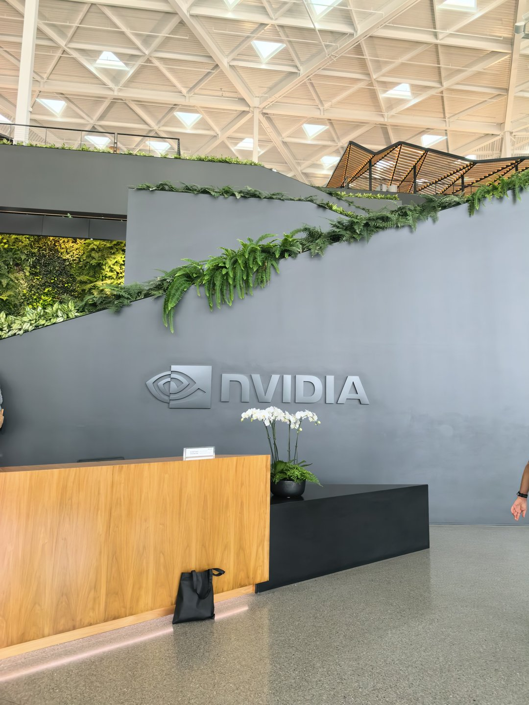

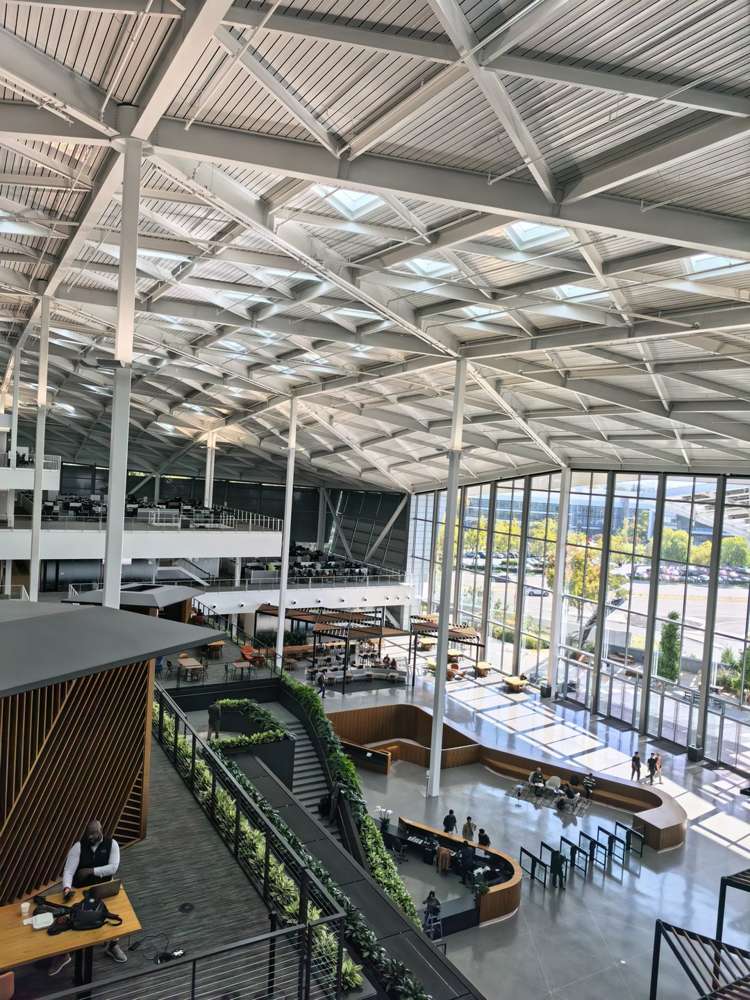

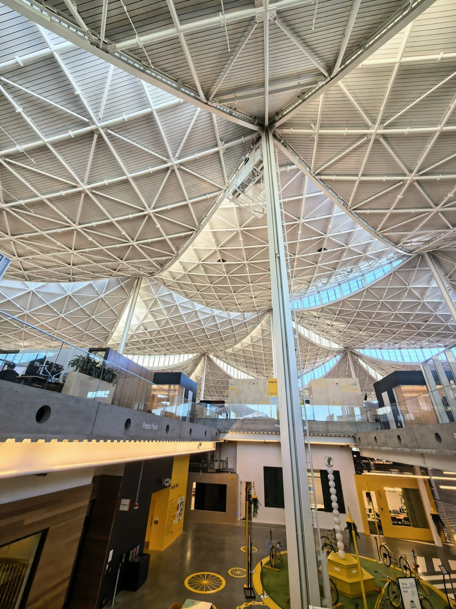

---

## 2

@前HR本人

发表于：2026-09-29 22:00

来源：微博

链接：https://m.weibo.cn/status/5348726354477151

欧美日最终必须走阿根廷路子！

 

2026年5月，阿根廷交基础财政盈余达到1.924万亿比索，约合13.4亿美元。尽管不同统计口径存在差异，和季度原因，但连续多月实现财政盈余，成为米莱经济改革最标志性的成果。当然，其财政盈余不是靠经济繁荣自然生成，而是以大刀阔斧的财政收缩、砍掉无效支出为代价换来的，也是底层福利大幅压缩为代价。阿根廷的经历，其实给深陷高债务泥潭的欧美日敲响警钟，大概率也要重复阿根廷的调整之路。

 

长期以来，阿根廷就是财政纪律失控的经典样本。过去数十年，阿根廷政客为兑现竞选承诺，政府开支随意扩张，财政缺口越来越大，弥补缺口最简单的办法就是印钞。大量货币涌入市场，直接催生恶性通胀，比索持续快速贬值，物价飞涨，民众财富被不断稀释。这是一套恶性循环：财政无约束导致赤字扩大→印钞放水→通胀爆炸，反复循环，把国家拖入经济泥潭。

在阿根廷民众实在受不了后，一个走极端的米莱上台，采取“电锯式”财政整顿，压缩政府机构、削减不必要补贴、砍掉低效公共项目，忍痛挤掉经济体系里的财政“注水肉”，才终于扭转长期赤字，实现财政盈余。

 

阿根廷的困境，根源是票选制度下的政治短视。竞选政客想要赢得选票，习惯抛出各类福利、补贴等诱人政策，用来换取选民支持，却很少认真思考钱从哪里来。竞选承诺不断加码，税收收入跟不上支出，最后只能依靠举债、印钞来兜底。这种模式，过去常被认为只是拉美国家的通病，而以美国为首的发达国家曾站在一旁批评，指责拉美国家缺乏财政自律。

但最近十年，美国自身也走上了类似的道路。疫情期间，美国大规模财政刺激，直接向民众发放现金补贴，特朗普政府最近为了赢得中期选举，宣传的每人5000美元现金发放，本质就是用财政放水换取民意。一旦停止印钞、收紧财政，经济就会承压，GDP增速下滑，而政客很难承受经济下行带来的选票损失，于是印钞、举债的惯性难以停下。

 

不只是美国，欧洲、日本同样陷入同类困局。民粹思潮蔓延之下，欧美日政客为争取选票，不断许诺各类福利，政府债务规模持续走高，债务利息支出逐年攀升，通胀压力反复出现。这套靠持续举债维持高福利、高消费的模式，本质上是透支未来。短期看，政府可以依靠发债、货币宽松维持繁荣；长期看，债务雪球越滚越大，利息负担会压垮财政空间。

 想要打破这套循环，没有捷径。唯一出路就是像阿根廷受不了，最终米莱政府那样，主动挤掉财政里的泡沫，砍掉低效支出，接受一段经济阵痛期，也就是过苦日子。这个过程必然伴随福利收缩、公共项目缩减，短期内民众生活质量下降，政客要承受巨大民意压力。但如果迟迟不愿下决心调整，债务危机、恶性通胀只会以更猛烈的形式爆发。

 

当然，客观上欧美日拥有储备货币、成熟资本市场等优势，不会完全复刻阿根廷的剧烈崩盘。但底层逻辑相通的，依靠无限举债和印钞维持的繁荣不可持续。当债务到达临界点，财政纪律重建、主动收缩开支，将是他们无法回避的选择。阿根廷的改革，不是一个遥远的拉美故事，而是发达经济体未来的一面镜子。美债就是下一个要破灭的大泡沫。

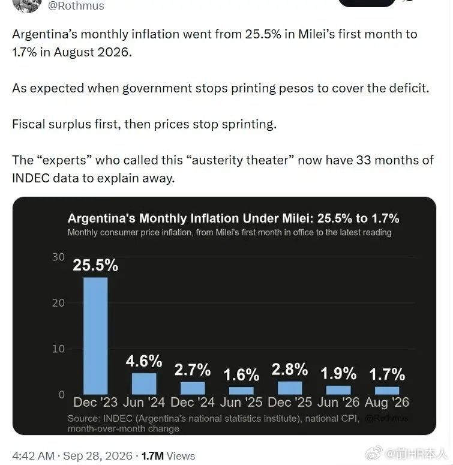

---

## 3

@EricTsui

发表于：2026-09-29 21:04

来源：微博

链接：https://m.weibo.cn/status/5348712315618809

"数字时代最大的贫困是注意力的贫困。" 

—— 尤瓦尔·赫拉利《未来简史》

---

## 4

@西门大妈没走丢

发表于：2026-09-29 09:28

来源：微博

链接：https://m.weibo.cn/status/5348537351015494

对了再爆个高校的瓜（没错就这么不长记性)：

最近北京某计算机强校，有一门公选课，就是那种什么智慧营销啥的水课，老师连续缺课两节～按理说这已经构成严重教学事故了，但是万万没想到，这甚至只是事故的开始…

有个大哥一看事已至此，自己来都来了，老师没来都没来，那我何不自己去讲课？

然后他就AI查了很多资料，生产了一份逻辑清晰资料翔实的PPT～而且这个大哥非常有料，他甚至高三毕业后真的创业过，所以讲起来头头是道，深入浅出，理论结合实际，各种案例信手拈来，在课堂上全情投入，听的下面学生一愣一愣的…

就这样讲了一个小时，无人发现，大家练练感慨老师真是年轻有为啊，归来半生发量依然如此茂密～

甚至有人怕他讲口渴了，给他送水…

Word妈呀！你就说这是不是学生的极大认可？

这还没完，他甚至建了个课程群…然后群里很多人都在要这个课件～

他说我这个是水课（确实），大家不要太当真，学生立刻反驳：

我学到了知识，这怎么能叫水呢！

然后他怎么被识破的呢？

因为学生加了他微信，发现他朋友圈晒的18岁生日照片…

然后，就没有然后了～因为我就没见过哪个学校对于假冒老师有什么惩罚条例，更不要说他讲的比老师好多了…

怎么说呢，这算不算草台班子里的栋梁之材呢？

---

## 5

@宝玉xp

发表于：2026-09-29 19:50

来源：微博

链接：https://m.weibo.cn/status/5348693761065125

OpenAI 推出 dots：24 小时替你干活的 AI 分身

OpenAI 发布了常驻 AI 智能体 dots。普通聊天机器人是你问一句它答一句，dot 不一样：它有自己的云端电脑和浏览器，会记住你的偏好和做事标准，你不在的时候也会继续推进工作，还会主动发现该做的事。

dot 由新模型 GPT-6 Astra 驱动，能通过插件连接 4000 多个应用。你可以在 ChatGPT（桌面、网页、手机）、Slack、Teams 里给它发消息，也可以直接跟它语音通话，短信支持也快上线了。不管从哪个入口找它，它都带着完整的上下文。

它能干什么？OpenAI 举的例子都很具体。Slack 里有人报了 bug，dot 马上开始排查。设计稿一到，dot 就把它做成能跑的应用。开发者的 dot 会盯着用户反馈，自己修小问题、跑测试，再把附带演示视频的代码合并请求交给你审。有位早期测试者忘了给一家媒体开发票，他的 dot 发现后把发票准备好，经他同意后发了出去。

一个 dot 能同时跑好几个项目，你不用开一堆对话窗口挨个指挥。你随时可以打开它的云电脑看它在做什么；如果你授权，它也能直接操作你自己的笔记本电脑。

安全上，dot 默认只在自己的云电脑里工作，跟你的电脑隔离。你不在时它做的"主动调研"只有只读权限。发消息、改内容这类可能影响你账号的操作要先过自动审核，需要时会请你批准。改密码这种敏感操作永远只能你本人来。

除了个人 dot，OpenAI 还预览了"专员 dot"。企业给它分配独立的身份、账号和系统权限，让它专门负责采购、发票处理、客服这类明确的岗位。目前先在少数企业试点，同时和微软合作，让企业能用 Agent 365 里现成的管控工具管理 dots。

怎么用：从今天起，dots 在符合条件的地区陆续开放给 ChatGPT Pro 和 Business Premium 用户；企业版（含教育、医疗）需要管理员开启测试版。第一个 dot 包含在套餐里，不另收费。跟 dot 聊天不占 ChatGPT 用量额度，但让它去 Codex 或 ChatGPT Work 里执行任务，照常计入用量。第一次需要在 ChatGPT 桌面应用或电脑浏览器里创建，之后就能在手机上用。以后还可以加购更多 dot，或者提升单个 dot 的速度和每月工作量。 宝玉xp的微博视频

---

## 6

@物理芝士数学酱

发表于：2026-09-29 15:14

来源：微博

链接：https://m.weibo.cn/status/5348624183593645

\#今天要来点心理学吗?\# \#今天要来点数学吗？\#

人类以为自己在自由地制造\#随机性\# ，但机器只需要记住他的过去，就能抓住其中的规律。

人类如此可预测，即使在随机输入时，计算机也有80%的时间都能轻松预测某人接下来的选项。

除了下图划红线处的这个人，他仅凭“自由意志”就变得完全不可预测。

加州大学伯克利分校课堂上进行的小实验：

教授编写了一个简单的程序，让学生随机按键 “f” 或 “d”，程序会预测他们下一次要按哪个键。结果发现，这个程序能以 70%–80% 的准确率预测正确，因为人类很难做到真正随机。即使知道程序的原理，也无法“骗过”它。

后来有一个学生让程序的预测准确率降到 50%，当被问到秘诀时，他回答说：“我只是用了我的自由意志（free will）。”——这句话在书页上被红笔划线。 

——————————————

这台机器是真实存在的，叫The Aaronson Oracle——Aaronson神谕机。

还制作了这个互动教学页面网页链接\#工具网站\# ，如动图二。（程序预测我的准确率就在55%左右，展示了我的自由意志强度~）

这个故事可追溯到70年前。

科学史 

1950年代贝尔实验室Bell Labs 工程师 David Hagelbarger 做了一台叫 SEER（Sequence Extrapolating Robot）的机器，让机器和人玩猜硬币“正反面”游戏。

关键思想非常简单：

观察你最近几次的选择；

记录你在类似情况下下一次通常怎么选；

如果发现规律，就利用这个规律预测你下一步。

它并没有真正“理解”人的心理，而是在统计人的行为序列。

1953 年，信息论之父 Claude Shannon 写了一份备忘录，描述他自己设计的一台“读心机”。他明确说明，这台机器是对 David W. Hagelbarger 的机器的简化版。

Shannon 在备忘录里说，他的机器更接近坡的“心理博弈”方法，而不是冯·诺伊曼的严格博弈论分析。换句话说，这台机器的设计是为了模仿人类的心理模式，而不是纯粹的数学最优策略。

——————————

This machine is a somewhat simplified model of a machine designed by D. W. Hagelbarger. It plays what is essentially the old game of matching pennies or "odds and evens." This game has been discussed from the game theoretic angle by von Neumann and Morgenstern, and from the psychological point of view by Edgar Allen Poe in the "The Purloined Letter." Oddly enough, the machine is aimed more nearly at Poe's method of play than von Neumann's.

Shannon, A Mind-Reading (?) Machine, 19531

——————————

图三，没有找到 Claude Shannon 那台著名的“读心机”的照片，但有另一台他在同一时期（约 1953 年）制作的游戏机器叫 Nimwit。

它会玩数学游戏 Nim（一种取物游戏，玩家轮流从堆里拿物品，最后一个拿的人输或赢，取决于规则）。

机器的前面板上有两列灯：一列显示玩家赢的次数，另一列显示机器赢的次数。

这个灯光计分板的设计，后来成为整篇文章所用的“记分板”隐喻的来源。

有意思的是：

机器并非不可战胜，但人类很难在实际操作中同时记住那么多历史信息并进行计算。

Claude Shannon 在 1953 年分析了他设计的“读心机”策略。数学上可以证明，这台机器并不是无敌的：如果玩家能完全掌握机器的记忆单元内容，并据此做出最优选择，就能以 3:1 的比例战胜它。

在纸面上，最佳策略能让人类赢三次，机器赢一次。

但要做到这一点，必须实时追踪机器所有的记忆单元，并进行复杂计算。

人类在实际对局中无法在脑中完成这种庞大的计算，因此即使知道理论上的方法，也无法实践。

不可避免地，有人会好奇哪台机器更好。Hagelbarger记录了发生的事情：

经过多次讨论，最终建造了一台裁判机并将其连接上 两台机器，它们玩了数千场 游戏。这台小型机器（香农的）的灵活性胜出了，它击败了 那个更大的，大约55：45。

50多年以后Scott Aaronson在 Berkeley 授课时写了一个很简单的预测程序，让学生按两个键：f 或 d。也就是最开始介绍的那页文字。

Aaronson 回忆说，这个程序大约能够 70% 的时候预测正确；课堂实验中甚至达到 70%–80%。更有意思的是：

Aaronson 自己明明知道程序怎么写，却也无法稳定击败它。

最后出现了一位学生，程序对他的预测率恰好是 50%。

大家问他秘诀是什么。

他的回答是：

“I just used my free will.”

美国量子计算理论家 Scott Aaronson 于 2013 年出版的一本书Quantum Computing Since Democritus，它用通俗而深刻的方式介绍了从古希腊哲学到现代量子计算、复杂性理论、密码学和哲学问题的思想演进。

书里收录了这段经历，也就是截图一。

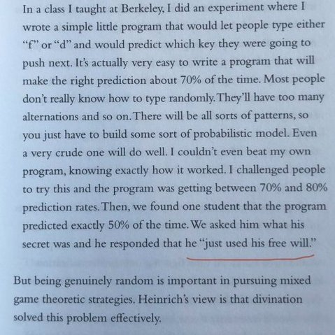

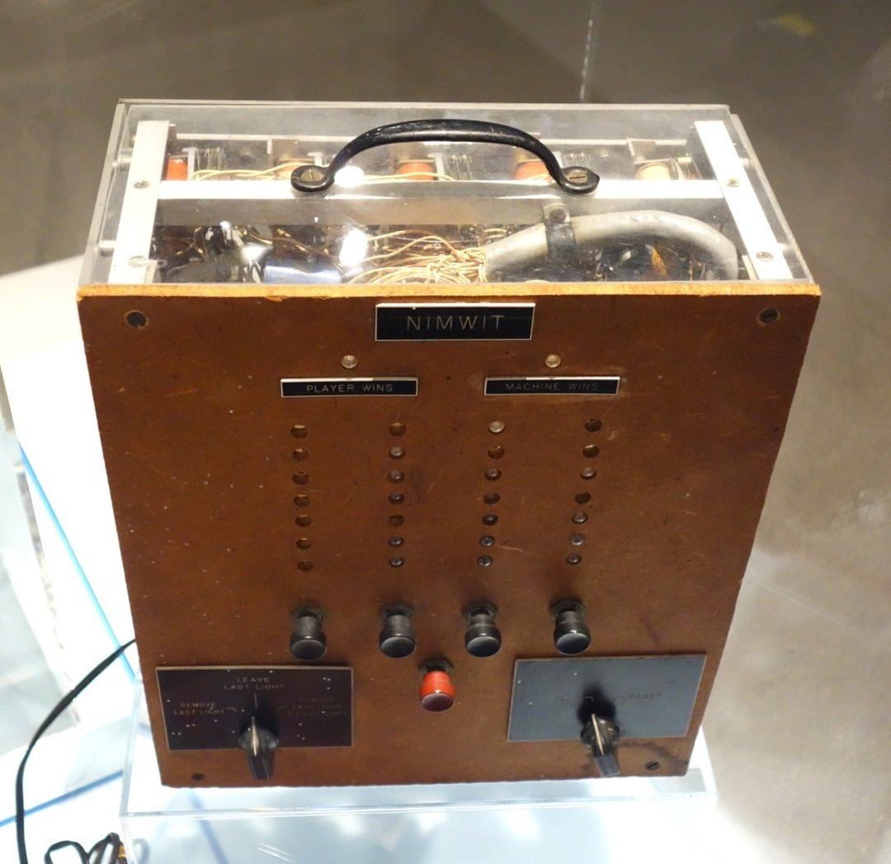

---

## 7

@风云学会陈经

发表于：2026-09-29 11:37

来源：微博

链接：https://m.weibo.cn/status/5348569760667656

\#北理工教师裴某被解聘\#

这次问题爆发很快，处理也很快

起因是什么？是一个让部分群众非常愤怒的亚文化倾向，居然在北理工这种国防高校里，搞起了课程活动！

群众很愤怒，后果很可怕。随便一找，问题一堆。北理工很快就处理了。

再次劝告亚文化群体，不要嚣张，舆论风气已经变了，不是“露头就打”，而是“露头就秒”。

这处理速度，震慑力很强！

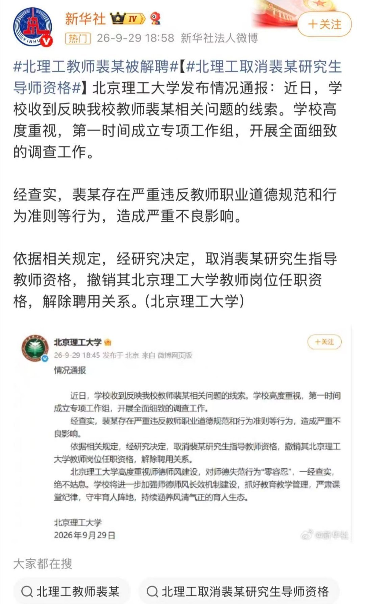

---

## 8

@风咒

发表于：2026-09-29 02:59

来源：微博

链接：https://m.weibo.cn/status/5348439426597683

币站有个UP，叫“小太阳张二毛”，因为主打“相亲中的AA实验”，被网友们称作社会学家。我也写了很多篇关于他的内容。

他近期又做了一个比较有看点的实验：【当我相亲5个离异带娃的女性，且说吃饭AA】

张二毛很好奇，这些女性经历过一次婚姻，是否会放弃那些“诚意”、“态度”、“安全感”，只要一个踏踏实实过日子的人就行。以下是实验报告：

第一位女性：41岁，离异，有一个12岁的儿子，月入8K，要求男方深圳有房，30-45岁之间，年入30-40W，接受离异。要男方工资上交，要彩礼。并且彩礼不叫彩礼，叫“安全感”。因为她觉得可以不办婚礼，帮男方省了钱，但不办婚礼就不能有彩礼的名头，所以管这个钱叫“安全感”。UP给自己造的人设是自己有一个8岁的女儿。

相亲时，女方时不时说自己【看起来】像30出头，并且用同事朋友的话佐证，还把高P照片给UP看，并且问UP，她是不是和照片看起来一样。

UP遂顺着说：你比照片里还漂亮。于是女方更贴近他了，UP在这里感慨：你们的要求真的只有骗子才能满足...女方接下来问：儿子跟她（不跟前夫）行不行，并且问房子的问题。UP说结了婚可以加女方名字，结果女方不是这意思，女方的意思是问UP老了（挂了）之后这房子给谁。UP说肯定给自己女儿啊。结果女方很坚定地说：【给她干嘛？她迟早是要嫁人的呀】。应该给我们的孩子（儿子）呀，因为以后给我们养老的是他呀。

最后，UP开始做AA实验，并且搬出佐证【因为很多女人说看不上的话就AA】。女方愣了，问UP是不是没看上她，UP说是。女方最终A了，并说“你活该单身”。

第二位女性：33岁，离异，女儿四岁，自由职业，期望男方深圳或者周边有房，30-40岁，成熟有担当，有解决问题的能力。希望自己当全职妈妈。也要男方上交工资，因为要安全感。UP给自己造的人设是没有孩子的相亲者。

这位是相亲时直接把孩子带过来了。UP和她相处了三个多小时，女方很满意，因为看到UP和自己女儿玩得很好，说这是对UP的试探。随后进入重点：询问UP是不是还要一个孩子，UP说当然希望和女方有一个爱情的结晶，女方眉头紧皱：婚后她（女儿）就是我们的孩子啊，为什么要我再受一次苦，为什么还要我再生呢？UP说她是你和前夫的孩子啊，不是我的。女方说女儿不会跟前夫见面了，而且还小，UP好好关心她爱她，她就是你的孩子。UP说当然可以把小孩当自己的孩子一样看待，但还是希望和对方有个孩子。女方这时候彻底生气了：没想到你也想用孩子捆住我，我说实话，我不会再生了，我要把全部的爱给女儿，我不想再生孩子，让女儿觉得自己被抛弃了，你太自私了，我们不合适。然后就拉着女儿走了。A都没A。

经过这两位，UP觉得离异带娃的，反而是更精明并且更注重金钱了，因为要安全感，而安全感在她们这里的表现就是钱。

第三位女性：29岁，离异，女儿五岁，月入7K，只想找未婚或离异无娃男，最好深圳有房，年龄30-40，最低月入3万+。

女方坦言自己前段婚姻就是因为学生时期的纯爱和冲动，再加上已经先有孩子了，所以彩礼也只要了10万8。但不成熟，所以两人经常吵架，经济也拮据，女方说男方下了班玩游戏，不努力，不靠谱，说现在很多男的都不靠谱，就爱玩游戏。

UP问了一句：你资料上不也写着“爱旅游”吗？不是也爱玩吗？

女方理直气壮地说：你不觉得女孩子就该去看世界吗？不然就会被男孩子的三瓜两枣骗走啦！我当初就是这么上当的啊！

UP说：上当过分了吧？你前夫也没骗你啊，你们结婚也是因为相爱吧？而且你也说了，你父母劝过你，你仍然坚持结婚，你现在说上当不太好吧...不论结果如何，你当时结婚也是彼此愿意的，很开心的啊，而且那时候你们刚毕业，他也把最好的给了你啊。

女方沉默了一会，说：...你说得对，确实是这个样子，但现在我不一样了，我就要看到实打实的诚意。

UP问：男方给你多少才是诚意？

女方说：工资上交，彩礼一定要给，这是安全感，给多少要看你们的诚意和态度。吵架的话也要以女方为主，因为听老婆的话的人都发财了。而且还要很爱（和前夫的）孩子，还要给女方父母每月3000生活费，这样才会跟他结婚。还会给他生个孩子。

UP反问：什么叫“给我”？这是在卖生育权吗？孩子不是你的吗？

女方说：虽然是我的，但生孩子对女方伤害很大而且不可逆，所以你必须给我补偿。

UP觉得没啥必要聊下去了，遂提出AA，被女方损了一顿，UP又问“网上很多女人不是说互相看不上就AA吗?”，女方没回答这个问题，直接走了。

第四位女性：35岁，带两岁男孩，月入9K，期望男方30-40岁，年入30-50万，接受离异带娃。

上来女方问：是否介意前夫偶尔来找她？

UP：？？？

女方说：虽然离婚，好歹夫妻一场，并且还是孩子父亲，要时不时见个面维系感情，为了孩子，为了孩子不缺父爱。

UP遂问：那你还要彩礼吗？

女方回：当然要，这是态度，如果对方因为离异看不起她，那也不用结婚，你问这个是不想给吗？UP说给。女方问给多少，UP说给30万。女方略显激动，UP又说给老婆花钱天经地义，女方明显说话更温柔了。

最后UP还是说了AA（之前UP请女方喝了奶茶），被女方骂没格局。

第五位女性：44岁，有2个男孩。女方明确提出感觉和UP不太可能，做朋友也不错。但她的择偶要求也是收入比她高，深圳或者周边有房，有担当，能接受她有孩子，并且不再要孩子。

虽然这次聊的比较开心，UP最终还是又提了AA的请求，女方抬起头看了UP，笑着说：老弟是不是没看上我呀？UP问你不都说了我们俩不可能吗？女方说老弟，那是在试探你，不然也不会说“不结婚也没关系”了呀。

这位女方最终AA了，但A的UP很害怕，因为这位女性截至UP发视频时，还在找UP，说可以做朋友...

UP最后总结道：他接触过的这些离异相亲的，有些人要求比00后还高，像感觉自己有工作经验了，找下一份工作要提升工资。但也有优点：孝顺父母，舍得教育孩子，给孩子报各种名师补习班，只不过钱是要男方出。

最后UP说也有一些离异的带娃女性三观正，为了孩子付出很多，但这种也往往会让孩子有很大压力，这是他和这些女性交流时感受到的，她们不希望孩子出一点错误，非常强势。但她们也对再婚更谨慎，如果你想追求她们，要付出更多代价，不然她们没安全感。也有一些男的找她们，但她们基本都看不上。

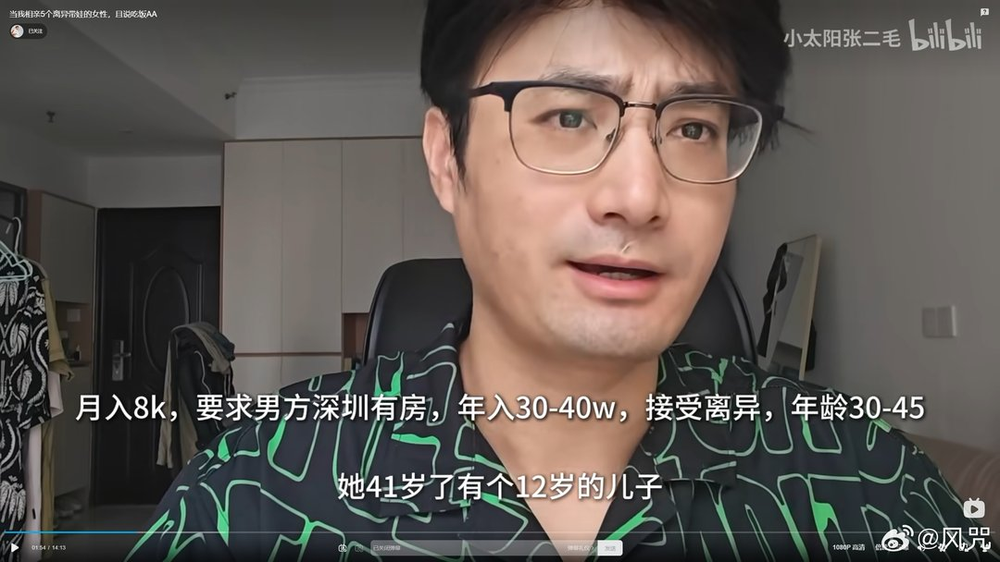

---

## 9

@渔老板钓鱼

发表于：2026-09-29 22:35

来源：微博

链接：https://m.weibo.cn/status/5348735246926148

//@想念哈哈哈哈哈哈哈:例如美国疫情期间，由于多数美国人储蓄少，发钱后大部分被直接花掉，确实拉动了经济//@想念哈哈哈哈哈哈哈:美国发钱 避免通缩大萧条 然后房贷利息干到7% 发钱的直接目的，是在经济下行时人为增加市场需求，让企业能把东西卖出去，从而保住就业和收入，打破“消费减少→裁员→收入再减少”的恶性循环。 这个逻辑在特定情况下确实有效。

---

## 10

@戴雨潇Dai

发表于：2026-09-28 10:30

来源：微博

链接：https://m.weibo.cn/status/5348190373282131

留存下历史记录：北京理工大学优秀教师——法学院裴轶老师专访

---

## 11

@黄斌

发表于：2026-09-28 22:05

来源：微博

链接：https://m.weibo.cn/status/5348365245875568

//@幻想狂劉先生:老百姓看到的往往是眼前和当下，他们的思路是：既然大部分公共基础设施的建设和维护都是苏联时代完成的，那么想让他们重新得到建设和维护的方法就是回到苏联。从经济学角度看，在那些没有资源的地方搞建设得不偿失，本来也没几个人&几乎半年都是冬天，能用的时间很短&严寒对道路和桥梁的维护是一场噩梦。但从国家利益来说，大国绝不可能轻易放弃边疆，维持边疆需要有人，投资和建设边疆绝不是纯粹的经济学问题。但俄联邦这种一切富集莫斯科的经济政策下，流向边疆的资源本来就少得可怜，现在资源又被“更重要”的方向分走，边疆的处境可想而知。我以前打过一个比方，假设北京和莫斯科的差距是10:1，那乌鲁木齐和新西伯利亚相比起码是1000:1。我之所以没有拿更远的远东地区打比方，是因为东部某些靠近中国的地区发展速度和生活水平远超其他边疆区，不具备代表性//@安德鲁司:边疆区群众也未必是真相信这些老头。这个就像一个只有 A 餐和 B 餐的食堂一样，选择 B 餐，也许单纯就是吃腻了 A 餐。

---

## 12

@高飞

发表于：2026-09-23 12:39

来源：微博

链接：https://m.weibo.cn/status/5346410960786955

\#奴工理论\#

看到这个奴工理论，想到之前发的这条，这俩案例就是典型的奴工理论代表吧。

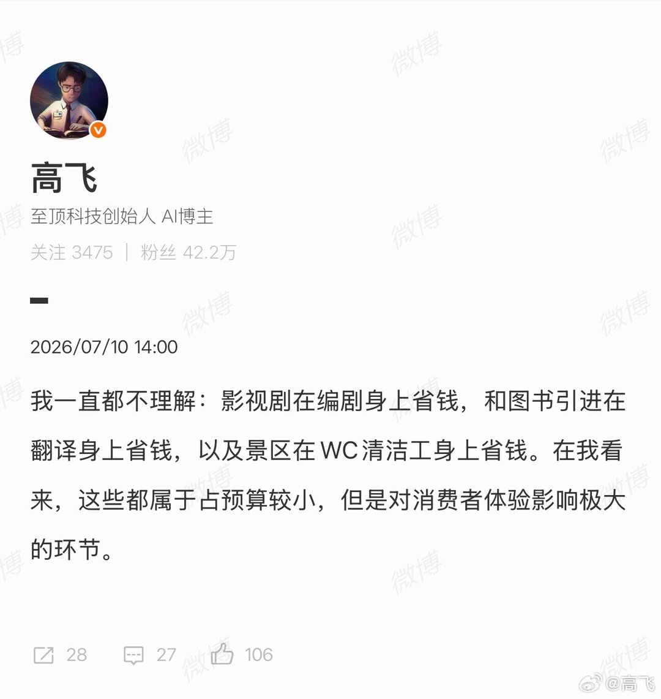

---

## 13

@梅新育

发表于：2026-09-28 14:38

来源：微博

链接：https://m.weibo.cn/status/5348252818079918

她力量  之  \#北理工裴姓教师被指论文造假\#

看了她讲课“女性政治权利”内容的视频，彻底踏破了政治底线。

学问一塌糊涂，多处事实硬伤，但悍然叫嚷出的主张完全够得上“野心”一词了。

课堂上公然讲这种内容，已经不是一般的女拳了。

军工名校开这种课程？

\#北理工女性课程被叫停\#

---

## 14

@胜利主义章北海

发表于：2026-09-24 07:59

来源：微博

链接：https://m.weibo.cn/status/5346702821426163

某种意义上，我们也要感谢裴教授。

裴教授以院长助理的身份，

用最直白的语言讲出内心真实想法。

很多人这个时候才发现:

女权主义思想早就在中国高校生根发芽长成了参天大树，乃至于这样一位仇恨男性，认为“美国是灯塔，中国药丸”的人，成了国防七子之一院校的院长助理，下一步就是成为副院长。

如果她没有把话讲这么直白呢？如果她多一点“耐心”呢？如果她继续忍耐，等到自己成为副院长甚至院长，再利用自己的权力去大力推广女权思想呢？那危害岂不是更大？

但是话又说回来，像裴教授还有多少？

有没有一种可能，同情和认可裴教授的人并不少，只是比较聪明，没有像她那么直白，所以网民发现不了。而这些人正在用更隐蔽更潜移默化的做法在推广自己的想法。

希望是我杞人忧天了。 

🐼:

我在等电磁弹射航母、六代机、新型驱逐舰，

你在等什么？

🦅:

我在等♀权大军考公，等♀权进入你的各行各业。

---

## 15

@信号与噪声

发表于：2026-09-27 15:34

来源：微博

链接：https://m.weibo.cn/status/5347904661488508

ChatGPT 现在面临一个大问题。

牛津和剑桥的研究人员揭露了大型语言模型的一个巨大威胁。”

他们称之为“模型崩溃”。

互联网生态系统正在迅速变化，生成式 AI 很快就会贡献大量在线文本。这迫使我们考虑，当像 gpt-n 这样的未来迭代版本使用从网络上抓取的、已经由 LLM 生成的数据进行训练时，会发生什么。

根据研究，不加区分地使用模型生成的内容进行训练会导致结果 AI 中出现“不可逆转的缺陷”。模型会丢失“原始内容分布的尾部”。换句话说，它开始忘记真实人类写作的创造性、边缘性和独特细微之处，陷入一个重复的回音室。

这不仅仅是 ChatGPT 的问题……研究人员构建了理论直觉，证明这种崩溃在所有学习型生成模型中普遍存在，不仅发生在大型语言模型中，也发生在变分自编码器和高斯混合模型中。

科技公司依赖于从互联网抓取大规模数据来构建更智能的模型。然而，该论文警告称，如果我们想维持使用网络数据训练的好处，就必须认真对待模型崩溃。

最终启示？在充满 AI 内容的网络中，从真实人类互动中收集的数据将变得越来越宝贵。

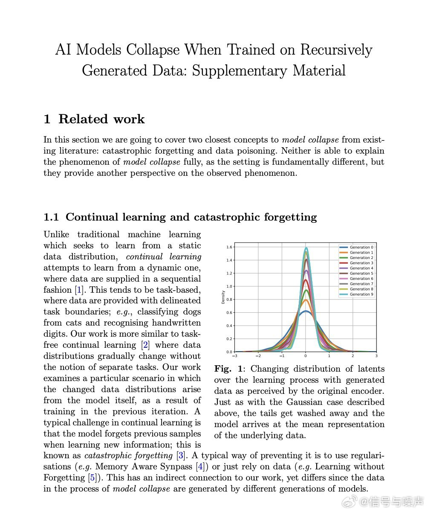

---

## 16

@明涛AI_ECON

发表于：2026-09-27 13:56

来源：微博

链接：https://m.weibo.cn/status/5347879948652303

无论是玩自媒体还是接受采访都是不务正业，严格说来如果获得收益都不合规。只有不理性的人仍然一直玩。//@行政法思述:是的。传统“为民请命”的角色在信息平权时代实际上已被解构；极端、情绪化、迎合大众情绪的声音背景下，越来越多的知识分子意识到难以改变舆论场的底层逻辑，从而干脆选择退出；于是，在对舆论生态、生存风险与自我价值进行理性权衡后，不出意外地选择犬儒式沉默。

---

## 17

@南山林雪萍

发表于：2026-09-27 09:54

来源：微博

链接：https://m.weibo.cn/status/5347819015900923

病态创新。为什么中国的技术创新的生命周期会加速折寿？

在中国，无论是光伏还是电动汽车，制造设备都已经远远领先于海外。然而这些技术创新，从来不曾为那些敢于投资创新的企业家，带来丰厚的利润。在中国，光伏设备折旧更新速度大概是5年。而美国则至少在10年以上，充分享受设备慢慢折旧的红利。

美国第一光伏制造商First Solar，做薄膜光伏电池。然而薄膜光伏的效率很低，只有19%。这在中国都是淘汰产能。中国要求光伏效率不能低于21%。

而在中国，晶澳的TOPCon可以达到24%，而隆基的BC技术则达到惊人的25%。从光伏转换效率而言，中国正在使用的技术，遥遥领先于美国的这种产品。

然而，领先技术不代表赚钱，落后技术不代表亏钱。晶澳和天合，在美国的合资工厂，技术依然是国内已经淘汰的PERC技术，力压FirstSolar一头。然而落后中国至少三代技术（从薄膜，到PERC，到Topcon，到BC）的FirstSolar，依然赚的盆满钵满。2025年美国光伏新增装机容量40吉瓦，FirstSolar以“落后”“淘汰”产能，获得了几乎美国1/3的市场。5 家国内龙头总市值 为 1940 亿元，而FirstSola的市值超过1400 亿元。然而FirstSolar的销售收入只有350亿元人民币，不及五家的13%。至于说利润，Top5里面除了阿特斯盈利10亿，其他都是亏损50亿人民币以上。而FirstSolar利润则独家达到110亿元人民币。

这种反常的经济现象，源自两点。第一，美国政府用最复杂的政策工具（从双反一保，到301条款，201，到232等至少8种以上），对中国光伏产品，构成了历史所有战役最有纵深的隔离壕沟。中国新技术很难进得来。第二个美国市场是资本回报驱动，而不是资本驱动。

只要有需求，再加上美国的补贴，旧技术、低效率的生产，同样可以有响亮的回报。

美国的技术创新，并不激进。它是理性的资本回报驱动型，而不是资本驱动型。公司存在的理由是获得利润，没有利润就是一种病态。拥有先进技术却无法获得利润，不得不说，中国技术是一种病态的激进。

这是一个非常值得警惕的现象。一个创新技术有它的生命周期，在度过生死瓶颈期之后，它至少有四个商业周期可以获得利润。如同FirstSolar是一个老掉牙的技术，依然可以获得丰沛的利润甘泉。这才是对创新的最大尊重。

然而中国的技术冒进主义，压缩了技术创新周期带来的利润回报时间。技术还没到寿命终点，就已经被加速折寿。

矿山挖得太快会损耗地球资源，人们对此有着强烈的警惕感。然而，把技术创新过早提前消耗掉，也是一种“技术矿”的巨大浪费。对待技术创新周期被加速折旧，中国产业似乎表现出漠不在乎的态度。然而，当这种态度跨越了国界，就构成了一种国家之间的贸易和投资的敌意。美国已经要下决心，把中国光伏产品和电动汽车，封挡在国门之外。2026年12月美国的232国家安全法案，将使得进口电池的征税大幅度提高。而美国交通部长则声称，无论是中国的汽车，还是中国汽车技术，都不能落地美国。欧洲则正在苦苦思考，闷头作业，试图破解中国每年10亿贸易顺差对欧洲产业形成了镰刀放草的伤害。美国用301、201等这种单边主义匕首，避开了WTO贸易的多边仲裁，任意挥舞。一向倡导多边主义的欧洲，也在寻找301这样的单边工具。很显然，WTO多边贸易主义，已经无法为欧盟提供躲闪锋利的贸易伤害。而这对于中国产品，出口到欧洲，也将是一个巨大的打击。宝马负责销售的高管，最近质疑“中国车出口欧洲的低价，在商业逻辑存在巨大疑问”。技术创新本来可以赢得尊重，而中国所驱动的技术，则成为欧洲和美国的恐惧，和针锋相对的目标。

一哄而上，涸泽而渔。这是一种自杀式的技术创新。中国的产业技术是否能够走得慢一点，让技术创新也能休养生息，造血繁荣？\#大出海\#\#我在美国看中企大出海\#\#供应链攻防战\#

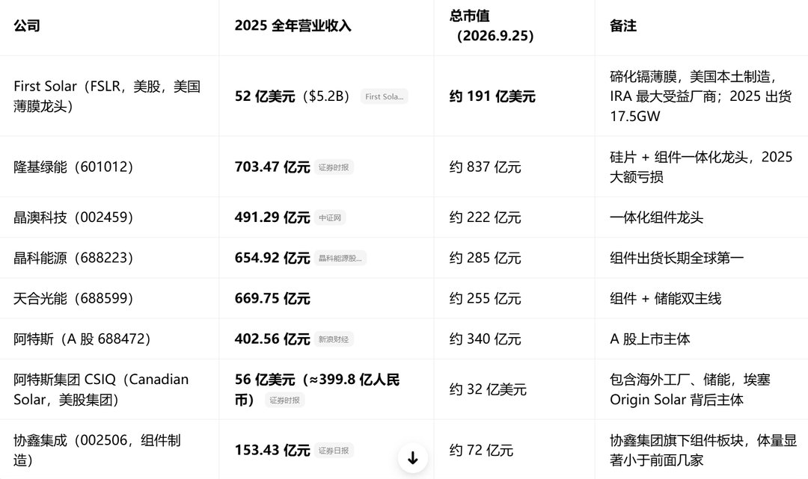

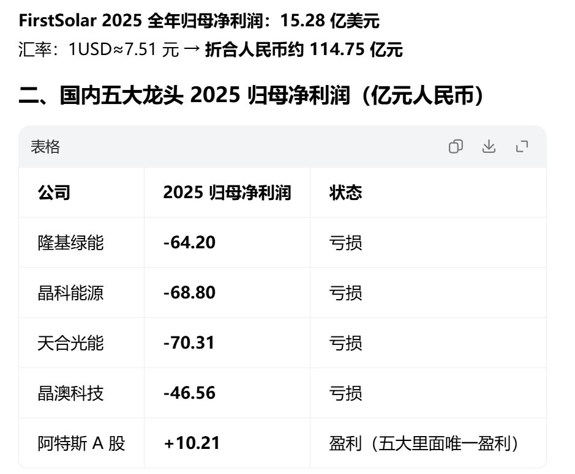

---

## 18

@刘群MT-to-Death

发表于：2026-09-27 00:36

来源：微博

链接：https://m.weibo.cn/status/5347678512483002

吴恩达：人类对抗AI的护城河是“上下文优势”  网页链接

这篇访谈不错，吴恩达的感觉还是很对的，同意他的大部分判断。“上下文优势”的提法很好，深得我心。

01 少数AI巨头在刻意制造恐慌

02 “工作末日”是伪命题

03 大学教的是2022年的技能，年轻人该自己去学2028年的能力

04 企业部署AI的KPI没有标准答案

05 一亿美元押注一对一AI辅导

06 真正敏感的数据宁可跑本地模型

07 没人能完美控制AI，但可以让它足够安全

08 构建成本已断崖式下降，真正的瓶颈变成了“产品判断力”

09 AGI到底还有多远

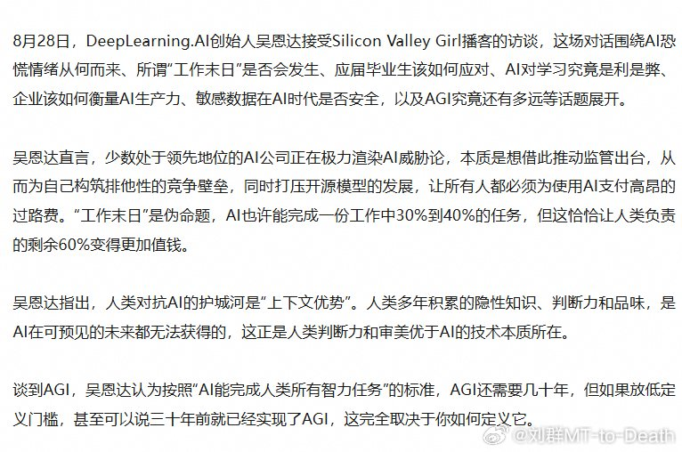

---

## 19

@张会长说财经

发表于：2026-09-27 02:38

来源：微博

链接：https://m.weibo.cn/status/5347709395667417

人民币没怎么贬，为什么中国商品反而越来越便宜？

野村中国首席经济学家、中国首席经济学家论坛副理事长陆挺有一个观点：过去这些年，人民币的名义有效汇率，并不是一路往下跌。真正明显变化的，是实际有效汇率。

这句话到底什么意思？

假设有一家中国工厂，2023年，这家工厂生产一件衬衫，成本是80元，卖给美国海外客户100元。

这时候老板还能赚：100－80＝20元。工人也还可以每年涨点工资，日子过得去。

但是现在人民币还升值了，但美国物价涨了不少，但中国国内价格不涨，反而由于内卷严重，还在降价。

于是美国客户发现，虽然人民币升值了，但中国的东西越来越便宜。

可是，东西便宜了，企业的成本可没有同步下降。

那家中国工厂原来一件衬衫卖100元，但现在市场竞争激烈，内销根本卖不动，大家都挤在出口这一条道上，别人都降价到95了，美国客户只愿意出95元，如果工资、房租、原材料等成本还是80元，那么95－80＝15元。

老板的利润从20元变成15元。

怎么办？继续降价抢订单。利润越来越薄。

而工人呢？企业利润越来越低，工人不可能涨工资，甚至要降点待遇。

于是就出现了一个非常微妙的循环：

国内价格不涨 → 企业降价竞争 → 利润被压缩 → 工资不增长 → 中国商品相对国外越来越便宜 → 出口竞争力增强。

这就是“内部通缩换外部竞争力。”

人民币兑美元的汇率，只告诉你人民币和美元之间直接兑换的比例。

但实际有效汇率还要考虑中国的商品价格，和美国、欧洲、日本等主要贸易伙伴的商品价格相比，到底贵不贵。

举个例子：

人民币兑美元：7.2 → 6.8

看起来人民币升值了。

但是如果同时，中国商品价格下降10%，美国商品价格上涨10%

那么中国商品相对于美国商品，实际上变得便宜很多。

这就是人民币对美元升值了，实际有效汇率却下降。

这就是陆挺这句话真正想提醒我们的地方：汇率表面上没有大幅贬值，并不代表中国商品的国际竞争力没有通过“降价”来增强。

而这种模式的天花板也很明显，不能永远靠企业少赚钱、工人少涨工资、商品不断降价来换出口竞争力。

如果国内需求不能起来，企业利润、居民收入和消费能力长期承压，那么这种模式最终会遇到自己的瓶颈。

所以真正值得关注的，不只是人民币兑美元是多少，而是我们到底是在靠汇率优势赚钱，还是在靠不断降低自己的价格和利润换取竞争力？

终极追问：这种模式能持续吗？

---

## 20

@风云学会陈经

发表于：2026-09-27 01:07

来源：微博

链接：https://m.weibo.cn/status/5347686335385888

一声叹息，新机销量全面崩盘

这就是消费心理，苹果新机需求可以，安卓的新机涨价就崩了。

这是因为安卓新机因为内存涨价，成本升得太多了，开价到了苹果的价格区间。市场不接受了。

而手机其实是不需要那么新的，买降价的老款旗舰机反而更合算，大多数人都能用的不错。

买手机的钱还是有的，就是不想花，也确实有办法不花。

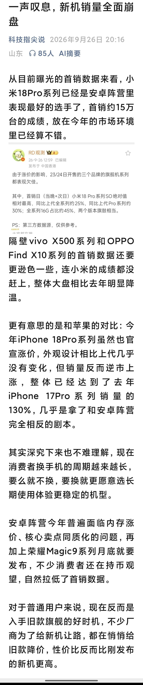

---

## 21

@宝玉xp

发表于：2026-09-27 00:34

来源：微博

链接：https://m.weibo.cn/status/5347678084928487

几个月前我悟到的一条经验就是不要给模型模板，而是给它目标、规范，让模型按照自己熟悉的方式去自由发挥，反而比套目标会更好。

这几天 Opus 5.5 给我的震撼更大，别说模板，做视频的 Skill 可能都不需要，给它提供文本转语音（TTS）工具、画图工具、ffmpeg 和浏览器就足够了

以下内容摘录自《腾讯学堂：AI 原生思维——像训练大模型一样训练自己》网页链接 ：

> 给设计规范，不给模板。我做 PPT Skill 时放了一堆模板，水墨风、科技风各一套。后来从 Claude Design 学到：不给模板，给一套颜色、样式的规范，模型自己决定做成什么样。今天这个 PPT 就不是模板套的，而是基于 Adobe 的 Design System 生成的。模板是专家捷径，规范加模型能力是笨办法，但“苦涩的教训”说通用方法终将战胜专家捷径。模型每升级一次，产品不改代码自动变强，这就是“搭架子等模型”。

---

## 22

@阑夕

发表于：2026-09-24 06:43

来源：微博

链接：https://m.weibo.cn/status/5346683803666025

The Information发了一篇对美国的AI政策提出严厉批评的长文，作者是「拥抱熊猫派」的投资人Ryan Cunningham和智库研究员Kristy Loke：

为什么美国的AI梦想难以起飞

2022年，美国在AI领域的主导地位几乎无可撼动，模型、半导体、资本和人才方面全都断层领先。

此时，作为最大竞争对手的中国，似乎正因出口管制而陷入困境——这些管制切断了中国获取全球最先进芯片和存储技术的渠道。

4年之后，形势似乎正在逆转：

来自中国的模型已在全球Token份额中占据重要地位，美国AI大厂正关注中国的逻辑芯片和存储芯片，而华盛顿的雄心正面临日益高涨的公众反对。

光是今年第一季度，美国各级州县就喊停了总计价值超过1300亿美金的数据中心项目，71%的美国受访者反对在自家附近兴建机房。

得克萨斯州是对数据中心最宽容的地方，但它也已经迫于民众压力冻结了所有的新并网项目，谁敢批准谁就会被选下台。

与此同时，美国的领导人似乎已与民意脱节，就在前沿实验室正在筹备上市、川普正在教育人民拥抱数据中心的当口，各大公司采用AI对生产率的可见提升仍然有限得紧。

美国的问题不在于钱、卡、人的短缺，而是缺乏统一的AI战略，能把模型的先进技术、共享的经济回报、社会的公共合法性以及部署所需的能源基础设施全都连接起来。

我们分别以能源计算分析师和中国AI政策研究者的身份撰写此文。

从美国实体AI建设当前面临的瓶颈，和中国多管齐下的AI发展路径这两个视角来看，美国的巨额资本支出掩盖了一个严峻的现实：

这个国家正在为一场大多数公民目前不愿参与的工业革命提供弹药。

这种情况未必绝对不会改变，但从眼下的处境来看，它变不了。

- AI的「美国梦」 -

美国到底想要怎样的AI？

在最清晰的阐述里，这个目标似乎只聚焦于「赢得比赛」，于是，政策制定者正试图将美国的AI技术栈树立为「全球 的黄金标准」，尽管衡量胜利的相关标准都还不明确。

支持者认为，AI能为人类带来更高的生活质量，但对生活将如何改善却几乎没有给出切实的预期。

那么，AI的「美国梦」在理想情况下，长什么样？

现在有两种叙事，第一种来自硅谷，许诺了一个无限富足的世界，只有通过大规模投资前沿模型实现AGI才能实现，智能的成本将会降到极低，以至于大多数形式的劳动都不再需要，从而解放人类，使我们沉浸于娱乐、求知与自主的美好未来。

第二种叙事在白宫盛行，与其说是对梦想是什么的愿景，不如说是对梦想不能是什么的恐惧：在与中国的军备竞赛中落败的噩梦。

这些叙事源自不同的心态，却汇聚于同一个目标：权力的垄断。

在第一种叙事里中，硅谷大佬们被一种经济信念所锚定——「只有失败者才会迫于竞争」——以及一种近乎宗教的信念：

谁先创造出机器之神，谁就将捕获「宇宙中所有未来价值的光锥」。

第二种叙事则将AI主要视为维护美国霸权的工具，并恐惧一旦霸权衰落便会迎来统治的终结。

简而言之，顺我者昌、逆我者亡，二者在各自的回音室中都运作良好，但也都无法令人信服的回应这些体系之外的人们的真实焦虑。

对许多美国人来说，根本的社会契约——「努力工作就会得到回报」——已被金融危机、无就业复苏和全球疫情所撕裂。

他们目睹互联网平台建立的商业模式损害儿童心理健康，如今，这些公司又得寸进尺的开始把数据中心建到他们的社区里。

当AI实验室鼓吹大家不再需要劳动了的时候，工人阶级听到的不是度假的邀请，而是「永久底层阶级」的持续威胁，在技术将普遍改善他们生活的承诺在历史上一再落空之后，他们没有理由相信这一次会有所不同。

AI行业的声音也变得越来越极端，一下子是星际殖民，一下子是文明灭亡，大家真的都听厌了，只想说：「证明给我们看吧」。

- 四种面向，而非一种 -

和美国对于绝对领先的执念相比，中国的战略更加多维，自2020年以来，中国的科技政策就围绕着「四个面向」来做推进：

面向世界科技前沿、面向经济主战场、面向国家重大需求、面向人民生命健康。

这一框架在上层建筑对于AI产业的表述里反复出现，意味着北京已经意识到，单一化的目标是远远不够的。

中国当然也在追求前沿模型，并推行了旨在优化创新环境的法律改革，但它并未将前沿模型的地位视为唯一的AI战略。

这或许是出于必要：在先进芯片、算力和资本方面受到制约的情况下，中国需要一个「足够合理」的战略，在务实主义与技术雄心之间取得平衡。

然而，这一做法在2025年的DeepSeek时刻之后仍在延续，模型构建依然不是唯一的国家目标，而是在继续发展的同时，追求产业扩散、技术主权和准确治理。

经济发展可以说是北京政策关注的重点所在，2025年重申并扩展的「人工智能+」行动与AGI的关系不大，它设定现实目标，引导地方政府和企业追求生产率的提升，推动产业升级。

第三种取向侧重于构建安全的核心技术供应链，在华为被卡脖子之后，中国回归了核心技术的创新，并加速了半导体供应链关键环节的本地化，近期的芯片进展在一定程度上反映了对应的回报。

第四个方向要求技术发展必须同时增进公共福祉，随着人们对自动化和就业流失的担忧加剧，中国一直在提高对算法的问责要求，当年轻人沉迷于AI陪伴产品之后，中国的监管敲定了即便放在全球也是最严厉的一些规则，用来保护人民的心智。

中国的做法虽然不一定适合美国，但以并行目标取代一个中心、而不是让所有事情都服从于前沿竞争的参考，是值得揣摩的。

- 比赛不是策略 -

中国的例子表明，包容性的AI政策不能只去限制竞争对手和加速本国企业，一项能够创造显著经济收益、同时加重真实社会成本的技术，需要规划、协调以及对相互竞争目标的兼顾。

尽管美国拥有种种优势——而且这些优势相当可观——如果开发者无法获得许可来建设容纳这些芯片的设施，以及建设为其供电的发电能力，那么用有世界上最好的芯片也用处不大。

也不应孤立的追求AI主导地位，它可能与开放、安全、隐私、劳工保护和地缘管理相冲突，一个可信的美国AI梦不能仅仅由赢得一场定义模糊的竞赛来界定：

它必须以普通美国人是否获得能力、安全、机会和真正的自由——包括免于可避免的技术伤害——来衡量。

这不是在反创新，而是反脆弱。

在国内，要诚实的推进基础设施落地，为人民提供补偿，不要把失业视为抽象数字了，给出具体理由，让大家相信AI的成果将被普惠分享。

在国际，意味着与包括中国在内的伙伴和竞争者进行建设性接触，多一点共识，少一点猜忌，把风险纳入到管理体系里来。

如果美国希望AI的繁荣继续下去，就应该快一些做出改变，否则它的梦想将在通往星沉大海的发射台上，爆炸坠落。

source:theinformation.com/articles/americas-ai-dream-failing-launch

---

## 23

@tombkeeper

发表于：2026-09-23 12:59

来源：微博

链接：https://m.weibo.cn/status/5346415924744167

有位博主说等女儿成年之后，自己会在力所能及的范围内给她一些帮助，但绝对不会支持她奢华的生活方式，如果她想过奢华的生活得靠自己。

有人评论说“我生孩子就会对它的人生负责到底，如果有一天她情绪崩溃不想上班，怀疑人生的意义，这也不是她的错是这个社会的错。如果我无法负责到底我就不会生孩子，毕竟生她的之后我们都是为了自己的私欲，也没问过孩子我想不想来到这个世界。”

上面这一串并没有实际意义，因为说这种话的人根本就没打算也不可能生孩子。“我生孩子就会……”后面那一串它们根本就不会。那一串是它们想从自己爹妈那里得到但又没得到然而多少还有点羞耻心不太好意思直接说爹妈没提供这些就不配做父母于是换个角度变成看似给自己提的要求说了出来。

---

## 24

@青扑落

发表于：2026-09-19 04:39

来源：微博

链接：https://m.weibo.cn/status/5344840594491370

深圳最好的高中无疑是深圳中学（深中）。

每年中考录取分数线深中都高高在上，挑走最好的一批学生。高考成绩也是相当出色：深中每年参加高考1500人左右，上清北两校的大概有七八十人。985录取率更是超过50%。在全广东省是断崖式领先。

这个学校的教育理念非常不同，它理念是：我已经筛选出最好的学生（包括他们背后重视教育的家庭），那么让他们成功最重要的途径，就是充分激发他们的自驱力，这样他们的潜力才能完全被释放出来。

因此，深中给了学生相当大的自由度。譬如：深中是唯一允许学生带手机到学校的深圳公立中学。深中同样也不强制学生参加晚自习。有一些课程或章节，主要靠学生自学，老师只负责答疑…… 诸如此类的规定很多。做父母的都知道对于一所好高中这些是多么“有勇气”的规定了。

但结果就是让人服气：深中的学生，学习出色，各方面综合素质也很高，各种社团竞赛等课外活动也都有声有色。走高考和走国际路线都很受欢迎。

上面还不是我讲故事的重点。后面的才是：

好几年前，深圳另外一所高中（大概在深圳排名十名之前，也算是很不错的中学了），它的校长觉得深中的教育理念很先进，心想我们要学啊，于是学着深中制定了很多新的校规和管理方法。总之也是号称还给学生自由，激发孩子潜力。

结果呢：那几年这学校的教育水平一落千丈，无论体制内（高考）还是体制外（社团、竞赛、国际路线）成绩都惨不忍睹。进而又影响到了中考招生，好学生都避之不及。导致生源质量下降，然后又进一步导致高三出口成绩下降，进入了恶性循环。所谓学习先进经验彻底变成了邯郸学步。后来该学校家长们群情激愤，把这个校长赶跑了。

上面还不是我讲故事的重点。后面的才是：

姚明搞中国篮球，就跟后面这个邯郸学步的中学校长类似，照搬了一些要么皮毛、要么水土不服的“理念”，最后自己怎么走路反而都忘了。

NBA的经验先不先进？先进。

苏联革命的经验先不先进？先进。

但你首先要和中国的具体实际相结合呀。

譬如，姚明抛弃中国篮球“三从一大”的传统（从严、从难、从实战出发、大运动量），这就是等于把体育运动的根刨了。你用什么理念，是要根据对象的特质特点来呀。

结果，都不用打比赛，中国篮球就开始出丑：

球员王哲林前两年曾发过一条“篮球球员训练的一天”的视频，把自己的训练量晒了出来：3组17分钟慢跑热身、15公斤杠铃片练3组核心，最后投篮300 次——100个三分、100个中距离、100个罚球（而且投篮只统计出手次数，不要求命中）。

本来这位哥是想“炫耀”训练刻苦的，结果把我们篮球的屁股露出来了。网友拿去和NBA对标，反差极其刺眼：

 -科比的"666训练法"是每天投进1000个跳投、500个三分；

 -库里一堂投篮训练课90分钟要求不间歇不喝水，按每分钟25次出手算超过2000 球；

 - 杰伦布朗同样练300球，但要求是命中300个，且第10到第50球投丢就得重来；

 - 崔永熙去美国特训时，每天4–5小时高强度对抗练到精疲力竭之后，再加500次投篮。

后来崔永熙曾说他在美国"两个月的训练量顶得上国内一年"，还直言国内篮球确实是个温室。

深中的学生不强制要求学生晚自习、允许学生带手机，那是因为绝大部分的学生照样学到晚上11点 —— “允许带手机”和“学到11点”，你猜哪一点才是深中学生出成绩的根本？

姚明作为篮球天才，自己刚去美国时，孱弱的上肢让火箭队需要专门给他加练卧推。同样是天才的科比，每天可以看到“凌晨4点钟的洛杉矶”（指坚持早起额外训练）。我们的篮球宝宝呢？

\#中国男篮vs日本男篮\#\#中国男篮惨败被日本球员嘲讽\#

---

## 25

@宝玉xp

发表于：2026-09-26 07:23

来源：微博

链接：https://m.weibo.cn/status/5347418725945121

Anthropic 官方发的这篇文章《What a task costs on Opus 5.5》解释清楚了为什么现在 Opus 5.5 要比之前 Opus 5 耐用多了，看起来 API 价格降低了 20%（缓存读取降了 60%），但是账单高低其实看任务跑了多少轮，因为每跑一轮，都要把之前的整段对话重新发给模型一遍。

这样算下来，平均一个会话能便宜约 31%。

Anthropic 内部用 44 张客服工单测试，从 Opus 4.8 换到 Opus 5.5 成本降了约 18%，再做一次提示词审查，总共比原来低了约 25%。

订阅用户（Pro、Max、Team）的额度按新价格折算，能比用 Opus 5 时多撑 25% 左右。

一些技巧：

1. 换到不相关的任务，用 /clear 清空对话。

2. 想保留前情就用 /compact 压缩，但要在缓存失效之前做，否则要贵一些。

3. 订阅用户的缓存保留 1 小时，用 API 的话，缓存只保留 5 分钟，离开 6 分钟，12 万 Token 上下文的下一轮就从 0.02 美元涨到 0.60 美元。

4. 缓存只复用和上一轮开头完全一致的部分，中途切换模型、接入或断开 MCP 服务器、第一次打开快速模式，下一轮都要按更贵的写入价重新付费。

5. Opus 5.5 默认推理强度是 medium，比 Opus 5 的默认 high 低一档。但同一档位下 Opus 5.5 想得更多，所以给 Opus 5 调好的档位别照搬。日常活用 medium，卡住了调 high，批量重命名这类机械活用 low。

6. 模型分工上，日常用 Opus 5.5。开到 xhigh 还在同一个问题上连卡两次，再换更贵的 Fable 5.1，解决完切回来。搜代码、读日志的 subagent 交给 Sonnet 或 Haiku，写代码留在 Opus 5.5。

文章地址：网页链接

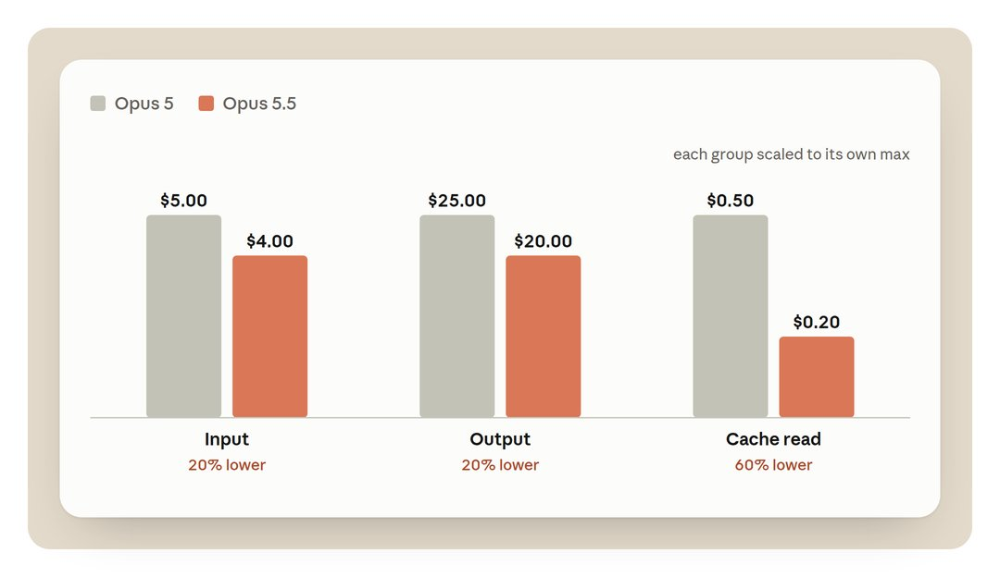

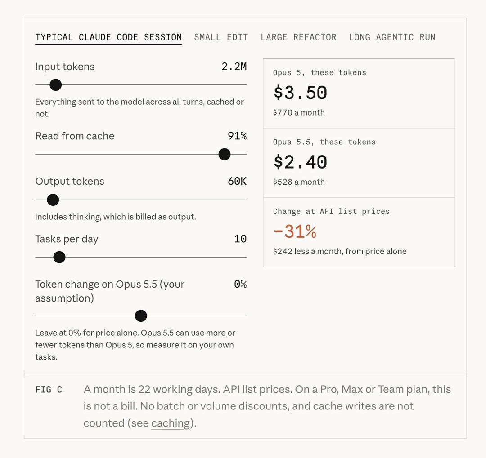

---

## 26

@一起唱歌666

发表于：2026-09-26 07:12

来源：微博

链接：https://m.weibo.cn/status/5347415923363952

这两个人解开了一个世纪之谜。人类身高是环境还是基因因素？环境。

这两个人是失散六十年的同卵双胞胎。高个子在山东日照。小个子是浙江海宁。差距20厘米。

---

## 27

@这很盒里吧

发表于：2026-09-29 13:20

来源：微博

链接：https://m.weibo.cn/status/5348595625892908

哈哈哈哈，达特茅斯学院的教务长 Santiago Schnell，8 月 9 日在「华盛顿邮报」上发表了一篇名为「Universities are fighting AI cheating. But there’s a deeper problem」的文章，谈到了大学生利用 AI 作弊的问题（见图）。

他在文章中提到：「一篇写得好的文章并不能证明学生付出了独立努力，但它通常反映了阅读、推理和修改的过程。生成式人工智能削弱了这种推断。学生如今可以写出流畅的文章，却不必完成文章表面上所体现的大部分智力工作。」

结果，Schnell 这篇文章很快被学生发现有 AI 参与撰写的痕迹。

学生刊物 The Dartmouth 在 9 月开展的后续调查发现，Schnell 在今年发表的作品中大部分都使用了 AI 工具。

而 Schnell 对此的声明是：「他使用 AI 是为了语言润色、文字编辑、提高清晰度和条理性，以及提高写作过程的效率。」

The Dartmouth 随后将 Schnell 的这份声明放入 AI 检测器中检测，结果显示该声明本身明显也是由 AI 撰写的。

面对学生们的质疑，达特茅斯学院校长 Sian Beilock 回应称，率先拥抱 AI 的探索过程难免伴随混乱与阵痛。失误在所难免，这也是一所机构学习过程的一部分。

但学生们并不买账。达特茅斯学院大四学生 Moyse 表示，应该有人承担后果，他称这起 AI 丑闻是一种荒唐至极的虚伪表现。

该事件也在全美掀起了一场审查高校教职人员 AI 使用情况的风暴。

在加州大学伯克利分校，学生报 The Daily Californian 将数十份校园通告输入 AI 检测器，发现部分来自高级管理人员的信函显然是由 AI 撰写或修改的。

伯克利分校发言人 Dan Mogulof 并没有否认这点，认为大学领导人和传播事务人员在特定指导方针下可以将 AI 作为工具使用，只要最终成果能够准确且真实地传达和表达作者的思想、观点、语气及目标、

学生记者还发现，伯克利数学教授 Zvezdelina Stankova 发表在 The San Francisco Standard 上的一篇长文，大部分是由 AI 撰写或修改的。

Stankova 教授也同样承认了自己确实用 AI 辅助过编辑，但这篇探讨伯克利新生数学底子薄弱的深度文章，依然是人类高强度思考与推敲的心血结晶。

已有部分高校对此制定了规则，比如南加州大学的指导原则更新为「要求学生披露 AI 使用情况的教职人员，通常也应以同样的标准要求自己。」

多位教育专家指出，眼下的种种争议，根源在于技术在校园内的渗透与迭代速度实在太快。

—— 长久以来，学术界靠既有的伦理红线来约束剽窃及学术不端，但即便是成文的指引，往往也落后于 AI 演进的步伐，让原本清晰的边界变得混沌不明。这并不是高校的问题，而是整个社会的问题。

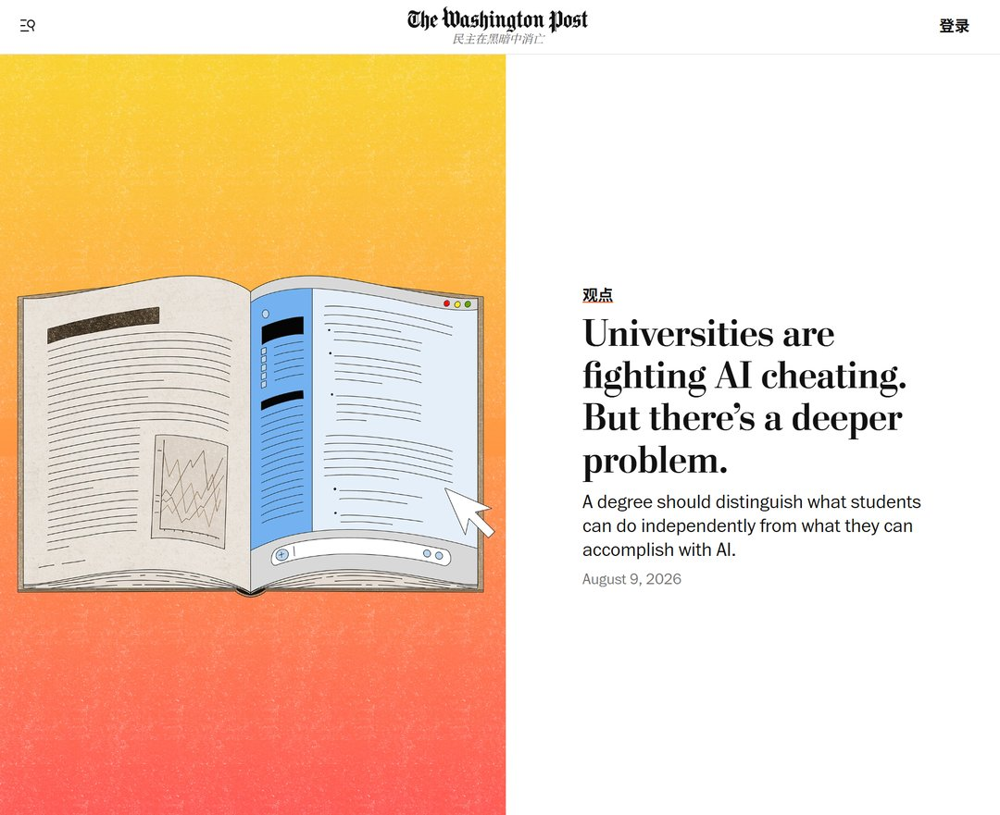

---

## 28

@刘晓光Savvy

发表于：2026-09-29 23:40

来源：微博

链接：https://m.weibo.cn/status/5348751658190122

有个网友说一句生存智慧：

凡是它们鼓励的都要反对，它们反对的都要抓紧做。

这句话其实不算特别对，我深入一下：

凡是明文鼓励的，凡是明文禁止的，都最好不要做。

真正值得做的，是那种模糊地带，灰色地带，不说好也不说不好的，佯装无事发生的。

比如双重国籍这个事，从法理上来说不正确，不应该。

但这个恰恰是在灰色模糊地带，据我所知绝大部分名人，有钱人，都在搞这件事。

搞这个就是两头吃，中外红利都享受了。

那种非法出境把国籍抛弃的人，才是真傻子。

我有一个泳池比喻，我认为是最适合社会生存的：

在泳池里老老实实的，从不撒尿，这个是万万不能的，这意味着你只能喝别人的尿。

站在泳池的台子上对着泳池撒尿也不行，很快就会进局子。

穿着泳裤在泳池里偷偷撒尿，没人知道。

这种偷偷撒尿的灰色事情，才是最应该大力去做的。

