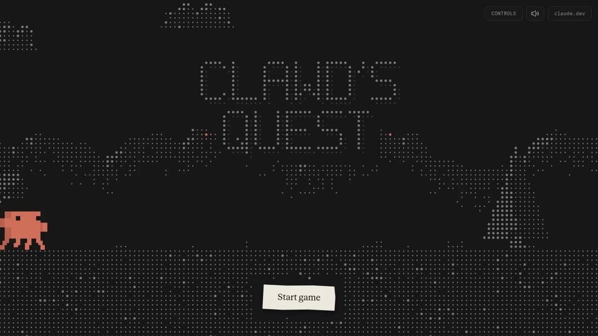

# 2026-10-01

## 1

@宝玉xp

发表于：2026-09-30 22:56

来源：微博

链接：https://m.weibo.cn/status/5349103078736183

Anthropic 上线新站点 claude.dev 网页链接 ，面向用 Claude 做开发的人。站点会发布工程深度文章、Claude Code 和 API 使用指南、Claude 团队成员的经验分享，另外还藏了一些彩蛋。

原来的文档网站仍在 code.claude.com/docs，首页导航里的 DOCS 链接会直接跳转过去。Claude.dev 更接近 Anthropic 工程团队的博客，文章分为智能体（Agents）、工程、实战手册（Playbooks）、技能（Skills）四类。技能指的是给 Claude 预先写好的一套操作说明，让它按固定流程完成某类任务。

首页现有的文章大多围绕 Claude 5 代模型的实际用法。例如《Building with Claude Sonnet 5.5》讲怎么用 Sonnet 5.5 开发，《What a task costs on Opus 5.5》算的是在 Opus 5.5 上跑一个任务要花多少钱，《The new rules of context engineering for Claude 5 generation models》讲怎样给新一代模型组织输入内容。

也有团队自己的工程复盘，比如《How we made claude.ai 3x faster in two weeks》，记录他们两周内把 claude.ai 提速 3 倍的过程。比如最新一篇是 9 月 28 日发布的《用 Claude 自动设计评测并逐步调优》。

对正在用 Claude API 或 Claude Code 的开发者，这些文章能直接看到 Anthropic 内部团队怎么用模型、怎么估算成本。

站点还收录了视频，包括 Claude Code 团队怎么用 Claude Code，以及 Ramp、DoorDash 等公司让员工用 Claude Code 和智能体工作的案例，完整视频放在 YouTube 上。

彩蛋之一是终端模式。点导航里的 TERMINAL，整个站点会变成命令行界面，文章列表像终端里的滚动输出，输入 /help 能看到可用命令。站点的主要入口都配了键盘快捷键，按 H 回首页，按 D 打开文档，按 T 进入终端。 宝玉xp的微博视频

---

## 2

@海兰珠阿婶

发表于：2026-09-24 07:13

来源：微博

链接：https://m.weibo.cn/status/5346691291023042

同志们，该说不说的

我真觉得对于高校教师，尤其是文科岗，真的有必要进行意识形态和道德规范审查了

学术讨论确实可以在合理范围内实现多元化讨论，但我现在看到打着多元化的幌子搞历史虚无主义，打着创新的名义对革命烈士、历史人物进行二创抹黑，打着性别权的名义输出仇恨教育。

甚至高校教师自己本身就不爱国不爱党，嘲讽国内基本盘和爱国人士都是蛆。然而，这种人居然还堂而皇之地登上我们大学讲堂授课，给我们的娃娃上课。给我们的娃娃传输思想教育

可以想象由这样人教育出来的娃娃将来进入了各大院校后会输出什么样的意识形态。这些人拿着国家的经费与津贴，坐在办公室，吹着小空调，反过来却是最跳反的一帮人。我们白花花的银子投进高校里，难道就得到一批面顺心反私下搞对立的反党反华人士?

我真的建议高校该进行一波严肃的意识形态与道德规范审查。尤其是文科岗回去的，尤其是那些本科没在国内读，研究生在海外，凭海外学历回来混了个博士学位的。天知道，他们在海外的七年接受了什么样的意识形态洗脑。要知道，在他们人生价值观形成的最重要的七年接受的都是欧美教育，谁能来保证他们的意识形态不是欧美白左式的?谁能来保证这些人不会把我们的文科苗子培养到我们国家的对立面上?

谢谢大家，如果我说的不对，请在评论区留下宝贵指导意见。我会虚心听取各位老师的声音

---

## 3

@后沙月光本尊

发表于：2026-09-30 11:39

来源：微博

链接：https://m.weibo.cn/status/5348932710306536

梁智惠，韩国拳师。

16岁开始参加韩国女权活动，她对学校要求女学生穿着规范，举止端庄，感到愤怒。

2018年，她策划了韩国各地初高中女生团体社会集会，反对被男人评头论足。

没完没了折腾韩国男女对立。

2019年12月15日，被美国CNN评为 “年度推动亚洲变革青年运动家”，称之为亚洲女青年“学习标杆”

---

## 4

@小虾才没香喷喷

发表于：2026-09-30 02:59

来源：微博

链接：https://m.weibo.cn/status/5348801834647823

哈哈哈哈哈哈哈翻译上大分

---

## 5

@宝玉xp

发表于：2026-09-29 21:19

来源：微博

链接：https://m.weibo.cn/status/5348716217106494

OpenAI 发布 GPT-6.1 Sol：能力接近自家旗舰 Astra，价格只要五分之一

OpenAI 推出了中端模型 GPT-6.1 Sol，官方说法是“接近 Astra 的智能，五分之一的价格”。GPT-6 Astra 是 OpenAI 目前最强的模型，Sol 则是它下面一档、主打性价比的系列。

先看价格。API 上，GPT-6.1 Sol 每百万 token 输入 2 美元、输出 10 美元，Astra 是 10 美元和 50 美元，正好差五倍。重复使用的内容（比如每次都要带上的系统提示词、长文档）走缓存，每百万 token 只要 0.1 美元，比 GPT-6 Sol 的缓存价又便宜了一半。

对开发者来说，这意味着以前只敢在关键环节调用 Astra 的应用，现在可以把更多请求交给 Sol，账单能明显降下来。

能力上，这次升级主要在三块：写代码、操作电脑、处理复杂的专业工作。按官方数据，在软件工程测试 DeepSWE 上它追平了 Astra；在衡量“让 AI 自己操作电脑完成任务”的 OSWorld 2.0 上，比上一代 Sol 提高约 7 个百分点，离 Astra 只差约 2 个百分点。回答中含有事实错误的比例，也从上一代的 11.4% 降到了 7.7%。

OpenAI 还特别提到，新模型更愿意坦白自己做不到什么，也更守规矩，不容易偏离用户意图或越过安全限制，这方面向 Astra 看齐。

现在就能用：ChatGPT 的 Plus、Pro、Business、Enterprise 和 Edu 用户可以在 ChatGPT Work 和 Codex 里直接选用，开发者在 API 里调用 gpt-6.1-sol。官方还预告了一个生成速度最高快 8 倍的极速版，稍后上线。 宝玉xp的微博视频

---

## 6

@卢诗翰

发表于：2026-09-26 12:41

来源：微博

链接：https://m.weibo.cn/status/5347498640017922

其实高校这个事和这两天国乒亚运放一起对比，你就明白女性主义为何在几年内横扫高校了，因为她的赎罪券门槛实在是太低了。

在女性主义视角下，大众对某个女教师论文的质疑，会被视为围剿女性，其他的什么法学教授女性博主一下就会帮忙发声。

反观男性这边，比如男乒男篮，亚运输球被来回喷吧，但你有看到哪个人说这是围剿男运动员吗？会被当神经病吧

男性视角是非常唯物且去身份化的，竞技体育成绩说话，管你主观客观，什么转型期换代期，只要输球，那就是连呼吸权也没有。

女性主义则往往强调其身份。

所以某教授为什么说社会从来不围剿男性，只围剿女性，秘诀就在这里

男运动员有被喷过吗？没有，只有篮球运动员，乒乓运动员被喷

但女教授论文被批评，她们就会强调是女性被围剿了

于是最后一算，你看男运动员从来没被批评过，女运动员女教授天天被批

学吧，学无止境。

